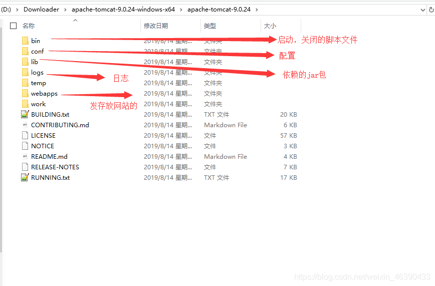
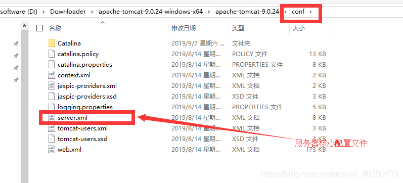
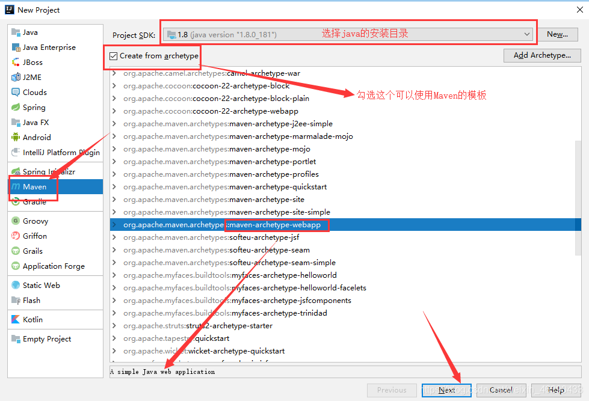
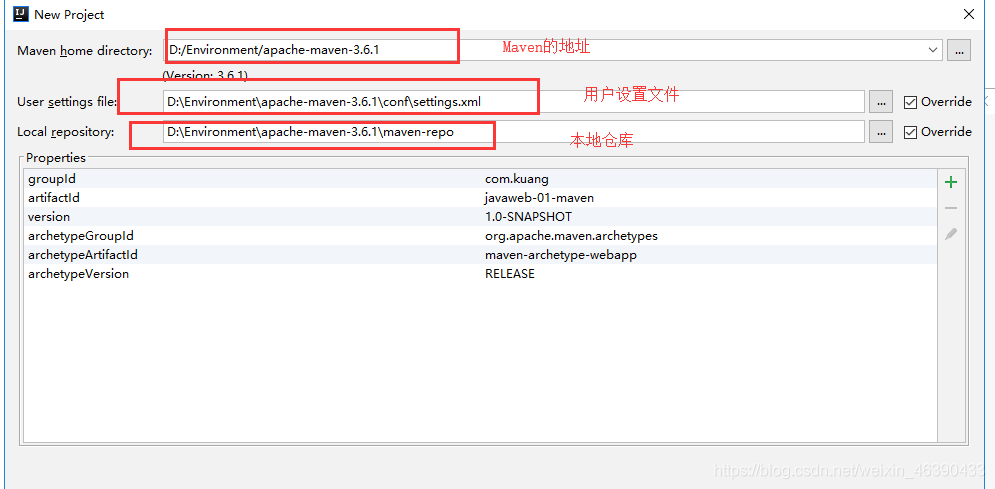
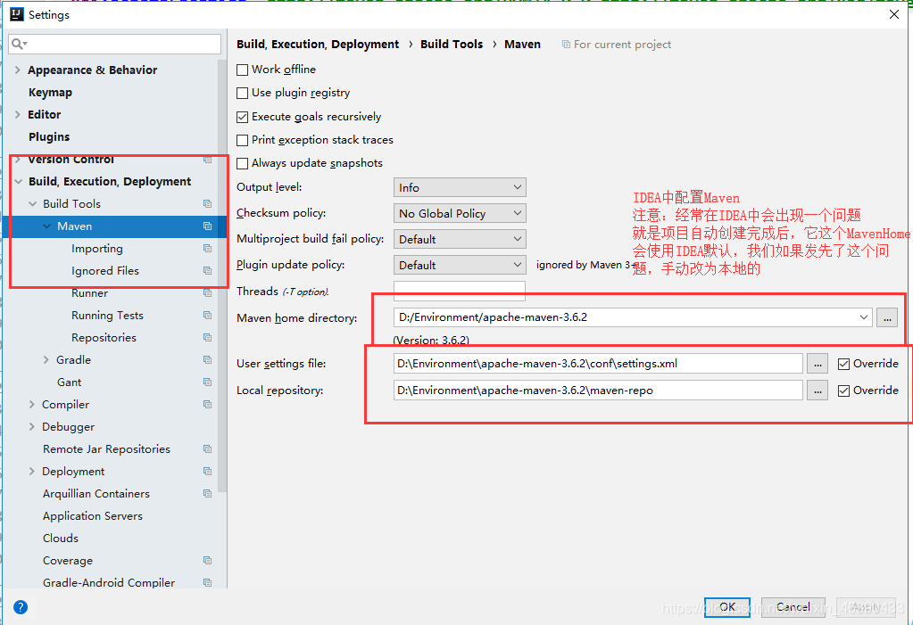
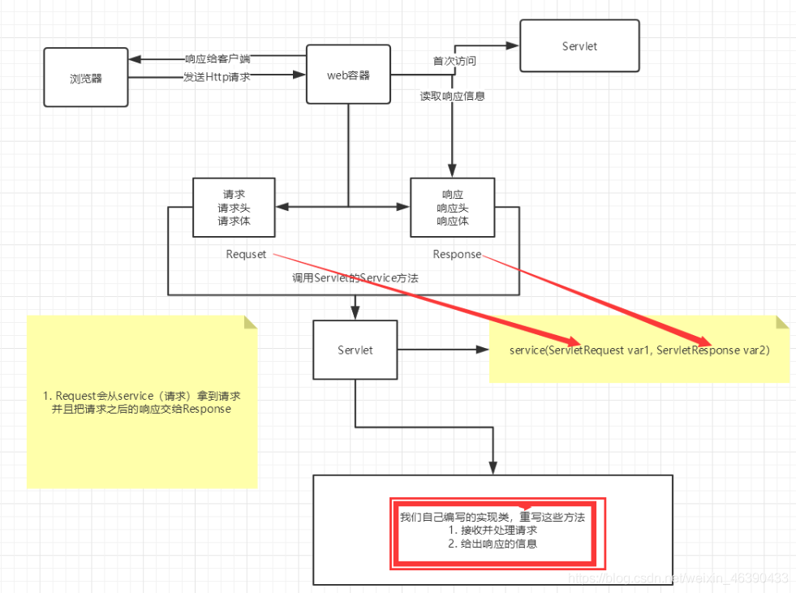
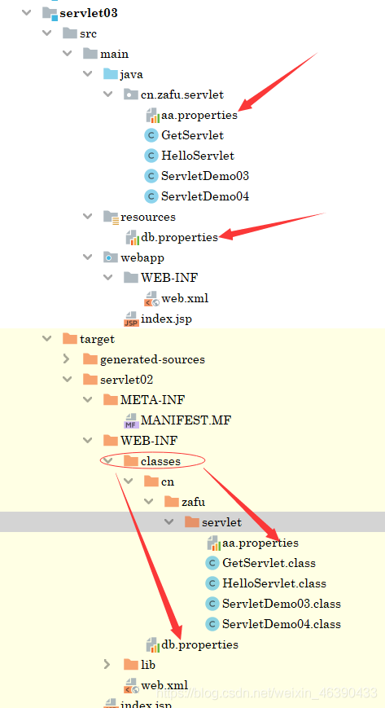

## Tomcat

### Tomcat 启动和配置

**文件夹作用：**



**配置**



可以配置启动的端口号

> tomcat 的默认端口号为：8080
>
> mysql：3306
>
> http：80
>
> https：443

```xml
<Connector port="8081" protocol="HTTP/1.1"
           connectionTimeout="20000"
           redirectPort="8443" />
可以配置主机的名称
```

- 默认的主机名为：localhost->127.0.0.1
- 默认网站应用存放的位置为：webapps

```xml
 <Host name="www.qinjiang.com"  appBase="webapps"
        unpackWARs="true" autoDeploy="true">
```

### 高难度面试题：

请你谈谈网站是如何进行访问的！

1. 输入一个域名；回车

2. 检查本机的 C:\Windows\System32\drivers\etc\hosts 配置文件下有没有这个域名映射；

   1. 有：直接返回对应的 ip 地址，这个地址中，有我们需要访问的 web 程序，可以直接访问

      ```java
      127.0.0.1       www.qinjiang.com
      ```

   2. 没有：去 DNS 服务器找，找到的话就返回，找不到就返回找不到；

3. 可以配置一下环境变量（可选性）

### 发布一个 web 网站

- 将自己写的网站，放到服务器(Tomcat)中指定的 web 应用的文件夹（webapps）下，就可以访问了

网站应该有的结构

```java
--webapps ：Tomcat服务器的web目录
	-ROOT
	-kuangstudy ：网站的目录名
  		- WEB-INF
    		-classes : java程序
    		-lib：web应用所依赖的jar包
    		-web.xml ：网站配置文件
     	- index.html 默认的首页
     	- static
       		-css
       			-style.css
       		-js
       		-img
       	-.....
```

## Http

### 概念

HTTP（超文本传输协议）是一个简单的请求-响应协议，它通常运行在 TCP 之上。

- 文本：html，字符串，~ ….
- 超文本：图片，音乐，视频，定位，地图…….
- 默认端口号：80

Https：安全的

- 默认端口号：443

### Http 请求

客户端—发请求（Request）—服务器

#### 请求结构

1、**请求行**

- 方法名、请求资源 URI、HTTP 版本

- 请求行中的请求方式：GET
- 请求方式：Get，Post，HEAD,DELETE,PUT,TRACT…
  - get：请求能够携带的参数比较少，大小有限制，会在浏览器的 URL 地址栏显示数据内容，不安全，但高效
  - post：请求能够携带的参数没有限制，大小没有限制，不会在浏览器的 URL 地址栏显示数据内容，安全，但不高效。

2、**请求头**

```java
Accept：告诉浏览器，它所支持的数据类型
Accept-Encoding：支持哪种编码格式  GBK   UTF-8   GB2312  ISO8859-1
Accept-Language：告诉浏览器，它的语言环境
Cache-Control：缓存控制
Connection：告诉浏览器，请求完成是断开还是保持连接
HOST：主机..../.
```

#### 发送 HTTP 请求

- 用户在浏览器的地址栏*输入 URL*
- 单击*超链接*
- 提交*表单*

#### 检索请求参数

1. `request.getParameter()`、`request,getParameterValues()`

2. 查询串 `?`问号后面的内容为请求参数名和参数值对，若有多个参数，中间用`&`符合分割，参数用`=`赋值

### Http 响应

服务器—响应-----客户端
1、**状态行**

HTTP 版本、状态码、状态码描述

**响应状态码**
200：请求响应成功 200

​ 3xx：请求重定向

​ 重定向：你重新到我给你新位置去；
​ 4xx：找不到资源 404

​ 资源不存在；
​ 5xx：服务器代码错误 500 502:网关错误

2、**响应头**

```java
Accept：告诉浏览器，它所支持的数据类型
Accept-Encoding：支持哪种编码格式  GBK   UTF-8   GB2312  ISO8859-1
Accept-Language：告诉浏览器，它的语言环境
Cache-Control：缓存控制
Connection：告诉浏览器，请求完成是断开还是保持连接
HOST：主机..../.
Refresh：告诉客户端，多久刷新一次；
Location：让网页重新定位；
```

### 常见面试题：

当你的浏览器中地址栏输入地址并回车的一瞬间到页面能够展示回来，经历了什么？

1. 域名解析
2. 发起 TCP 的三次握手
3. 建立起 TCP 连接后发起 http 请求
4. 服务器响应 http 请求，浏览器得到 html 代码
5. 浏览器解析 html 代码，并请求 html 代码中的资源（css JavaScript 图片）
6. 浏览器对页面进行渲染呈现

[参考](https://www.cnblogs.com/wupeixuan/p/8747918.html)

## Maven

### 阿里云镜像

maven 文件夹下`conf/settings.xml`

```xml
 <mirror>
      <id>nexus-aliyun</id>
	  <mirrorOf>central</mirrorOf>
	  <name>Nexus aliyun</name>
	  <url>http://maven.aliyun.com/nexus/content/repositories/central/</url>
 </mirror>
```

### 本地仓库

maven 有本地仓库和远程仓库；
建立一个本地仓库（同样在 settings.xml）

```xml
<localRepository>D:\Program Files(x86)\apache-maven-3.8.1\maven-repo</localRepository>
```

### 创建 Maven 项目





**IDEA 中的 Maven 设置**

注意：IDEA 项目创建成功后，看一眼 Maven 的配置



**pom 文件**

```xml
<?xml version="1.0" encoding="UTF-8"?>

<!--Maven版本和头文件-->
<project xmlns="http://maven.apache.org/POM/4.0.0" xmlns:xsi="http://www.w3.org/2001/XMLSchema-instance"
  xsi:schemaLocation="http://maven.apache.org/POM/4.0.0 http://maven.apache.org/xsd/maven-4.0.0.xsd">
  <modelVersion>4.0.0</modelVersion>

  <!--这里就是我们刚才配置的GAV-->
  <groupId>com.kuang</groupId>
  <artifactId>javaweb-01-maven</artifactId>
  <version>1.0-SNAPSHOT</version>
  <!--Package：项目的打包方式
  jar：java应用
  war：JavaWeb应用
  -->
  <packaging>war</packaging>


  <!--配置-->
  <properties>
    <!--项目的默认构建编码-->
    <project.build.sourceEncoding>UTF-8</project.build.sourceEncoding>
    <!--编码版本-->
    <maven.compiler.source>1.8</maven.compiler.source>
    <maven.compiler.target>1.8</maven.compiler.target>
  </properties>

  <!--项目依赖-->
  <dependencies>
    <!--具体依赖的jar包配置文件-->
    <dependency>
      <groupId>junit</groupId>
      <artifactId>junit</artifactId>
      <version>4.11</version>
    </dependency>
  </dependencies>

  <!--项目构建用的东西 可删-->
  <build>
    <finalName>javaweb-01-maven</finalName>
    <pluginManagement><!-- lock down plugins versions to avoid using Maven defaults (may be moved to parent pom) -->
      <plugins>
        <plugin>
          <artifactId>maven-clean-plugin</artifactId>
          <version>3.1.0</version>
        </plugin>
        <!-- see http://maven.apache.org/ref/current/maven-core/default-bindings.html#Plugin_bindings_for_war_packaging -->
        <plugin>
          <artifactId>maven-resources-plugin</artifactId>
          <version>3.0.2</version>
        </plugin>
        <plugin>
          <artifactId>maven-compiler-plugin</artifactId>
          <version>3.8.0</version>
        </plugin>
        <plugin>
          <artifactId>maven-surefire-plugin</artifactId>
          <version>2.22.1</version>
        </plugin>
        <plugin>
          <artifactId>maven-war-plugin</artifactId>
          <version>3.2.2</version>
        </plugin>
        <plugin>
          <artifactId>maven-install-plugin</artifactId>
          <version>2.5.2</version>
        </plugin>
        <plugin>
          <artifactId>maven-deploy-plugin</artifactId>
          <version>2.8.2</version>
        </plugin>
      </plugins>
    </pluginManagement>
  </build>
</project>


```

**maven 由于他的约定大于配置，我们之后可以能遇到我们写的配置文件，无法被导出或者生效的问题，**

**解决方案：**

```xml
<!--在build中配置resources，来防止我们资源导出失败的问题-->
<build>
    <resources>
        <resource>
            <directory>src/main/resources</directory>
            <includes>
                <include>**/*.properties</include>
                <include>**/*.xml</include>
            </includes>
            <filtering>true</filtering>
        </resource>
        <resource>
            <directory>src/main/java</directory>
            <includes>
                <include>**/*.properties</include>
                <include>**/*.xml</include>
            </includes>
            <filtering>true</filtering>
        </resource>
    </resources>
</build>

```

## Servlet

### Servlet 简介

Servlet 是 sun 公司开发的动态 web 的一项技术

Sun 在 API 中提供一个接口叫做：Servlet，开发一个 Servlet 程序需要完成两个小步骤：

1. 编写一个类，实现 servlet 接口；
2. 把开发好的 Java 类部署到 web 服务器上。

把实现了 Servlet 接口的 Java 程序叫做，Servlet

### 编写 HelloServlet 程序

Serlvet 接口 Sun 公司有两个默认的实现类：HttpServlet，GenericServlet

1. 构建一个普通的 Maven 项目，删掉里面的 src 目录,在这个项目里面建立 Moudel(模块)，这个空的工程就是 Maven 主工程；

2. 在 Maven 父子工程中

   父项目的 pom.xml 中自动生成

   ```xml
    <modules>
            <module>servlet-01</module>
            <module>servlet-02</module>
        </modules>
        //告诉编译器，在读取主pom时，去找两个子pom
   ```

   子项目（测试中没有自动生成）

   ```xml
   <parent>
           <artifactId>javaweb-02servlet</artifactId>
           <groupId>cn.zafu</groupId>
           <version>1.0-SNAPSHOT</version>
       </parent>
       //使子项目继承父项目的设置，避免重复导入依赖
   ```

   父项目中的 java,子项目可以直接使用

   ```java
   son extends father
   ```

3. Maven 环境优化 1.修改 web.xml 为最新（去 tomca 文件夹下的 webapps 下去取）； 2.将 maven 结构搭建完整，，main 下建 java 文件夹，resources 文件夹

4. 编写一个 Servlet 程序

   

5. 编写 Servlet 的映射

   我们写的是 Java 程序，但是需要通过浏览器访问，而浏览器需要连接 web 服务器，所以我们需要在 web 服务中注册我们写的 Servlet，还需要给它一个浏览器能够访问的路径；

   ```xml
     <!--注册Servlet-->
     <servlet>
       <servlet-name>hello</servlet-name>
       <servlet-class>cn.zafu.servlet.HelloServlet</servlet-class>
     </servlet>
     <!--Servlet的请求路径-->
     <servlet-mapping>
       <servlet-name>hello</servlet-name>
       <url-pattern>/hello</url-pattern>
     </servlet-mapping>
   ```

6. 配置 Tomca
   注意配置项目发布路径即可。

7. 启动项目
   启动后通过请求路径访问程序。
   — 域名/发布路径/请求路径

### Servlet 原理

Servlet 是由 Web 服务器调用的，web 服务器收到浏览器请求后：



### Mapping 问题

1. 一个 Servlet 可以指定一个映射路径

2. 一个 Servlet 可以指定多个映射路径

3. 一个 Servlet 可以指定通用映射路径

   ```xml
   <servlet-mapping>
       <servlet-name>hello</servlet-name>
       <url-pattern>/hello/*</url-pattern>
   </servlet-mapping>
   ```

4. 默认请求路径

   ```xml
   <!--默认请求路径-->
   <servlet-mapping>
       <servlet-name>hello</servlet-name>
       <url-pattern>/*</url-pattern>
   </servlet-mapping>
   ```

5. 指定一些后缀或者前缀等等….

   ```xml
   <!--可以自定义后缀实现请求映射
       注意点，*前面不能加项目映射的路径
       hello/sajdlkajda.qinjiang
       -->
   <servlet-mapping>
       <servlet-name>hello</servlet-name>
       <url-pattern>*.cxd</url-pattern>
   </servlet-mapping>
   ```

6. 优先级问题
   指定了固有的映射路径优先级最高，如果找不到就会走默认的处理请求；

   ```xml
   <!--404-->
   <servlet>
       <servlet-name>error</servlet-name>
       <servlet-class>cn.zafu.servlet.ErrorServlet</servlet-class>
   </servlet>
   <servlet-mapping>
       <servlet-name>error</servlet-name>
       <url-pattern>/*</url-pattern>
   </servlet-mapping>
   ```

### ServletContext

一个 web 容器启动时，会为创建一个对应的 ServletContext 对象，它代表了当前 web 应用；

#### 1、共享数据

我们在一个 Servlet 中通过 servlerContext 对象保存（set）的数据，可以在另一个 servlet 通过 servlerContext 对象 get 到

```java
public class HelloServlet extends HttpServlet {
    @Override
    protected void doGet(HttpServletRequest req, HttpServletResponse resp) throws ServletException, IOException {

        //this.getInitParameter();	获取初始化参数
        //this.getServletConfig();	获取Servlet配置
        //this.getServletContext();	获取Servlet上下文
        ServletContext servletContext = this.getServletContext();
        String username = "数据";
        servletContext.setAttribute("username",username);//将一个数据保存到了ServletContext中
        //void setAttribute(String var1, Object var2);

    }

}
```

```java
public class GetServlet extends HttpServlet {
    @Override
    protected void doGet(HttpServletRequest req, HttpServletResponse resp) throws ServletException, IOException {
        ServletContext context = this.getServletContext();
        String username = (String)context.getAttribute("username");

		//设置响应格式，否则中文默认GBK格式在浏览器上显示会乱码
        resp.setContentType("text/html");
        resp.setCharacterEncoding("utf-8");

        resp.getWriter().print("名字"+username);
    }

    @Override
    protected void doPost(HttpServletRequest req, HttpServletResponse resp) throws ServletException, IOException {
        doGet(req, resp);
    }
}
```

#### 2、获取初始化参数

web.xml 中

```xml
<!--配置一些web应用初始化参数-->
<context-param>
    <param-name>url</param-name>
    <param-value>jdbc:mysql://localhost:3306/mybatis</param-value>
</context-param>
```

获取

```java
protected void doGet(HttpServletRequest req, HttpServletResponse resp) throws ServletException, IOException {
	ServletContext context = this.getServletContext();
	String url = context.getInitParameter("url");
	resp.getWriter().print(url);
}
```

#### 3、请求转发

```java
@Override
    protected void doGet(HttpServletRequest req, HttpServletResponse resp) throws ServletException, IOException {
        ServletContext context = this.getServletContext();
        System.out.println("进入了sd4");
        RequestDispatcher requestDispatcher = context.getRequestDispatcher("/gp");//转发的请求路径
        requestDispatcher.forward(req,resp);//调用forward实现请求转发
        //合并写  context.getRequestDispatcher("/gp").forward(req,resp);
    }
```

#### 4、读取资源文件

Properties

- 在 java 目录下新建 properties
- 在 resources 目录下新建 properties

发现：都被打包到了同一个路径下：classes，我们俗称这个路径为 classpath:



```properties
username=root12312
password=zxczxczxc
```

```java
public class ServletDemo05 extends HttpServlet {
    @Override
    protected void doGet(HttpServletRequest req, HttpServletResponse resp) throws ServletException, IOException {
        //思路：需要一个文件流；
        InputStream is = this.getServletContext().getResourceAsStream("/WEB-INF/classes/com/kuang/servlet/aa.properties");

        Properties prop = new Properties();
        prop.load(is);
        String user = prop.getProperty("username");
        String pwd = prop.getProperty("password");

        resp.getWriter().print(user+":"+pwd);

    }

    @Override
    protected void doPost(HttpServletRequest req, HttpServletResponse resp) throws ServletException, IOException {
        doGet(req, resp);
    }
}
```

### HttpServletResponse

web 服务器接收到客户端的 http 请求，针对这个请求，分别创建一个代表请求的 HttpServletRequest 对象，代表响应的一个 HttpServletResponse；

- 如果要获取客户端请求过来的参数：找 HttpServletRequest
- 如果要给客户端响应一些信息：找 HttpServletResponse

#### 1、简单方法

```java
//向浏览器发送数据的方法
ServletOutputStream getOutputStream() throws IOException;
PrintWriter getWriter() throws IOException;
//向浏览器发送响应头的方法
//响应的状态码
//点源码自己看
```

#### 2、下载文件

```java
@Override
protected void doGet(HttpServletRequest req, HttpServletResponse resp) throws ServletException, IOException {
    // 1. 要获取下载文件的路径
    String realPath = "";
    // 2. 下载的文件名是啥？
    String fileName = realPath.substring(realPath.lastIndexOf("\\") + 1);
    // 3. 设置想办法让浏览器能够支持(Content-Disposition)下载我们需要的东西,中文文件名URLEncoder.encode编码，否则有可能乱码
    resp.setHeader("Content-Disposition","attachment;filename="+URLEncoder.encode(fileName,"UTF-8"));
    // 4. 获取下载文件的输入流
    FileInputStream in = new FileInputStream(realPath);
    // 5. 创建缓冲区
    int len = 0;
    byte[] buffer = new byte[1024];
    // 6. 获取OutputStream对象
    ServletOutputStream out = resp.getOutputStream();
    // 7. 将FileOutputStream流写入到buffer缓冲区,使用OutputStream将缓冲区中的数据输出到客户端！
    while ((len=in.read(buffer))>0){
        out.write(buffer,0,len);
    }
	//8、关闭 刷新
    in.close();
    out.close();
}

```

#### 3、图片响应

验证码功能,验证怎么来的？

- 前端实现
- 后端实现，需要用到 Java 的图片类，生产一个图片

```java
package com.kuang.servlet;

import javax.imageio.ImageIO;
import javax.servlet.ServletException;
import javax.servlet.http.HttpServlet;
import javax.servlet.http.HttpServletRequest;
import javax.servlet.http.HttpServletResponse;
import java.awt.*;
import java.awt.image.BufferedImage;
import java.io.IOException;
import java.util.Random;

public class ImageServlet extends HttpServlet {

    @Override
    protected void doGet(HttpServletRequest req, HttpServletResponse resp) throws ServletException, IOException {

        //如何让浏览器3秒自动刷新一次;
        resp.setHeader("refresh","3");

        //在内存中创建一个图片
        BufferedImage image = new BufferedImage(80,20,BufferedImage.TYPE_INT_RGB);
        //得到图片
        Graphics2D g = (Graphics2D) image.getGraphics(); //笔
        //设置图片的背景颜色
        g.setColor(Color.white);
        g.fillRect(0,0,80,20);
        //给图片写数据
        g.setColor(Color.BLUE);
        g.setFont(new Font(null,Font.BOLD,20));
        g.drawString(makeNum(),0,20);

        //告诉浏览器，这个请求用图片的方式打开
        resp.setContentType("image/jpeg");
        //网站存在缓存，不让浏览器缓存
        resp.setDateHeader("expires",-1);
        resp.setHeader("Cache-Control","no-cache");
        resp.setHeader("Pragma","no-cache");

        //把图片写给浏览器
        ImageIO.write(image,"jpg", resp.getOutputStream());

    }

    //生成随机数
    private String makeNum(){
        Random random = new Random();
        String num = random.nextInt(9999999) + "";
        StringBuffer sb = new StringBuffer();
        for (int i = 0; i < 7-num.length() ; i++) {
            sb.append("0");
        }
        num = sb.toString() + num;
        return num;
    }


    @Override
    protected void doPost(HttpServletRequest req, HttpServletResponse resp) throws ServletException, IOException {
        doGet(req, resp);
    }
}


```

#### 4、实现重定向

B 一个 web 资源收到客户端 A 请求后，B 他会通知 A 客户端去访问另外一个 web 资源 C，这个过程叫重定向

```java
void sendRedirect(String var1) throws IOException;
  /*
     resp.setHeader("Location","/r/img");
     resp.setStatus(302);
  */
```

**面试题：请你聊聊重定向和转发的区别？**

相同点

- 页面都会实现跳转

不同点

- 请求转发的时候，url 不会产生变化; 307
- 重定向时候，url 地址栏会发生变化； 302

### HttpServletRequest

HttpServletRequest 代表客户端的请求，用户通过 Http 协议访问服务器，HTTP 请求中的所有信息会被封装到 HttpServletRequest，通过这个 HttpServletRequest 的方法，获得客户端的所有信息；

#### 获取参数，请求转发

```java
String password = req.getParameter("password");
String[] hobbys = req.getParameterValues("hobbys");

req.getRequestDispatcher("/success.jsp").forward(req,resp);
```

## Cookie、Session

### 会话

**会话**：用户打开一个浏览器，点击了很多超链接，访问多个 web 资源，关闭浏览器，这个过程可以称之为会话；

**有状态会话**：一个同学来过教室，下次再来教室，我们会知道这个同学，曾经来过，称之为有状态会话；

客户端 服务端

1. 服务端给客户端一个 信件，客户端下次访问服务端带上信件就可以了； cookie
2. 服务器登记你来过了，下次你来的时候我来匹配你； seesion

> 保存会话的两种技术

**cookie**

- 客户端技术 （响应，请求）

**session**

- 服务器技术，利用这个技术，可以保存用户的会话信息？ 我们可以把信息或者数据放在 Session 中！

常见常见：网站登录之后，你下次不用再登录了，第二次访问直接就上去了！

### Cookie

1. 从请求中拿到 cookie 信息

2. 服务器响应给客户端 cookie

   ```java
   Cookie[] cookies = req.getCookies(); //获得Cookie
   cookie.getName(); //获得cookie中的key
   cookie.getValue(); //获得cookie中的vlaue
   new Cookie("lastLoginTime", System.currentTimeMillis()+""); //新建一个cookie
   cookie.setMaxAge(24*60*60); //设置cookie的有效期
   resp.addCookie(cookie); //响应给客户端一个cookie
   ```

cookie：一般会保存在本地的 用户目录下 appdata；

**一个网站 cookie 是否存在上限**

- 一个 Cookie 只能保存一个信息；
- 一个 web 站点可以给浏览器发送多个 cookie，最多存放 20 个 cookie；
- Cookie 大小有限制 4kb；
- 300 个 cookie 浏览器上限

**删除 Cookie**

- 不设置有效期，关闭浏览器，自动失效；
- 设置有效期时间为 0 ；

**编码解码**

```java
URLEncoder.encode("秦疆","utf-8")
URLDecoder.decode(cookie.getValue(),"UTF-8")
```

### Session (重点)

**什么是 Session：**

- 服务器会给每一个用户（浏览器）创建一个 Seesion 对象；
- 一个 Seesion 独占一个浏览器，只要浏览器没有关闭，这个 Session 就存在；
- 用户登录之后，整个网站它都可以访问！–> 保存用户的信息；保存购物车的信息……

**Session 和 cookie 的区别：**

- Cookie 是把用户的数据写给用户的浏览器，浏览器保存 （可以保存多个）
- Session 把用户的数据写到用户独占 Session 中，服务器端保存 （保存重要的信息，减少服务器资源的浪费）
- Session 对象由服务创建；

**使用场景：**

- 保存一个登录用户的信息；
- 购物车信息；
- 在整个网站中经常会使用的数据，我们将它保存在 Session 中；

```java
 //得到Session
HttpSession session = requset.getSession();
//给Session中存东西
session.setAttribute("name",name);
session.removeAttribute("name");
//获取Session的ID
String sessionId = session.getId();
//判断Session是不是新创建
boolean isNew = session.isNew();
//手动注销Session
session.invalidate();

//Session创建的时候做了什么事情；
Cookie cookie = new Cookie("JSESSIONID",sessionId);
resp.addCookie(cookie);
```

**会话自动过期：web.xml 配置**

```xml
<!--设置Session默认的失效时间-->
<session-config>
    <!--15分钟后Session自动失效，以分钟为单位-->
    <session-timeout>15</session-timeout>
</session-config>
```

### 三者区别

**Cookie**


**Session**


**ServletContext/Application**


## JSP

Java Server Pages ： Java 服务器端页面，也和 Servlet 一样，用于动态 Web 技术！

### JSP 原理

- tomcat 中有一个<u>work 目录</u>；

- IDEA 中使用 Tomcat 的会在 IDEA 的 tomcat 中生产一个 work 目录

电脑地址：
`C:\Users\Heaven\AppData\Local\JetBrains\IntelliJIdea2020.3\tomcat\5aecb66e-5810-4023-9f2e-e98b4d3656b2\work\Catalina\localhost\ROOT\org\apache\jsp`
发现页面转变成了 Java 程序！

**浏览器向服务器发送请求，不管访问什么资源，其实都是在访问 Servlet！**JSP 最终也会被转换成为一个 Java 类！
**JSP 本质上就是一个 Servlet**

```java
//初始化
  public void _jspInit() {}
//销毁
  public void _jspDestroy() {}
//JSPService
  public void _jspService(.HttpServletRequest request,HttpServletResponse response){}
```

**index_jsp.java(看源码)**

1. 判断请求

2. 内置一些对象

   ```java
   final javax.servlet.jsp.PageContext pageContext;  //页面上下文
   javax.servlet.http.HttpSession session = null;    //session
   final javax.servlet.ServletContext application;   //applicationContext
   final javax.servlet.ServletConfig config;         //config
   javax.servlet.jsp.JspWriter out = null;           //out
   final java.lang.Object page = this;               //page：当前
   HttpServletRequest request                        //请求
   HttpServletResponse response                      //响应
   ```

3. 输出页面前增加的代码

   ```java
   response.setContentType("text/html");       //设置响应的页面类型
   pageContext = _jspxFactory.getPageContext(this, request, response,
          null, true, 8192, true);
   _jspx_page_context = pageContext;
   application = pageContext.getServletContext();
   config = pageContext.getServletConfig();
   session = pageContext.getSession();
   out = pageContext.getOut();
   _jspx_out = out;
   ```

4. 以上的这些个对象我们可以在 JSP 页面中直接使用！

5. 在 JSP 页面中；

   - 只要是 JAVA 代码就会原封不动的输出；
   - 如果是 HTML 代码，就会被转换为：

   ```java
   out.write("<html>\r\n");
   ```


### JSP 基础语法

```jsp
<%代码块%>
<%=变量或者表达式%>
<%!声明%>
<%--注释--%>
<%@page args.... %>
<%@include file=""%>
```

#### JSP 声明`<%!...%>`

`<%!声明%>`会被编译到 JSP 生成 Java 的类中！其他的，就会被生成到\_jspService 方法中！


#### JSP 代码块`<%...%>`

`<%---%>`


#### JSP 的注释`<%--...--%>`

`<%--注释--%>`
不会在客户端显示，HTML 就会！


#### JSP 标签`\<%jsp: ... %>`

`<%@指令 %>` 、`<%jsp:标签: %>`

> 静态包含&动态包含 `<%@include file=""%> & <jsp:include page=""/>`

**JSP 指令**：`<%@include会将两个页面合二为一%>` 静态包含

```java
<%@include file="common/header.jsp"%>
<h1>网页主体</h1>
<%@include file="common/footer.jsp"%>
```


**JSP 标签**： `< jsp:include：拼接页面，本质还是三个>` 动态包含

```java
<jsp:include page="/common/header.jsp"/>
<h1>网页主体</h1>
<jsp:include page="/common/footer.jsp"/>
```


> \<jsp:forward>与 response.sendRedirect()页面跳转的区别

- \<jsp:forward>: 2 个页面的 request,response 是同一个 **转发**

  ```jsp
  <jsp:forward page="forforward.jsp" >
      <jsp:param name = "name" value="m"/>
      <jsp:param name="oldName" value='<%= request.getParameter("name") %>'/>
      <jsp:param name = "roles" value = "manager"/>
  </jsp:forward>
  ```

- response.sendRedirect: 2 个页面的 request,response 不同 **重定向**

  ```jsp
  <% response.sendRedirect("forforward.jsp"); %>
  ```


1.从地址栏显示来说

- forward 是服务器请求资源,服务器直接访问目标地址的 URL,把那个 URL 的响应内容读取过来,然后把这些内容再发给浏览器.浏览器根本不知道服务器发送的内容从哪里来的,所以它的地址栏还是原来的地址.
- redirect 是服务端根据逻辑,发送一个状态码,告诉浏览器重新去请求那个地址.所以地址栏显示的是新的 URL.

  2.从数据共享来说

- forward:转发页面和转发到的页面可以共享 request 里面的数据.
- redirect:不能共享数据.

  3.从运用地方来说

- forward:一般用于用户登陆的时候,根据角色转发到相应的模块.
- redirect:一般用于用户注销登陆时返回主页面和跳转到其它的网站等.

  4.从效率来说

- forward:高.
- redirect:低.

> \<jsp:userBean />

### 9 大内置对象

- PageContext 存东西
- Request 存东西
- Response
- Session 存东西
- Application 【SerlvetContext】 存东西
- config 【SerlvetConfig】
- out
- page 不用了解
- exception

```java
pageContext.setAttribute("name1","秦疆1号"); //保存的数据只在一个页面中有效
request.setAttribute("name2","秦疆2号"); //保存的数据只在一次请求中有效，请求转发会携带这个数据
session.setAttribute("name3","秦疆3号"); //保存的数据只在一次会话中有效，从打开浏览器到关闭浏览器
application.setAttribute("name4","秦疆4号");  //保存的数据只在服务器中有效，从打开服务器到关闭服务器
```

pageContext：通过寻找的方式取出`findAttribute()`，从底层到高层寻找，**page->request->session->application**
request：客户端向服务器发送请求，产生的数据，用户看完就没用了，比如：新闻，用户看完没用的！
session：客户端向服务器发送请求，产生的数据，用户用完一会还有用，比如：购物车；
application：客户端向服务器发送请求，产生的数据，一个用户用完了，其他用户还可能使用，比如：聊天数据；

### JSP 标签、JSTL 标签、EL 表达式

```xml
<!-- JSTL表达式的依赖 -->
<dependency>
    <groupId>javax.servlet.jsp.jstl</groupId>
    <artifactId>jstl-api</artifactId>
    <version>1.2</version>
</dependency>
<!-- standard标签库 -->
<dependency>
    <groupId>taglibs</groupId>
    <artifactId>standard</artifactId>
    <version>1.1.2</version>
</dependency>
```

**EL 表达式： ${ }**

- 获取数据
- 执行运算
- 获取 web 开发的常用对象

```jsp
<form action="coreif.jsp" method="get">
    <%--
    EL表达式获取表单中的数据
    ${param.参数名}获取本身表单的input
    --%>
    <input type="text" name="username" value="${param.username}">
    <input type="submit" value="登录">
</form>
```

**JSP 标签**

```jsp
<%--jsp:include--%>

<%--
http://localhost:8080/jsptag.jsp?name=kuangshen&age=12
--%>

<jsp:forward page="/jsptag2.jsp">
    <jsp:param name="name" value="kuangshen"></jsp:param>
    <jsp:param name="age" value="12"></jsp:param>
</jsp:forward>
```

**JSTL 表达式**

JSTL 标签库的使用就是为了弥补 HTML 标签的不足；它自定义许多标签，可以供我们使用，标签的功能和 Java 代码一样！

[菜鸟传送门](https://www.runoob.com/jsp/jsp-jstl.html)：格式化标签、SQL 标签、XML 标签、核心标签 （掌握部分）

JSTL 标签库使用步骤

- 引入对应的 taglib`<%@ taglib prefix="c" uri="http://java.sun.com/jsp/jstl/core" %>`
- 使用其中的方法
- 在 Tomcat 也需要引入 jstl 的包，否则会报错：JSTL 解析错误


## JavaBean

**实体类**

JavaBean 有特定的写法：

- 必须要有一个无参构造
- 属性必须私有化
- 必须有对应的 get/set 方法；

一般用来和数据库的字段做映射 ORM；

ORM ：对象关系映射

- 表—>类
- 字段–>属性
- 行记录---->对象

## MVC 三层架构

- 什么是 MVC： Model view Controller 模型、视图、控制器


**Model**

​ 业务处理 ：业务逻辑（Service）
​ 数据持久层：CRUD （Dao - 数据持久化对象）
**View**

​ 展示数据
​ 提供链接发起 Servlet 请求 （a，form，img…）
**Controller （Servlet）**

​ 接收用户的请求 ：（req：请求参数、Session 信息….）

​ 交给业务层处理对应的代码

​ 控制视图的跳转

## Filter 过滤器 （重点）

Filter：过滤器 ，用来过滤网站的数据；

- 处理中文乱码
- 登录验证….
- 用户登录之后才能进入主页！用户注销后就不能进入主页了！

  **Filter 开发步骤：**

1. 导包不要错 **（注意）**

   

2. 实现 Filter 接口，重写对应的方法即可

   ```java
   package com.huang.filter;

   import javax.servlet.*;
   import javax.servlet.annotation.WebFilter;
   import java.io.IOException;
   @WebFilter("/*")
   public class CharacterEncodingFilter implements Filter {
       //初始化：web服务器启动，就以及初始化了，随时等待过滤对象出现！
       public void init(FilterConfig filterConfig) throws ServletException {

       }
   	//Chain : 链
         /*
         1. 过滤中的所有代码，在过滤特定请求的时候都会执行
         2. 必须要让过滤器继续同行
             chain.doFilter(request,response);
          */
       public void doFilter(ServletRequest request, ServletResponse response, FilterChain chain) throws IOException, ServletException {
           request.setCharacterEncoding("utf-8");
           response.setCharacterEncoding("utf-8");
           chain.doFilter(request,response);
       }
   	 //销毁：web服务器关闭的时候，过滤器会销毁
       public void destroy() {

       }
   }

   ```

3. 在 web.xml 中配置 Filter

   ```xml
   <filter>
       <filter-name>CharacterEncodingFilter</filter-name>
       <filter-class>com.kuang.filter.CharacterEncodingFilter</filter-class>
   </filter>
   <filter-mapping>
       <filter-name>CharacterEncodingFilter</filter-name>
       <!--只要是 /servlet的任何请求，会经过这个过滤器-->
       <url-pattern>/servlet/*</url-pattern>
       <!--<url-pattern>/*</url-pattern>-->
       <!-- 别偷懒写个 /* -->
   </filter-mapping>
   ```

## 监听器

实现一个监听器的接口；（有 n 种监听器）

1. 编写一个监听器 (以监听 session 为例)

   实现监听器的接口…

   

   ```java
   //统计网站在线人数 ： 统计session
   public class OnlineCountListener implements HttpSessionListener {

       //创建session监听： 看你的一举一动
       //一旦创建Session就会触发一次这个事件！
       public void sessionCreated(HttpSessionEvent se) {
           ServletContext ctx = se.getSession().getServletContext();

           System.out.println(se.getSession().getId());

           Integer onlineCount = (Integer) ctx.getAttribute("OnlineCount");

           if (onlineCount==null){
               onlineCount = new Integer(1);
           }else {
               int count = onlineCount.intValue();
               onlineCount = new Integer(count+1);
           }

           ctx.setAttribute("OnlineCount",onlineCount);

       }

       //销毁session监听
       //一旦销毁Session就会触发一次这个事件！
       public void sessionDestroyed(HttpSessionEvent se) {
           ServletContext ctx = se.getSession().getServletContext();

           Integer onlineCount = (Integer) ctx.getAttribute("OnlineCount");

           if (onlineCount==null){
               onlineCount = new Integer(0);
           }else {
               int count = onlineCount.intValue();
               onlineCount = new Integer(count-1);
           }

           ctx.setAttribute("OnlineCount",onlineCount);

       }


       /*
       Session销毁：
       1. 手动销毁  getSession().invalidate();
       2. 自动销毁  xml配置存活时间
        */
   }

   ```

2. web.xml 中注册监听器

   ```xml
   <!--注册监听器-->
   <listener>
       <listener-class>com.kuang.listener.OnlineCountListener</listener-class>
   </listener>
   ```

**监听器：GUI 编程中经常使用；**

```java
public class TestPanel {
    public static void main(String[] args) {
        Frame frame = new Frame("中秋节快乐");  //新建一个窗体
        Panel panel = new Panel(null); //面板
        frame.setLayout(null); //设置窗体的布局

        frame.setBounds(300,300,500,500);
        frame.setBackground(new Color(0,0,255)); //设置背景颜色

        panel.setBounds(50,50,300,300);
        panel.setBackground(new Color(0,255,0)); //设置背景颜色

        frame.add(panel);

        frame.setVisible(true);

        //监听事件，监听关闭事件
        frame.addWindowListener(new WindowAdapter() {
            @Override
            public void windowClosing(WindowEvent e) {
                super.windowClosing(e);
            }
        });

    }
}
```

## 线程安全

1. 实现 SingleThreadMode 接口
2. 避免使用实例变量
3. 同步对共享数据的操作`synchronized(this){}`

## JDBC

### 第一个 JDBC 小程序

1. 导入 mysql 包，添加到库
2. 编写代码

```java
import java.sql.*;

public class jdbcFirst {
    public static void main(String[] args) throws ClassNotFoundException, SQLException {
        //1. 加载驱动
        Class.forName("com.mysql.jdbc.Driver");//固定写法 加载驱动

        //2. 用户信息和url
        String url = "jdbc:mysql://127.0.0.1:3306/jdbcstudy?useUnicode=true&characterEncoding=utf8&useSSL=true";
        String username = "root";
        String password = "123456";

        //3. 连接成功，数据库对象 Connection 代表数据库
        Connection connection = DriverManager.getConnection(url,username,password);

        //方法一
        //4. 执行SQL的对象 Statement 执行sql的对象 一般使用PreparedStatement
        Statement statement = connection.createStatement();
        //5. 执行SQL的对象 去执行SQL
        String sql = "SELECT * FROM `user`";
        ResultSet resultSet = statement.executeQuery(sql); //返回的结果集

        //方法二
        //4.预编译SQL 并 手动给参数赋值
        String sql = "INSERT INTO `user`(id) VALUES(?)";
        PreparedStatement st = connection.prepareStatement(sql);
        st.setObject(1,1234);//（下标，值）
        //5.执行
        ResultSet resultSet = st.executeQuery();

        while (resultSet.next()){
            System.out.println("id = " + resultSet.getObject("id"));
        }

        //6. 释放连接
        resultSet.close();
        statement.close();
        connection.close();
    }
}

```

### statement 对象

jdbc 中的 statement 对象用于想数据库发送 SQL 语句，想要完成增删改查，只需要通过这个对象向数据库发送增删改查语句即可。

`Statement.executeUpdate`方法用于向数据库发送**增、删、改**的 SQL 语句，返回一个整数（即有几行数据发生了变换）。

`Statement.executeQuery`方法用于向数据库发生**查询**语句，返回代表查询结果的**ResultSet**对象。

```java
 Statement statement = connection.createStatement();
 String sql = "SELECT * FROM `user`";
 ResultSet resultSet = statement.executeQuery(sql);

 String sql2 = "insert into user(...) valuse(...)";
 int num = statement.executeUpdate(sql2);
```

### JdbcUtils 工具类


`db.properties`

```properties
driver = com.mysql.jdbc.Driver
url = jdbc:mysql://localhost:3306/jdbcstudy?useUnicode=true&characterEncoding=UTF-8&useSSL=true
username=root
password=123456
```

`JdbcUtils.java`

```java
package utils;

import java.io.IOException;
import java.io.InputStream;
import java.sql.*;
import java.util.Properties;

public class JdbcUtils {
    private static String driver = null;
    private static String url = null;
    private static String username = null;
    private static String password = null;

    static {
        try{
            InputStream in = JdbcUtils.class.getClassLoader().getResourceAsStream("db.properties");
            Properties properties= new Properties();
            properties.load(in);

            driver = properties.getProperty("driver");
            url = properties.getProperty("url");
            username = properties.getProperty("username");
            password = properties.getProperty("password");

            //1.驱动只用加载一次
            Class.forName(driver);

        }catch (IOException | ClassNotFoundException e){
            e.printStackTrace();
        }
    }

    //获取连接
    public static Connection getConnection() throws SQLException {
        return DriverManager.getConnection(url,username,password);
    }

    //释放资源
    public static void release(Connection conn, Statement st, ResultSet rs) throws SQLException {
        if(rs != null) rs.close();
        if(st != null) st.close();
        if(conn != null) conn.close();
    }
}

```

> Eg.使用

```java
import utils.JdbcUtils;

import java.sql.Connection;
import java.sql.SQLException;
import java.sql.Statement;

public class TestInsert {
    public static void main(String[] args) throws SQLException {
        Connection connection = JdbcUtils.getConnection(); //获取数据库连接

        Statement statement = connection.createStatement();//获取SQL的执行对象

        String sql = "INSERT INTO `user`(id) VALUES(4)";

        int i = statement.executeUpdate(sql);
        if(i > 0) System.out.println("插入成功");

        JdbcUtils.release(connection,statement,null);
    }
}

```

### PreparedStatement 对象

预编译，防止 SQL 注入，并且速度更快

**与 Statement 使用有区别**

```java
import utils.JdbcUtils;

import java.sql.Connection;
import java.sql.PreparedStatement;
import java.sql.SQLException;

public class TestInsert {
    public static void main(String[] args) throws SQLException {
         //1.获取数据库连接
        Connection connection = JdbcUtils.getConnection();

        //区别
        //2.使用？占位符代替参数
        String sql = "INSERT INTO `user`(id) VALUES(?)";
        //3.预编译SQL
        PreparedStatement st = connection.prepareStatement(sql);

        //4.手动给参数赋值
        st.setObject(1,1234);//（下标，值）

        //5.执行
        int i = st.executeUpdate();
        if(i > 0) System.out.println("插入成功");

        JdbcUtils.release(connection,st,null);
    }
}
```

### BaseDao

```java
package com.huang.dao;

import java.io.IOException;
import java.io.InputStream;
import java.sql.*;
import java.util.Properties;

//操作数据库的公共类
public class BaseDao {
    private static String driver = null;
    private static String url = null;
    private static String username = null;
    private static String password = null;

    //静态代码块 类加载的时候就初始化了
    static {
        Properties properties= new Properties();
        //通过加载器读取对应资源
        InputStream in = BaseDao.class.getClassLoader().getResourceAsStream("db.properties");

        try{
            properties.load(in);
        }catch (IOException e) {
            e.printStackTrace();
        }
        driver = properties.getProperty("driver");
        url = properties.getProperty("url");
        username = properties.getProperty("username");
        password = properties.getProperty("password");
    }

    //获取连接
    public static Connection getConnection() throws SQLException, ClassNotFoundException {
        Class.forName(driver);
        return DriverManager.getConnection(url,username,password);
    }

    //编写查询公共类
    public static ResultSet execute(Connection connection, PreparedStatement preparedStatement,ResultSet resultSet,String sql,Object[] params) throws SQLException {
            //预编译的sql，在后面不用传参
            preparedStatement = connection.prepareStatement(sql);
            //遍历参数
            for (int i = 0; i < params.length; i++) {
            //setObject ,占位符从1 开始，但是我们的数组是从0开始的
            preparedStatement.setObject(i+1,params[i]);
        }
        resultSet = preparedStatement.executeQuery();//不用参数
        return resultSet;
    }

    //编写增删改公共方法
    public static int execute(Connection connection,PreparedStatement preparedStatement,String sql,Object[] params) throws SQLException {
        preparedStatement = connection.prepareStatement(sql);
        //遍历参数
        for (int i = 0; i < params.length; i++) {
            //setObject ,占位符从1 开始，但是我们的数组是从0开始的
            preparedStatement.setObject(i+1,params[i]);
        }
        int updateRows = preparedStatement.executeUpdate();
        return updateRows;
    }

    //释放资源
    public static boolean closeResource(Connection conn, PreparedStatement st, ResultSet rs){
        boolean flag = true;
        if(rs != null) {
            try {
                rs.close();
                //GC回收
                rs = null;

            } catch (SQLException throwables) {
                throwables.printStackTrace();
                flag = false;
            }
        }
        if(st != null) {
            try {
                st.close();
                //GC回收
                st = null;

            } catch (SQLException throwables) {
                throwables.printStackTrace();
                flag = false;
            }
        }
        if(conn != null) {
            try {
                conn.close();
                //GC回收
                conn = null;

            } catch (SQLException throwables) {
                throwables.printStackTrace();
                flag = false;
            }
        }
        return flag;
    }
}

```

### 数据库连接池

数据库连接--执行完毕--释放

连接--释放 十分浪费资源

**池化技术：准备一些预先的资源，过来就连接预先准备好的**

- 最小连接数
- 最大连接数
- 等待超时

编写连接池，实现一个接口`DataSourse`

> 开源数据源实现

DBCP：commons-dbcp-1.4.jar、commons-pool-1.6.jar

C3P0：c3p0-0..5.5.jar、mchange-commons-java-0.2.19.jar

Druid:阿里巴巴

使用了这些数据库池之后，我们在项目开发中就不需要编写连接数据池连接的代码了

> DBCP

`dbcpconfig.properties`

```properties
#连接设置 这里的名字 是DBCP数据源里定义好的
driverClassName=com.mysql.jdbc.Driver
url=jdbc:mysql://localhost:3306/jdbcstudy?useUnicode=true&characterEncoding=utf8&useSSL=true
username=root
password=123456

#!-- 初始化连接 --
initialSize=10

#最大连接数量
maxActive=50

#!-- 最大空闲连接 --
maxIdle=20

#!-- 最小空闲连接 --
minIdle=5

#!-- 超时等待时间以毫秒为单位 6000毫秒/1000等于60秒 --
maxWait=60000
#JDBC驱动建立连接时附带的连接属性属性的格式必须为这样：【属性名=property;】
#注意：user 与 password 两个属性会被明确地传递，因此这里不需要包含他们。
connectionProperties=useUnicode=true;characterEncoding=UTF8

#指定由连接池所创建的连接的自动提交（auto-commit）状态。
defaultAutoCommit=true

#driver default 指定由连接池所创建的连接的只读（read-only）状态。
#如果没有设置该值，则“setReadOnly”方法将不被调用。（某些驱动并不支持只读模式，如：Informix）
defaultReadOnly=

#driver default 指定由连接池所创建的连接的事务级别（TransactionIsolation）。
#可用值为下列之一：（详情可见javadoc。）NONE,READ_UNCOMMITTED, READ_COMMITTED, REPEATABLE_READ, SERIALIZABLE
defaultTransactionIsolation=READ_UNCOMMITTED
```

`JdbcUtils_DBCP.java`

```java
package utils;

import org.apache.commons.dbcp.BasicDataSourceFactory;

import javax.sql.DataSource;
import java.io.InputStream;
import java.sql.*;
import java.util.Properties;

public class JdbcUtils_DBCP {
    private  static DataSource dataSource = null;
    static {
        try{
            InputStream in = JdbcUtils_DBCP.class.getClassLoader().getResourceAsStream("dbcpconfig.properties");
            Properties properties= new Properties();
            properties.load(in);

            //创建数据源  工厂模式--> 创建
            dataSource = BasicDataSourceFactory.createDataSource(properties);


        }catch (Exception e) {
            e.printStackTrace();
        }
    }
    //获取连接
    public static Connection getConnection() throws SQLException {
        return dataSource.getConnection(); //从数据源中获取连接
    }

    //释放资源
    public static void release(Connection conn, Statement st, ResultSet rs) throws SQLException {
        if(rs != null) rs.close();
        if(st != null) st.close();
        if(conn != null) conn.close();
    }
}

```

> c3p0

`c3p0config.xml`

```xml
<?xml version="1.0" encoding="UTF-8"?>

<c3p0-config>
<!--
c3p0的缺省（默认）配置
如果在代码中ComboPooledDataSource ds=new ComboPooledDataSource();这样写就表示使用的是c3p0的缺省（默认）
-->

    <default-config>
    <property name="driverClass">com.mysql.cj.jdbc.Driver</property>
    <property name="jdbcUrl">jdbc:mysql://localhost:3306/jdbcstudy?useUnicode=true&amp;characterEncoding=utf8&amp;uesSSL=true&amp;serverTimezone=UTC</property>
    <property name="user">root</property>
    <property name="password">123456</property>

    <property name="acquireIncrement">5</property>
    <property name="initialPoolSize">10</property>
    <property name="minPoolSize">5</property>
    <property name="maxPoolSize">20</property>
    </default-config>
</c3p0-config>
```

`JdbcUtils_c3p0.java`

```java
package utils;

import com.mchange.v2.c3p0.ComboPooledDataSource;
import org.apache.commons.dbcp.BasicDataSourceFactory;

import javax.sql.DataSource;
import java.io.InputStream;
import java.sql.Connection;
import java.sql.ResultSet;
import java.sql.SQLException;
import java.sql.Statement;
import java.util.Properties;

public class JdbcUtils_c3p0 {
    private  static DataSource dataSource = null;
    static {
        try{
            //创建数据源  工厂模式--> 创建
            dataSource = new ComboPooledDataSource(); //配置文件写法

        }catch (Exception e) {
            e.printStackTrace();
        }
    }
    //获取连接
    public static Connection getConnection() throws SQLException {
        return dataSource.getConnection(); //从数据源中获取连接
    }

    //释放资源
    public static void release(Connection conn, Statement st, ResultSet rs) throws SQLException {
        if(rs != null) rs.close();
        if(st != null) st.close();
        if(conn != null) conn.close();
    }
}

```

## smbms 项目实践

> 前期：数据库设计

### 项目搭建准备工作

1. 搭建一个 maven web 项目

2. 配置 Tomcat 并测试

3. 导入所需 jar 包：

   ```xml
       <dependencies>

           <!--Junit-->
           <dependency>
               <groupId>junit</groupId>
               <artifactId>junit</artifactId>
               <version>4.11</version>
               <scope>test</scope>
           </dependency>

           <!--数据库驱动-->
           <dependency>
               <groupId>mysql</groupId>
               <artifactId>mysql-connector-java</artifactId>
               <version>8.0.22</version>
           </dependency>

           <!-- 数据库连接池 -->
           <dependency>
               <groupId>com.mchange</groupId>
               <artifactId>c3p0</artifactId>
               <version>0.9.5.2</version>
           </dependency>

           <!--Servlet - JSP -->
           <dependency>
               <groupId>javax.servlet</groupId>
               <artifactId>javax.servlet-api</artifactId>
               <version>4.0.1</version>
               <scope>provided</scope>
           </dependency>
           <dependency>
               <groupId>javax.servlet.jsp</groupId>
               <artifactId>javax.servlet.jsp-api</artifactId>
               <version>2.3.3</version>
               <scope>provided</scope>
           </dependency>
           <dependency>
               <groupId>javax.servlet</groupId>
               <artifactId>jstl</artifactId>
               <version>1.2</version>
           </dependency>
           <!-- https://mvnrepository.com/artifact/com.alibaba/fastjson -->
           <dependency>
               <groupId>com.alibaba</groupId>
               <artifactId>fastjson</artifactId>
               <version>1.2.74</version>
           </dependency>


           <!--Lombok-->
           <dependency>
               <groupId>org.projectlombok</groupId>
               <artifactId>lombok</artifactId>
               <version>1.18.20</version>
               <scope>provided</scope>
           </dependency>
       </dependencies>

       <!--解决资源过滤的问题-->
       <build>
           <resources>
               <resource>
                   <directory>src/main/java</directory>
                   <includes>
                       <include>**/*.properties</include>
                       <include>**/*.xml</include>
                   </includes>
                   <filtering>false</filtering>
               </resource>
               <resource>
                   <directory>src/main/resources</directory>
                   <includes>
                       <include>**/*.properties</include>
                       <include>**/*.xml</include>
                   </includes>
                   <filtering>false</filtering>
               </resource>
           </resources>
       </build>
   ```

4. 创建项目包结构

   [](https://imgtu.com/i/24caQI)

5. 编写实体类`pojo`

   ORM 映射 ：表-类映射

6. 编写基础公共类

   1. 数据库配置文件`db.properties`

      ```properties
      driver=com.mysql.cj.jdbc.Driver
      url=jdbc:mysql://localhost:3306/smbms?useUnicode=true&characterEncoding=UTF-8&useSSL=true&serverTimezone=UTC
      username=root
      password=123456
      ```

   2. 编写数据库公共类`BaseDao`

      ```java
      package com.huang.dao;

      import java.io.IOException;
      import java.io.InputStream;
      import java.sql.*;
      import java.util.Properties;

      //操作数据库的公共类
      public class BaseDao {
          private static String driver = null;
          private static String url = null;
          private static String username = null;
          private static String password = null;

          //静态代码块 类加载的时候就初始化了
          static {
              Properties properties= new Properties();
              //通过加载器读取对应资源
              InputStream in = BaseDao.class.getClassLoader().getResourceAsStream("db.properties");

              try{
                  properties.load(in);
              }catch (IOException e) {
                  e.printStackTrace();
              }
              driver = properties.getProperty("driver");
              url = properties.getProperty("url");
              username = properties.getProperty("username");
              password = properties.getProperty("password");
          }

          //获取连接
          public static Connection getConnection() throws SQLException, ClassNotFoundException {
              Class.forName(driver);
              return DriverManager.getConnection(url,username,password);
          }

          //编写查询公共类
          public static ResultSet execute(Connection connection, PreparedStatement preparedStatement,ResultSet resultSet,String sql,Object[] params) throws SQLException {
                  //预编译的sql，在后面不用传参
                  preparedStatement = connection.prepareStatement(sql);
                  //遍历参数
                  for (int i = 0; i < params.length; i++) {
                  //setObject ,占位符从1 开始，但是我们的数组是从0开始的
                  preparedStatement.setObject(i+1,params[i]);
              }
              resultSet = preparedStatement.executeQuery();//不用参数
              return resultSet;
          }

          //编写增删改公共方法
          public static int execute(Connection connection,PreparedStatement preparedStatement,String sql,Object[] params) throws SQLException {
              preparedStatement = connection.prepareStatement(sql);
              //遍历参数
              for (int i = 0; i < params.length; i++) {
                  //setObject ,占位符从1 开始，但是我们的数组是从0开始的
                  preparedStatement.setObject(i+1,params[i]);
              }
              int updateRows = preparedStatement.executeUpdate();
              return updateRows;
          }

          //释放资源
          public static boolean closeResource(Connection conn, PreparedStatement st, ResultSet rs){
              boolean flag = true;
              if(rs != null) {
                  try {
                      rs.close();
                      //GC回收
                      rs = null;

                  } catch (SQLException throwables) {
                      throwables.printStackTrace();
                      flag = false;
                  }
              }
              if(st != null) {
                  try {
                      st.close();
                      //GC回收
                      st = null;

                  } catch (SQLException throwables) {
                      throwables.printStackTrace();
                      flag = false;
                  }
              }
              if(conn != null) {
                  try {
                      conn.close();
                      //GC回收
                      conn = null;

                  } catch (SQLException throwables) {
                      throwables.printStackTrace();
                      flag = false;
                  }
              }
              return flag;
          }
      }

      ```

   3. 编写字符编码过滤器`CharacterEncodingFilte`、`web.xml`

      ```java
      package com.huang.filter;

      import javax.servlet.*;
      import javax.servlet.annotation.WebFilter;
      import java.io.IOException;
      @WebFilter("/*")
      public class CharacterEncodingFilter implements Filter {
          public void init(FilterConfig filterConfig) throws ServletException {

          }
          public void doFilter(ServletRequest request, ServletResponse response, FilterChain chain) throws IOException, ServletException {
              request.setCharacterEncoding("utf-8");
              response.setCharacterEncoding("utf-8");
              chain.doFilter(request,response);
          }

          public void destroy() {

          }
      }

      ```

7. 导入静态资源：前端界面绘制

### 登录功能实现

**步骤**

1. 编写前端页面

2. 设置欢迎页面

   ```xml
    <!--设置欢迎页面-->
     <welcome-file-list>
       <welcome-file>login.jsp</welcome-file>
     </welcome-file-list>
   ```

3. 编写 DAO 层用户登录的接口

   ```java
   public interface UserDao {
       //得到登录的用户
       public User getLoginUser(Connection conn,String id) throws SQLException;

   }
   ```

4. 编写 DAO 接口的实现类

   ```java
   public class UsrDaoImpl implements UserDao{

       public User getLoginUser(Connection conn, String id) throws SQLException {
           PreparedStatement pstm = null;
           ResultSet rs = null;
           User user = null;

           if(conn != null){
               String sql = "select * from hhw_user where id=?";
               Object[] params = {id};

               rs = BaseDao.execute(conn,pstm,rs,sql,params);
               if(rs.next()) {
                   user = new User();
                   user.setId(rs.getString("id"));
                   user.setName(rs.getString("name"));
                   user.setPassword(rs.getString("password"));
                   user.setIDcard(rs.getString("IDcard"));
                   user.setRole(rs.getString("role"));
                   user.setColor(rs.getString("color"));
                   user.setCollege(rs.getString("college"));
                   user.setMajor(rs.getString("major"));
                   user.setClas(rs.getString("class"));
               }
               BaseDao.closeResource(null,pstm,rs);
           }
           return user;
       }
   }
   ```

5. 业务层接口

   ```java
   public interface UserService {
       //用户登录
       public User login(String id, String password) throws SQLException, ClassNotFoundException;
   }

   ```

6. 业务层实现类

   ```java
   public class UserServiceImpl implements UserService{

       //业务层都会条用dao层 所以我要引入dao包
       private UserDao userDao;
       public UserServiceImpl(){
           userDao = new UsrDaoImpl();
       }

       public User login(String id, String password) throws ClassNotFoundException {
           Connection conn = null;
           User user = null;

           try {
               conn = BaseDao.getConnection();
               //通过业务层条用对应的具体的数据库操作
               user = userDao.getLoginUser(conn,id);

           } catch (SQLException throwables) {
               throwables.printStackTrace();
           }finally {
               BaseDao.closeResource(conn,null,null);
           }
           return user;
       }
   }

   ```

7. 编写 servlet

   ```java
   package com.huang.servlet.user;

   import com.huang.pojo.User;
   import com.huang.sevice.User.UserService;
   import com.huang.sevice.User.UserServiceImpl;
   import com.huang.util.Constants;

   import javax.servlet.ServletException;
   import javax.servlet.annotation.WebServlet;
   import javax.servlet.http.HttpServlet;
   import javax.servlet.http.HttpServletRequest;
   import javax.servlet.http.HttpServletResponse;
   import java.io.IOException;

   @WebServlet(name = "LoginServlet",urlPatterns = "/login.do")
   public class LoginServlet extends HttpServlet {

       //Servlet:控制层 调用业务层代码
       protected void doPost(HttpServletRequest request, HttpServletResponse response) throws ServletException, IOException {
           super.doGet(request,response);
       }

       protected void doGet(HttpServletRequest request, HttpServletResponse response) throws ServletException, IOException {
           System.out.println("LoginServlet---start...");

           //获取用户名和密码
           String userid = request.getParameter("userid");
           String password = request.getParameter("password");

           //和数据库中的密码进行对比 调用业务层
           UserServiceImpl userService = new UserServiceImpl();
           try {
               User user = userService.login(userid, password);
               if(user != null){ //查有此人 可以登录
                   //将用户信息存到session
                   request.getSession().setAttribute(Constants.USER_SESSION,user);
                   //跳转到内部主页
                   response.sendRedirect("jsp/SystemAdmin.jsp");

               }else {//查无此人 无法登录
                   //转发回登录页面 顺带提示错误
                   request.setAttribute("error","用户名或密码不正确");
                   request.getRequestDispatcher("login.jsp").forward(request,response);

               }
           } catch (ClassNotFoundException e) {
               e.printStackTrace();
           }


       }
   }

   ```

8. 测试访问，确保以上功能成功

### 登录拦截优化

编写过滤器 注册

```java
package com.huang.filter;

import com.huang.pojo.User;
import com.huang.util.Constants;

import javax.servlet.*;
import javax.servlet.annotation.WebFilter;
import javax.servlet.http.HttpServletRequest;
import javax.servlet.http.HttpServletResponse;
import java.io.IOException;

@WebFilter("/jsp/*")
public class SysFilter implements Filter {

    @Override
    public void init(FilterConfig filterConfig) throws ServletException {
        Filter.super.init(filterConfig);
    }

    @Override
    public void doFilter(ServletRequest servletRequest, ServletResponse servletResponse, FilterChain filterChain) throws IOException, ServletException {
        System.out.println("---------sysFilter Start----------");
        HttpServletRequest request =  (HttpServletRequest)servletRequest;
        HttpServletResponse response = (HttpServletResponse)servletResponse;

        //过滤器，从session中获取用户
        User user = (User)request.getSession().getAttribute(Constants.USER_SESSION);
        if(user == null){//已经被移除或者注销了，或者未登录
            response.sendRedirect("/error.jsp");
        }else {
            filterChain.doFilter(servletRequest, servletResponse);
        }
    }

    @Override
    public void destroy() {
        Filter.super.destroy();
    }
}
```

### 修改密码优化 Ajax

1. 导入阿里的包

```xml
<!-- https://mvnrepository.com/artifact/com.alibaba/fastjson -->
<dependency>
    <groupId>com.alibaba</groupId>
    <artifactId>fastjson</artifactId>
    <version>1.2.68</version>
</dependency>
```

```js
var imgYes = "";
var imgNo = "";
/**
 * 提示信息显示
 * element:显示提示信息的元素（font）
 * css：提示样式
 * tipString:提示信息
 * status：true/false --验证是否通过
 */
function validateTip(element, css, tipString, status) {
  element.css(css);
  element.html(tipString);

  element.prev().attr("validateStatus", status);
}
// var referer = $("#referer").val();

var oldpassword = null;
var newpassword = null;
var rnewpassword = null;
var saveBtn = null;

$(function () {
  oldpassword = $("#oldpassword");
  newpassword = $("#newpassword");
  rnewpassword = $("#rnewpassword");
  saveBtn = $("#save");

  oldpassword.next().html("*");
  newpassword.next().html("*");
  rnewpassword.next().html("*");

  oldpassword
    .on("blur", function () {
      //AJAX
      $.ajax({
        type: "GET",
        url: "UserServlet.do",
        data: { method: "pwdmodify", oldpassword: oldpassword.val() },
        dataType: "json",
        success: function (data) {
          if (data.result == "true") {
            //旧密码正确
            validateTip(oldpassword.next(), { color: "green" }, imgYes, true);
          } else if (data.result == "false") {
            //旧密码输入不正确
            validateTip(
              oldpassword.next(),
              { color: "red" },
              imgNo + " 原密码输入不正确",
              false
            );
          } else if (data.result == "sessionerror") {
            //当前用户session过期，请重新登录
            validateTip(
              oldpassword.next(),
              { color: "red" },
              imgNo + " 当前用户session过期，请重新登录",
              false
            );
          } else if (data.result == "error") {
            //旧密码输入为空
            validateTip(
              oldpassword.next(),
              { color: "red" },
              imgNo + " 请输入旧密码",
              false
            );
          }
        },
        error: function (data) {
          //请求出错
          validateTip(
            oldpassword.next(),
            { color: "red" },
            imgNo + " 请求错误",
            false
          );
        },
      });
    })
    .on("focus", function () {
      validateTip(
        oldpassword.next(),
        { color: "#666666" },
        "* 请输入原始密码",
        false
      );
    });

  newpassword
    .on("focus", function () {
      validateTip(
        newpassword.next(),
        { color: "#666666" },
        "* 请输入新密码",
        false
      );
    })
    .on("blur", function () {
      if (newpassword.val() != null && newpassword.val().length > 0) {
        validateTip(newpassword.next(), { color: "green" }, imgYes, true);
      } else {
        validateTip(
          newpassword.next(),
          { color: "red" },
          imgNo + " 密码输入不符合规范，请重新输入",
          false
        );
      }
    });

  rnewpassword
    .on("focus", function () {
      validateTip(
        rnewpassword.next(),
        { color: "#666666" },
        "* 请输入与上面一致的密码",
        false
      );
    })
    .on("blur", function () {
      if (
        rnewpassword.val() != null &&
        newpassword.val() == rnewpassword.val() &&
        newpassword.val().length > 0
      ) {
        validateTip(rnewpassword.next(), { color: "green" }, imgYes, true);
      } else {
        validateTip(
          rnewpassword.next(),
          { color: "red" },
          imgNo + " 两次密码输入不一致，请重新输入",
          false
        );
      }
    });

  saveBtn.on("click", function () {
    oldpassword.blur();
    newpassword.blur();
    rnewpassword.blur();
    if (
      oldpassword.attr("validateStatus") == "true" &&
      newpassword.attr("validateStatus") == "true" &&
      rnewpassword.attr("validateStatus") == "true"
    ) {
      if (confirm("确定要修改密码？")) {
        $("#userForm").submit();
      }
    }
  });
});
```

### 分页实现


`PageSupport`分页工具类

```java
package com.huang.util;

public class PageSupport {
    //当前页码-来自于用户输入
    private int currentPageNo = 1;

    //总数量（表）
    private int totalCount = 0;

    //页面容量
    private int pageSize = 0;

    //总页数-totalCount/pageSize（+1）
    private int totalPageCount = 1;

    public int getCurrentPageNo() {
        return currentPageNo;
    }

    public void setCurrentPageNo(int currentPageNo) {
        if (currentPageNo > 0) {
            this.currentPageNo = currentPageNo;
        }
    }

    public int getTotalCount() {
        return totalCount;
    }

    public void setTotalCount(int totalCount) {
        if (totalCount > 0) {
            this.totalCount = totalCount;
            //设置总页数
            this.setTotalPageCountByRs();
        }
    }

    public int getPageSize() {
        return pageSize;
    }

    public void setPageSize(int pageSize) {
        if (pageSize > 0) {
            this.pageSize = pageSize;
        }
    }

    public int getTotalPageCount() {
        return totalPageCount;
    }

    public void setTotalPageCount(int totalPageCount) {
        this.totalPageCount = totalPageCount;
    }

    public void setTotalPageCountByRs() {
        if (this.totalCount % this.pageSize == 0) {
            this.totalPageCount = this.totalCount / this.pageSize;
        } else if (this.totalCount % this.pageSize > 0) {
            this.totalPageCount = this.totalCount / this.pageSize + 1;
        } else {
            this.totalPageCount = 0;
        }
    }

}
```

## 文件传输
