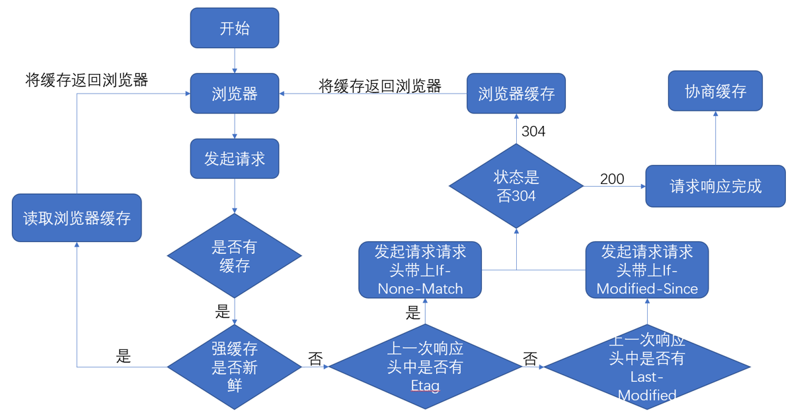

### 懒加载
按需加载
  1. 浏览一个网页，准备往下拖动滚动条
  2. 拖动一个占位图片到视窗
  3. 占位图片被瞬间替换成最终的图片
  
#### 内联图片

一张图片就是一个``标签，浏览器是否发起请求图片是根据``的src属性，所以实现懒加载的关键就是，在图片没有进入可视区域时，先不给``的src赋值，这样浏览器就不会发送请求了，等到图片进入可视区域再给src赋值。

```JavaScript

```

- class：用于在JavaScript中关联元素
- src属性：指向了一张占位图片，图片在页面的第一次加载会显现
- data-src和data-srcset属性：这是占位属性，里面放的是目标图片的url


> 方法一：监听一些事件比如scroll或者resize来检测元素出现在视窗

`scrollTop+clientHeight > offsetTop`

```JavaScript
//性能损耗，不建议使用，但若浏览器不兼容Observer则需使用
document.addEventListener("DOMContentLoaded", function() {
  let lazyImages = [].slice.call(document.querySelectorAll("img.lazy"));
  let active = false;

  const lazyLoad = function() {
    if (active === false) {
      active = true;

      setTimeout(function() {
        lazyImages.forEach(function(lazyImage) {
          if ((lazyImage.getBoundingClientRect().top <= window.innerHeight && lazyImage.getBoundingClientRect().bottom >= 0) && getComputedStyle(lazyImage).display !== "none") {
            lazyImage.src = lazyImage.dataset.src;
            lazyImage.srcset = lazyImage.dataset.srcset;
            lazyImage.classList.remove("lazy");

            lazyImages = lazyImages.filter(function(image) {
              return image !== lazyImage;
            });

            if (lazyImages.length === 0) {
              document.removeEventListener("scroll", lazyLoad);
              window.removeEventListener("resize", lazyLoad);
              window.removeEventListener("orientationchange", lazyLoad);
            }
          }
        });

        active = false;
      }, 200);
    }
  };

  document.addEventListener("scroll", lazyLoad);
  window.addEventListener("resize", lazyLoad);
  window.addEventListener("orientationchange", lazyLoad);
});
```


> 方法二：利用intersectionObserver

```JavaScript
document.addEventListener("DOMContentLoaded", function() {
    var lazyImages = [].slice.call(document.querySelectorAll("img.lazy"));
    
    //兼容性
    if (!('IntersectionObserver' in window)) {
        return;
    }
    
    let lazyImageObserver = new IntersectionObserver(function(entries, observer) {
      entries.forEach(function(entry) {
//      回调函数将会在元素可见性变化时被调用。
        if (entry.isIntersecting) {
          let lazyImage = entry.target;
          lazyImage.src = lazyImage.dataset.src;
          lazyImage.srcset = lazyImage.dataset.srcset;
          lazyImage.classList.remove("lazy");
          // 取消监听
          lazyImageObserver.unobserve(lazyImage);
        }
      });
    });
    
    lazyImages.forEach(function(lazyImage) {
      lazyImageObserver.observe(lazyImage);
    });

});
 
```

#### CSS图像

相比较而言，CSS加载图片比较容易控制。当文档对象模型、CSS对象模型和渲染树被构造完成后，开始请求外部资源之前，浏览器会检测CSS规则是怎么应用到DOM上的。**如果浏览器检测到CSS引用的外部资源并没有应用到已存在的DOM节点上，浏览器就不会请求这些资源。** 这个行为可用于延迟CSS图片资源的加载，思路是通过JavaScript检测到元素处于视窗中时，加一个class类名，这个class就引用了外部图片资源。 这可以实现图片按需加载而不是一次性全部加载。

```HTML
 <div class="lazy-background">
  <h1>Here's a hero heading to get your attention!</h1>
  <p>Here's hero copy to convince you to buy a thing!</p>
  <a href="/buy-a-thing">Buy a thing!</a>
</div>
<style>
 .lazy-background {
  background-image: url("hero-placeholder.jpg"); /* 占位图片 */
}

.lazy-background.visible {
  background-image: url("hero.jpg"); /* 真正的图片 */
}
</style>
 <script>
 //利用JavaScript去检测元素是否处于视窗（intersection observer）
 //如果可见就为它加上一个visible的类名。

 document.addEventListener("DOMContentLoaded", function() {
  var lazyBackgrounds = [].slice.call(document.querySelectorAll(".lazy-background"));

  if ("IntersectionObserver" in window) {
    let lazyBackgroundObserver = new IntersectionObserver(function(entries, observer) {
      entries.forEach(function(entry) {
        if (entry.isIntersecting) {
          entry.target.classList.add("visible");
          lazyBackgroundObserver.unobserve(entry.target);
        }
      });
    });

    lazyBackgrounds.forEach(function(lazyBackground) {
      lazyBackgroundObserver.observe(lazyBackground);
    });
  }
});
</script>
```

    

### 重排重绘
重排(Reflow)：当渲染树的一部分必须更新并且节点的尺寸发生了变化，浏览器会使渲染树中受到影响的部分失效，并重新构造渲染树。
重绘(Repaint)：是在一个元素的外观被改变所触发的浏览器行为，浏览器会根据元素的新属性重新绘制，使元素呈现新的外观。比如改变某个元素的背景色、文字颜色、边框颜色等等
1. 区别：重绘不一定需要重排（比如颜色的改变），重排必然导致重绘（比如改变网页位置）
2. 引发重排
  - 添加、删除可见的dom
  - 元素的位置改变
  - 元素的尺寸改变(外边距、内边距、边框厚度、宽高、等几何属性)
  - 页面渲染初始化
  -  浏览器窗口尺寸改变
  -  获取某些属性。当获取一些属性时，浏览器为取得正确的值也会触发重排,它会导致队列刷新，这些属性包括：offsetTop、offsetLeft、 offsetWidth、offsetHeight、scrollTop、scrollLeft、scrollWidth、scrollHeight、clientTop、clientLeft、clientWidth、clientHeight、getComputedStyle() (currentStyle in IE)。所以，在多次使用这些值时应进行缓存。


> 优化：


浏览器自己的优化：
  - 浏览器会维护1个队列，把所有会引起重排，重绘的操作放入这个队列，等队列中的操作到一定数量或者到了一定时间间隔，浏览器就会flush队列，进行一批处理，这样多次重排，重绘变成一次重排重绘

减少 reflow/repaint： 
  - 不要一条一条地修改 DOM 的样式。可以先定义好 css 的 class，然后修改 DOM className。
  - 不要把 DOM 结点的属性值放在一个循环里当成循环里的变量。 
  - 为动画的 HTML 元件使用 fixed 或 absoult 的 position，那么修改他们的 CSS 是不会 reflow 的。 
  - 千万不要使用 table 布局。因为可能很小的一个小改动会造成整个 table 的重新布局。(table及其内部元素除外，它可能需要多次计算才能确定好其在渲染树中节点的属性，通常要花3倍于同等元素的时间。这也是为什么我们要避免使用table做布局的一个原因。)
  - 不要在布局信息改变的时候做查询（会导致渲染队列强制刷新）


### 网站安全

前端常见安全问题的7个方面：
1. iframe
2. opener
3. CSRF（跨站请求伪造）
4. XSS（跨站脚本攻击）
5. ClickJacking（点击劫持）
6. HSTS（HTTP严格传输安全）
7. CND劫持


#### XSS（跨站脚本攻击）

 XSS又叫CSS（Cross Site Script），跨站脚本攻击：攻击者在目标网站植入恶意脚本（js / html），用户在浏览器上运行时可以获取用户敏感信息（cookie / session）、修改web页面以欺骗用户、与其他漏洞相结合形成蠕虫等。


> XSS防御总结


- i）对数据进行严格的输出编码：如HTML元素的编码，JS编码，CSS编码，URL编码等等
  - 避免拼接 HTML；Vue/React 技术栈，避免使用 v-html / dangerouslySetInnerHTML
- ii）CSP HTTP Header，即 Content-Security-Policy、X-XSS-Protection
  - 增加攻击难度，配置CSP(本质是建立白名单，由浏览器进行拦截)
  - Content-Security-Policy: default-src 'self'-所有内容均来自站点的同一个源（不包括其子域名）
  - Content-Security-Policy: default-src 'self' *.trusted.com-允许内容来自信任的域名及其子域名 (域名不必须与CSP设置所在的域名相同)
  - Content-Security-Policy: default-src https://yideng.com-该服务器仅允许通过HTTPS方式并仅从yideng.com域名来访问文档
- iii）输入验证：比如一些常见的数字、URL、电话号码、邮箱地址等等做校验判断
- iv）开启浏览器XSS防御：Http Only cookie，禁止 JavaScript 读取某些敏感 Cookie，攻击者完成 XSS 注入后也无法窃取此 Cookie。
- v）验证码


### 缓存策略

