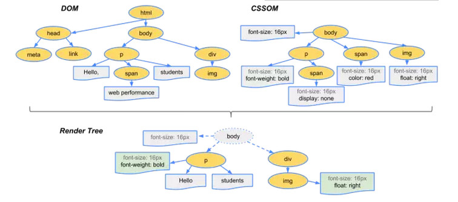
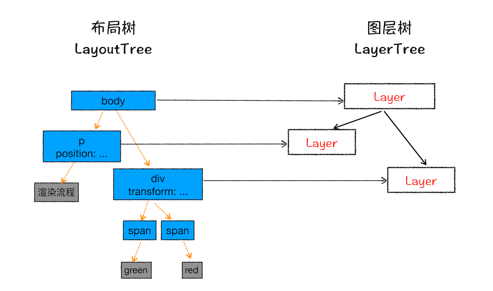
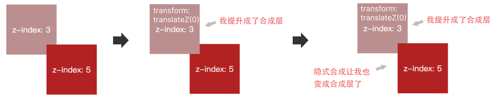
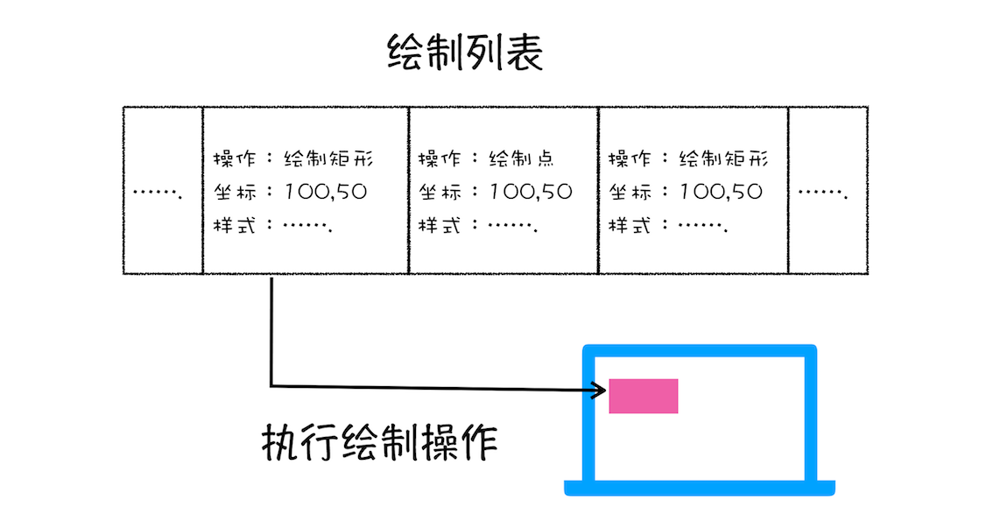
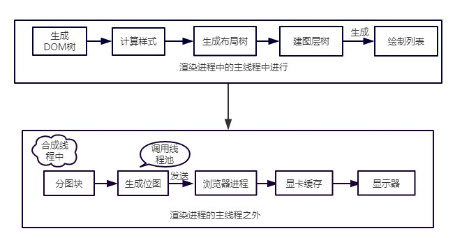
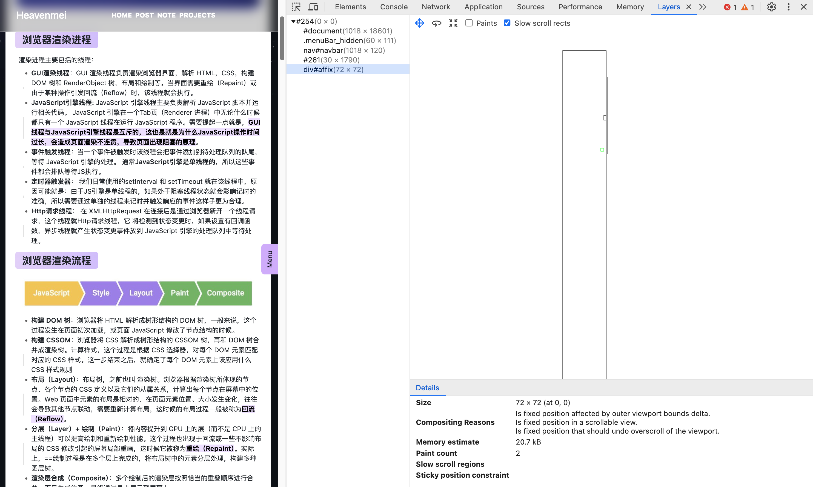
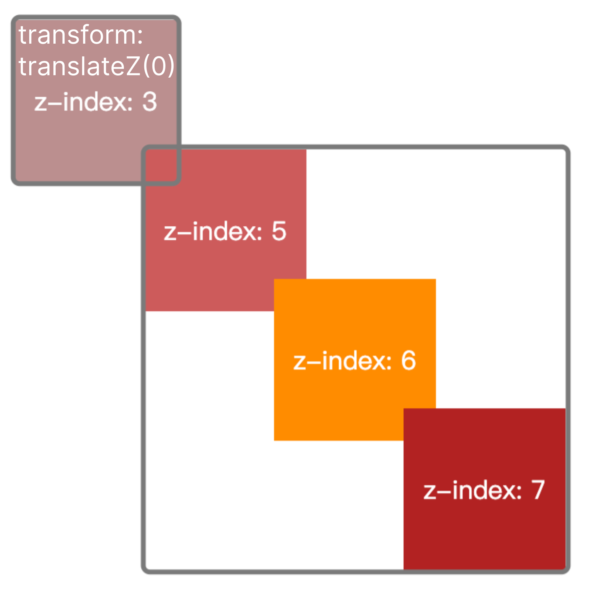

## 浏览器渲染进程

渲染进程主要包括的线程：

- **GUI渲染线程**：GUI 渲染线程负责渲染浏览器界面，解析 HTML，CSS，构建 DOM 树和 RenderObject 树，布局和绘制等。当界面需要重绘（Repaint）或由于某种操作引发回流（Reflow）时，该线程就会执行。
- **JavaScript引擎线程:** JavaScript 引擎线程主要负责解析 JavaScript 脚本并运行相关代码。 JavaScript 引擎在一个Tab页（Renderer 进程）中无论什么时候都只有一个 JavaScript 线程在运行 JavaScript 程序。需要提起一点就是，==GUI线程与JavaScript引擎线程是互斥的，这也是就是为什么JavaScript操作时间过长，会造成页面渲染不连贯，导致页面出现阻塞的原理==。
- **事件触发线程**：当一个事件被触发时该线程会把事件添加到待处理队列的队尾，等待 JavaScript 引擎的处理。 通常**JavaScript引擎是单线程的**，所以这些事件都会排队等待JS执行。
- **定时器触发器**： 我们日常使用的setInterval 和 setTimeout 就在该线程中，原因可能就是：由于JS引擎是单线程的，如果处于阻塞线程状态就会影响记时的准确，所以需要通过单独的线程来记时并触发响应的事件这样子更为合理。
- **Http请求线程**： 在 XMLHttpRequest 在连接后是通过浏览器新开一个线程请求，这个线程就Http请求线程，它 将检测到状态变更时，如果设置有回调函数，异步线程就产生状态变更事件放到 JavaScript 引擎的处理队列中等待处理。


## 浏览器渲染流程


- **构建 DOM 树**：浏览器将 HTML 解析成树形结构的 DOM 树，一般来说，这个过程发生在页面初次加载，或页面 JavaScript 修改了节点结构的时候。
- **构建 CSSOM**：浏览器将 CSS 解析成树形结构的 CSSOM 树，再和 DOM 树合并成渲染树。计算样式，这个过程是根据 CSS 选择器，对每个 DOM 元素匹配对应的 CSS 样式。这一步结束之后，就确定了每个 DOM 元素上该应用什么 CSS 样式规则
- **布局（Layout）**：布局树，之前也叫 渲染树。浏览器根据渲染树所体现的节点、各个节点的 CSS 定义以及它们的从属关系，计算出每个节点在屏幕中的位置。Web 页面中元素的布局是相对的，在页面元素位置、大小发生变化，往往会导致其他节点联动，需要重新计算布局，这时候的布局过程一般被称为==回流（Reflow）==。
- **分层（Layer）+ 绘制（Paint）**：将内容提升到 GPU 上的层（而不是 CPU 上的主线程）可以提高绘制和重新绘制性能。这个过程也出现于回流或一些不影响布局的 CSS 修改引起的屏幕局部重画，这时候它被称为==重绘（Repaint）==。实际上，==绘制过程是在多个层上完成的，将布局树中的元素分层处理，构建多种图层树。
- **渲染层合成（Composite）**：多个绘制后的渲染层按照恰当的重叠顺序进行合并，而后生成位图，最终通过显卡展示到屏幕上。




### DOM Tree

流程：**字节（Bytes）→字符（Characters）→令牌（Tokens）→节点（Nodes）→对象模型（DOM）**

浏览器构建 DOM 树时，这个过程占用了**主线程**。==当解析器发现非阻塞资源（CSS文件、图片），不会阻塞DOM树解析，但是会阻塞DOM树渲染==。浏览器会请求这些资源并且继续解析。

==但是对于 `<script> `标签（特别是没有 async 或者 defer 属性的）会阻塞渲染并停止 HTML 的解析==，完成后才会从暂停的地方重新开始。这也是就为什么 script标签要放到最后。

==并且 CSS 也会影响 JS 的执行==，只有当解析完样式表才会执行 JS，所以也可以认为这种情况下，CSS 也会暂停构建 DOM。


#### CSS 阻塞结论
1. css加载不会阻塞DOM树的解析
2. css加载会阻塞DOM树的渲染
3. css加载会阻塞后面js语句的执行

#### Load 和 DOMContentLoaded 区别

- Load 事件触发代表页面中的 DOM，CSS，JS，图片已经全部加载完毕。
- DOMContentLoaded 事件触发代表初始的 HTML 被完全加载和解析，不需要等待 CSS，JS，图片加载。


### CSSOM

`document.styleSheets` 可以查看CSS格式化最终结果（CSSOM）


首先对CSS 的格式化（字节流->styleSheets）和标准化 (em/red->px/rgb)处理后, 计算每个节点的具体样式信息，计算规则主要包括 **继承** 和 **层叠**。计算完成后，所有样式会被挂到`window.getComputedStyle` 上，以供JS 获取计算后的样式。


### Layout Tree

- 遍历DOM树**可见节点**，并把这些节点加到布局树中
- 对于不可见的节点，head,meta标签等都会被忽略。对于body.p.span 这个元素，它的属性包含**display:none**,所以这个元素没有被包含进布局树。

接下来会计算布局树节点的坐标位置（不扩展了）

在布局树中，一个 DOM 节点会有一个渲染对象（RenderObject）。一个渲染对象知道如何绘制一个 DOM 节点的内容，它通过向一个绘图上下文（GraphicsContext）发出必要的绘制调用来绘制 DOM 节点。


### Layer Tree 分层

**浏览器的页面实际上被分成了很多图层，这些图层叠加后合成了最终的页面。**

**并不是布局树的每个节点都包含一个图层，如果一个节点没有对应的层，那么这个节点就从属于父节点的图层。**




有些说法会把图层树分为，先构建渲染层（RenderLyar），在构建合成层（GraphicsLayer）。这个说法太复杂了。简单来说就是给特定阶段创建新的图层。那什么情况下，渲染引擎会为特定的节点创建新图层呢？

#### 显式合成

两种情况：有层叠上下文 或者 需要被剪裁


拥有层叠上下文的节点：
- HTML 根元素
- 有明确的定位属性（relative、fixed、sticky、absolute），`positon != static`, 并且设置了 `z-index`
- **opacity** 不为 1
- **transform** 不为 none。3D转换
- **fliter** 不为 none
- **isolation** 不为 none。isolation 属性决定了元素是否必须创建一个新的层叠上下文。
-  具有 **will-change** 属性


- video、canvas、iframe 等元素
- 通过 Element.animate() 实现的 opacity 动画转换
- 对 opacity、transform、fliter、backdropfilter 应用了 animation 或者 transition

**需要剪裁（Clip）**：
- 如果出现滚动条，滚动条也会被单独提升为一个图层


#### 隐式合成

就是`z-index`比较低的节点会提升为一个单独的图层，那么`层叠等级比它高`的节点**都会**成为一个独立的图层。


**举个例子🌰：**



4. 两个 absolute 定位的 div 在屏幕上交叠了，根据  `z-index`  的关系，其中一个 div 就会”盖在“了另外一个上边。
5. 这个时候，如果处于下方的 div 被加上了 CSS 属性：`transform: translateZ(0)`，就会被浏览器提升为合成层。原本应该处于上方的 div 就依然还是跟 Document 共用一个 Layer，层级反而降了，就出现了元素交叠关系错乱的问题。
6. 所以为了纠正错误的交叠顺序，浏览器必须让原本应该”盖在“它上边的渲染层也同时提升为合成层。


### 绘制

分好层后，就需要对每个层进行绘制了。绘制并不是一蹴而就，而是像画画一样，是按顺序一笔一笔画出来的，渲染引擎也是类似。对于每一个合成层，渲染引擎的渲染过程：

- 先绘制下面的渲染层，再绘制上面的渲染层；
- 在绘制一个渲染层时，将一个渲染层的绘制拆分成很多小的绘制指令。需要说明一点，**绘制列表只是用来记录绘制顺序和绘制指令的列表，并没有真正的绘制出页面**。




### 合成

生成了绘制指令，就到了真正绘制页面的时候了，主线程会将这些信息交给合成线程，==由合成线程来完成绘制==


#### 分块

页面可能很大，但用户只能看到一部分，在这种情况下如果全部绘制，就会产生很大的性能开销，因此需要**优先绘制视口**（即用户看到的区域）区域内的元素。

基于此原因，绘制前，**合成线程会对页面进行分块**，


#### 栅格化（raster）

然后将每个图块发送给栅格线程，**栅格线程将图块转换为位图**。合成器线程可以优先处理不同的栅格线程，这样就可以首先对视口（或附近）中的事物进行栅格化。

通常，**栅格化过程都会使用 GPU 来加速生成，生成的位图被保存在 GPU 内存中**。


#### 合成

一旦所有图块都被光栅化，合成线程发送**绘制图块命令**DrawQuad 给浏览器进程。浏览器进程中**viz组件**接收合成线程发过来的 DrawQuad 命令，然后根据 DrawQuad 命令，将其页面内容绘制到内存中，最后再将内存显示在屏幕上。

到这里，经过这一系列的阶段，编写好的 HTML、CSS、JavaScript 等文件，经过浏览器就会显示出漂亮的页面了。

## 渲染流水线大总结


结合上图，一个完整的渲染流程大致可总结为如下：

7. 渲染进程将 HTML 内容转换为能够读懂的 **DOM 树结构**。

8. 渲染引擎将 CSS 样式表转化为浏览器可以理解的** styleSheets**，计算出 DOM 节点的样式。

9. 创建**布局树**，并计算元素的布局信息。

10. 对布局树进行分层，并生成**分层树**。

11. 为每个图层生成**绘制列表**，并将其提交到合成线程。

12. 合成线程将图层分成**图块**，并在**光栅化线程**池中将图块转换成位图。

13. 合成线程发送**绘制图块命令**DrawQuad 给浏览器进程。

14. 浏览器进程根据 DrawQuad 消息生成页面，并**显示**到显示器上。

## 性能优化

### 重排、重绘、合成

更新了元素的几何属性（重排）
  - 添加、删除可见的dom
  - 元素的位置改变
  - 元素的尺寸改变(外边距、内边距、边框厚度、宽高、等几何属性)
  - 页面渲染初始化
  -  浏览器窗口尺寸改变
  -  获取某些属性。当获取一些属性时，浏览器为取得正确的值也会触发重排,它会导致队列刷新，这些属性包括：offsetTop、offsetLeft、 offsetWidth、offsetHeight、scrollTop、scrollLeft、scrollWidth、scrollHeight、clientTop、clientLeft、clientWidth、clientHeight、getComputedStyle() (currentStyle in IE)。所以，在多次使用这些值时应进行缓存。


更新元素的绘制属性（重绘）


直接合成阶段


#### 总结
- 重排**会改变元素的几何位置**，需要更新完整的渲染流水线，所以开销也是最大的
- 重绘只是**修改元素的颜色等非位置属性**，所以省去了布局和分层阶段，开销比重排小
- 合成：**transform 或 opacity只涉及几何变换或透明度变换**，会跳过前面的流程，直接进入合成阶段，开销最小。


#### 浏览器自己的优化
  - 浏览器会维护1个队列，把所有会引起重排，重绘的操作放入这个队列，等队列中的操作到一定数量或者到了一定时间间隔，浏览器就会flush队列，进行一批处理，这样多次重排，重绘变成一次重排重绘

#### 减少 reflow/repaint
  - 不要一条一条地修改 DOM 的样式。可以先定义好 css 的 class，然后修改 DOM className。
  - 不要把 DOM 结点的属性值放在一个循环里当成循环里的变量。 
  - 为动画的 HTML 元素使用 fixed 或 absoult 的 position，那么修改他们的 CSS 是不会 reflow 的。 
  - **不要使用 table 布局**。因为可能很小的一个小改动会造成整个 table 的重新布局。(table及其内部元素除外，它可能需要多次计算才能确定好其在渲染树中节点的属性，通常要花3倍于同等元素的时间。这也是为什么我们要避免使用table做布局的一个原因。)
  - 不要在布局信息改变的时候做查询（会导致渲染队列强制刷新）


### 提升为合成层优缺点

渲染层是为保证页面元素以正确的顺序，合成层是为了减少渲染的开销。

好处：

- 合成层的位图，会交由 GPU 合成，比 CPU 处理要快

- 当需要 repaint 时，只需要 repaint 本身，不会影响到其他的层

- ==对于 transform 和 opacity 效果，不会触发 layout 和 paint==

缺点：

- 绘制的图层必须传输到 GPU，这些层的数量和大小达到一定量级后，可能会导致传输非常慢，进而导致一些低端和中端设备上出现闪烁；
- 隐式合成容易产生过量的合成层，每个合成层都占用额外的内存，而内存是移动设备上的宝贵资源，过多使用内存可能会导致浏览器崩溃，让性能优化适得其反。

### 使用 transform 或者 opacity 来实现动画效果

从性能方面考虑，最理想的渲染流水线是没有布局和绘制环节的，只需要做合成层的合并即可：目前，**只有两个属性是满足这个条件的：`transforms 和 opacity`**。

==提升合成层的最好方式是使用 CSS 的 will-change 属性==。 `will-change`  设置为 opacity、transform、top、left、bottom、right 可以将元素提升为合成层。对于那些目前还不支持 will-change 属性的浏览器，目前常用的是使用`transform: translateZ(0)`来强制提升为合成层


### 减少隐式合成

例如，页面里边存在的一个带动画 transform 的 button 按钮，提升为了合成层，动画交叠的不确定性使得页面内其他  `z-index`  大于它但其实并没有交叠的节点也都全部提升为了合成层（这个原因真的好坑）。

- 这个时候我们只需要把这个动画节点的  `z-index`  属性值设置得大一些，让层叠顺序高过于页面其他无关节点就行。
- 当然并不是盲目地设置  `z-index`  就能避免，有时候  `z-index`  也还是会导致隐式合成，这个时候可以试着*调整一下文档中节点*的先后顺序直接让后边的节点来覆盖前边的节点，而不用  `z-index`  来调整重叠关系。

### 减小合成层的尺寸

举个例子🌰

要画一个尺寸 100x100的div， 可以首先设置尺寸 10x10 （width 和 height 属性减小合成层的物理尺寸），然后通过再用  `transform: scale(10)`  放大，这样一来可以极大地减少层合成带来的内存消耗。

```css
.top {
    width: 10px;
    height: 10px;
    transform: scale(10);
    top: 200px;
    left: 200px;
    z-index: 5;
    background: indianred;
}
```


## 查看合成层

F12，点击  `More tools -> Rendering`，选择  `Layer borders`，你就能看到页面合成层有黄色框。选择`More tools -> Layer`，可以看到所有图层。



左侧列出了所有提升为独立合成层的元素，右侧则是一个整体合成层边界视图，以及选定合成层的详细情况，包括以下几个比较关键的信息：

- Size：合成层的大小，其实也就是对应元素的尺寸；
- Compositing Reasons：形成复合层原因；
- Memory estimate：内存占用估算；
- Paint count：绘制次数；
- Slow scroll regions：缓慢滚动区域。


## 相关拓展

### 层爆炸和层压缩

**层爆炸**

由于隐式合成，很容易就产生一些不在预期范围内的合成层，当这些不符合预期的合成层达到一定量级时，就会变成层爆炸。

层爆炸会占用 GPU 和大量的内存资源，严重损耗页面性能，因此盲目地使用 GPU 加速，结果有可能会是适得其反。

例子详见：[CSS3 硬件加速也有坑](https://security.feishu.cn/link/safety?target=https%3A%2F%2Flink.juejin.cn%2F%3Ftarget%3Dhttps%253A%252F%252Fdiv.io%252Ftopic%252F1348&scene=ccm&logParams=%7B%22location%22%3A%22ccm_drive%22%7D&lang=zh-CN)  这篇文章提供了一个很有趣的  [DEMO](https://security.feishu.cn/link/safety?target=https%3A%2F%2Flink.juejin.cn%2F%3Ftarget%3Dhttp%253A%252F%252Ffouber.github.io%252Ftest%252Flayer%252F&scene=ccm&logParams=%7B%22location%22%3A%22ccm_drive%22%7D&lang=zh-CN)

**层压缩**

面对层爆炸，浏览器也有层压缩机制：如果多个渲染层同一个合成层重叠时，这些渲染层会被压缩到一个 GraphicsLayer 中，以防止由于重叠原因导致可能出现的“层爆炸”。

举个例子🌰：

有四个 absolute 定位的 div 在屏幕内发生了交叠。此时处于最下方的 div 在加上了 CSS 属性  `transform: translateZ(0)`  后被浏览器提升为合成层。

~~如果按照隐式合成的原理，盖在它上边的每一个 div 都会提升为一个新的合成层，就会产生四个合成层了~~。

然而事实并不是这样的，浏览器的层压缩机制，会将隐式合成的多个渲染层压缩到同一个 GraphicsLayer 中进行渲染，也就是说，上方的三个 div 最终会处于同一个合成层中，这就是浏览器的层压缩。




### CSS 如何影响 DOM 的构建

JavaScript 脚本由于可能会修改 DOM，因此会阻塞 DOM 的构建，这一点我们都知道；而 CSS 并不会操作或者改变 DOM，因此**通常我们认为 CSS 不会影响 DOM 的构建，只会影响后续的布局、绘制等过程。但其实CSS 可以通过 JavaScript 来阻塞 DOM 的构建**。

因为 JavaScript 是可以改变样式的，也就是具有修改 CSS 规则树的能力，而 JavaScript 脚本里是否有改变样式的操作，这一点在执行 JavaScript 之前是不可知的。因此，为保证 JavaScript 脚本的正确执行，**在执行 JavaScript 之前，CSS 规则树必须要先准备好**（不然万一有修改 CSS 的操作呢）。

也就是说，若在构建 DOM 的中途存在阻塞 DOM 构建的 JavaScript 脚本，而此页面中还包含了外部 CSS 文件的引用，那么此时就需要等目前的 CSS 规则树（基于目前生成完的部分 DOM 树）构建完毕后，再开始 JavaScript 脚本的执行，等一切结束了，再继续 DOM 的构建。


### CPU（中央处理器）和 GPU（图形处理器）

GPU 处理数据的过程大概是这样的：

- 将每个复合层绘制成一个单独的图像；
- 准备层数据（尺寸、偏移量、透明度等）；
- 准备动画着色器（如果适用）；
- 将数据发送到 GPU；


我们可以说  **CPU 所做的工作都在软件层面，而 GPU 在硬件层面**，我们可以用软件（使用 CPU ）做任何事情，但是对于图像处理，通常用硬件会更快，因为 GPU 使用图像对高度并行浮点运算做了优化。浏览器将从 CPU 绘制它，然后将生成的图像发送到 GPU，GPU 将其显示在屏幕上：

15. CPU 计算好显示内容提交到 GPU
16. GPU 渲染完成后将渲染结果放入**帧缓冲区**
17. 视频控制器会按照 VSync 信号逐行读取帧缓冲区的数据，经过可能的数模转换传递给显示器显示


## Reference

 [浏览器层合成](https://security.feishu.cn/link/safety?target=https%3A%2F%2Fjuejin.cn%2Fpost%2F6844903966573068301%23heading-9&scene=ccm&logParams=%7B%22location%22%3A%22ccm_drive%22%7D&lang=zh-CN)

 [无线性能优化：Composite](https://security.feishu.cn/link/safety?target=https%3A%2F%2Ffed.taobao.org%2Fblog%2F2016%2F04%2F26%2Fperformance-composite%2F&scene=ccm&logParams=%7B%22location%22%3A%22ccm_drive%22%7D&lang=zh-CN)

 [详谈合成层](https://security.feishu.cn/link/safety?target=https%3A%2F%2Fjuejin.cn%2Fpost%2F6844903502678867981%23heading-0&scene=ccm&logParams=%7B%22location%22%3A%22ccm_drive%22%7D&lang=zh-CN)

 [CSS GPU Animation](https://security.feishu.cn/link/safety?target=https%3A%2F%2Flink.juejin.cn%2F%3Ftarget%3Dhttps%253A%252F%252Fwww.smashingmagazine.com%252F2016%252F12%252Fgpu-animation-doing-it-right%252F&scene=ccm&logParams=%7B%22location%22%3A%22ccm_drive%22%7D&lang=zh-CN)

 [浏览器的工作原理](https://security.feishu.cn/link/safety?target=https%3A%2F%2Fjuejin.cn%2Fpost%2F6847902222349500430&scene=ccm&logParams=%7B%22location%22%3A%22ccm_drive%22%7D&lang=zh-CN)
 
 [06 | 渲染流程（下）：HTML、CSS 和 JavaScript，是如何变成页面的？-极客时间](https://time.geekbang.org/column/article/118826)

[# 渲染页面：浏览器的工作原理](https://developer.mozilla.org/zh-CN/docs/Web/Performance/Guides/How_browsers_work)

 [人人FED团队的文章-从Chrome源码看浏览器如何layout布局](https://link.juejin.cn/?target=https%3A%2F%2Fwww.rrfed.com%2F2017%2F02%2F26%2Fchrome-layout%2F "https://www.rrfed.com/2017/02/26/chrome-layout/")