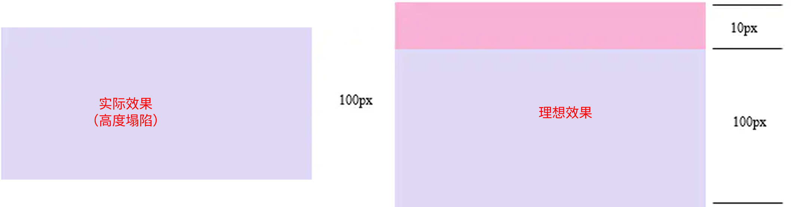
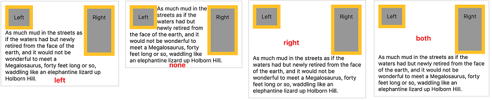
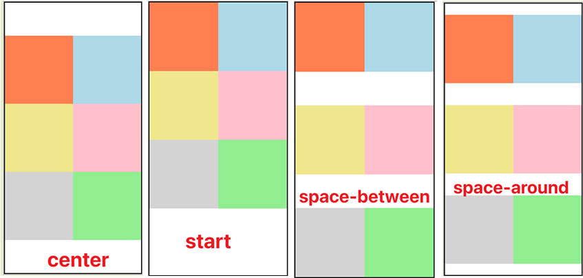

## 选择器

### [分类](https://security.feishu.cn/link/safety?target=https%3A%2F%2Fwww.w3cschool.cn%2Fcssref%2F53s812dp.html&scene=ccm&logParams=%7B%22location%22%3A%22ccm_drive%22%7D&lang=zh-CN)

1. 标签选择器

2. 类选择器`.`

3. id 选择器`#`

4. 复合选择器  `标签+类/id`

5. 组合选择器  `,` （#b1,.p1,h1,span,div.red{}）

6. 嵌套选择器

   - 父元素  `>`  子元素
   - 祖先`空格`后代
   - 兄  `~`  弟

7. 属性选择器

   - `[属性名]`  选择含有指定属性的元素
   - `[属性名=属性值]`  选择含有指定属性和属性值的元素
   - `[属性名^=属性值]`  选择属性值以指定值开头的元素
   - `[属性名$=属性值]`  选择属性值以指定值结尾的元素
   - `[属性名*=属性值]`  选择属性值中含有某值的元素的元素

8. 伪类/伪元素选择器  `:`

   伪类，用来描述一个元素的特殊状态（不存在的类，特殊的类） 伪元素，表示页面中一些特殊的并不真实的存在的元素（特殊的位置）
   
| 选择器                                                                                                                                                                                                 | 示例             | 示例说明                             |
| --------------------------------------------------------------------------------------------------------------------------------------------------------------------------------------------------- | -------------- | -------------------------------- |
| [:link](https://security.feishu.cn/link/safety?target=https%3A%2F%2Fwww.w3cschool.cn%2Fcssref%2Fsel-link.html&scene=ccm&logParams=%7B%22location%22%3A%22ccm_drive%22%7D&lang=zh-CN)                | a:link         | 选择所有未访问链接                        |
| [:visited](https://security.feishu.cn/link/safety?target=https%3A%2F%2Fwww.w3cschool.cn%2Fcssref%2Fsel-visited.html&scene=ccm&logParams=%7B%22location%22%3A%22ccm_drive%22%7D&lang=zh-CN)          | a:visited      | 选择所有访问过的链接                       |
| [:active](https://security.feishu.cn/link/safety?target=https%3A%2F%2Fwww.w3cschool.cn%2Fcssref%2Fsel-active.html&scene=ccm&logParams=%7B%22location%22%3A%22ccm_drive%22%7D&lang=zh-CN)            | a:active       | 选择正在活动链接                         |
| [:hover](https://security.feishu.cn/link/safety?target=https%3A%2F%2Fwww.w3cschool.cn%2Fcssref%2Fsel-hover.html&scene=ccm&logParams=%7B%22location%22%3A%22ccm_drive%22%7D&lang=zh-CN)              | a:hover        | 把鼠标放在链接上的状态                      |
| [:focus](https://security.feishu.cn/link/safety?target=https%3A%2F%2Fwww.w3cschool.cn%2Fcssref%2Fsel-focus.html&scene=ccm&logParams=%7B%22location%22%3A%22ccm_drive%22%7D&lang=zh-CN)              | input:focus    | 选择元素输入后具有焦点                      |
| [:first-letter](https://security.feishu.cn/link/safety?target=https%3A%2F%2Fwww.w3cschool.cn%2Fcssref%2Fsel-firstletter.html&scene=ccm&logParams=%7B%22location%22%3A%22ccm_drive%22%7D&lang=zh-CN) | p:first-letter | 选择每个`<p>` 元素的第一个字母               |
| [:first-line](https://security.feishu.cn/link/safety?target=https%3A%2F%2Fwww.w3cschool.cn%2Fcssref%2Fsel-firstline.html&scene=ccm&logParams=%7B%22location%22%3A%22ccm_drive%22%7D&lang=zh-CN)     | p:first-line   | 选择每个`<p>` 元素的第一行                 |
| [:first-child](https://security.feishu.cn/link/safety?target=https%3A%2F%2Fwww.w3cschool.cn%2Fcssref%2Fsel-firstchild.html&scene=ccm&logParams=%7B%22location%22%3A%22ccm_drive%22%7D&lang=zh-CN)   | p:first-child  | 选择器匹配属于任意元素的第一个子元素的 `<p>` 元素     |
| [:nth-child(*n*)](https://security.feishu.cn/link/safety?target=https%3A%2F%2Fwww.w3cschool.cn%2Fcssref%2Fsel-nth-child.html&scene=ccm&logParams=%7B%22location%22%3A%22ccm_drive%22%7D&lang=zh-CN) | p:nth-child(2) | 选择每个 `<p>` 元素是其父级的第二个子元素         |
| [:lang(*language*)](https://security.feishu.cn/link/safety?target=https%3A%2F%2Fwww.w3cschool.cn%2Fcssref%2Fsel-lang.html&scene=ccm&logParams=%7B%22location%22%3A%22ccm_drive%22%7D&lang=zh-CN)    | p:lang(it)     | 为`<p>`元素的lang属性选择一个开始值           |
| [::before](https://security.feishu.cn/link/safety?target=https%3A%2F%2Fwww.w3cschool.cn%2Fcssref%2Fsel-before.html&scene=ccm&logParams=%7B%22location%22%3A%22ccm_drive%22%7D&lang=zh-CN)           | p:before       | 在每个`<p>`元素之前插入内容，需要配合content属性使用 |
| [::after](https://security.feishu.cn/link/safety?target=https%3A%2F%2Fwww.w3cschool.cn%2Fcssref%2Fsel-after.html&scene=ccm&logParams=%7B%22location%22%3A%22ccm_drive%22%7D&lang=zh-CN)             | p:after        | 在每个`<p>`元素之后插入内容，需要配合content属性使用 |


```css
div:before {
  content: "abc";
  color: red;
}

div:after {
  content: "haha";
  color: blue;
}
div::after {
  content: "";
  display: block; //一定要
  width: 20px;
  height: 20px;
  background-color: rgb(255, 0, 0);
}
```

### 样式的继承

我们为一个元素设置的样式同时也会应用到它的后代元素上，继承是发生在**祖先和后代**之间的。

⚠️注意：并不是所有的样式都会被继承：比如 背景相关的，布局相关等的这些样式都不会被继承。

### 选择器优先级

**行内样式（1000）>ID 选择器（100）>类选择器（10）>标签选择器（1）**  

原因：首先加载标签选择器,再加载类选择器，然后加载 ID 选择器，最后加载行内样式

**CSS 优先级法则：**

- 选择器都有一个权值，权值越大越优先；
- 当权值相等时，**后出现的样式表设置要优于先出现的样式表设置**；
- 创作者的规则高于浏览者：即网页编写者设置的 CSS 样式的优先权高于浏览器所设置的样式；
- 继承的 CSS 样式不如后来指定的 CSS 样式；
- 在同一组属性设置中标有  `!important`  规则的优先级最大；

## 单位

### 长度单位

绝对长度：
- **像素 px**： 屏幕（显示器）实际上是由一个一个的小点点构成的,不同屏幕的像素大小是不同的，像素越小的屏幕显示的效果越清晰 所以同样的 200px 在不同的设备下显示效果不一样
- **英寸 pt**

相对长度：
- **百分比**：也可以将属性值设置为相对于**其父元素属性的百分比**，设置百分比可以使子元素跟随父元素的改变而改变
- **em**：em 是**相对于元素的字体大小**来计算的，1em = 1font-size，em 会根据字体大小的改变而改变
- **rem**：rem 是**相对于根元素（html）的字体大小**来计算，HTML 根元素默认字体的大小为<u>16px</u>， 也称为基础字体大小

### 颜色单位

**颜色名**：red、orange、yellow、blue、green ... ...

**RGB 值**：每一种颜色的范围在 0 - 255 (0% - 100%) 之间，语法：`RGB(红色,绿色,蓝色)`

**RGBA**：就是在 rgb 的基础上增加了一个`a表示不透明度`，1 表示完全不透明 0 表示完全透明 .5 半透明

**十六进制的 RGB 值**：语法：`#红色绿色蓝色`  颜色浓度通过 00-ff

 如果颜色两位两位重复可以进行简写 `#aabbcc` --> `#abc`

**HSL 值 HSLA 值**

 - H 色相(0 - 360)
 - S 饱和度，颜色的浓度 0% - 100%
 - L 亮度，颜色的亮度 0% - 100%

## 常用的 CSS 属性

### 字体属性

| 属性        | 含义       | 说明                                                     |
| ----------- | ---------- | -------------------------------------------------------- |
| font-size   | 大小、尺寸 | 可以使用多种单位                                         |
| font-weight | 粗细       | normal 普通（默认） bold 粗体 自定义 400 normal 700 bold |
| font-family | 字体       | 一般建议写 3 种字体：首选、其次、备用。以逗号隔开        |
| font-style  | 样式       | normal 普通 italic 斜体                                  |
| font        | 简写       | font:font-style\|font-weight\|font-size\|font-family     |

### 文本属性

| 属性            | 含义           | 说明                                                   |
| --------------- | -------------- | ------------------------------------------------------ |
| color           | 颜色           |                                                        |
| line-height     | 行高           | 行之间的高度                                           |
| text-align      | 水平对齐方式   | 取值：left、center、right                              |
| vertical-align  | 垂直对齐方式   | 取值：top、middle、bottom 可以用于图片和文字的对齐方式 |
| text-indent     | 首行缩进       |                                                        |
| text-decoration | 文本修饰       | 取值：underline、overline、line-through                |
| text-transform  | 字母大小写转换 | 取值：lowercase、uppercase、capitalize 首字母大写      |
| letter-spacing  | 字符间距       |                                                        |
| word-spacing    | 单词间距       | 只对英文有效                                           |
| white-space     | 空白的处理方式 | 文本超出后是否换行，取值：nowrap                       |

### 背景属性

| 属性                  | 含义                 | 说明                                                                                                                |
| --------------------- | -------------------- | ------------------------------------------------------------------------------------------------------------------- |
| background-color      | 背景颜色             | 取值：transparent 透明                                                                                              |
| background-image      | 背景图片             | 必须使用 url()方式指定图片的路径                                                                                    |
| background-repeat     | 背景图片的重复方式   | 取值：repeat(默认)，repeat-x，repeat-y,no-repeat                                                                    |
| background-position   | 背景图片的显示位置   | 取值：<br />关键字：top、bottom、left、right、center<br /> 坐标：左上角为(0,0)坐标，向右为 x 正方向,向下为 y 正方向 |
| background-attachment | 背景图片是否跟随滚动 | 取值：scroll(默认)、fixed 固定不动                                                                                  |
| background            | 简写                 |                                                                                                                     |

### 其他属性 display

**`display`  用来设置元素显示的类型**

- inline 将元素设置为行内元素
- block 将元素设置为块元素
- inline-block 将元素设置为行内块元素 ，行内块，既可以设置宽度和高度又不会独占一行
- table 将元素设置为一个表格
- none 元素不在页面中显示

**`visibility`  用来设置元素的显示状态**

- visible 默认值，元素在页面中正常显示
- hidden 元素在页面中隐藏 不显示，但是依然占据页面的位置

## 盒子模型

```css
width 宽度
height 高度
border 边框
  - border-width：上 右 下 左 /  border-xxx-width
  - border-color
  - border-style： solid 表示实线   dotted 点状虚线     dashed 虚线    double 双线
  - border-radius: 用来设置圆角 圆角设置的圆的半径大小
padding 内边距
margin 外边距
```

### 水平居中

```css
width: xxxpx;
margin: 0 auto;
```

### 溢出

`overflow`  属性来设置父元素如何处理溢出的子元素:( overflow-x: overflow-y: )

- visible，默认值 子元素会从父元素中溢出，在父元素外部的位置显示
- hidden 溢出内容将会被裁剪不会显示
- scroll 生成两个滚动条，通过滚动条来查看完整的内容
- auto 根据需要生成滚动条

### 外边距的合并

**相邻的垂直方向外边距会发生重叠现象**

- 兄弟元素间的相邻垂直外边距会取两者之间的较大值（两者都是正值） 特殊情况：
	- 如果相邻的外边距一正一负，则取两者的和
	- 如果相邻的外边距都是负值，则取两者中绝对值较大的
	- 兄弟元素之间的外边距的重叠，对于开发是有利的，所以我们<u>不需要进行处理</u>

- **父子元素间相邻外边距，子元素多余的外边距会被父元素的外边距截断** 父子外边距的折叠会影响到页面的布局，必须要进行处理。解决：在父元素上加上 overflow:hidden;使其成为 BFC。
- 父子元素和兄弟元素边距重叠，重叠原则取最大值。
- 空元素的边距重叠是取 margin 与 padding 的最大值。

```html
<style>
.parent {
  background: #e7a1c5;
}
.parent .child {
  background: #c8cdf5;
  height: 100px;
  margin-top: 10px;
}
</style>
<section class="parent">
	<article class="child"></article>
</section>
```





## 浮动 float

### 文档流（normal flow）

网页是一个多层的结构，一层摞着一层，通过 CSS 可以分别为每一层来设置样式，作为用户来讲只能看到最顶上一层 这些层中，**最底下的一层称为文档流**，文档流是网页的基础。

我们所创建的元素默认都是在文档流中进行排列，对于我们来元素主要有两个状态：<u>在文档流中，不在文档流中</u>

#### 元素在文档流中的特点

**块元素**

- ==独占一行，宽父高自==
- 块元素会在页面中独占一行(自上向下垂直排列)
- 默认宽度是父元素的全部（会把父元素撑满)
- 默认高度是被内容撑开（子元素）

**行内元素**

- ==不占一行，宽高自==
- 行内元素不会独占页面的一行，只占自身的大小
- 行内元素在页面中左向右水平排列，如果一行之中不能容纳下所有的行内元素，则元素会换到第二行继续自左向右排列（书写习惯一致）
- 内元素的默认宽度和高度都是被内容撑开

#### 脱离文档流的特点

**脱离文档流以后，不需要再区分块和行内了， 特点跟行内元素一致。**==不占一行，宽高自==

**块元素 && 内元素**

- 块元素不在独占页面的一行
- 脱离文档流以后，块元素的宽度和高度默认都被内容撑开
- 行内元素脱离文档流以后会变成块元素，特点和块元素一样


### 浮动

使用  `float`  属性来设置于元素的浮动
- none 默认值 ，元素不浮动
- left 元素向左浮动
- right 元素向右浮动

⚠️注意：元素设置浮动以后，水平布局的等式便不需要强制成立， 元素设置浮动以后，会完全从文档流中脱离，不再占用文档流的位置，所以**元素下边的还在文档流中的元素会自动向上移动**


#### 浮动的特点

2. 浮动元素会完全**脱离文档流**，不再占据文档流中的位置
3. 设置浮动以后元素会向父元素的左侧或右侧移动
4. 浮动元素默认**不会从父元素中移出**
5. 浮动元素向左或向右移动时，**不会超过它前边的其他浮动元素**
6. **如果浮动元素的上边是一个没有浮动的块元素，则浮动元素无法上移
7. 浮动元素不会超过它上边的浮动的兄弟元素，最多最多就是和它一样高

==简单总结： 浮动的主要作用就是让页面中的元素可以水平排列，通过浮动可以制作一些水平方向的布局==

### BFC 块级格式化环境

BFC(Block Formatting Context) 是一个 CSS 中的一个隐含的属性，可以为一个元素开启 BFC，开启 BFC 该元素会变成一个独立的布局区域。**BFC 就是一个隔离的独立容器，容器里面的子元素不会影响到外面的元素，反之亦然。**

#### BFC渲染/布局规则

1. 内部的 Box 会在垂直方向，从顶部开始一个接着一个地放置； 
2. Box垂直方向的距离由 `margin` 决定，属于同一个 `BFC` 的两个相邻Box的 `margin` 会发生重叠；
3. 每个元素的 `margin Box` 的左边， 与包含块 `border Box` 的左边相接触，（对于从左到右的格式化，否则相反）。即使存在浮动也是如此； 
4. BFC 在页面上是一个隔离的独立容器，外面的元素不会影响里面的元素，反之亦然。文字环绕效果，设置 `float`； 
5. 开启 BFC 的元素**不会被浮动元素所覆盖**（清浮动）; 
6. 计算 `BFC` 的高度时，浮动元素也参与计算，**可以包含浮动的子元素**；
7. 开启 BFC 的元素子元素和父元素**外边距不会重叠**。


#### 触发 BFC
1. 根元素，即 HTML 元素（最大的一个 `BFC`）​ 
2. 浮动元素：float 除 none 以外的值。
3. 绝对定位元素：position (absolute、fixed)。
4. display 为 行内块（inline-block）、表格单元（table、table-cell、table-caption）、弹性和（flex、inline-flex）
5. overflow 除了 visible 以外的值 (hidden、auto、scroll)。

#### 使用场景

[遇到哪些问题需要用到 BFC](https://security.feishu.cn/link/safety?target=https%3A%2F%2Fblog.csdn.net%2Fsinat_36422236%2Farticle%2Fdetails%2F88763187%3Fops_request_misc%3D%25257B%252522request%25255Fid%252522%25253A%252522164482927316780261938625%252522%25252C%252522scm%252522%25253A%25252220140713.130102334..%252522%25257D%26request_id%3D164482927316780261938625%26biz_id%3D0%26utm_medium%3Ddistribute.pc_search_result.none-task-blog-2~all~top_positive~default-2-88763187.first_rank_v2_pc_rank_v29%26utm_term%3Dbfc%26spm%3D1018.2226.3001.4187&scene=ccm&logParams=%7B%22location%22%3A%22ccm_drive%22%7D&lang=zh-CN)

1. **利用 BFC 避免 margin 重叠**。属于同一个BFC的两个相邻块级子元素的上下margin会发生重叠，(设置writing-mode:tb-rl时，水平 margin会发生重叠)。所以当两个相邻块级子元素分属于不同的BFC时可以阻止margin重叠。 这里给任一个相邻块级盒子的外面包一个div，通过改变此div的属性使两个原盒子分属于两个不同的BFC，以此来阻止margin重叠。
2. **自适应两栏布局**。阻止因为浏览器因为四舍五入造成的多列布局换行的情况。有时候因为多列布局采用小数点位的width导致因为浏览器因为四舍五入造成的换行的情况，可以在最后一 列触发BFC的形式来阻止换行的发生。比如下面栗子的特殊情况
3. **高度塌陷（BFC、clear、clearfix）可以包含浮动元素**。通过改变包含浮动子元素的父盒子的属性值，触发BFC，以此来包含子元素的浮动盒子。
4. **阻止元素被浮动元素覆盖**。一个正常文档流的block元素可能被一个float元素覆盖，挤占正常文档流，因此可以设置一个元素的float、 display、position值等方式触发BFC，以阻止被浮动盒子覆盖。


### clear

如果我们不希望某个元素因为其他元素浮动的影响而改变位置，可以通过 clear 属性来**清除浮动元素对当前元素所产生的影响。** 设置清除浮动以后，浏览器会自动为元素添加一个上外边距， 以使其位置不受其他元素的影响


**可选值**：
- left 清除左侧浮动元素对当前元素的影响
- right 清除右侧浮动元素对当前元素的影响
- both 清除两侧中最大影响的那侧




## 定位 position

使用`position`属性来设置定位 可选值：

- static 默认值，元素是静止的没有开启定位
- relative 开启元素的相对定位
- absolute 开启元素的绝对定位
- fixed 开启元素的固定定位
- sticky 开启元素的粘滞定位


**offset 偏移量** 当元素开启了定位以后，可以通过偏移量来设置元素的位置
- top：定位元素和定位位置上边的距离
- bottom：定位元素和定位位置下边的距离
- left：定位元素和定位位置的左侧距离
- right：定位元素和定位位置的右侧距离


#### 相对定位 relative

- 元素开启相对定位以后，如果不设置offset元素不会发生任何的变化
- 相对定位是参照于元素在文档流中的位置进行定位的（原始位置）
- 相对定位会提升元素的层级
- 相对定位不会使元素脱离文档流
- 相对定位不会改变元素的性质块还是块，行内还是行内


#### 绝对定位 absolute

- 开启绝对定位后，如果不设置偏移量元素的位置不会发生变化
- 开启绝对定位后，元素会从**文档流中脱离**
- 绝对定位会改变元素的性质，**行内变成块**，块的宽高被内容撑开
- 绝对定位会使元素提升一个层级
- 绝对定位元素是**相对于其包含块**进行定位的。

包含块（containing block）就是离当前元素最近的祖先块元素。绝对定位的包含块，就是离它最近的**开启了定位的祖先块元素**，如果所有的祖先元素都没有开启定位则根元素就是它的包含块  **相对定位一般配合绝对定位使用（将父元素设置相对定位，使其相对于父元素偏移**）

#### 固定定位 fixed

- 固定定位也是一种绝对定位，所以固定定位的大部分特点都和绝对定位一样
- 唯一不同的是固定定位永远**参照于浏览器的视口**进行定位
- 固定定位的元素不会随网页的滚动条滚动

#### 粘滞定位

- 粘滞定位和相对定位的特点基本一致，不同的是粘滞定位可以在元素到达某个位置时将其固定


#### 层级

对于开启了定位元素，可以通过`z-index`属性来指定元素的层级，z-index 需要一个整数作为参数
- 值越大元素的层级越高
- 元素的层级越高越优先显示
- 如果元素的层级一样，则优先显示靠下的元素
- 祖先的元素的层级再高也不会盖住后代元素

**z-index上限是 $2^{32}-1$** 

## font

`@font-face`可以将服务器中的字体直接提供给用户去使用

```css
@font-face {
  /* 指定字体的名字 */
  font-family: "myfont";
  /* 服务器中字体的路径 */
  src: url("./font/ZCOOLKuaiLe-Regular.ttf") format("truetype");
}
```


### 文本效果
`text-shadow` 属性，给为文本添加阴影，能够设置水平阴影、垂直阴影、模糊距离，以及阴影的颜色。

```css
h1{
  text-shadow: 5px 5px 5px #FF0000;
}
```

`text-wrap` 属性：设置区域内的自动换行。

| 值          | 描述                              |
| ---------- | ------------------------------- |
| normal     | 只在允许的换行点进行换行。                   |
| none       | 不换行。元素无法容纳的文本会溢出。               |
| break-word | 在任意两个字符间换行。                     |
| suppress   | 压缩元素中的换行。浏览器只在行中没有其他有效换行点时进行换行。 |


### 字体相关样式

`color`: 用来设置字体颜色

`font-size`:  字体的大小
- em 相对与当前元素
- rem 相对于根元素

`font-family`  字体族（字体的格式）以同时指定多个字体，多个字体间使用逗号隔开字体生效时优先使用第一个，第一个无法使用则使用第二个 以此类推
- serif 衬线字体
- sans-serif 非衬线字体
- monospace 等宽字体
- Eg. `Microsoft YaHei,Heiti SC,tahoma,arial,Hiragino Sans GB,"\5B8B\4F53",sans-serif`

`font-weight`  字重 字体的加粗
- normal 默认值 不加粗
- bold 加粗，100-900 九个级别（没什么用）

`font-style`  字体的风格
- normal 正常的
- italic 斜体

`line height` 行高，文字占有的实际高度

- 可以直接指定一个大小（px em）
- 也可以直接为行高设置一个整数，行高将会是字体的指定的倍数
- **行间距 = 行高 - 字体大小**
- ==可以将行高设置为和高度一样的值，使单行文字在一个元素中垂直居中==
- 字体框就是字体存在的格子，设置 font-size 实际上就是在设置字体框的高度，行高会在字体框的上下平均分配

`text-align`  文本的水平对齐
- left 左侧对齐
- right 右对齐
- center 居中对齐
- justify 两端对齐

`vertical-align` 设置元素垂直对齐的方式
- baseline 默认值 基线对齐
- top 顶部对齐
- bottom 底部对齐
- middle 居中对齐

`text-decoration`  设置文本修饰
- none 什么都没有
- underline 下划线
- line-through 删除线
- overline 上划线

**`white-space` 设置网页如何处理空白**
- normal 正常
- nowrap 不换行
- pre 保留空白

### 图标字体

- 通过类名来使用图标字体

- 通过实体来使用图标字体，&#x 图标的编码;

- 通过**伪元素**来设置图标字体

5. 找到要设置图标的元素通过 before 或 after 选中
6. 在 content 中设置字体的编码
7. 设置字体的样式

```css
li::before {
  content: "\f1b0";
  font-family: "Font Awesome 5 Free";
  font-weight: 900;
  color: blue;
  margin-right: 10px;
}
```

## background


```css
div{
  background:url(bg_flower.gif);
  /* 通过像素规定尺寸 */
  background-size:63px 100px;

  /* 通过百分比规定尺寸 */
  background-size:100% 50%;
  background-repeat:no-repeat;
}
```


`background-color`  设置背景颜色

`background-image` 设置背景图片
- 可以同时设置背景图片和背景颜色，这样**背景颜色将会成为图片的背景色**
- 如果背景的图片小于元素，则背景图片会自动在元素中平铺将元素铺满
- 如果背景的图片大于元素，将会一个部分背景无法完全显示
- 如果背景图片和元素一样大，则会直接正常显示
- CSS3 允许为元素设置多个背景图像

```css
body{
  background-image:url(bg_flower.gif),url(bg_flower_2.gif);
}
```


`background-repeat`  用来设置背景的重复方式
- repeat 默认值 ， 背景会沿着 x 轴 y 轴双方向重复
- repeat-x 沿着 x 轴方向重复
- repeat-y 沿着 y 轴方向重复
- no-repeat 背景图片不重复

`background-position` 用来设置背景图片的位置 通过 top left right bottom center 几个表示方位的词来设置背景图片的位置


`background-size` 设置背景图片的大小
- （宽度，高度）
- cover 图片的比例不变，将元素铺满
- contain 图片比例不变，将图片在元素中完整显示

`background-origin` 背景图片的偏移量计算的原点。
- padding-box 默认值，background-position 从内边距处开始计算
- content-box 背景图片的偏移量从内容区处计算
- border-box 背景图片的变量从边框处开始计算

```css
div{
  background:url(bg_flower.gif);
  background-repeat:no-repeat;
  background-size:100% 100%;
  /* 规定背景图片的定位区域 */
  background-origin:content-box;
}
```


`background-clip` 设置背景的范围。与`background-origin` 属性相似，规定背景颜色的绘制区域，区域划分与`background-origin` 属性相同。
- border-box 默认值，背景会出现在边框的下边
- padding-box 背景不会出现在边框，只出现在内容区和内边距
- content-box 背景只会出现在内容区


```css
div{
  background-color:yellow;
  background-clip:content-box;
}
```
### 渐变

==渐变是图片，需要通过 background-image 来设置==

`linear-gradient()`线性渐变，颜色沿着一条直线发生变化

linear-gradient(red,yellow) 红色在开头，黄色在结尾，中间是过渡区域

- 线性渐变的开头，我们可以指定一个渐变的方向

  to left、to right、to bottom、 to top、deg deg 表示度数、turn 表示圈

渐变可以同时指定多个颜色，多个颜色默认情况下平均分布， 也可以手动指定渐变的分布情况

```css
background-image: linear-gradient(red, yellow, green, orange);
background-image: linear-gradient(
  red 50px,
  yellow 100px,
  green 120px,
  orange 200px
);
background-image: repeating-linear-gradient(to right, red, yellow 50px);
/*repeating-linear-gradient() 可以平铺的线性渐变*/
```


`radial-gradient(大小 at 位置, 颜色 位置 ,颜色 位置 ,颜色 位置)` 径向渐变(放射性的效果)

大小：

- circle 圆形
- ellipse 椭圆
- closest-side 近边
- closest-corner 近角
- farthest-side 远边
- farthest-corner 远角

位置：top right left center bottom

```css
background-image: radial-gradient(farthest-corner at 100px 100px, red, green);
```

## 动画 animation

### 过渡（transition）

`transition : transition-property | transition-duration | transition-timing-function | transition-delay;`

| 属性                         | 描述                      |
| -------------------------- | ----------------------- |
| transition                 | 简写属性，用于在一个属性中设置四个过渡属性。  |
| transition-property        | 规定应用过渡的 CSS 属性的名称。      |
| transition-duration        | 定义过渡效果花费的时间。默认是 0。      |
| transition-timing-function | 规定过渡效果的时间曲线。默认是 "ease"。 |
| transition-delay           | 规定过渡效果何时开始。默认是 0。       |

- `transition-delay`: 过渡效果的延迟，等待一段时间后在执行过渡
- `transition-property`: 指定要执行过渡的属性 ，逗号隔开，如果所有属性都需要过渡，则使用 all 关键字
- `transition-duration`: 指定过渡效果的持续时间
- `transition-timing-function`: 过渡的时序函数，指定过渡的执行的方式
	- ease 默认值，慢速开始，先加速，再减速
	- linear 匀速运动
	- ease-in 加速运动
	- ease-out 减速运动
	- ease-in-out 先加速 后减速
	- cubic-bezier() 来指定时序函数， [https://cubic-bezier.com](https://security.feishu.cn/link/safety?target=https%3A%2F%2Fcubic-bezier.com&scene=ccm&logParams=%7B%22location%22%3A%22ccm_drive%22%7D&lang=zh-CN)
	- steps(4, jump-start) 分步执行过渡效果，可以设置一个第二个值
	- steps-end ， 在时间结束时执行过渡(默认值)
	- steps-start ， 在时间开始时执行过渡

```css
/* transition 可以同时设置过渡相关的所有属性，
只有一个要求，如果要写延迟，则两个时间中第一个是持续时间，第二个是延迟 */
transition: 2s margin-left 1s cubic-bezier(0.24, 0.95, 0.82, -0.88);

/* 设置在宽度上添加过渡效果，时长为1秒，过渡效果时间曲线为linear，等待2秒后开始过渡 */
div{
  transition: width 1s linear 2s;
  -moz-transition: width 1s linear 2s;       /* Firefox 4 */
  -webkit-transition: width 1s linear 2s;    /* Safari and Chrome */
  -o-transition: width 1s linear 2s;         /* Opera */
}
```


### 动画（animation）

动画和过渡类似，都是可以实现一些动态的效果， 不同的是过渡需要在某个属性发生变化时才会触发 动画可以自动触发动态效果，设置动画效果，必须先要设置一个关键帧，关键帧设置了动画执行每一个步骤

```css
@keyframes test {
  /* from表示动画的开始位置 也可以使用 0% */
  from {
    margin-left: 0;
    background-color: orange;
  }

  /* to动画的结束位置 也可以使用100%*/
  to {
    background-color: red;
    margin-left: 700px;
  }
}
```

`animation: name duration timing-function delay iteration-count direction;`

| 属性                        | 描述                                      |
| ------------------------- | --------------------------------------- |
| @keyframes                | 规定动画。                                   |
| animation                 | 所有动画属性的简写属性，除了 animation-play-state 属性。 |
| animation-name            | 规定 @keyframes 动画的名称。                    |
| animation-duration        | 规定动画完成一个周期所花费的秒或毫秒。默认是 0。               |
| animation-timing-function | 规定动画的速度曲线。默认是 "ease"。                   |
| animation-delay           | 规定动画何时开始。默认是 0。                         |
| animation-iteration-count | 规定动画被播放的次数。默认是 1。                       |
| animation-direction       | 规定动画是否在下一周期逆向地播放。默认是 "normal"。          |
| animation-play-state      | 规定动画是否正在运行或暂停。默认是 "running"。            |
| animation-fill-mode       | 规定对象动画时间之外的状态。                          |

- `animation-name`: 要对当前元素生效的关键帧的名字
- `animation-duration`: 动画的执行时间
- `animation-delay`:动画的延时
- `animation-iteration-count`: 动画执行的次数/infinite 无限执行
- `animation-direction`:指定动画运行的方向
	- normal 默认值 从 from 向 to 运行 每次都是这样
	- reverse 从 to 向 from 运行 每次都是这样
	- alternate 从 from 向 to 运行 重复执行动画时反向执行
	- alternate-reverse 从 to 向 from 运行 重复执行动画时反向执行
- `animation-play-state`: 设置动画的执行状态
	- running 默认值 动画执行
	- paused 动画暂停

- `animation-fill-mode`: 动画的填充模式
	- none 默认值 动画执行完毕元素回到原来位置
	- forwards 动画执行完毕元素会停止在动画结束的位置
	- backwards 动画延时等待时，元素就会处于开始位置
	- both 结合了 forwards 和 backwards

**通过百分比设置动画发生的时间**

动画是使元素从一种样式逐渐变化为另一种样式的效果。可以改变任意多的样式任意多的次数。可以用关键词 "from" 和 "to"来设置动画变化发生的时间，其效果等同于 0% 和 100%。0% 是动画的开始，100% 是动画的完成。为了得到最佳的浏览器支持，应该始终定义 0% 和 100% 选择器。

```css
/* 当动画为 25% 及 50% 时改变背景色，然后当动画 100% 完成时再次改变 */
@keyframes myfirst{
  0%   {background: red;}
  25%  {background: yellow;}
  50%  {background: blue;}
  100% {background: green;}
}

/* 同时改变背景色和位置 */
@keyframes myfirst{
  0%   {background: red; left:0px; top:0px;}
  25%  {background: yellow; left:200px; top:0px;}
  50%  {background: blue; left:200px; top:200px;}
  75%  {background: green; left:0px; top:200px;}
  100% {background: red; left:0px; top:0px;}
}
```


### 变形（transform）

变形就是指通过 CSS 来改变元素的形状或位置，变形不会影响到页面的布局

**2D Transform 方法汇总**

| 函数                    | 描述                       |
| --------------------- | ------------------------ |
| matrix(n,n,n,n,n,n)   | 定义 2D 转换，使用六个值的矩阵。       |
| translate(x,y)        | 定义 2D 转换，沿着 X 和 Y 轴移动元素。 |
| translateX(n)         | 定义 2D 转换，沿着 X 轴移动元素。     |
| translateY(n)         | 定义 2D 转换，沿着 Y 轴移动元素。     |
| scale(x,y)            | 定义 2D 缩放转换，改变元素的宽度和高度。   |
| scaleX(n)             | 定义 2D 缩放转换，改变元素的宽度。      |
| scaleY(n)             | 定义 2D 缩放转换，改变元素的高度。      |
| rotate(angle)         | 定义 2D 旋转，在参数中规定角度。       |
| skew(x-angle,y-angle) | 定义 2D 倾斜转换，沿着 X 和 Y 轴。   |
| skewX(angle)          | 定义 2D 倾斜转换，沿着 X 轴。       |
| skewY(angle)          | 定义 2D 倾斜转换，沿着 Y 轴。       |

#### 平移

百分比是相对于自身计算的

`translateX()`\ `translateY()`\ `tranlateZ()`  ：沿着轴方向平移。 沿着 z 轴方向平移,调整元素在 z 轴的位置，正常情况就是调整元素和人眼之间的距离，距离越大，元素离人越近，z 轴平移属于立体效果（**近大远小**），默认情况下网页是不支持透视，如果需要看见效果，必须要设置网页的视距

```css
transform: translateX(100%);

html {
  /* 设置当前网页的视距为800px，人眼距离网页的距离 */
  perspective: 800px;
}
```


#### 旋转

`rotate()`\ `rotateX()`\ `rotateY()`\ `rotateZ()` ： 通过旋转可以使元素沿着 x y 或 z 旋转指定的角度

```css
transform: rotateZ(0.25turn);
transform: rotateY(180deg) translateZ(400px);
transform: translateZ(400px) rotateY(180deg);
transform: rotateY(180deg);
/* 是否显示元素的背面 */
backface-visibility: hidden;
```


#### 缩放

`scaleX()`\ `scaleY()`\ `scale()` ： 水平/垂直/ 双 方向缩放

```css
transform:scale(2)

/* 变形的原点 默认值 center*/
transform-origin:20px 20px;
```


#### 翻转
`skew()`根据给定的水平线（X 轴）和垂直线（Y 轴）参数设置元素翻转给定的角度。

```css
/* 设置围绕 X 轴把元素翻转 30 度，围绕 Y 轴翻转 20 度。 */
div{
  transform: skew(30deg,20deg);
  -ms-transform: skew(30deg,20deg);         /* IE 9 */
  -webkit-transform: skew(30deg,20deg);     /* Safari and Chrome */
  -o-transform: skew(30deg,20deg);          /* Opera */
  -moz-transform: skew(30deg,20deg);        /* Firefox */
}
```


#### matrix 组合所有

`matrix()` 方法把所有 2D 转换方法组合在一起。matrix() 方法需要六个参数，包含数学函数，允许旋转、缩放、移动以及倾斜元素。

```css
/* 使用 matrix 方法将 div 元素旋转 30 度 */
div{
  transform:matrix(0.866,0.5,-0.5,0.866,0,0);
  -ms-transform:matrix(0.866,0.5,-0.5,0.866,0,0);          /* IE 9 */
  -moz-transform:matrix(0.866,0.5,-0.5,0.866,0,0);         /* Firefox */
  -webkit-transform:matrix(0.866,0.5,-0.5,0.866,0,0);      /* Safari and Chrome */
  -o-transform:matrix(0.866,0.5,-0.5,0.866,0,0);           /* Opera */
}
```


## 弹性盒子 flex

flex(弹性盒、伸缩盒)是 CSS 中的又一种布局手段，它主要用来**代替浮动**来完成页面的布局，flex 可以使元素具有弹性，让元素可以跟随页面的大小的改变而改变

弹性容器：`display: flex / inline-flex` 设置为块级/行内 弹性容器

弹性元素：弹性容器的子元素是弹性元素（弹性项），弹性元素可以同时是弹性容器

### 弹性容器样式

`flex-direction`：顺序指定了弹性子元素在父容器中的位置。
- row：横向从左到右排列（左对齐），默认的排列方式。
- row-reverse：反转横向排列（右对齐，从后往前排，最后一项排在最前面。
- column：纵向排列。
- column-reverse：反转纵向排列，从后往前排，最后一项排在最上面。

`justify-content` ：内容对齐，如何分配==主轴==上的空白空间（**元素水平对齐**）
- flex-start 元素沿着主轴起边排列
- flex-end 元素沿着主轴终边排列
- center 元素居中排列
- space-around 空白分布到元素两侧
- space-between 空白均匀分布到元素间
- space-evenly 空白分布到元素的单侧

`align-items`：元素在==辅轴==上如何对齐（**单行垂直对齐**）
- stretch 默认值，将元素的长度设置为相同的值
- flex-start 元素不会拉伸，沿着辅轴起边对齐
- flex-end 沿着辅轴的终边对齐
- center 居中对齐
- baseline 基线对齐

`flex-wrap` ：设置弹性元素是否在弹性容器中自动==换行==
- nowrap 默认值，元素不会自动换行，该情况下弹性子项可能会溢出容器
- wrap 元素沿着辅轴方向自动换行
- wrap-reverse 元素沿着辅轴反方向换行

`align-content`：辅轴空白空间的分布（**多行垂直对齐**） 
- 属性用于修改  `flex-wrap`  属性的行为。
- 类似于 justify-content, 在辅轴设置各个行的对齐。

 
```css
.container{
	display: flex;
	flex-flow: row wrap;
	align-content:center;
}
```


### 弹性元素的样式

`order`:  决定弹性元素的排列顺序，数值小的排在前面。可以为负值

`align-self`：设置弹性元素==自身垂直对齐==方式。

`flex`：可以设置弹性元素所有的三个样式==分配剩余空间==

- `flex：none | [ flex-grow ] || [ flex-shrink ] || [ flex-basis ]`
- `flex-grow`：弹性元素的增长系数
- `flex-shrink`：弹性元素的缩减系数
- `flex-basis`：弹性元素在主轴上的长度， "auto"、"inherit"、"12px"。如果主轴是 横向的 则 该值指定的就是==元素的宽度==，如果主轴是 纵向的 则 该值指定的是就是元素的高度

`margin: auto`：==获取弹性容器中剩余的空间==

- 使得弹性子元素在两上轴方向上完全居中
- `margin-right: auto;` 。 它将剩余的空间放置在元素的右侧：

## 响应式设计

### Viewport

一个常用的针对移动网页优化过的页面的  `viewport meta`  标签大致如下：

- `width`：控制  `viewport`  的大小，可以指定的一个值，如果 600，或者特殊的值，如`device-width`  为设备的宽度（单位为缩放为 100% 时的 CSS 的像素）。
- `height`：和  `width`  相对应，指定高度。
- `initial-scale`：初始缩放比例，也即是当页面第一次  `load`  的时候缩放比例。
- `maximum-scale`：允许用户缩放到的最大比例。
- `minimum-scale`：允许用户缩放到的最小比例。
- `user-scalable`：用户是否可以手动缩放。

### 媒体查询 @media

语法： @media 查询规则{}

**媒体类型**：可以在媒体类型前添加一个 only，表示只有。only 的使用主要是为了兼容一些老版本浏览器。
 - all 所有设备 
 - print 打印设备 
 - screen 带屏幕的设备 
 - speech 屏幕阅读器
 - 可以使用,连接多个媒体类型，这样它们之间就是一个或的关系

**媒体特性**：
- width 视口的宽度 
- height 视口的高度
- min-width 视口的最小宽度（视口大于指定宽度时生效）
- max-width 视口的最大宽度（视口小于指定宽度时生效）
 
**断点**：样式切换的分界点，也就是网页的样式会在这个点时发生变化。
- 小于 768 超小屏幕 max-width=768px 
- 大于 768 小屏幕 min-width=768px
- 大于 992 中型屏幕 min-width=992px
- 大于 1200 大屏幕 min-width=1200px

```css
@media only screen {
  body {
    background-color: red;
  }
}

@media (min-width: 640px) {
    font-size: 14px;
}

@media only screen and (min-width: 500px) and (max-width: 700px) {
  body {
    background-color: #bfa;
  }
}
```


## css3新特性

### border-radius
不可为负值，如果为负值则与0展示效果一样。第一个值设置其水平半径，第二个值设置其垂直半径，如果第二个值省略则默认第二个值等于第一个值。  
   ```css
   div{
    border: 1px solid;
    /* 设置每个圆角水平半径和垂直半径都为30px */
    border-radius: 30px;
   }
   ```

`border-radius` 是4个角的缩写方法。四个角的表示顺序与`border`类似按照`border-top-left-radius`、`border-top-right-radius`、`border-bottom-right-radius`、`border-bottom-left-radius`的顺序来设置：
   
   ```css
div{
	border: 1px solid;
	/* 如果 / 前后的值都存在，那么 / 前面的值设置其水平半径，/ 后面值设置其垂直半径，如果没有 / ，则水平和垂直半径相等 */
	border-radius: 10px 15px 20px 30px / 20px 30px 10px 15px;
	
	/* 上面写法等价于下面的写法，第一个值是水平半径，第二个值是垂直半径 */
	border-top-left-radius: 10px 20px;
	border-top-right-radius: 15px 30px;
	border-bottom-right-radius: 20px 10px;
	border-bottom-left-radius: 30px 15px;
}
   ```
   
  
### box-shadow

边框阴影 ：通过属性`box-shadow` 向边框添加阴影。

 `box-shadow:[投影方式] X轴偏移量 Y轴偏移量 模糊半径 阴影扩展半径 阴影颜色`
   
   ```css
div{
	/* 内阴影，向右偏移10px，向下偏移10px，模糊半径5px，阴影缩小10px */
	box-shadow: inset 10px 10px 5px -10px #888888;
}
   ```

### border-image
 边框图片
 
`border-image : border-image-source || border-image-slice [ / border-image-width] || border-image-repeat`
   
`border-image ： none | image [ number | percentage]{1,4} [ / border-width>{1,4} ] ? [ stretch | repeat | round ]{0,2}`
   
```css
div{
	border-image:url(border.png) 30 30 round;

	border-image: url(border.png) 20/10px repeat;
}
```


### CSS3 多列

通过 CSS3够创建多个列来对文本进行布局，就像我们经常看到的报纸的布局一样。

| 属性                | 描述                              |
| ----------------- | ------------------------------- |
| column-count      | 规定元素应该被分隔的列数。                   |
| column-fill       | 规定如何填充列。                        |
| column-gap        | 规定列之间的间隔。                       |
| column-rule       | 设置所有 column-rule-* 属性的简写属性。     |
| column-rule-width | 规定列之间规则的宽度。                     |
| column-rule-style | 规定列之间规则的样式。                     |
| column-rule-color | 规定列之间规则的颜色。                     |
| column-span       | 规定元素应该横跨的列数。                    |
| column-width      | 规定列的宽度。                         |
| columns           | 语法 : column-width column-count。 |

`column-count` 属性规定元素应该被分隔的列数。

```css
/* 将div中的文本分为3列 */
div{
  column-count:3;
  -moz-column-count:3;        /* Firefox */
  -webkit-column-count:3;     /* Safari 和 Chrome */
}
```

`column-gap` 属性规定列之间的间隔。

```css
/* 设置列之间的间隔为 40 像素 */
div{
  column-gap:40px;
  -moz-column-gap:40px;        /* Firefox */
  -webkit-column-gap:40px;     /* Safari 和 Chrome */
}
```


`column-rule` 属性设置列之间的宽度、样式和颜色规则。
`column-rule : column-rule-width | column-rule-style | column-rule-color`

```css
div{
  column-rule:3px outset #ff0000;
  -moz-column-rule:3px outset #ff0000;       /* Firefox */
  -webkit-column-rule:3px outset #ff0000;    /* Safari and Chrome */
}
```

### resize

在 CSS3中`resize` 属性设置是否可由用户调整元素尺寸。

```css
/* 设置div可以由用户调整大小 */
div{
  resize:both;
  overflow:auto;
}
```


###  outline-offset

`outline-offset` 属性对轮廓进行偏移，并在超出边框边缘的位置绘制轮廓。

轮廓与边框有两点不同：
- 轮廓不占用空间； 
- 轮廓可能是非矩形；

```css
/* 规定边框边缘之外 15 像素处的轮廓 */
div{
  border:2px solid black;
  outline:2px solid red;
  outline-offset:15px;
}
```
