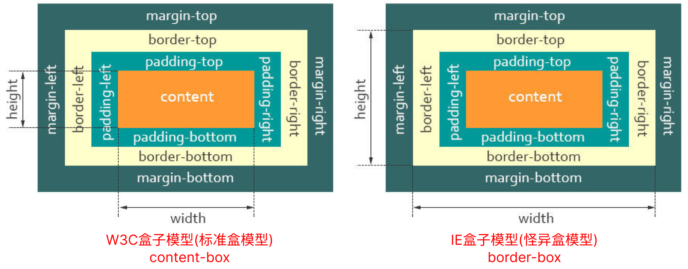

## 1-继承相关

css的继承：就是给父级设置一些属性，子级继承了父级的该属性，这就是我们的css中的继承。 官方解释，继承是一种规则，它允许样式不仅应用于特定的html标签元素，而且**应用于其后代元素**。

#### 无继承性的属性

1. display：规定元素应该生成的框的类型
2. 文本属性：vertical-align、text-decoration、text-shadow、white-space、unicode-bidi（设置文本的方向）
3. 盒子模型的属性：width、height、margin 、margin-top、margin-right、margin-bottom、margin-left、border、 border-style、border-top-style、border-right-style、border-bottom-style、border-left-style、border-width、border-top-width、border-right-right、border-bottom-width、border-left-width、border-color、border-top-color、border-right-color、border-bottom-color、border-left-color、border-top、border-right、border-bottom、border-left、padding、padding-top、padding-right、padding-bottom、padding-left
4. 背景属性：background、background-color、background-image、background-repeat、background-position、background-attachment
5. 定位属性：float、clear、position、top、right、bottom、left、min-width、min-height、max-width、max-height、overflow、clip、z-index
6. 生成内容属性：content、counter-reset、counter-increment
7. 轮廓样式属性：outline-style、outline-width、outline-color、outline
8. 页面样式属性：size、page-break-before、page-break-after
9. 声音样式属性：pause-before、pause-after、pause、cue-before、cue-after、cue、play-during

#### 有继承性的属性

1. 字体系列属性：font、font-family、font-weight、font-size、font-style、font-variant（设置小型大写字母的字体）、font-stretch（伸缩变形）、font-size-adjust
2. 文本系列属性：text-indent、text-align、line-height、word-spacing、letter-spacing、text-transform（大小写）、direction（书写方向）、color
3. 元素可见性：visibility
4. 表格布局属性：caption-side、border-collapse、border-spacing、empty-cells、table-layout
5. 列表布局属性：list-style-type、list-style-image、list-style-position、list-style
6. 生成内容属性：quotes
7. 光标属性：cursor
8. 页面样式属性：page、page-break-inside、windows、orphans
9. 声音样式属性：speak、speak-punctuation、speak-numeral、speak-header、speech-rate、volume、voice-family、 pitch、pitch-range、stress、richness、、azimuth、elevation

#### 所有元素可以继承的属性
- 元素可见性：visibility
- 光标属性：cursor

#### 内联元素可以继承的属性
- 字体系列属性
- 除text-indent、text-align之外的文本系列属性

#### 块级元素可以继承的属性
- text-indent、text-align、visibility、cursor

## 2-css预处理工具


CSS 预处理器是一个能让你通过预处理器自己独有的语法来生成CSS的程序。

三种主流css预处理器是[Less]([https://lesscss.org/](https://lesscss.org/))、[Sass]([https://sass-lang.com/](https://sass-lang.com/))（Scss=sass+css）及[Stylus]([https://stylus-lang.com/](https://stylus-lang.com/))

**编译环境不一样**
- Sass 需要Ruby环境
- Less 需要引入less.js(浏览器)
- Stylus 需要安装node

**变量符不一样**
```css
$color: #00c; /* sass */

@color: #00c; /* less */

mainColor = #00c; /* stylus */
```


## 3-行内元素 VS. 块级元素

`display`：块级元素与行内元素相互转换
- inline：转换为行内元素；
- block：转换为块状元素；
- inline-block：转换为行内块状元素

#### 块级元素
- 独占一行，默认垂直向下排列；
- 高度、宽度、margin及padding都是可控的，设置有效，有边距效果；
- 宽度没有设置时，默认为100%；
- 块级元素中可以包含块级元素和行内元素。

#### 行内元素
- 水平排列，不独占；
- **高度、宽度是不可控的**，设置无效，由内容决定。
- 根据标签语义化的理念，行内元素最好只包含行内元素，不包含块级元素。
- ==margin及padding, 水平方向有效， 垂直方向无效==。（`padding-top` 和 `padding-bottom` 会显示出效果，但是高度不会撑开，不会对周围元素有影响）

#### min-width/max-width 属性间的覆盖规则？

`min-width > max-width > width`

-  max-width 会覆盖 width，即使 width 是行内样式或者设置了 !important。
- min-width 会覆盖 max-width，此规则发生在 min-width 和 max-width 冲突的时候

## 4-盒模型
 
 CSS盒模型本质上是一个盒子，封装周围的HTML元素，它包括：外边距（margin）、边框（border）、内边距（padding）、实际内容（content）四个属性。 CSS盒模型：**标准模型 + IE模型**
 
`box-sizing: `
-  content-box (标准盒模型)：width/height 只是 内容高度，不包含 padding 和 border 值。 默认值
	- `盒子总宽度/高度 = width/height + padding + border + margin`
- border-box (IE盒子模型)：width/height 包含了 padding 和 border 值
	- `盒子总宽度/高度 = width/height + margin = (内容区宽度/高度 + padding + border) + margin`


#### JS如何获取盒模型对应的宽和高

1. `dom.style.width/height` 只能取到行内样式的宽和高，style 标签中和 link 外链的样式取不到。 
2. `dom.currentStyle.width/height` （只有IE兼容）取到的是最终渲染后的宽和高 
3. `window.getComputedStyle(dom).width/height` 同（2）但是多浏览器支持，IE9 以上支持。 
4. `dom.getBoundingClientRect().width/height` 也是得到**渲染后的宽和高**，大多浏览器支持。IE9 以上支持，除此外还可以取到相对于视窗的上下左右的距离。
5. `dom.offsetWidth/offsetHeight` : **宽高+padding+border**，不包括margin。最常用，兼容性最好。

## 5-BFC（边距重叠解决方案）

#### BFC渲染/布局规则
1. 内部的 Box 会在垂直方向，从顶部开始一个接着一个地放置； 
2. Box垂直方向的距离由 `margin` 决定，属于同一个 `BFC` 的两个相邻Box的 `margin` 会发生重叠； 
3. 每个元素的 `margin Box` 的左边， 与包含块 `border Box` 的左边相接触，（对于从左到右的格式化，否则相反）。即使存在浮动也是如此； 
4. BFC 在页面上是一个隔离的独立容器，外面的元素不会影响里面的元素，反之亦然。文字环绕效果，设置 `float`； 
5. BFC 的区域不会与 `float Box` 重叠（清浮动）; 
6. 计算 `BFC` 的高度时，浮动元素也参与计算。

#### 触发 BFC（即脱离文档流）

1. 根元素，即 HTML 元素（最大的一个 `BFC`）​ 
2. 浮动（ `float 的值不为 none` ）​ 
3. 绝对定位元素（ `position 的值为 absolute 或 fixed` ）​ 
4. display 为 行内块（inline-block）、表格单元（table、table-cell、table-caption）、弹性和（flex、inline-flex）
5. `overflow 不为 visible`

#### BFC使用场景

1. 自适应两（三）栏布局（避免多列布局由于宽度计算四舍五入而自动换行）​ 
2. 避免元素被浮动元素覆盖​ 
3. 高度塌陷（BFC、clear、clearfix）可以让父元素的高度包含子浮动元素，清除内部浮动（原理：触发父 `div` 的 `BFC` 属性，使下面的子 `div` 都处在父 `div`的同一个 `BFC` 区域之内）​ 
4. 去除边距重叠现象，分属于不同的 `BFC` 时，可以阻止 `margin` 重叠局


## 6-IFC

**IFC: 行内格式化上下文**​

1. 内部的 `Box` 会在水平方向，从含块的顶部开始一个接着一个地放置
2. 这些 `Box` 之间的水平方向的 `margin`，`border` 和`padding` 都有效
3. `Box` 垂直对齐方式：以它们的底部、顶部对齐，或以它们里面的文本的基线（`baseline`）对齐（默认， 文本与图片对其），例：`line-heigth` 与 `vertical-align`


## 7-样式优先级

**行内样式（1000）>ID 选择器（100）>类选择器（10）>标签选择器（1）**  

**CSS 优先级法则：**

- 选择器都有一个权值，权值越大越优先；
- 当权值相等时，**后出现的样式表设置要优于先出现的样式表设置**；
- 创作者的规则高于浏览者：即网页编写者设置的 CSS 样式的优先权高于浏览器所设置的样式；
- 继承的 CSS 样式不如后来指定的 CSS 样式；
- 在同一组属性设置中标有  `!important`  规则的优先级最大；

## 8-盒子塌陷/ 清除浮动

**盒子塌陷**：本应该在父盒子内部的元素跑到了外部。

当父元素没设置足够大小的时候，而子元素设置了浮动的属性，子元素就会跳出父元素的边界（**脱离文档流**），尤其是当父元素的高度为auto时，而父元素中又没有其它非浮动的可见元素时，父盒子的高度就会直接塌陷为零， 我们称这是**CSS高度塌陷**。

#### 清除浮动
本质就是浮动`float`导致的，因此只需要清楚浮动。其实叫做闭合浮动更合适，因为是把浮动的元素圈起来，让父元素闭合出口和入口不让他们出来影响其他的元素。 


1. 最简单，直接，粗暴的方法就是**盒子大小写死**，给每个盒子设定固定的width和height，直到合适为止，这样的好处是简单方便，兼容性好，适合只改动少量内容不涉及盒子排布的版面。缺点是非自适应，浏览器的窗口大小直接影响用户体验。
2. **给外部的父盒子也添加浮动**，让其也脱离标准文档流，这种方法方便，但是对页面的布局不是很友好，不易维护。
3. **给父元素添加`overflow`属性，触发BFC**。但是因为本身overflow的本质是溢出隐藏的效果，所以有的时候也会有一些问题存在，比如内容增多的时候不会自动换行导致内容被隐藏掉，无法显示出要溢出的元素。
	```css
	.father {
		overflow: auto;  
		/* overflow = hidden|auto|scroll 都可以实现*/
	}
	```

4. 给父盒子添加`border`
5. 给父盒子设置`padding-top`
6. **在浮动元素的末尾添加一个空的标签**。这是W3C推荐的做法，虽然比较简单，但是添加了无意义的标 签，结构化比较差，所以不推荐使用。
	```html
	<div style="clear:both"></div>
	<!--也可以使用br等别的块级元素来清除浮动-->
	<br style="clear:both" />    
	```

7. **用`::after`伪元素清除浮动（最常用）**。在父元素中加一个盒子伪元素设置clear属性，再隐藏它。这其实是对空盒子方案的改进，一种纯CSS的解决方案，不用引入冗余元素。*这也是bootstrap框架采用的清除浮动的方法*。这是一种纯CSS的解决浮动造成盒子塌陷方法，没有引入任何冗余元素，推荐使用此方法来解决CSS盒子塌陷。
	- 但是这个方法IE6，7不识别，要进行兼容，使用zoom:1触发 hasLayout来清除浮动
	```css
	.clearfix {
		*zoom: 1; /*  *只有IE6,7识别 */
	}
	
	.clearfix::after {
		content:".";  /*尽量不要为空，一般写一个点*/
		height:0;     /*盒子高度为0，看不见*/
		display:block;    /*插入伪元素是行内元素，要转化为块级元素*/
		visibility:hidden;      /*content有内容，将元素隐藏*/
		clear:both;  
	}

	/* 方法二：设置空字符，则不需要隐藏content */
	.clearfix::after{
		content:"\200B";   /* content:'\0200'; 也可以 */
		display:block;
		height:0;
		clear:both;
   }

	/* 方法三：使用before和after双伪元素清除浮动（推荐）完全符合闭合浮动思想 */
	.clearfix:before, .clearfix:after {
		content: ""; 
		display: table;
	}
	.clearfix:after {
		clear: both;
	}
	```


## 9-css 伪类 VS. 伪元素

#### 伪类(pseudo-classes)

其核⼼就是⽤来**选择DOM树之外**的信息,不能够被普通选择器选择的⽂档之外的元素，⽤来添加⼀些选择器的特殊效果。⽐如`:hover :active :visited :link :visited :first-child :focus :lang`等

**由于状态的变化是动态的**，所以元素达到⼀个特定状态时，它可能得到⼀个伪类的样式；当状态改变时，它⼜会失去这个样式。由此可以看出，它的功能和class有些类似，但它是基于⽂档之外的抽象，所以叫 伪类。


#### 伪元素(Pseudo-elements)

DOM树没有定义的虚拟元素。核⼼就是需要**创建不存在于⽂档中的元素**，⽐如`::before ::after` 它选择的是元素指定内容，表示选择元素内容的之前内容或之后内容。伪元素控制的内容和元素是没有差别的，但是它本身只是基于元素的抽象，并不存在于⽂档中，所以称为伪元素。⽤于将特殊的效果添加到某些选择器


#### 伪类与伪元素的区别
- 伪类和伪元素分别⽤单冒号:和双冒号::来表示。
- 伪类和伪元素的区别，关键点在于如果没有伪元素(或伪类)，是否需要添加元素才能达到效果，如果是则是伪元素，反之则是伪类
- 伪类和伪元素都不出现在源⽂件和DOM树中。也就是说在html源⽂件中是看不到伪类和伪元素的。
	- 伪类其实就是基于普通DOM元素⽽产⽣的不同状态，他是DOM元素的某⼀特征。
	- 伪元素能够创建在DOM树中不存在的抽象对象，⽽且这些抽象对象是能够访问到的。

## 10-inline-block 的 div 之间的空隙，原因及解决


`display:inline-block`布局的元素在chrome下会出现几像素的间隙，原因是因为我们在编辑器里写代码的时候，在编辑器里不在同一行，==即存在换行符，因此这就是著名的inline-block“换行 符/空格间隙问题”==。

解决方法：
1. 移除标签间的空格 (很蠢)
2. **把div中的字体大小设为0：**

	```css
	div{font-size:0;}
	```

3. 如果是img，修改img的vertical-align属性：

	```css
	img{vertical-align:buttom;}
	img{vertical-align:middle;}
	img{vertical-align:top;}
	```

4. 把img标签的display属性改成block：

	```css
	img{display:block;}
	```


## 11-浏览器是怎样解析CSS选择器的？

**CSS选择器的解析是从右向左解析的**。若从左向右的匹配，发现不符合规则，需要进行回溯，会损失很多性能。若从右向左匹配，先找到所有的最右节点，对于每一个节点，向上寻找其父节点直到找到根元素或满足条件的匹配规则，则结束这个分支的遍历。


两种匹配规则的性能差别很大，是因为从右向左的匹配在第一步就筛选掉了大量的不符合条件的最右节点(叶子节点)，而从左向右的匹配规则的性能都浪费在了失败的查找上面。

而在 CSS解析完毕后,需要将解析的结果与**DOM Tree**的内容-起进行分析建立-棵**Render Tree**，最终用来进行**绘图**。

==在建立Render Tree时(WebKit 中的「Attachment」过程)， 浏览器就要为每个DOM Tree中的元素根据CSS的解析结果(Style Rules)来确定生成怎样的Render Tree==。


## 12-zoom:1的原理运用

zoom是IE专用属性，firefox等是不支持的。它的本来作用是设置或检索对象的缩放比例，但这作用几乎用不到。

可以让网页实现IE7中的放大缩小功能。比如你想让你的网页缩小为原来的一半，那么就在body中加入style="zoom:0.5"

**设置zoom:1可以在IE6下清除浮动、解决margin导致的重叠等问题。**

zoom:1就是IE6 专用的 触发 haslayout 属性的。hasLayout是IE特有的一个属性。很多的IE下的css bug都与其息息相关。在IE中，一个元素要么自己对自身的内容进行计算大小和组织，要么依赖于父元素来计算尺寸和组织内容。当一个元素的hasLayout属性值为true时，它负责对自己和可能的子孙元素进行尺寸计算和定位。

hasLayout对于内联元素也可以有效果，当内联元素的hasLayout为true的时候，可以给这个内联元素设定高度和宽度并得到期望的效果。具体关于hasLayout的知识点，可以另外搜索。

```css
.box {
    *zoom: 1;   /*  *只有IE6,7识别 */
}
```

zoom是设置或检索对象的缩放比例。设置或更改一个已被呈递的对象的此属性值将导致环绕对象的内容重新流动。

虽然此属性不可继承，但是它会影响对象的所有子对象( children )。这种影响很像 background 和 filter 属性导致的变化。

此属性对于 currentStyle 对象而言是只读的，对于其他对象而言是可读写的。

当设置了zoom的值之后，所设置的元素就会就会扩大或者缩小，高度宽度就会重新计算了，这里一旦改变zoom值时其实也会发生重新渲染，运用这个原理，也就解决了ie下子元素浮动时候父元素不随着自动扩大的问题。


### 13-修改SVG颜色
 [修改svg图标颜色方法](https://www.cnblogs.com/mengff/p/17490650.html "发布于 2023-06-19 11:09")
#### fill=currentColor
 `fill='currentColor'` 或 css 修改fill。 **仅对内联svg有效**，对background中svg无效。


#### mask
但是在伪元素或者backgound中，这fill不生效。因为：

1. 样式不允许跨文档级联
2. 当使用  （或 `content` ，或任何引用 svg 的 css 图像属性）时，出于安全考虑，浏览器不会公开 svg 文档

解决方案：使用 **SVG 蒙版** 和背景颜色的变通方法。并没有修改 SVG DOM 本身，只是在更改背景颜色。

 [在 :before 或 :after CSS 中更改 SVG 填充颜色](https://segmentfault.com/q/1010000042997976)

```css
a::before {
  content: url("/icons/links.svg");
  color: #f68800; /* 不生效 */
}


/* 使用蒙版 让svg 填充颜色 */
a::before {
  content: " ";
  background-color: #f68800;
  mask: url("/icons/links.svg") no-repeat 50% 50%;
  -webkit-mask-size: cover;
  mask-size: cover;
}
```


#### filter 纯黑白
```css
.icon{
	filter: brightness(0); /* 纯黑 */
	filter: brightness(100); /* 纯白 */
}
```


