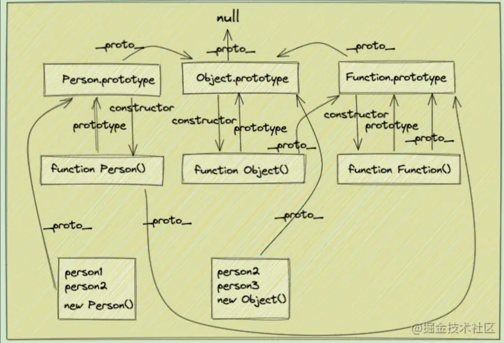
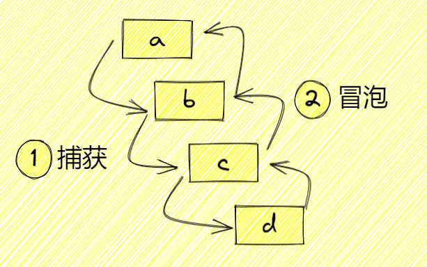

### 1、JavaScript 有几种数据类型？判断变量类型的方法？

- number：数字类型
- string：字符串类型
- boolean：布尔值类型
- undefined：未定义类型
- null：空类型
- object：对象类型
- symbol：symbol 类型
- bigint：大数字类型

**判断变量类型**

- typeof ：（6 种）number、string、boolean、object（数组，null）、undefined、function
- instanceof：判断原型链是否存在该对象
- constructor：原型对象的属性，指向构造函数
- Object.prototype.toString.call()：[object String]
- isPrototypeOf: 判断对象 Array.prototype.isPrototypeOf(a)
- getPrototypeOf: Object.getPrototypeOf(a)=== Array.prototype
- isArray: Array.isArray(a)

### 2、JavaScript 最大安全数字与最小安全数字？

```js
console.log(Number.MAX_SAFE_INTEGER);
// 9007199254740991
console.log(Number.MIN_SAFE_INTEGER);
// -9007199254740991
```

### 3、深拷贝与浅拷贝的区别？

浅拷贝：只拷贝第一层，深层的依然是引用，改变深层会影响原对象

eg. `Object.assign()`、`...扩展符`、`Array.form()/slice()/map()/concat()/解构`

```js
function shallowCop(obj) {
  let newObj = Array.isArray(obj) ? [] : {};
  for (let item in obj) {
    newObj[item] = obj[item];
  }
  return newObj;
}
```

深拷贝：每一层都拷贝了，改变数据不会影响原对象

eg.`JSON.parse()/JSON.stringfy`、递归拷贝

```js
function deepCopy(obj) {
  return JSON.parse(JSON.stringify(obj));
}

function deepCopy(obj) {
  let newObj = Array.isArray() ? [] : {};
  for (let item in obj) {
    if (obj.hasOwnPropertype(item)) {
      newObj[item] =
        typeof obj[item] === "object" ? deepCopy(obj[item]) : obj[item];
    }
  }
  return newObj;
}
```

### 4、闭包是什么？

闭包是一个函数，是一个能让外部访问到函数内部的函数

- 优点：使外部能访问内部，延长内部变量寿命
- 缺点：滥用闭包造成内存泄漏

回调函数都是闭包

```js
function a() {
  let num = 0;

  // 这是个闭包
  return function () {
    return ++num;
  };
}
const b = a();
console.log(b()); // 1
console.log(b()); // 2
```

### 5、原型链是什么呀？

原型链是一条引用的链，实例的隐式原型指向构造函数的显式原型，可以使用`A instanceof B`来判断 B 是否在 A 的原型链上。




### 6、变量提升？函数提升？

- 变量提升

```js
console.log(name); // undefined
var name = "Sunshine_Lin";

if (false) {
  var age = 23;
}
console.log(age); // undefined 不会报错
```

- 函数提升

```js
console.log(fun); // function fun() {}
function fun() {}

if (false) {
  function fun2() {}
}
console.log(fun2); // undefined 不会报错
```

- 函数提升优先级 > 变量提升优先级

```js
console.log(fun); // function fun() {}
var fun = "Sunshie_Lin";
function fun() {}
console.log(fun); // 'Sunshie_Lin'
```

### 7、isNaN 与 Number.isNaN 的区别？

- `isNaN`：除了判断 NaN 为 true 外，还会把不能转成数字判断为 true，例如'dasd'
- `Number.isNaN`：只会判断 NaN 为 true

### 8、解决遍历对象时，把原型上的属性遍历出来了咋办？

使用`hasOwnProperty`判断

```js
function Person(name) {
  this.name = name;
}
Person.prototype.age = 23;
const person = new Person("Sunshine_lin");
for (const key in person) {
  console.log(key);
} // name age
// 使用 hasOwnProperty
for (const key in person) {
  person.hasOwnProperty(key) && console.log(key);
} // name
```

### 9、valueOf 与 toString？

- `valueOf`比较偏向于计算，`toString`偏向于显示
- 对象转换时，优先调用`toString`
- 强转字符串时优先调用`toString`，强转数字时优先调用`valueOf`
- 正常情况下，优先调用`toString`
- 运算操作符情况下优先调用`valueOf`

### 10、JavaScript 变量在内存中具体存储形式？

- `基本数据类型`：存在栈内存里
- `引用数据类型`：指针存栈内存，指向堆内存中一块地址，内容存在堆内存中
- 也有说法说其实 JavaScript 所有数据都存堆内存中，我也比较赞同这种说法

### 11、讲一讲 JavaScript 的装箱和拆箱？

**装箱：把基本数据类型转化为对应的引用数据类型的操作**

看以下代码，s1 只是一个基本数据类型，他是怎么能调用 indexOf 的呢？

```js
const s1 = "Sunshine_Lin";
const index = s1.indexOf("_");
console.log(index); // 8
```

原来是 JavaScript 内部进行了装箱操作

- 1、创建 String 类型的一个实例；
- 2、在实例上调用指定的方法；
- 3、销毁这个实例；

```js
var temp = new String("Sunshine_Lin");
const index = temp.indexOf("_");
temp = null;
console.log(index); // 8
```

**拆箱：将引用数据类型转化为对应的基本数据类型的操作**

通过 valueOf 或者 toString 方法实现拆箱操作

```js
var objNum = new Number(123);
var objStr = new String("123");
console.log(typeof objNum); //object
console.log(typeof objStr); //object
console.log(typeof objNum.valueOf()); //number
console.log(typeof objStr.valueOf()); //string

console.log(typeof objNum.toString()); // string
console.log(typeof objStr.toString()); // string
```

### 12、null 和 undefined 的异同点有哪些？

**相同点**

- 1、都是空类型
- 2、转布尔值都是 false，都是假值
- 3、null == undefined 为 true

**不同点**

- 1、typeof，前者为 object，后者为 undefined

- 2、null 转数字为 0，undefined 转数字为 NaN

- 3、null === undefined 为 false

- 4、undefined: 未定义的值，一个变量的原始值，而非人为操作。null：空值，被人为置为空对象。
### 13、为什么 typeof null 是 object？

不同数据类型底层都是用二进制来表示的，二进制前三位为`000`则会被判断为 object，而 null 二进制全是 0，所以被判断成 object

### 14、== 与 === 的区别？==的隐式转换

- `==`：比较过程会进行隐式转换
- `===`：值相同，类型相同才会为 true


1. null == undefined 为 true，且与自身相等，与其他不等
2. bool ->number: 如果有一个操作数是<u>布尔值</u>，则在比较相等性之前先将其转换为数值——false 转换为 0，而 true 转换为 1；
3. string->number: 如果一个操作数是<u>字符串</u>，另一个操作数是数值，在比较相等性之前先将字符串转换为数值
4. object->object.toString(): 如果一个操作数是对象，另一个操作数不是，则调用<u>对象的 toString()</u>方法，用得到的基本类型值按照前面的规则进行比较
5. NaN 不等于任意值，包括自身
6. ToNumber:
	- **undefined--NaN**
	- null -- 0
	- "" -- 0
	- [] -- 0
7. ToString:
	- null -- "null"
	- undefined -- "undefined"
	- true -- "true"
	- Object 先 valueOf 再 toString
	- Array.valueOf =自身 Array.toString= 逗号拼接

8. ToBoolean
	- False: undefined、null、false、0、NaN、""
	- True: 除上、[]、{}

```js
[] == false //true

[] == ![]
[] == false
[] == 0
'' == 0
0 == 0  //true


{} == !{}
{} == false
{}.toString() =[Object object]
Number([Object object]) = NaN
NaN == false// false
```

### 15、JS 的隐式转换规则？

- 转string类型：`+`（字符串连接符）
- 转number类型：`++`/`--`(自增自减运算符) `+ - * / %`(算术运算符) `> < >= <= == != === !== `(关系运算符)
- 转boolean： `!`（逻辑非运算符)
### 16、undefined >= undefined 为什么是 false ？null >= null 为什么是 true？

隐式转换，变成`NaN >= NaN`，`NaN`不等于自身也不大于自身

隐式转换，变成`0 >= 0`，为 true

### 17、0.1 + 0.2 === 0.3，对吗？

不对，JavaScript 存在`精度丢失`问题，由于有些小数无法用二进制表示，所以只能取近似值，解决方法有：

- 先转大数，再变小数
- 使用`toFixed`

### 18、函数声明和函数表达式的区别？

- 函数声明：享受函数提升
- 函数表达式：归类于变量声明，享受变量提升
- 函数提升优先级 > 变量提升优先级`

```js
console.log(fun); // fun () {}
// 函数表达式
var fun = function (name) {};
// 函数声明
function fun() {}
console.log(fun); // fun (name) {}
```

### 19、JS 的事件处理传播机制

事件流：在单击目标元素后，它会先触发目标元素上的 `click` 事件，在一层层往上触发事件，最终到达最顶层的 `window` 对象，这是浏览器默认的事件冒泡行为（IE 9+）。**DOM事件流：事件捕获 -> 目标阶段 -> 事件冒泡**。事件流有两种方式：
- 事件冒泡：从内到外，事件委托（event delegation）
- 事件捕获：从外到内


`e.stopPropagation`: 阻止冒泡

`e.preventDefault`： 阻止事件默认行为

`e.target` 和 `e.currenttarget`：target 指向被点击的对象，而 currentTarget 指向当前事件活动的对象，通常是事件的祖元素。


**绑定点击事件有几种方式？**（3 种）

- `xxx.onclick = function (){}`
- `<xxx onclick=""></xxx>`
- `xxx.addEventListener('click', function(){}, false)`
	- ==addEventListener 的第三个参数决定事件是 捕获阶段 执行还是 冒泡阶段 执行==。true捕获，false冒泡（默认）
### 20、Ajax、Axios、Fetch 有啥区别？

- `Ajax`：是对 XMLHttpRequest(XHR)的封装
- `Axios`：是基于 Promise 对 XHR 对象的封装
- `Fetch`：是 window 的一个方法，基于 Promise，与 XHR 无关，不兼容 IE

### 21、load、$(document).ready、DOMContentLoaded 的区别？

- `$(document).ready`、`DOMContentLoaded`：DOM 树构建完毕，但还没有请求静态资源
- `load`：静态资源请求完毕

### 22、什么是事件委托？

当子元素都需要绑定相同事件时，可以将事件绑在父元素上，优点有：

- 绑定在父元素，则只需绑定一次，节省性能

- 后续新增的子元素也可以触发父元素绑定的事件

  ```js
  var oUl = document.getElementById("newList");
  oUl.onclick = function (e) {
    var evt = e || event;
    var _target = evt.target || evt.srcElement; //兼容IE
    if (_target.nodeName.toLowerCase() == "li") {
      //操作
    }
  };
  ```

### 23、如何实现数组去重？

```js
// 使用 Map 去重
function quchong1(arr) {
  const newArr = [];
  arr.reduce((pre, next) => {
    if (!pre.get(next)) {
      pre.set(next, 1);
      newArr.push(next);
    }
    return pre;
  }, new Map());
  return newArr;
}

// 使用 Set 去重
function quchong(arr) {
  return [...new Set(arr)];
}
```

### 24、Set 与 Array 的区别是什么？

- Set 使用 has 判断有无元素，数组使用索引
- Set 添加元素使用方法 add，数组用 push、unshift
- Set 长度为 size，数组为 length
- Set 会自动把同样的基础数据类型去重，数组不能
- Set 删除元素用 delete，数组用 splice、pop、shift
- Set 可以使用 clear 清空，数组需要重新赋值[]
- 数组可以传入 new Set(array)，实现数组转 Set
- Set 可以使用 keys、value 方法，转数组
- Set 自带 forEach 方法进行遍历

### 25、Map 与 Object 的区别是什么？

- Map 使用 set 设置属性，对象使用 obj[key] = value
- Map 使用 get 获取属性值，对象使用 obj[key]
- Map 使用 has 判断属性存在与否，对象只能 obj[key]
- Map 删除元素使用 delete 方法，对象使用 delete 关键字
- Map 使用 clear 进行情空，对象需要重新赋值{}
- Map 和对象都可以使用 entries 方法转数组键值对
- Map 自带 forEach 方法进行遍历

### 26、NaN 是什么？有什么特点？

- typeof NaN = number
- NaN 不等于自身，不大于自身，不小于自身
- NaN 可以使用`Number.isNaN`判断
- NaN 是假值，转布尔值为 false

### 27、处理异步的方法有哪些？

- 回调函数
- Promise
- 事件监听
- 发布订阅
- async/await

### 28、JavaScript 继承方式有几种？

前置工作

```js
// 定义一个动物类
function Animal(name) {
  // 属性
  this.name = name || "Animal";
  // 实例方法
  this.sleep = function () {
    console.log(this.name + "正在睡觉！");
  };
}
// 原型方法
Animal.prototype.eat = function (food) {
  console.log(this.name + "正在吃：" + food);
};
```

#### 1、原型链继承

核心：将父类的实例作为子类的原型

```js
function Cat() {}
Cat.prototype = new Animal();
Cat.prototype.name = "cat";

var cat = new Cat();
console.log(cat.name); // cat
cat.eat("fish"); // cat正在吃：fish
cat.sleep(); // cat正在睡觉！
console.log(cat instanceof Animal); //true
console.log(cat instanceof Cat); //true
```

优点：

- 1、非常纯粹的继承关系，实例是子类的实例，也是父类的实例
- 2、父类新增原型方法/属性，子类都能访问到
- 3、简单，易于实现

缺点：

- 1、要想为子类新增属性和方法，必须要在`new Animal()`这样的语句之后执行，不能放构造器中
- 2、**来自原型对象的所有属性被所有实例共享**
- 3、创建子实例时，无法向父类构造函数传参
- 4、不支持多继承

#### 2、构造继承

核心：使用父类的构造器来增强子类实例，等于是复制父类的实例属性给子类（没用到原型）

```js
function Cat(name) {
  Animal.call(this);
  this.name = name || "Tom";
}

var cat = new Cat();
console.log(cat.name); // Tom
cat.sleep(); // Tom正在睡觉！
console.log(cat instanceof Animal); // false
console.log(cat instanceof Cat); // true
```

优点：

- 1、解决了`原型链继承`中，子类实例共享父类引用属性的问题
- 2、创建子类实例时，可以向父类传递参数
- 3、可以实现多继承(call 多个父类对象)

缺点：

- 1、实例并不是父类的实例，知识子类的实例
- 2、**只能继承父类的实例属性和方法，不能继承原型属性/方法**
- 3、无法实现函数复用，每个子类都有父类实例函数的副本，影响性能

#### 3、寄生式继承

核心：为父类实例添加新特性，作为子类实例返回

```js
function Cat(name) {
  var instance = new Animal();
  instance.name = name || "Tom";
  return instance;
}

var cat = new Cat();
console.log(cat.name); // Tom
cat.sleep(); // Tom正在睡觉！
console.log(cat instanceof Animal); // true
console.log(cat instanceof Cat); // false
```

优点：

- 1、不限制调用方式，不管是`new 子类()`还是`子类()`，返回的对象具有相同效果

缺点：

- 1、实例是父类的实例，不是子类的实例
- 2、不支持多继承

#### 4、拷贝继承

核心：就一个一个拷贝

```js
function Cat(name) {
  var animal = new Animal();
  for (var p in animal) {
    Cat.prototype[p] = animal[p];
  }
  this.name = name || "Tom";
}

var cat = new Cat();
console.log(cat.name); // Tom
cat.sleep(); // Tom正在睡觉！
console.log(cat instanceof Animal); // false
console.log(cat instanceof Cat); // true
```

优点：

- 1、支持多继承

缺点：

- 1、效率低，内存占用高（因为要拷贝父类的属性）
- 2、无法获取父类不可枚举方法（不可枚举方法，不能使用 for in 访问到）

#### 5、组合继承

核心：通过父类构造，继承父类的属性并保留传参的优点，然后通过将父类实例作为子类原型，实现函数复用

```js
function Cat(name) {
  Animal.call(this);
  this.name = name || "Tom";
}
Cat.prototype = new Animal();

Cat.prototype.constructor = Cat;

var cat = new Cat();
console.log(cat.name); // Tom
cat.sleep(); // Tom正在睡觉！
console.log(cat instanceof Animal); // true
console.log(cat instanceof Cat); // true
```

优点：

- 1、弥补了`构造继承`的缺陷，可以继承实例属性/方法，也可继承原型属性/方法
- 2、既是子类的实例，也是父类的实例
- 3、不存在引用属性共享问题
- 4、可传参
- 5、函数可复用

缺点：

- 1、<mark>**调用了两次父类构造函数**，生成了两份实例（子类实例将子类原型上的那份屏蔽了）</mark>

#### 6、寄生组合继承

核心：通过寄生方式，砍掉父类的实例属性，这样，在调用两次父类的构造时，就不会初始化两次实例方法/属性，避免`继承组合`的缺点

```js
function Cat(name) {
  Animal.call(this);
  this.name = name || "Tom";
}
// 创建一个没有实例方法的类
var Super = function () {};
Super.prototype = Animal.prototype;
//将实例作为子类的原型
Cat.prototype = new Super();

// Test Code
var cat = new Cat();
console.log(cat.name); // Tom
cat.sleep(); // Tom正在睡觉！
console.log(cat instanceof Animal); // true
console.log(cat instanceof Cat); //true
```

优点：

- 1、堪称完美

缺点：

- 1、实现复杂

### 29、创建一个对象的方式有哪几种？

- new Object

```js
const obj = new Object();
obj.name = "Sunshine_Lin";
```

- 字面量

```js
const obj = { name: "Sunshin_Lin" };
```

- 工厂模式

```js
function createObj(name) {
  const obj = new Object();
  obj.name = name;
  return obj;
}
const obj = createObj("Sunshine_Lin");
```

- 构造函数

```js
function Person(name) {
  this.name = name;
}
const person = new Person("Sunshine_Lin");
```

### 39、this 指向的四种情况？

- new 操作符

```js
function Person(name) {
  this.name = name;
  console.log(this);
}
// this指向当前person实例对象
const person = new Person("Sunshine_Lin");
```

- 显示绑定 call、apply、bind 改变 this

```js
const obj1 = {
  name: "林三心",
  sayName: function () {
    console.log(this.name);
  },
};
const obj2 = {
  name: "Sunshin_Lin",
};
// 改变sayName的this指向obj2
obj1.sayName.call(obj2); // Sunshin_Lin
// 改变sayName的this指向obj2
obj1.sayName.apply(obj2); // Sunshin_Lin
// 改变sayName的this指向obj2
const fn = obj1.sayName.bind(obj2);
fn(); // Sunshin_Lin
```

- 隐式绑定 (对象调用)

```js
const target = {
  fn: function () {
    console.log(this);
  },
};
target.fn(); // target

// 这种就是改变了this了
const fn = target.fn;
fn(); // 浏览器window，node里global
```

- 默认绑定

```js
function fn() {
  console.log(this);
}
fn(); // 浏览器window，node里global
```

- 箭头函数 （指向父作用域 function）

```js
const obj = {
  name: "林三心",
  fn: () => {
    console.log(this.name);
  },
};
console.log(obj.fn()); // undefined
```

### 40、数组的常用方法有哪些？

| 方法    | 作用                           | 是否影响原数组 |
| ------- | ------------------------------ | -------------- |
| push    | 在数组后添加元素，返回长度     | ✅             |
| pop     | 删除数组最后一项，返回被删项   | ✅             |
| shift   | 删除数组第一项，返回被删项     | ✅             |
| unshift | 数组开头添加元素，返回长度     | ✅             |
| reserve | 反转数组，返回数组             | ✅             |
| sort    | 排序数组，返回数组             | ✅             |
| splice  | 截取数组，返回被截取部分       | ✅             |
| join    | 将数组变字符串，返回字符串     | ❌             |
| concat  | 连接数组                       | ❌             |
| map     | 相同规则处理数组项，返回新数组 | ❌             |
| forEach | 遍历数组                       | ❌             |
| filter  | 过滤数组项，返回符合条件的数组 | ❌             |
| every   | 每一项符合规则才返回 true      | ❌             |
| some    | 只要有一项符合规则就返回 true  | ❌             |
| reduce  | 接受上一个 return 和数组下一项 | ❌             |
| flat    | 数组扁平化                     | ❌             |
| slice   | 截取数组，返回被截取区间       | ❌             |

### 41、Math 的常用方法有哪些？

| 方法                 | 作用              |
| -------------------- | ----------------- |
| Math.max(...arr)     | 取 arr 中的最大值 |
| Math.min(...arr)     | 取 arr 中的最小值 |
| Math.ceil(小数)      | 小数向上取整      |
| Math.floor(小数)     | 小数向下取整      |
| Math.round(小数)     | 小数四舍五入      |
| Math.sqrt(num)       | 对 num 进行开方   |
| Math.pow(num, m)     | 对 num 取 m 次幂  |
| Math.random() \* num | 取 0-num 的随机数 |


### 43、讲讲 JavaScript 的垃圾回收机制


[赠你 13 张图，助你 20 分钟打败了「V8 垃圾回收机制」！！！](https://security.feishu.cn/link/safety?target=http%3A%2F%2Fmp.weixin.qq.com%2Fs%3F__biz%3DMzg2NjY2NTcyNg%3D%3D%26mid%3D2247483683%26idx%3D1%26sn%3D973b0280aa9c6eb1678ea530ee4d2381%26chksm%3Dce4614b2f9319da402278b86e63f44e818e832ecbaafdada344ba979de3df4443a8ed53b0cb1%26scene%3D21%23wechat_redirect&scene=ccm&logParams=%7B%22location%22%3A%22ccm_drive%22%7D&lang=zh-CN)

### 44、JS 中有哪些不同类型的弹出框？

在 JS 中有三种类型的弹出框可用，分别是：

- Alert
- Confirm
- Prompt

### 45. 如何将 JS 日期转换为 ISO 标准

```js
var date = new Date();
var n = date.toISOString();
console.log(n);
// YYYY-MM-DDTHH:mm:ss.sssZ
```

### 46、如何在 JS 中编码和解码 URL

- 编码：encodeURI()
- 解码：decodeURI()

### 47、什么是 BOM？有哪些 api？

BOM 就是`browser object model`，`浏览器对象模型`

| api                | 作用                 | 代表方法或属性                                                                                                                                                                                                                                                                                                                           |
| ------------------ | -------------------- | ---------------------------------------------------------------------------------------------------------------------------------------------------------------------------------------------------------------------------------------------------------------------------------------------------------------------------------------- |
| window.history     | 操纵浏览器的记录     | history.back() history.go(-1)                                                                                                                                                                                                                                                                                                            |
| window.innerHeight | 获取浏览器窗口的高度 |                                                                                                                                                                                                                                                                                                                                          |
| window.innerWidth  | 获取浏览器窗口的宽度 |                                                                                                                                                                                                                                                                                                                                          |
| window.location    | 操作刷新按钮和地址栏 | location.host：获取域名和端口 <br />location.hostname：获取主机名<br />location.port：获取端口号<br /> location.pathname：获取 url 的路径<br /> location.search：获取?开始的部分<br /> location.href：获取整个 url <br />location.hash：获取#开始的部分 <br />location.origin：获取当前域名<br /> location.navigator：获取当前浏览器信息 |

### 48、BOM 和 DOM 的关系

**BOM**全称 Browser Object Model，即浏览器对象模型，主要处理浏览器窗口和框架。

DOM 全称 Document Object Model，即文档对象模型，是 HTML 和 XML 的应用程序接口（API），遵循 W3C 的标准，所有浏览器公共遵守的标准。

JS 是通过访问**BOM**（Browser Object Model）对象来访问、控制、修改客户端(浏览器)，由于**BOM**的 window 包含了 document，window 对象的属性和方法是直接可以使用而且被感知的，因此可以直接使用 window 对象的 document 属性，通过 document 属性就可以访问、检索、修改 XHTML 文档内容与结构。因为 document 对象又是 DOM 的根节点。

可以说，BOM 包含了 DOM(对象)，浏览器提供出来给予访问的是 BOM 对象，从 BOM 对象再访问到 DOM 对象，从而 js 可以操作浏览器以及浏览器读取到的文档。

### 49、JS 中的 substr()和 substring()函数有什么区别

substr() 函数的形式为`substr(startIndex,length)`。它从 startIndex 返回子字符串并返回'length'个字符数。

```js
var s = "hello";
s.substr(1, 4) == "ello"; // true
```

substring() 函数的形式为`substring(startIndex,endIndex)`。它返回从 startIndex 到 endIndex - 1 的子字符串。

```js
var s = "hello";
s.substring(1, 4) == "ell"; // true
```

### 50、解释一下 "use strict" ?

“use strict”是 Es5 中引入的 js 指令。使用“use strict”指令的目的是强制执行严格模式下的代码。在严格模式下，咱们不能在不声明变量的情况下使用变量。早期版本的 js 忽略了“use strict”。
