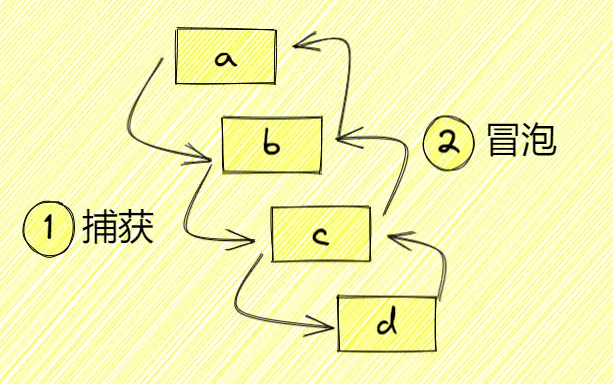
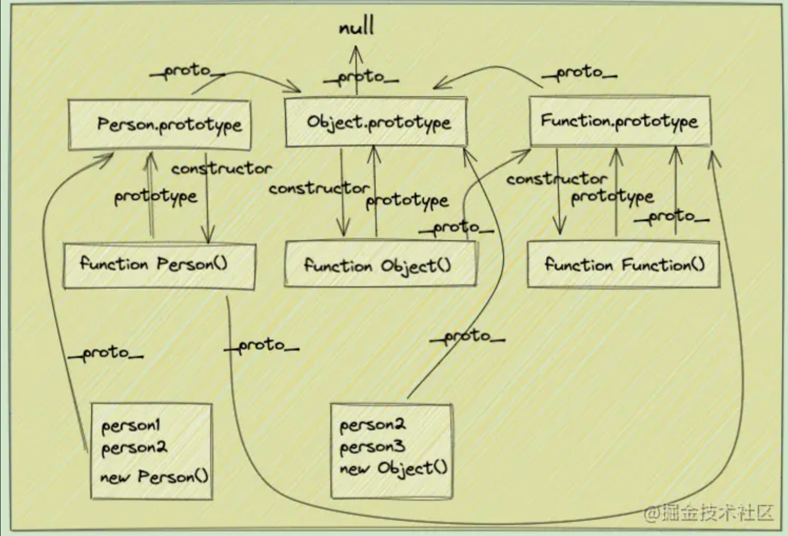

### 闭包 & 内存泄漏

> 闭包是通过将函数定义在另一个函数内部实现的，内层函数会形成对外层函数变量的引用，即使外层函数已经返回，这些变量仍然会被保留。因此，闭包可以让我们在函数外部间接地访问函数内部的变量。


闭包是一个函数，是一个能让==外部访问到函数内部的函数==

- 优点：使外部能访问内部，延长内部变量寿命
- 缺点：滥用闭包造成内存泄漏

使用场景：
- 回调函数都是闭包
- 闭包可以用来实现函数节流和防抖，优化性能。
- 使用闭包处理异步请求

```js
function a() {
  let num = 0;

  // 这是个闭包
  return function () {
    return ++num;
  };
}
const b = a();
console.log(b()); // 1
console.log(b()); // 2
```

#### 内存泄漏
- 意外的全局变量（忘记使用 var/let/const，变量变为全局）
- 未清理的定时器和回调
-  DOM 引用未释放
	- 移除 DOM 元素后手动置空引用
	- 使用 WeakMap 存储 DOM 引用
- 未清理的缓存
	- 实现缓存淘汰策略 (LRU)
	- 使用 WeakMap 作为缓存结构


### JS 的事件处理传播机制

事件流：在单击目标元素后，它会先触发目标元素上的 `click` 事件，在一层层往上触发事件，最终到达最顶层的 `window` 对象，这是浏览器默认的事件冒泡行为（IE 9+）。**DOM事件流：事件捕获 -> 目标阶段 -> 事件冒泡**。事件流有两种方式：
- 事件冒泡：从内到外，事件委托（event delegation）
- 事件捕获：从外到内


`e.stopPropagation`: 阻止冒泡

`e.preventDefault`： 阻止事件默认行为


- `e.target`：**触发**事件的元素，被点击的对象（不变）
- `e.currentTarget`：**绑定**事件的元素，当前事件活动的对象，通常是事件的祖元素（变）


**绑定点击事件有几种方式？**（3 种）

- `xxx.onclick = function (){}`
- `<xxx onclick=""></xxx>`
- `xxx.addEventListener('click', function(){}, false)`
	- ==addEventListener 的第三个参数决定事件是 捕获阶段 执行还是 冒泡阶段 执行==。true捕获，false冒泡（默认）


### this 指向的四种情况？

- new 操作符

```js
function Person(name) {
  this.name = name;
  console.log(this);
}
// this指向当前person实例对象
const person = new Person("Sunshine_Lin");
```

- 显示绑定 call、apply、bind 改变 this

```js
const obj1 = {
  name: "林三心",
  sayName: function () {
    console.log(this.name);
  },
};
const obj2 = {
  name: "Sunshin_Lin",
};
// 改变sayName的this指向obj2
obj1.sayName.call(obj2); // Sunshin_Lin
// 改变sayName的this指向obj2
obj1.sayName.apply(obj2); // Sunshin_Lin
// 改变sayName的this指向obj2
const fn = obj1.sayName.bind(obj2);
fn(); // Sunshin_Lin
```

- 隐式绑定 (对象调用)

```js
const target = {
  fn: function () {
    console.log(this);
  },
};
target.fn(); // target

// 这种就是改变了this了
const fn = target.fn;
fn(); // 浏览器window，node里global
```

- 默认绑定

```js
function fn() {
  console.log(this);
}
fn(); // 浏览器window，node里global
```

- 箭头函数 （指向父作用域 function）

```js
const obj = {
  name: "林三心",
  fn: () => {
    console.log(this.name);
  },
};
console.log(obj.fn()); // undefined
```

### JS延迟加载 async & defer

#### 延迟加载方式
1. `<script async src="script.js"></script>`：给script标签加async属性，则加载和渲染后续文档元素的过程将和 `script.js` 的加载与执行并行进行（异步）
2. `<script defer src="script.js"></script>`：给script标签加defer属性，加载后续文档元素的过程将和 `script.js` 的加载并行进行（异步），但是 `script.js` 的执行要在所有元素解析完成之后，`DOMContentLoaded` 事件触发之前完成
3. 动态创建script标签：等到`DOMContentLoaded` 事件触发时，生成一个script标签，渲染到页面上
4. setTimeout定时器延迟代码执行

#### async & defer

`defer`属性告诉浏览器不要等待脚本，浏览器会继续处理 HTML，构建 DOM。该脚本“在后台”加载，然后在 **DOM 完全构建完成后再运行**。 按它们在文档中**出现的顺序执行**


`async`属性意味着该脚本是完全独立的，async 脚本在后台加载完就**立即运行**
- 浏览器不会阻止async脚本
- 其他脚本也不会等待async脚本，async脚本也不会等待其他脚本
- `DOMContentLoaded`和async脚本不会互相等待
    - `DOMContentLoaded`可能在async脚本执行之前触发（如果async脚本在页面解析完成后完成加载）
    - 或在async脚本执行之后触发（如果async脚本很快加载完成或在 HTTP 缓存中）


### 宏任务 & 微任务 & EventLoop & TaskQueue

#### 宏任务

| #                         | 浏览器 | Node |
| ------------------------- | --- | ---- |
| **I/O**                   | ✅   | ✅    |
| **setTimeout**            | ✅   | ✅    |
| **setInterval**           | ✅   | ✅    |
| **setImmediate**          | ❌   | ✅    |
| **requestAnimationFrame** | ✅   | ❌    |

#### 微任务

| #                                        | 浏览器 | Node |
| ---------------------------------------- | --- | ---- |
| **Promise.prototype.then catch finally** | ✅   | ✅    |
| **process.nextTick**                     | ❌   | ✅    |
| **MutationObserver**                     | ✅   | ❌    |

#### 宏任务与微任务的执行顺序？说说EventLoop？

[7关！setTimeout+Promise+Async输出顺序？你能过几关！](https://security.feishu.cn/link/safety?target=http%3A%2F%2Fmp.weixin.qq.com%2Fs%3F__biz%3DMzg2NjY2NTcyNg%3D%3D%26mid%3D2247483940%26idx%3D1%26sn%3D7a97101836c2b697a270bd84707d441f%26chksm%3Dce4617b5f9319ea3e65092ef4a8b977c85cb0c589f89f49cf626df961de0900c2510297f0af9%26scene%3D21%23wechat_redirect&scene=ccm&logParams=%7B%22location%22%3A%22ccm_drive%22%7D&lang=zh-CN)


**JS的执行机制就可以看做是一个主线程加上一个任务队列(task queue)**。同步任务就是放在主线程上执行的任务，异步任务是放在任务队列中的任务。所有的同步任务在主线程上执行，形成一个执行栈;异步任务有了运行结果就会在任务队列中放置一个事件；脚本运行时先依次运行执行栈，然后会从任务队列里提取事件，运行任务队列中的任务，这个过程是不断重复的，所以又叫做事件循环(Event loop)。


### JS模块化开发 & CommonJs & Es Module

在模块化没有出现之前，所有js文件都是script导入的，这就意味着 作用域都是顶层的，造成**变量污染**


JS模块化：`<script type="module"/>`让每个文件都是独立的作用域。**一个文件就是一个模块，有自己的作用域，只向外暴露特定的变量和函数**

发展从最初的**CommonJS** ，到后来的**AMD**和**CMD**，再到今天的**ES6模块**化方案。

#### CommonJs & Es Module 

| 模块化   | CommonJs                 | Es Module                              |
| ----- | ------------------------ | -------------------------------------- |
| 语法    | module.exports / exports | exports / export default               |
| 导出    | 拷贝输出，所以可更改               | 导出引用值，const 所以只读                       |
| 导入    | require                  | import                                 |
| 导入值读写 | 可读可写                     | 只读                                     |
| 代码发生在 | 运行时 （动态导入）               | 编译时（静态）<br/>只能声明在该文件的最顶部，<br/>不能动态加载语句 |
| 加载方式  | **同步**                   | **异步**                                 |
| 场景    | 服务端                      | 客户端                                    |

[常用的ES6-ES12的语法](https://security.feishu.cn/link/safety?target=http%3A%2F%2Fmp.weixin.qq.com%2Fs%3F__biz%3DMzg2NjY2NTcyNg%3D%3D%26mid%3D2247484979%26idx%3D1%26sn%3Dff9fd50664a1f75a770f7e396c72fd2e%26chksm%3Dce4613a2f9319ab4fb841798cc2fb2d17719545645a592b88f276731a3426773b3f86ee4aade%26scene%3D21%23wechat_redirect&scene=ccm&logParams=%7B%22location%22%3A%22ccm_drive%22%7D&lang=zh-CN)

#### 为什么Commonjs不适用于浏览器

==CommonJS的 `require` 语法是同步的==，当我们使用`require` 加载一个模块的时候，必须要等这个模块加载完后，才会执行后面的代码。

**在服务端，模块文件都存放在本地磁盘，读取非常快，所以这样做不会有问题。但是在浏览器端，限于网络原因，更合理的方案是使用异步加载。**

所以才有了后面的**AMD**和**CMD**模块化方案，它们都是异步加载的，比较适合在浏览器端使用。

因此，浏览器端的模块，不能采用"同步加载"（synchronous），只能采用"异步加载"（asynchronous）。这就是AMD规范诞生的背景。


#### AMD & CMD

都是异步加载

| 模块化 | 代表应用       | 特点                                         |
| --- | ---------- | ------------------------------------------ |
| AMD | require.js | 1、AMD的api默认一个当多个用<br/>2、依赖前置，异步执行          |
| CMD | sea.js     | 1、CMD的api严格区分，推崇职责单一 <br/>2、依赖就近，按需加载，同步执行 |

#### mjs
`.mjs` 是 ECMAScript 模块（ES Modules，简称 ESM）的文件扩展名。与传统的 `.js` 文件相比，`.mjs` 文件具有以下特点：

- **模块系统不同**：`.js` 文件在 Node.js 中默认使用 CommonJS 模块系统，而 `.mjs` 文件使用 ES6 模块系统。

- **加载方式不同**：ES 模块是异步加载的，适合浏览器环境，代码在编译时解析，支持静态分析；CommonJS 模块是同步加载的，适合服务器端，代码在运行时解析。

- **作用域不同**：两者模块作用域都是私有的，但 ES 模块支持导出多个绑定（named exports）。

- **严格模式**：`.mjs` 文件默认为严格模式，变量声明必须先进行，不能使用未定义的变量，并且禁止使用 `eval` 和 `arguments`。

- **动态导入**：`.mjs` 文件支持动态导入，可以在运行时按需加载模块。


###  原型链  & 继承

#### 原型链

原型链是一条引用的链，实例的隐式原型指向构造函数的显式原型，可以使用`A instanceof B`来判断 B 是否在 A 的原型链上。




前置工作

```js
// 定义一个动物类
function Animal(name) {
  // 属性
  this.name = name || "Animal";
  // 实例方法
  this.sleep = function () {
    console.log(this.name + "正在睡觉！");
  };
}
// 原型方法
Animal.prototype.eat = function (food) {
  console.log(this.name + "正在吃：" + food);
};
```

#### 1、原型链继承

核心：将父类的实例作为子类的原型

```js
function Cat() {}
Cat.prototype = new Animal();
Cat.prototype.name = "cat";

var cat = new Cat();
console.log(cat.name); // cat
cat.eat("fish"); // cat正在吃：fish
cat.sleep(); // cat正在睡觉！
console.log(cat instanceof Animal); //true
console.log(cat instanceof Cat); //true
```

优点：

- 1、非常纯粹的继承关系，实例是子类的实例，也是父类的实例
- 2、父类新增原型方法/属性，子类都能访问到
- 3、简单，易于实现

缺点：

- 1、要想为子类新增属性和方法，必须要在`new Animal()`这样的语句之后执行，不能放构造器中
- 2、**来自原型对象的所有属性被所有实例共享**
- 3、创建子实例时，无法向父类构造函数传参
- 4、不支持多继承

#### 2、构造继承

核心：使用父类的构造器来增强子类实例，等于是复制父类的实例属性给子类（没用到原型）

```js
function Cat(name) {
  Animal.call(this);
  this.name = name || "Tom";
}

var cat = new Cat();
console.log(cat.name); // Tom
cat.sleep(); // Tom正在睡觉！
console.log(cat instanceof Animal); // false
console.log(cat instanceof Cat); // true
```

优点：

- 1、解决了`原型链继承`中，子类实例共享父类引用属性的问题
- 2、创建子类实例时，可以向父类传递参数
- 3、可以实现多继承(call 多个父类对象)

缺点：

- 1、实例并不是父类的实例，知识子类的实例
- 2、**只能继承父类的实例属性和方法，不能继承原型属性/方法**
- 3、无法实现函数复用，每个子类都有父类实例函数的副本，影响性能

#### 3、寄生式继承

核心：为父类实例添加新特性，作为子类实例返回

```js
function Cat(name) {
  var instance = new Animal();
  instance.name = name || "Tom";
  return instance;
}

var cat = new Cat();
console.log(cat.name); // Tom
cat.sleep(); // Tom正在睡觉！
console.log(cat instanceof Animal); // true
console.log(cat instanceof Cat); // false
```

优点：

- 1、不限制调用方式，不管是`new 子类()`还是`子类()`，返回的对象具有相同效果

缺点：

- 1、实例是父类的实例，不是子类的实例
- 2、不支持多继承

#### 4、拷贝继承

核心：就一个一个拷贝

```js
function Cat(name) {
  var animal = new Animal();
  for (var p in animal) {
    Cat.prototype[p] = animal[p];
  }
  this.name = name || "Tom";
}

var cat = new Cat();
console.log(cat.name); // Tom
cat.sleep(); // Tom正在睡觉！
console.log(cat instanceof Animal); // false
console.log(cat instanceof Cat); // true
```

优点：

- 1、支持多继承

缺点：

- 1、效率低，内存占用高（因为要拷贝父类的属性）
- 2、无法获取父类不可枚举方法（不可枚举方法，不能使用 for in 访问到）

#### 5、组合继承

核心：通过父类构造，继承父类的属性并保留传参的优点，然后通过将父类实例作为子类原型，实现函数复用

```js
function Cat(name) {
  Animal.call(this);
  this.name = name || "Tom";
}
Cat.prototype = new Animal();

Cat.prototype.constructor = Cat;

var cat = new Cat();
console.log(cat.name); // Tom
cat.sleep(); // Tom正在睡觉！
console.log(cat instanceof Animal); // true
console.log(cat instanceof Cat); // true
```

优点：

- 1、弥补了`构造继承`的缺陷，可以继承实例属性/方法，也可继承原型属性/方法
- 2、既是子类的实例，也是父类的实例
- 3、不存在引用属性共享问题
- 4、可传参
- 5、函数可复用

缺点：

- 1、**调用了两次父类构造函数**，生成了两份实例（子类实例将子类原型上的那份屏蔽了）

#### 6、寄生组合继承

核心：通过寄生方式，砍掉父类的实例属性，这样，在调用两次父类的构造时，就不会初始化两次实例方法/属性，避免`继承组合`的缺点

```js
function Cat(name) {
  Animal.call(this);
  this.name = name || "Tom";
}
// 创建一个没有实例方法的类
var Super = function () {};
Super.prototype = Animal.prototype;
//将实例作为子类的原型
Cat.prototype = new Super();

// Test Code
var cat = new Cat();
console.log(cat.name); // Tom
cat.sleep(); // Tom正在睡觉！
console.log(cat instanceof Animal); // true
console.log(cat instanceof Cat); //true
```

优点：

- 1、堪称完美

缺点：

- 1、实现复杂


#### Class VS 构造函数

| 特性       | ES6 Class 继承               | 构造函数继承                   |
| -------- | -------------------------- | ------------------------ |
| 语法       | 使用 `class` 和 `extends` 关键字 | 使用构造函数和原型链               |
| 调用父类构造函数 | 使用 `super()`               | 使用 `Parent.call(this)`   |
| 原型方法继承   | 自动处理                       | 需要手动设置 `Object.create()` |
| 静态方法继承   | 自动继承                       | 需要手动复制                   |
| 可读性      | 更高                         | 较低                       |
| 底层实现     | 仍然是基于原型链的语法糖               | 直接操作原型链                  |
| 私有字段     | 支持 (使用 `#` 前缀)             | 不支持                      |


### 各种函数
#### 高阶函数

高阶函数（Higher-order function）。以函数作为参数传给另一个函数，像数组的`map、reduce、filter`这些都是高阶函数。

```js
// 简单的高阶函数
function add(x, y, f) {
    return f(x) + f(y);
}

//用代码验证一下：
add(-5, 6, Math.abs); // 11
```


#### 函数柯里化？

柯里化（Currying)，是把接受多个参数的函数变换成接受一个单一参数（最初函数的第一个参数）的函数，并且**返回接受余下的参数的新函数**。

```js
// Currying后
function curryingAdd(x) {
    return function (y) {
        return x + y
    }
}

add(1, 2)           // 3
curryingAdd(1)(2)   // 3
```

好处-1：参数复用

```js
// 正常正则验证字符串 reg.test(txt)

// 普通情况
function check(reg, txt) {
    return reg.test(txt)
}

check(/\d+/g, 'test')       //false
check(/[a-z]+/g, 'test')    //true

// Currying后
function curryingCheck(reg) {
    return function(txt) {
        return reg.test(txt)
    }
}

var hasNumber = curryingCheck(/\d+/g)
var hasLetter = curryingCheck(/[a-z]+/g)

hasNumber('test1')      // true
hasNumber('testtest')   // false
hasLetter('21212')      // false
```

好处-2：延迟执行 其实
`Function.prototype.bind`就是科里化的实现例子

```js
function sayKey(key) {
  console.log(this[key])
}
const person = {
  name: 'Sunshine_Lin',
  age: 23
}
// call不是科里化
sayKey.call(person, 'name') // 立即输出 Sunshine_Lin
sayKey.call(person, 'age') // 立即输出 23

// bind是科里化
const say = sayKey.bind(person) // 不执行
// 想执行再执行
say('name') // Sunshine_Lin
say('age') // 23
```

#### compose函数 扁平化

简单的compose函数：将需要嵌套执行的函数扁平化处理

```js
const compose = (a , b) => c => a( b( c ) );
```

例子：统计单词个数

```js
const space = (str) => str.split(' ')
const len = (arr) => arr.length


// 普通写法
console.log(len(space('i am linsanxin'))) // 3
console.log(len(space('i am 23 year old'))) // 5
console.log(len(space('i am a author in juejin'))) // 6


// compose写法
const compose = (...fn) => value => {
  return fn.reduce((value, fn) => {
    return fn(value)
  }, value)
}
const computedWord = compose(space, len)
console.log(computedWord('i am linsanxin')) // 3
console.log(computedWord('i am 23 year old')) // 5
console.log(computedWord('i am a author in juejin')) // 6
```

#### 箭头函数与普通函数的区别？

JS 函数能否被 `new` 调用，取决于它是否具有 `[[Construct]]` 内部方法。而箭头函数没有 `[[Construct]]`。

| 特性              | 普通函数 | 箭头函数                                         |
| --------------- | ---- | -------------------------------------------- |
| 能否 `new` 调用     | ✅    | ❌                                            |
| 是否有 `prototype` | ✅    | ❌                                            |
| 没有`arguments`对象 | ✅    | ❌                                            |
| `this` 绑定       | 动态   | 词法，<br/>没有自己的this<br/>==始终绑定定义时的上下文，无法动态改变== |
| 适用场景            | 构造函数 | 回调、短函数                                       |


#### 函数的length是多少？

`length` 是函数对象的一个属性值，指该函数有多少个必须要传入的参数，即形参的个数。形参的数量不包括剩余参数个数，仅包括第一个具有默认值之前的参数个数


#### JS中的 MUL 函数？

MUL表示数的简单乘法。在这种技术中，将一个值作为参数传递给一个函数，而该函数将返回另一个函数，将第二个值传递给该函数，然后重复继续。例如:x*y*z可以表示为

```js
const mul = x => y => z => x * y * z

console.log(mul(1)(2)(3)) // 6
```

