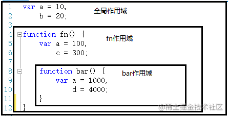
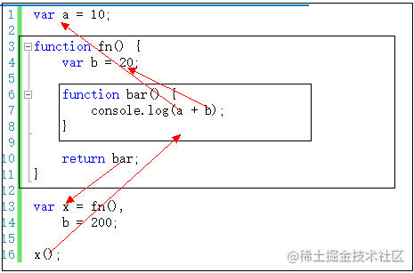

### Tips

`<script>`
- 区分大小写 （驼峰）

```js
//asnc 异步执行脚本
<script async src="..."></script>
//defer 推迟执行脚本
<script defer src="..."></script>
```


## 7 种数据类型
Undefined、Null、Boolean、Number、String、Symbol（ECMAScript6 新增）、Object

- **Undefined**:  假值， 声明未初始化
- **Null**: 假值， 空对象指针，`typeof null = object`
- **Boolean**: 字面值 true 和 false（区分大小写）
- **Number**:  不区分小数和整数
- **String**: 
- **Symbol**： ECMAScript6 新增
- **Object**：


```js
typeof xxx // 'undefined','number'、'string'...
typeof null // 'object'


//instanceof操作符 知道他是什么类型的对象
person instanceof Object
```

### undefined & null

```js
undefined == null; // true
undefined === null; // false

// 假值
Boolean(undefined) //false
Boolean(null) //false
```


### Number
- 最值：`Number.MIN_VALUE` ,`Number.MAX_VALUE`
- 数值转换：`Number()`用于任何数据类型、`parseInt()`和`parseFloat()`字符串是否包含数值模式
- `toFix(小数位数)`：返回包含指定小数位数的数值字符串。四舍五入

```js
1.123e3 - //科学计数法
NaN; //不是数值。isNaN()函数检验
Infinity; //无穷


NaN===NaN //false

Number.isNaN('sdsds') // false
isNaN('sdsd') //true
```


- `isNaN`：除了判断 NaN 为 true 外，还会把不能转成数字判断为 true，例如'dasd'
- `Number.isNaN`：只会判断 NaN 为 true


### String 

1. 可以用双引号、单引号、反引号;_不可变的_，
2. 注意转义字符 `\`
3. `let x = 变量.toString()`
4. 多行字符串（**反引号**）
   ```js
   //反引号 表示字面量
   var msg = `shdjsd
   hello
   world`;
   ```

5. 模板字符串 插值`${}`
   ```js
   let name = "sdsd";
   let msg = `hello ${name}`; //反引号
   ```

6. 原始字符串`String.raw`标签函数
7. **字符集**：16 位码元对应 1 个字符，Unicode

   ```js
   let msg = "abcd";
   //长度 属性 无括号
   msg.lenghth; //4
   //给定索引字符 方法
   msg.charAt(2); //c
   //查看指定码元的字符编码
   msg.charCodeAt(2); //99
   //根据UTF-16码元创建字符
   String.fromCharCode(0x61, 0x61, 0x63, 0x64); //abcd

   //两个16位码元组成的字符叫代理对，码点（一个字符的完整标识）解析
   //代替charCodeAt()
   msg.codePointAt(2);
   //代替fromCharCode()
   msg.fromCodePoint(97, 98, 128522, 100);
   ```

8.  **Base64 转码**

   可以任意值转为 0\~9、A\~Z、a\~z、+、/这个 64 个可打印字符
   - `bota()`：任意值转为 Base64 编码
   - `atob()`:Base64 编码转为原来值
   - 注意：这两个方法不适用非 ASCII 码
   ```js
   var string = "hello world";
   bota(string); //aGVsbG8gd29ybGQ=
   atob("aGVsbG8gd29ybGQ="); //hello world

   bota("你好"); //报错
   ```

   非 ASCII 码转换

   ```js
   function b64Encode(str) {
     return btoa(encodeURIComponent(str));
   }
   function b64Decode(str) {
     return decodeURIComponent(atob(str));
   }
   b64Encode("你好"); //JUU0JUJEJUEwJUU1JUE1JUJE
   b64Decode("JUU0JUJEJUEwJUU1JUE1JUJE");
   ```

9. 大小写转换 方法

   ```js
   msg.toUpperCase();
   msg.toLowerCase();
   ```

10. 字符串位置方法

    ```js
    //从头找，从尾找，返回位置
    let msg = "hello world";
    msg.indexOf("o"); //4
    msg.lastIndexOf("o"); //7

    //从指定位置开始找
    msg.indexOf("o", 6); //7
    msg.lastIndexOf("o", 6); //4
    ```

11. 截取子串`slice()`,`substr()`,`substring()`

    ```js
    // [)
    let msg = "hello world";
    msg.slice(开始，结束);
    msg.substring(开始，结束);
    msg.substr(开始，数量);

    //负参
    msg.slice(3,-4);	//所有负值参数转化为长度+负值	lo w
    msg.substring(3,-4);	//负参转化为0	hel ==>substring(3,0)==>substring(0,3)
    msg.substr(3,-4);	//第一个转换，第二个为0 	""空
    ```

12. 包含字符串：`startsWith()`,`endsWith()`,`includes()`

    ```js
    //返回值true/false
    let msg = "foobarbaz";
    msg.startsWith("foo"); //true 开始于索引0的匹配项
    msg.startsWith("bar"); //false
    msg.startsWith("foo", 1); //false 开始搜索的位置

    msg.endsWith("baz"); //true
    msg.endsWith("bar"); //false
    mag.ensWith("bar", 6); //true	字符串末尾的位置

    msg.includes("bar"); //true 检查整个字符串
    mag.includes("bar", 4); //tue 开始搜索的位置
    ```

13. `trim()`：创建副本，删除前后空格，再返回结果
14. `repeat(整数)`:复制 n 次
15. `padStart(长度，填充字符)`，`padEnd(长度，填充字符)`:复制字符串，如果小于指定长度，在前后填充字符
16. 模式匹配方法`match()`,`search()`,`replace()`


### Symbol

**“symbol” 值表示唯一的标识符**。根据规范，只有两种原始类型可以用作对象属性键：

- 字符串类型
- symbol 类型

symbol可以接收一个描述，**但symbol 总是不同的值，即使它们有相同的名字描述只是一个标签，不影响任何东西。**

```js
let id = Symbol()

// 一个描述为 "id" 的 symbol
let id1 = Symbol('id')
let id2 = Symbol('id)

id1 == id2 // false

id1.description // id

```


symbol 有两个主要的使用场景：

1. “隐藏” 对象属性。
    如果我们想要向“属于”另一个脚本或者库的对象添加一个属性，我们可以创建一个 symbol 并使用它作为属性的键。symbol 属性不会出现在 `for..in` 中，因此它不会意外地被与其他属性一起处理。并且，它不会被直接访问，因为另一个脚本没有我们的 symbol。因此，该属性将受到保护，防止被意外使用或重写。

    因此我们可以使用 symbol 属性“秘密地”将一些东西隐藏到我们需要的对象中，但其他地方看不到它。
```js
 
let user = { // 属于另一个代码
  name: "John"
};

let id = Symbol("id");

user[id] = 1;

alert( user[id] ); // 我们可以使用 symbol 作为键来访问数据
```
2. JavaScript 使用了许多系统 symbol，这些 symbol 可以作为 `Symbol.*` 访问。我们可以使用它们来改变一些内建行为。例如，我们使用 `Symbol.iterator` 来进行 [迭代](https://zh.javascript.info/iterable) 操作，使用 `Symbol.toPrimitive` 来设置 [对象原始值的转换](https://zh.javascript.info/object-toprimitive) 等等。

### Object 

对象（object）是大括号，数组是中括号

```js
var person = {
  name: "",
  age: 2,
};
```

JavaScript 中的所有的*键都是字符串*，值是任意对象！
- 对象赋值`person.name="huang"`
- 使用一个不存在的对象属性，不会报错！**undefined**
- 动态的删减，通过 delete 删除对象的属性`delete person.name`
- 动态的添加，直接给新的属性添加值即可
- 判断属性值是否在这个对象中！`age in person`
- 判断一个属性是否是这个对象自身拥有的 `person.hasOwnProperty("toString")`

## 操作符

```js
~	按位非
&	按位与
|	按位或
<<	左移
>>	有符号右移
>>>	无符号右移
!	逻辑非
&& 	逻辑与
||	逻辑或
*	乘
/	除
%	取模
**	指数	Math.pow()


... 扩展操作符
//对象中的扩展运算符(...)用于取出参数对象中的所有可遍历属性，拷贝到当前对象之中
let bar = { a: 1, b: 2 };
let baz = { ...bar }; // { a: 1, b: 2 }
//如果将扩展运算符用于数组赋值，只能放在参数的最后一位，否则会报错。
first // 1
rest  // [2, 3, 4, 5]
const [first, ...rest] = [1, 2, 3, 4, 5];
const [...rest, last] = [1, 2, 3, 4, 5];// 报错
const [first, ...rest, last] = [1, 2, 3, 4, 5];// 报错
```

### == & ===
**区别**
- ==	相等，操作数相等，先进行类型转换再比较
- ===	全等，不转换操作数，数据类型不同返回false

**NaN与所有数值都不相等，包括自己， 只能用isNaN()判断**

尽量避免浮点数运算，存在精度问题

```js
let res1 = ("55" == 55)//true
let res2 = ("55" === 55);//false，数据类型不同


NaN===NaN // false

(1/3) === (1-2/3)) //false

undefined == null; // true
undefined === null; // false

```


### for-in & for-of

**for-in是遍历（object）键名key，for-of是遍历（array）键值 value。**
```js
var obj = {a:1, b:2, c:3};
    
for (let key in obj) {
  console.log(key);
  //a ,b,c
}


const array1 = ['a', 'b', 'c'];

for (const val of array1) {
  console.log(val);
}


```


## Function 
```js
function abs(x) {}
var abs = function (x) {
  //手动抛出异常
  if (typeof x !== "number") throw "Not a Number";
};
```

> `arguments`关键字

代表，传递进来的所有参数，是一个<u>数组</u>

```js
var abs = function (x) {
  for (var i = 0; i < arguments.length; i++) {}
};
```

arguments 包含所有的参数，我们有时候想使用多余的参数来进行附加操作。需要排除已有参数~

> `rest`关键字

ES6 引入的新特性，获取除了已经定义的参数之外的所有参数~…

**rest 参数只能写在最后面，必须用…标识。**

```js
function aaa(a, b, ...rest) {
  console.log("a==>" + a);
  console.log("b==>" + b);
  console.log(rest);
}
```

## 变量

|                                                    | var                | let                            |
| -------------------------------------------------- | ------------------ | ------------------------------ |
| 作用域                                             | 函数作用域         | 块作用域（）块是函数的子集 |
| 声明提升                                           | 会被提升           | 不会，暂时性死区               |
| 成为 window 对象属性`console.log(window.属性)` | Yes                | No                             |
| 条件声明，重复声明                                 | Yes                | No（SyntaxError 异常）         |
| for 循环中的声明                                   | 会渗透到循环体外部 | 作用域仅限循环块内部           |

const：行为与let基本想相同，唯一区别是声明变量时必须*同时初始化变量*，不能再被重新赋值为其他引用值（TypeError 异常），**但对象的键则不受限制**。若想整个对象都不能修改，可使用`Object.freeze()`.

> 规范

由于我们的**所有变量都会绑定到 window 上**，如果不同的 js 文件，使用了相同的全局变量，就会产生冲突—>如何减少这样的冲突？

```js
//唯一全局变量
var huangApp = {};

//定义全局变量
huangApp.name = "haiwen";
huangApp.add = function (a, b) {
  return a + b;
};
```

把自己的代码全部放入自己定义的唯一空间名字中，降低全局命名冲突问题~

jQuery 中就是使用的该方法：jQuery.name，简便写法：**$()**


## 作用域

在 Javascript 中，作用域分为 `全局作用域` 和 `函数作用域`

- 全局作用域：代码在程序任何地方都能访问，window对象的内置属性都属于全局作用域
- 函数作用域：在固定的代码片段才能被访问





作用域有上下级关系，上下级关系的确定就看函数是在哪个作用域下创建的。如上，fn作用域下创建了bar函数，那么“fn作用域”就是“bar作用域”的上级。

作用域最大的用处就是隔离变量，不同作用域下同名变量不会有冲突。

> 作用域链

一般情况下，变量取值到 创建 这个变量 的函数的作用域中取值

但是**如果在当前作用域中没有查到值，就会向上级作用域去查，直到查到全局作用域**，这么一个查找过程形成的链条就叫做作用域链

```js
var x = 10;

function fn(){
    console.log(x);
}

function show(f){
    var x = 20;
    f();    // 10 
}

show(fn);
```




## 垃圾回收

[赠你 13 张图，助你 20 分钟打败了「V8 垃圾回收机制」！！！](https://security.feishu.cn/link/safety?target=http%3A%2F%2Fmp.weixin.qq.com%2Fs%3F__biz%3DMzg2NjY2NTcyNg%3D%3D%26mid%3D2247483683%26idx%3D1%26sn%3D973b0280aa9c6eb1678ea530ee4d2381%26chksm%3Dce4614b2f9319da402278b86e63f44e818e832ecbaafdada344ba979de3df4443a8ed53b0cb1%26scene%3D21%23wechat_redirect&scene=ccm&logParams=%7B%22location%22%3A%22ccm_drive%22%7D&lang=zh-CN)

### 垃圾回收机制
垃圾回收机制有两种方式，一种是`引用法`，一种是`标记法`


>  标记清理

**JS最常用的垃圾回收策略**，将`可达`的对象标记起来，`不可达`的对象当成垃圾回收。（标记的方法有很多种）

从初始的`根对象（window或者global）`的指针开始，向下搜索子节点，子节点被搜索到了，说明该子节点的引用对象可达，并为其进行标记，然后接着递归搜索，直到所有子节点被遍历结束。那么没有被遍历到节点，也就没有被标记，也就会被当成没有被任何地方引用，就可以证明这是一个需要被释放内存的对象，可以被垃圾回收器回收。

```js

// 可达
var name = 'Heavenmei'
var obj = {
  arr: [1, 2, 3]
}
console.log(window.name) // 林三心
console.log(window.obj) // { arr: [1, 2, 3] }
console.log(window.obj.arr) // [1, 2, 3]
console.log(window.obj.arr[1]) // 2


function fn () {
  var age = 22
}
// 不可达
console.log(window.age) // undefined
```


> 引用计数


就是判断一个对象的引用数，引用数`为0`就回收，引用数`大于0`就不回收

但是如果出现循环引用，就会造成内存泄漏。如下，两个对象相互引用，引用数都为1，无法被回收。
```js
function fn () {
  const obj1 = {}
  const obj2 = {}
  obj1.a = obj2
  obj2.a = obj1
}
fn()
```


### 内存管理

解除引用，释放内存，设置null。*解除引用不会立即触发内存被回收，回收是定时执行的。*
```js
obj1 = null
obj2 = null
```


**内存泄漏**

闭包、定时器

> 闭包：闭包是通过将函数定义在另一个函数内部实现的，内层函数会形成对外层函数变量的引用，即使外层函数已经返回，这些变量仍然会被保留。因此，闭包可以让我们在函数外部间接地访问函数内部的变量。

```js
function createCounter() {
    let count = 0; // 局部变量

    return function() {
        count++; // 内部函数引用了外部函数的局部变量
        console.log(count);
    }
}

const counter = createCounter(); // 返回的函数形成了一个闭包
counter(); // 输出: 1
counter(); // 输出: 2
```


**静态分配**

核心问题：如何减少浏览器执行垃圾回收的次数

静态分配是优化的一种极端形式，如果你的程序被垃圾回收严重拖了后腿可以利用它提升性能


## 内部对象

### Date

```js
//接收一个表示日期的字符串参数，转换为表示该日期的毫秒数
Date.parse(" ")
//返回日期的毫秒表示
Date.UTC(年，月（1月是0，2月是1），日，时，分，秒，毫秒)
//返回执行时的日期和时间的毫秒数
Date.now()

var now = new Date();
now.getFullYear();//年
now.getMonth();//月
now.getDate();//日
now.getDay();//星期几
now.getHours();//时
now.getMinutes();//分
now.getSeconds();//秒
now.getTime();//时间戳

//转换
now.toLocaleString();
now.toGMTString();
```

### RegExp (todo)

正则表达式

### Global

特殊的对象，代码中不会显式的使用。**浏览器将window对象实现为Global对象的代理，因此所有全局变量都变为window对象的属性**

```js
let uri = 'https://heavenmei.github.io'

encodeURI(uri)
decodeURI(uri)

encodeURIComponent(uri)
decodeURIComponent(uri)


// 执行js字符串
eval("console.log('hi')")


```

### Math

```js
Math.PI; //Π的值
min(), Max();
//舍入方法
Math.ceil(); //向上舍入为整数
Math.floor(); //向下舍入为整数
Math.round(); //四舍五入
Math.fround(); //数值最接近的单精度浮点数

//随机数
Math.random(); //[0,1)的随机数
function selectFrom(lowerValue, upperValue) {
  let choice = upperValue - lowerValue + 1; //可选总数
  return Math.floor(Math.random() * choice + lowerValue);
}

//其他方法
Math.abs();
Math.exp();
Math.sqrt();
```


## 集合引用类型
### Array

Array 可以包含任意的数据类型

```js
var arr = new Array()
var arr = [1, 2, 3, 4, 5, 6]; //通过下标取值和赋值
```

1、`arr.length`,假如给 arr.lennth 赋值，数组大小就会发生变化~，如果赋值过小，元素就会丢失

2、`arr.indexOf(2)`通过元素获得下标索引,字符串的"1"和数字 1 是不同的

3、`slice（）`截取 Array 的一部分，**返回新数组**，类似于 String 中 substring

4、`push()`压入到尾部，`pop()`弹出尾部的一个元素

5、`unshift()`**压入到头部**,`shift()` 弹出头部的一个元素

6、`sort()`排序

7、`reverse()`元素反转

8、`concat([数组])` 注意：concat()并没有修改数组，只是会**返回新数组**

9、连接符`join("连接符")` 打印拼接数组，使用特定的字符串连接

10、多维数组`arr[1][1]`

11、`splice(start，delete count，..add item)`**就地**修改数组的万能方法，从指定索引开始删除若干元素，然后在该位置添加若干元素


#### 定型数组
ECMAScript新增的结构，为了WebGL中使用时提升向原生库传输数据的效率。例如：Float32Array、Int32Array

如果纯 JS 编程，用不到定型数组，只有 JS 和其他方面交互时会用到。例如和 WebGL 原生库交换二进制数据，网络请求中需要二进制数据等。

定型数组的长度是固定的


### Map

ES6 新增，ES6以前可以用Object实现。

```js
var map = new Map([
	['tom':100],
	['jack',90]
 ]);

var name = map.get('tom')
map.set('admin',123456)
map.delete("tom")

```


  
#### Map or Object ?

与Object不同的是，Object只能使用数值、字符串或符号作为键，Map可以使用任何JS数据类型作为键。

Object 是无序结构，属性有描述符，可用于 Proxy，而 Map 是有序结构，性能更好。所以 Object 适合于结构固定的实例和配置，而 Map 适合于内存存储，场景不同

两者性能对比

- 给定固定大小的内存，Map大约可以比Object多存储50%的键值对
- Map 的插入、删除的性能更好

#### WeakMap
ES6新增, "弱映射", API是map子集. **"weak"指的是JS垃圾回收程序对待"弱映射"中键（key）的方式.** 

**WeakMap只能使用对象作为键（key）**。保证只能通过key对象的引用才能获取value

**弱键**：key不属于正式的引用, 可能会被垃圾回收。但是value不同。只要key存在，键值对就会存在weakmap中。反之，会被回收。

用途： 
- 私有变量：用WeakMap存储私有变量，key:对象实例, value: 私有属性。
- dom节点元数据：dom中的数据由weakmap存储，而当dom被删除，也就没有引用，其元数据也就被回收了

```js
const wm = new WeakMap()

wm.set({}, 'val') // 该key:{}空对象没有引用，因此该键值对会被当作垃圾回收


const container = {
	key: {}
}

ws.set(container.key,'val') // key指向的空对象被conatiner引用，因此不会回收

```


### Set
ES6新增,  “加强的Map”

```js
const m = new Set(["val1","val2","val3"])

set.add(2)
set.delete(1)
set.has(3)//是否包含某个元素
```


#### WeakSet
ES6新增， “弱集合”， **"weak"指的是JS垃圾回收程序对待"弱集合"中值（value）的方式.** 

**WeakSet只能使用对象作为值（value）**。保证只能通过value对象的引用才能获取value

**弱值**：value不属于正式的引用, 可能会被垃圾回收。

用途： 给对象打标签。当元素被删除，也就自动被回收

```js
const ws = new WeakSet()

ws.add({}) // 该{}空对象没有引用，因此会被当作垃圾回收


const container = {
	val: {}
}

ws.add(container.val) // val指向的空对象被conatiner引用，因此不会回收

```


## 前端学习网站

前端智能化思维：https://juejin.cn/post/6844904104448393223

前端内容图谱：https://www.processon.com/view/link/5ea52667f346fb177b96507c#map

B 站 - https://space.bilibili.com/389008815

腾讯课堂 - https://imissu.ke.qq.com/

某猿学习网: https://www.imooc.com/

vue3: https://juejin.cn/post/6955129410705948702

前端入门三部曲：

- https://www.bilibili.com/video/BV1nJ411R7Db?spm_id_from=333.999.0.0
- https://ke.qq.com/course/1740943
- https://ke.qq.com/course/464526

Vue 入门：

- https://www.bilibili.com/video/BV1qb41187fZ?spm_id_from=333.999.0.0
- https://www.bilibili.com/video/BV1VE411877C?spm_id_from=333.999.0.0

axios 请求： https://www.bilibili.com/video/BV12J41157k8?spm_id_from=333.999.0.0
