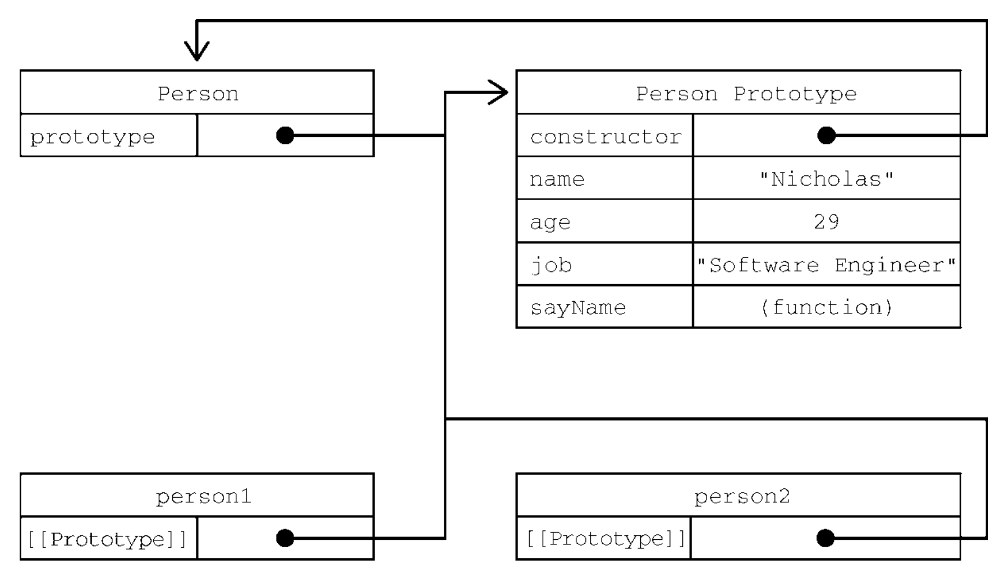

## 迭代器与生成器

### 迭代器

任何实现`Iterable`接口的对象都有一个`Symbol.iterator`属性，这个属性引用*默认迭代器*。
默认迭代器是一个函数，调用之后产生一个实现`Iterable`接口的对象

实现`Iterable`接口的内置类型：

- 字符串
- 数组
- 映射
- 集合
- arguments 对象
- NodeList 等 DOM 集合类型

接收可迭代对象的原生语言特性包括：

- for-of循环
- 数组结构
- 扩展操作符
- Array.from()
- 创建集合
- 创建映射
- Promise.all()接收由promise组成的可迭代对象
- Promise.race()接收由promise组成的可迭代对象
- yield* 操作符，在生成器中使用


> `Symbol.iterator` 方法

该方法执行返回一个迭代器对象。可以执行 `next()`方法，返回一个 `{ value, done }`的结构。其实就是典型的迭代器模式。

迭代器是 *非快照* 模式，意味着中途改变数组，迭代也会更改

```js
const arr = [10, 20, 30]
const iteration = arr[Symbol.iterator]()
iteration.next() // {value: 10, done: false}
iteration.next() // {value: 20, done: false}

// 非快照模式
arr.splice(2,0,40)
iteration.next() // {value: 40, done: false}


iteration.next() // {value: 30, done: false}
iteration.next() // {value: undefined, done: true}

// done为true之后一直返回同样的值
iteration.next() // {value: undefined, done: true}
```


### 生成器
生成器拥有一个函数块内暂停和回复代码执行的能力。

形式是一个函数，函数名称前面加一个星号(\*)表示它是一个生成器。 *左右空格无关*。**箭头函数不能用来定义生成器函数**

调用生成器函数会产生一个 **生成器对象**，生成器对象一开始处于暂停执行(suspended)状态，具有next()方法，调用这个方法会让生成器开始或恢复执行。
生成器函数只会在初次调用next()方法后开始执行。


> 通过yield中断执行

yield关键字可以让生成器停止和开始执行，生成器函数在遇到yield关键字之前会正常执行。遇到这个关键字后，执行会停止，函数作用域的状态会被保留。停止执行的生成器函数只能通过在生成器对象上调用next()方法来恢复执行。

**yield关键字只能在生成器函数内部使用**，用在其他地方会抛出错误，yield关键字必须直接位于生成器函数定义中。


```js
function * generatorFn(){
    yield 'foo';
    yield 'bar';
    yield 'baz';
}
​
let generatorObject = generatorFn();
​
console.log(generatorObject.next()); //{done:false, value:'foo'} 
console.log(generatorObject.next()); //{done:false, value:'bar'} 
console.log(generatorObject.next()); //{done:true, value:'baz'}

```


暂停yield关键字可以接收传给next() 的第一个参数
```js
function * generatorFn(){
    return yield 'foo';
}
​
let generatorObject = generatorFn();
​
console.log(generatorObject.next()); //{done:false, value:'foo'} 
console.log(generatorObject.next('baz')); //{done:true, value:'baz'} 
```


> 产生可迭代对象

使用星号增强yield行为，让它能够迭代一个可迭代对性，从而一次产出一个值。 *左右空格无关*

例如：实现最简单的迭代器模式

```js

class Foo {
    constructor() {
        this.values = [10, 20, 30]
    }
    // 自定义迭代器
    * [Symbol.iterator]() {
        yield* this.values
    }
}

const f = new Foo()
for (const x of f) {
    console.log(x)
}
// 10
// 20
// 30
```


> 提前终止生成器

**return()**
与迭代器不同，所有生成器对象都有return()方法，只要通过它进入关闭状态，就无法恢复了。后续调用next()会显示done：true状态。


**throw()**

throw()方法会在暂停的时间将一个提供的错误注入到生成器对象中。如果错误未被处理，生成器就会关闭。

不过，加入生成器函数内部处理了这个错误，那么生成器就不会关闭，而且还可以恢复执行。错误处理会跳过对应的yield，因此在这个例子中会跳过一个值。

### 生成器作为迭代器

```js
const m = new Map({
    // 自定义迭代器
    [Symbol.iterator]: function* () {
        yield ['k1', 'v1']
        yield ['k2', 'v2']
        yield ['k3', 'v3']
    }
})
```


## 对象


### 属性

对象的属性分为两种：数据属性、访问器属性 

| 数据属性 | 访问器属性 | default | desc |
| ---- | ---- | ---- | ---- |
| \[\[Configuration]] | \[\[Configuration]] | true | 是否修改特性，delete删除 |
| \[\[Enumerable]] | \[\[Enumerable]] | true | 是否支持for-in |
| \[\[Writeable]] | \[\[Get]] | true/ option |  |
| \[\[Value]] | \[\[Set]] | option |  |

- `Object.defineProperty(obj,propertyName,{})` 访问器属性只能用该方法定义
- `Object.defineProperties(obj, {})` 定义多个属性
- `Object.getOwnPropertyDescriptor(obj,propertyName)` 获取属性的属性描述符
- `Object.getOwnPropertyDescriptors(obj)` 获取所有属性的属性描述符


> 合并对象

`Object.assign(target, source1,...,sourceN)`：每个源对象中可枚举和自有属性**复制到目标对象**。以字符串和符号为键的属性会被复制。 

**浅复制，若有相同属性，则使用最后一个**

```js
let dest,src,result;

// 简单复制
target = {};
src = {id:'src'};

result = Object.assign(target, src);

// Object.assign修改目标对象，也会返回修改后的目标对象
console.log(target === result);	//true
console.log(target !== src);		//true
console.log(result)				//{id:src}
console.log(dest);				//{id:src}

```


>  Object.is()  &  ===

=== 不区分正负0，但是 `Object.is` 中 0 = +0 != -0

=== 中NaN不等于任何值，`Object.is` 中NaN可以等于自身

```js
0 === +0 // true
0 === -0 // true
+0 === -0 // true
NaN === NaN // false

Object.is(0, +0) // true
Object.is(0, -0) // false
Object.is(-0, +0) // false
Object.is(NaN, NaN) // true
```


> 对象解构

**null和undefined不能被解构，否则会抛出错误。**

```js
let person = {
	name:'Matt';
	age:27;
}

let {name:personName , age:personAge} = person;

console.log(personName);	//Matt
console.log(personAge);		//27

```


### 构造函数

构造函数名称的首字母要大写

构造函数内部的this被赋值为这个新对象（即**this指向新对象**），该对象的contructor指向构造函数

**问题**： 同一个构造函数的不同实例上的函数虽然同名但是不相等，要解决这个问题，可以**把函数定义转移到构造函数外部**。

```js
function Person (name){
	this.name = name;
	this.sayName = function(){
		console.log(this.name)
	}
	// 等价于， 每次都创建新的函数实例， 没必要
	// this.sayName = new Function("console.log(this.name)")

	// 可以改成
	// this.sayName = sayName
}

function sayName (){
	console.log(this.name)
}

let person1 = new Person("hi");
let person2 = new Person("hi2");

console.log(person1.sayName === person2.sayName ) // false

console.log(person1.constructor === Person) // true
console.log(person1 instanceof Person) // true


```

### 原型模式

每个函数都会创建一个prototype属性，这个属性是一个对象，包含应该由特定引用类型的实例共享的属性和方法。实际上，这个对象就是通过调用构造函数创建的对象的原型。使用原型对象的好处是，在它上面定义的属性和方法可以被对象实例共享。

默认情况下，所有原型对象自动获得一个名为constructor的属性，指回与之关联的构造函数。

实例与构造函数原型之间有直接的联系，但实例与构造函数之间没有。

**Object原型的原型是null**

  

```js
function Person (){}

PersonPrototype = {
	name: "hi",
	sayName: function(){
		console.log(this.name)
	}
} Huang@0369haiwen
Person.prototype = PersonPrototype
// Person

let person1 = new Person("hi");
let person2 = new Person("hi2");

console.log(person1.sayName === person2.sayName ) // true

console.log(Person.prototype.__proto__ === Object.prototype) 		//true
console.log(Person.prototype.__proto__.constructor === Object) 		//true
console.log(Person.prototype.__proto__.__proto__ === null) 		       //true
```


> 原型的层级


访问对象属性时，会不断向父亲原型查找，直至找到返回。

使用delete操作符可以完全删除实例上的这个属性，从而让标识符解析过程能够继续搜索原型对象。

`hasOwnProperty()`方法用于确定某个属性是在实例上还是原型对象上，true为在实例上。

`in`操作符不区分实例or原型，找到即true。

因此，只要in操作符返回true且hasOwnProperty()返回false，就说明该属性是一个原型属性。

`Object.keys()`可以获得对象上所有可枚举的实例属性。

`Object.getOwnPropertyNames()`可以获得对象上所有实例属性，无论是否可以枚举。


  
### class 继承

```js
<script>
	//ES6之后========================
	//定义一个学生的类
	class Student{
		constructor(name){
			this.name = name;
		}
		hello(){
			alert('hello');
		}
}

	class XiaoStudent extends Student{
		constructor(name,grade){
			super(name);
			this.grade = grade;
		}
		myGrade(){
			alert('我是一名小学生');
		}
	}

	var xiaoming = new Student("xiaoming");
	var xiaohong = new XiaoStudent("xiaohong",1);
</script>
```

**原型链**

_proto_:

