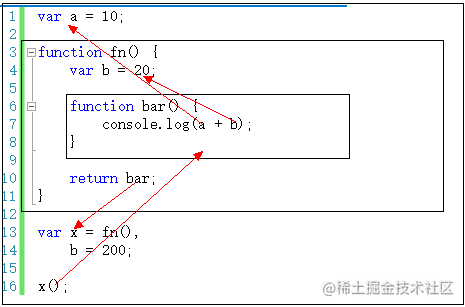

## 编译

编译过程：
1. 分词/词法分析
2. 解析/语法分析（AST）
3. 代码生成


两个阶段：
1. 编译阶段，会在当前作用域声明变量
2. 运行阶段，引擎会在作用域中查找变量（**向上查找**）
	1. **LHS 查询**：赋值 `var a`
	2. **RHS查询**：取值 `console.log(a)`

## 作用域

两个作用域工作模型：
- 词法作用域： 写代码时确定的，关注函数在何处声明。
- 动态作用域：运行时确定的（**JS不具有动态作用域**），类似this关注函数在何处调用


eval和with 在 不严格模式下 可以欺骗词法作用域。
```js
function foo(str,a){
	eval(str);
	console.log(a,b);
}
var b = 2;
foo("var b = 3", 1) // 1,3
```


作用域类型：
- 全局作用域： var
- 函数作用域：立即执行函数会声明并立即执行一个函数来创建自己的作用域
- 块作用域：==let声明不会在块作用域中提升== （暂时性死区）


提升： **所有声明（变量和函数）都会 移动 到各自作用域最顶端 （函数 > 变量）**


#### 作用域链

一般情况下，变量取值到 创建 这个变量 的函数的作用域中取值

但是**如果在当前作用域中没有查到值，就会向上级作用域去查，直到查到全局作用域**，这么一个查找过程形成的链条就叫做作用域链

```js
var x = 10;

function fn(){
    console.log(x);
}

function show(f){
    var x = 20;
    f();    // 10 
}

show(fn);
```




### 闭包

当函数可以记住 并 访问所有在的词法作用域，即使函数是在当前词法作用域之外执行，这时就产生了 “闭包”

常见的闭包：定时器、事件监听器、Ajax请求、跨窗口通信、Web Workers 或者任何其他异步任务中。**只要使用了回调函数，实际上就是在使用闭包！**


```js
for(var i = 1; i <= 5;i++){
	setTimeout(function timer(){
		console.log(i)
	}, i * 1000)
}
// 每秒一次输出 6
// var 提升 全局作用域


// 每秒依次输出1，2，3，4，5
// 方法1
for(let i = 1; i <= 5;i++){
	setTimeout(function timer(){
		console.log(i)
	}, i * 1000)
}

// 方法2
for(var i = 1; i <= 5;i++){
	(function(){
		// j 在 立即执行函数 创建的 新的作用域中
		var j = i;
		setTimeout(function timer(){
			console.log(j)
		}, j * 1000)
	})()
}


```


*立即执行函数会声明并立即执行一个函数来创建自己的作用域*