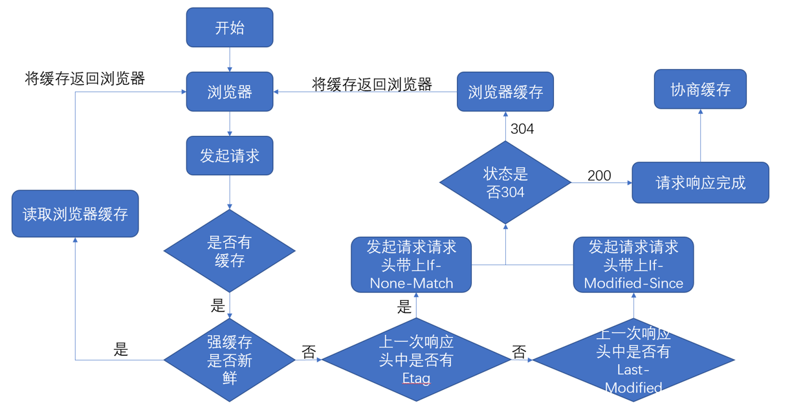
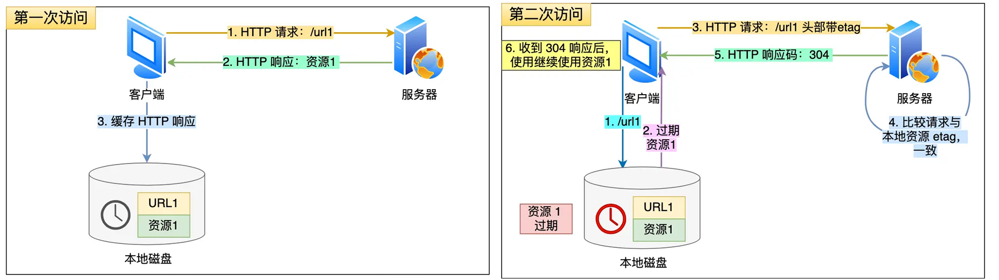
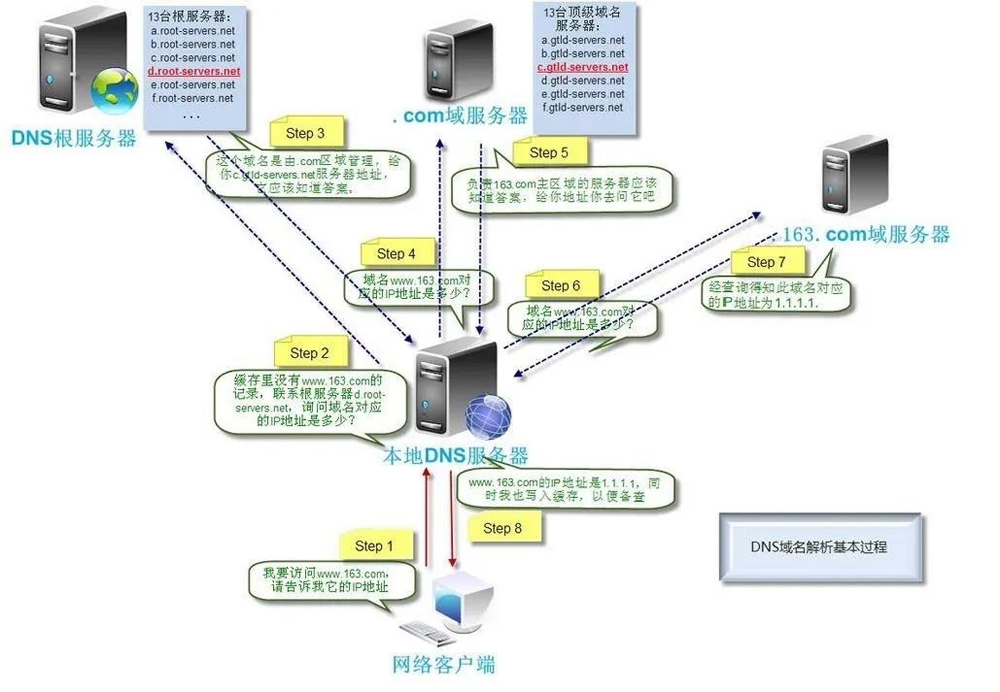

> 面试必问。一次性说清楚

1. URL解析
2. 检查缓存
3. DNS解析查找域名的 IP 地址
4. 浏览器向 web 服务器发送一个 HTTP 请求
5. 服务器的永久重定向响应
6. 服务器处理请求
7. 服务器返回一个 HTTP 响应
8. 浏览器显示 HTML
9. 浏览器发送请求获取嵌入在 HTML 中的资源（如图片、音频、视频、CSS、JS等等）


## URL解析

浏览器解析URL，确定Web服务器和文件名。 `URL=协议://服务器域名:端口号/path`

|协议|默认端口号|传输协议|
|---|---|---|
|http|80|超文本传输协议|
|https|443|在http的基础上进行了安全设置(SSL/TSL)证书认证|
|ftp|21|主要用于客户端电脑和服务器端的文件传输|


## 检查缓存
[一文彻底掌握HTTP缓存](https://juejin.cn/post/6915190788628905997 "https://juejin.cn/post/6915190788628905997")


浏览器进程会通过进程间通信把**URL请求发送至网络进程**，首先，网络进程会先查找本地缓存是否缓存了该资源，如果请求资源在缓存中并且新鲜，会按照以下优先级顺序查找缓存：

1. **内存缓存（Memory Cache）**： 如果内存缓存中有该资源，且其缓存策略允许，浏览器会直接使用内存中的数据。

2. **硬盘缓存（Disk Cache）**：如果内存缓存中没有找到资源，浏览器会尝试从硬盘缓存中获取资源。如果硬盘缓存中有该资源，且其缓存策略允许，浏览器会直接使用硬盘中的数据。
3. **网络请求**：
	- 如果资源未缓存或不新鲜，发起新请求，直接进入网络请求流程；
	- 如果已缓存且在有效期内，直接提供给客户端（强缓存=内存缓存+硬盘缓存），否则还是进入网络请求流程与服务器进行验证（协商缓存）


检验新鲜通常有两个HTTP头进行控制 Expires 和 Cache-Control：
- HTTP1.0 提供`Expires`，值为一个绝对时间表示缓存新鲜日期
- HTTP1.1 增加了`Cache-Control:max-age=`，值为以秒为单位的最大新鲜时间





### 强缓存

强缓存是利用http头中的Expires和Cache-Control两个字段来控制的。
- HTTP1.0 提供`Expires`，值为一个绝对时间表示缓存新鲜日期
- HTTP1.1 增加了`Cache-Control:max-age=`，值为以秒为单位的最大新鲜时间

强缓存中，当请求再次发出时，浏览器会根据其中的Expires和Cache-Control判断目标资源是否“命中”强缓存，如果命中则直接从缓存中获取资源，不会再与服务端发生通信。命中强缓存的情况下，返回的HTTP状态码为200。


#### 内存缓存和硬盘缓存

| 比较    | 内存缓存              | 硬盘缓存                           |
| ----- | ----------------- | ------------------------------ |
| 读取速度  | 快速                | 速度比内存缓存慢，<br/>需要重新解析文件，进行I/O操作 |
| 时效性   | 时效端<br/>进程关闭，内存清空 | 时效长                            |
| 容量    | 小                 | 大                              |
| 匹配优先级 | 先                 | 后                              |
| 存储    | js和图片等文件          | css文件                          |

**为什么一般js和图片文件会放到内存缓存，css 放在硬盘缓存？**

- 样式表一般在磁盘中，不会缓存到内存中去，因为CSS样式加载一次即可渲染出网页。
- 但是，**脚本却可能随时会执行**，如果脚本在磁盘当中，在执行该脚本需要从磁盘中取到内存当中来。这样的IO开销是比较大的，有可能会导致浏览器失去响应。因此，脚本一般在内存中。


### 协商缓存 304
**协商缓存就是与服务端协商之后，通过协商结果来判断是否使用本地缓存**。有可能本地缓存失效，有新的更新，浏览器需要向服务器去询问缓存的相关信息，进而判断是重新发起请求、下载完整的响应，还是从本地获取缓存的资源。

协商缓存的标识也是在响应报文的HTTP头中和请求结果一起返回给浏览器的，控制协商缓存的字段分别有：`Last-Modified`和`Etag`，其中==Etag的优先级比Last-Modified==高。
 
**304 Not Modified**：如果服务端提示缓存资源未改动（Not Modified），资源会被重定向到浏览器缓存，这种情况下网络请求对应的状态码是 304。





## 解析域名->IP地址 （DNS）
过程：
4. 浏览器缓存 （Chrome浏览器通过输入：chrome://net-internals/#dns 打开DNS缓存页面）
5. 本机缓存 （操作系统缓存，ipconfig /displaydns）
6. hosts文件 （查看本地硬盘的 hosts 文件）
7. 路由器缓存
8. ISP DNS 缓存
9. DNS 递归查询（可能存在负载均衡导致每次IP不一样）

若需要发起新的请求，首先会查看各个缓存是否有域名对应的ip地址，如果没有则下一步进行 DNS 请求，首先请求本地 DNS 服务器。本地DNS服务器一般都是你的网络接入服务器商提供，比如中国电信，中国移动。


### DNS 解析


> 不要和CDN搞混
> 
> DNS（Domain Name System，域名系统 
> 
> CDN（Content Delivery Network）内容分发网络，将站源内容缓存到各服务器

发起网络请求的第一步就是要进行DNS解析。

本地DNS服务器会首先查询它的缓存记录，如果缓存中有此条记录，就可以直接返回结果，此过程是**递归**的方式进行查询。如果没有，本地DNS服务器还要向DNS根服务器进行查询。



 
两种查询方式：
- **递归解析**：客户端-本地DNS，由本地DNS服务器自己负责向其他DNS服务器进行查询，一般是先向该域名的根域服务器查询，再由根域名服务器一级级向下查询。最后得到的查询结果返回给局部DNS服务器，再由局部DNS服务器返回给客户端。
- **迭代解析**：只是帮你找到相关的服务器，返回给你，你在去查。

### DNS负载均衡

当一个网站有足够多的用户的时候，假如每次请求的资源都位于同一台机器上面，那么这台机器随时可能会蹦掉。处理办法就是用DNS负载均衡技术。


它的原理是在**DNS服务器中为同一个主机名配置多个IP地址**,在应答DNS查询时,DNS服务器对每个查询将以DNS文件中主机记录的IP地址按顺序返回不同的解析结果,将客户端的访问引导到不同的机器上去,使得不同的客户端访问不同的服务器,从而达到负载均衡的目的｡例如可以根据每台机器的负载量，该机器离用户地理位置的距离等等。


### CDN & DNS

==CDN加速=智能DNS+多服务器==

CDN服务器的本质，是**存储源服务器分发的资源，也即资源副本，供用户就近访问**，缩短用户查看内容的访问延迟。

但是，我们如何知道用户所在的位置并为其分配最佳的CDN节点呢，这就需要用DNS负载均衡。

当用户访问网站时， 域名解析 请求将最终交给全局 负载均衡 DNS进行处理。全局负载均衡DNS通过一组预先定义好的策略，将当时最接近用户的节点地址提供给用户，使用户能够得到快速的服务。同时，它还与分布在世界各地的所有CDN节点保持通信，搜集各节点的通信状态，确保不将用户的请求分配到不可用的CDN节点上，实际上是通过DNS做全局负载均衡。

[# CDN原理](https://heavenmei.github.io/post/2022-09-08-CDN-base)
## 发起HTTP请求（TCP连接）

拿到域名对应的IP地址之后，浏览器会以一个随机端口（$1024<端口<65535$）向服务器的WEB程序（常用的有httpd,nginx等）80端口发起TCP的连接请求。

建立 TCP 连接后才能发起一个 HTTP 请求。一个典型的 http request header请求信息包含三个部分：
- 请求方法URI协议/版本
- 请求头(Request Header)
- 请求正文

```text
GET/sample.jspHTTP/1.1
Accept:image/gif.image/jpeg,*/*
Accept-Language:zh-cn
Connection:Keep-Alive
Host:localhost
User-Agent:Mozila/4.0(compatible;MSIE5.01;Window NT5.0)
Accept-Encoding:gzip,deflate
// 空行 请求头结束
username=jinqiao&password=1234
```


#### TCP 标志符

- SYN（Synchronize）：包含随机序列号
- ACK（Acknowledgment）：序列号+1
- FIN（Finish）：包含随机序列号
- RST（Reset）
- PSH（Push）
### TCP三次握手

10. 第一次握手：客户端A将标志位SYN置为1,随机产生一个值为seq=J（J的取值范围为=1234567）的数据包到服务器，客户端A进入SYN_SENT状态，等待服务端B确认；
11. 第二次握手：服务端B收到数据包后由标志位SYN=1知道客户端A请求建立连接，服务端B将标志位SYN和ACK都置为1，ack=J+1，随机产生一个值seq=K，并将该数据包发送给客户端A以确认连接请求，服务端B进入SYN_RCVD状态。
12. 第三次握手：客户端A收到确认后，检查ack是否为J+1，ACK是否为1，如果正确则将标志位ACK置为1，**ack=K+1**，并将该数据包发送给服务端B，服务端B检查ack是否为K+1，ACK是否为1，如果正确则连接建立成功，客户端A和服务端B进入ESTABLISHED状态，完成三次握手，随后客户端A与服务端B之间可以开始传输数据了。


#### 为什需要三次握手？

==TCP 使用三次握手建立连接的最主要原因是防止「历史连接」初始化了连接。 即“为了防止已失效的连接请求报文段突然又传送到了服务端，因而产生错误”==

三次握手可以通过比较序列号是否+1判断是否建立链接，两次握手没有确认就建立连接，白白浪费资源


### TCP四次挥手

13. **第一次挥手**： Client发送一个FIN，用来关闭Client到Server的数据传送，Client进入FIN_WAIT_1状态。
14. **第二次挥手：** Server收到FIN后，发送一个ACK给Client，确认序号为收到序号+1（与- SYN相同，一个FIN占用一个序号），Server进入CLOSE_WAIT状态。
15. **第三次挥手：** Server发送一个FIN，用来关闭Server到Client的数据传送，Server进入LAST_ACK状态。
16. **第四次挥手：** Client收到FIN后，Client进入TIME_WAIT状态，接着发送一个ACK给Server，确认序号为收到序号+1，Server进入CLOSED状态，完成四次挥手。


#### 为什么建立连接是三次握手，而关闭连接却是四次挥手呢？

这是因为服务端在LISTEN状态下，收到建立连接请求的SYN报文后，把ACK和SYN放在一个报文里发送给客户端。（所以省了一次握手）


- 关闭连接时，客户端向服务端发送 FIN时，仅仅表示客户端**不再发送数据了但是还能接收数据**。
- 服务端收到客户端的 FIN 报文时，先回一个 ACK 应答报文，而**服务端可能还有数据需要处理和发送，等服务端不再发送数据时，才发送 FIN 报文**给客户端来表示同意现在关闭连接。

#### TCP 四次挥手，可以变成三次吗？

什么情况会出现三次挥手?

当服务端在 TCP 挥手过程中，==没有数据要发送== 并且==开启了 TCP 延迟确认机制==，那么第二和第三次挥手就会合并传输，这样就出现了三次挥手。 （ACK+FIN）


**TCP 延迟确认机制 （默认开启）**

当发送没有携带数据的 ACK，它的网络效率也是很低的，因为它也有 40 个字节的 IP 头 和 TCP 头，但却没有携带数据报文。为了解决 ACK 传输效率低问题，所以就衍生出了 TCP 延迟确认。TCP 延迟确认的策略:
- 当有响应数据要发送时，ACK会随着响应数据一起立刻发送给对方。
- 当没有响应数据要发送时，ACK将会延迟一段时间，以等待是否有响应数据可以一
- 发送如果在延迟等待发送 ACK 期间，对方的第二个数据报文又到达了，这时就会立刻发送 ACK


## 服务器 负载均衡

负载均衡：当一台服务器无法支持大量的用户访问时，于是将同一个应用部署在多台服务器上，将大量用户的请求分配给多台机器处理。

Nginx是一款面向性能设计的HTTP服务器，客户端不是直接通过HTTP协议访问某网站应用服务器，而是**先请求到Nginx，Nginx再请求应用服务器，然后将结果返回给客户端，这里Nginx的作用是反向代理服务器**。同时也带来了一个好处，其中一台服务器万一挂了，只要还有其他服务器正常运行，就不会影响用户使用。


## 服务器返回一个 HTTP 响应
HTTP响应与HTTP请求相似，HTTP响应也由3个部分构成，分别是：
- 状态行
- 响应头(Response Header)
- 响应正文

```text
HTTP/1.1 200 OK
Date: Sat, 31 Dec 2005 23:59:59 GMT
Content-Type: text/html;charset=ISO-8859-1
Content-Length: 122

＜html＞
＜head＞
＜title＞http＜/title＞
＜/head＞
＜body＞
＜!-- body goes here --＞
＜/body＞
＜/html＞
```


### 状态码

- 1xx：信息性状态码，表示服务器已接收了客户端请求，客户端可继续发送请求.
- 2xx：成功状态码
	- 200 OK 表示客户端请求成功
	- 204 No Content 成功，但不返回任何实体的主体部分
	- 206 Partial Content 成功执行了一个范围（Range）请求
- 3xx：重定向状态码，表示服务器要求客户端重定向。
	- **301 Moved Permanently 永久性重定向**，响应报文的Location首部应该有该资源的新URL
	- **302 Found 临时性重定向**，响应报文的Location首部给出的URL用来临时定位资源
	- 303 See Other 请求的资源存在着另一个URI，客户端应使用GET方法定向获取请求的资源
	- **304 Not Modified  协商缓存** 服务器内容没有更新，可以直接读取浏览器缓存
	- 307 Temporary Redirect 临时重定向。与302 Found含义一样。302禁止POST变换为GET，但实际使用时并不一定，307则更多浏览器可能会遵循这一标准，但也依赖于浏览器具体实现
- 4xx：客户端错误
	- 400 Bad Request 表示客户端请求有语法错误，不能被服务器所理解
	- 401 Unauthonzed 表示请求未经授权，该状态代码必须与 WWW-Authenticate 报头域一起使用
	- 403 Forbidden 表示服务器收到请求，但是拒绝提供服务，通常会在响应正文中给出不提供服务的原因
	- 404 Not Found 请求的资源不存在，例如，输入了错误的URL
- 5xx：服务端错误
	- 500 Internel Server Error 表示服务器发生不可预期的错误，导致无法完成客户端的请求
	- 503 Service Unavailable 表示服务器当前不能够处理客户端的请求，在一段时间之后，服务器可能会恢复正常

### 301 & 302

服务器给浏览器响应一个301永久重定向响应，这样浏览器就会访问`http://www.google.com/`而非`http://google.com/`。


为什么服务器一定要重定向而不是直接发送用户想看的网页内容呢？其中一个原因跟**搜索引擎SEO**排名有关。如果一个页面有两个地址（如上），搜索引擎会认为它们是两个网站，结果造成每个搜索链接都减少从而降低排名。

而搜索引擎知道301永久重定向是什么意思，这样就会把访问带www的和不带www的地址归到同一个网站排名下。还有就是用不同的地址会造成缓存友好性变差，当一个页面有好几个名字时，它可能会在缓存里出现好几次。


301表示旧地址A的资源已经被永久地移除了（**这个资源不可访问了**），搜索引擎在抓取新内容的同时也将旧的网址交换为重定向之后的网址；

302表示旧地址A的资源还在（**仍然可以访问**），这个重定向只是临时地从旧地址A跳转到地址B，搜索引擎会抓取新的内容而保存旧的网址。SEO302好于301


## 浏览器 渲染HTML

拿到html文件就开始浏览器的渲染流程

[浏览器 之 渲染流程](/post/browser-render)


## Reference

[从输入 URL 到页面展示到底发生了什么？看完吊打面试官！](https://zhuanlan.zhihu.com/p/133906695?utm_psn=1888588723114996532)

[4.1 TCP 三次握手与四次挥手面试题](https://xiaolincoding.com/network/3_tcp/tcp_interview.html#tcp-%E4%B8%89%E6%AC%A1%E6%8F%A1%E6%89%8B%E8%BF%87%E7%A8%8B%E6%98%AF%E6%80%8E%E6%A0%B7%E7%9A%84)