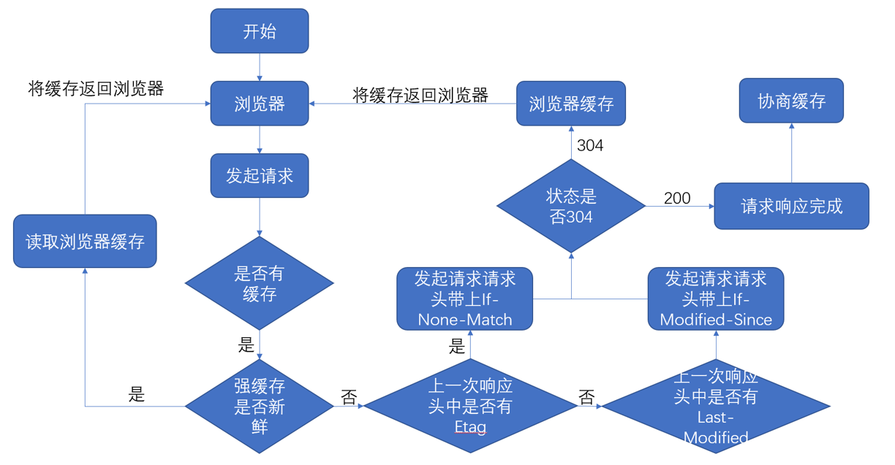
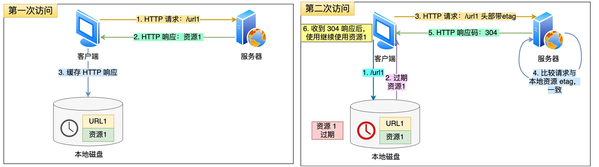
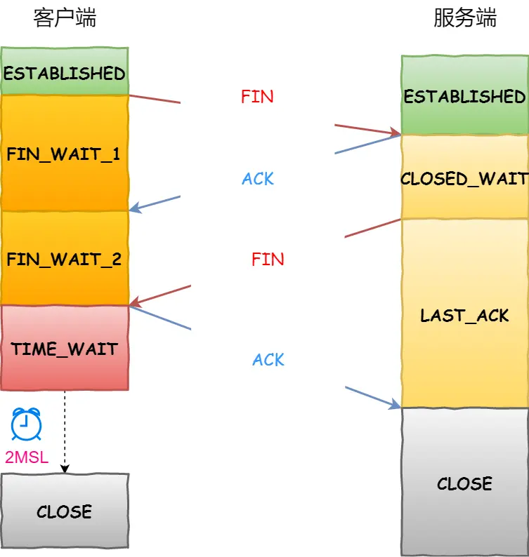
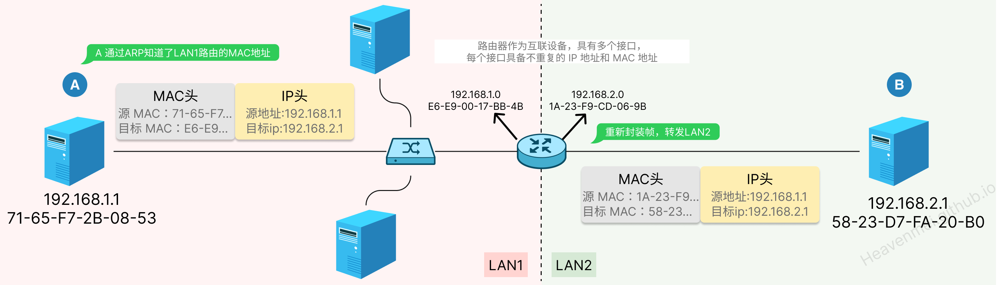
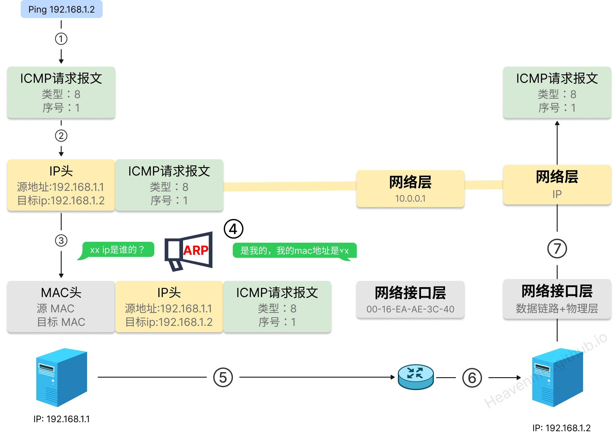

详细指南：[小林Coding 图解网络](https://xiaolincoding.com/network/)

浏览器存储机制： [cookie VS. sessionStorage VS. localStorage](/post/2024-12-09-Authentication#cookie-vs-sessionstorage-vs-localstorage)
## HTTP （应用层）

### 缓存
[ 一文彻底掌握HTTP缓存](https://juejin.cn/post/6915190788628905997 "https://juejin.cn/post/6915190788628905997")

浏览器进程会通过进程间通信把**URL请求发送至网络进程**，首先，网络进程会先查找本地缓存是否缓存了该资源，如果请求资源在缓存中并且新鲜，会按照以下优先级顺序查找缓存：
1. **内存缓存（Memory Cache）**： 如果内存缓存中有该资源，且其缓存策略允许，浏览器会直接使用内存中的数据。
2. **硬盘缓存（Disk Cache）**：如果内存缓存中没有找到资源，浏览器会尝试从硬盘缓存中获取资源。如果硬盘缓存中有该资源，且其缓存策略允许，浏览器会直接使用硬盘中的数据。

3. **网络请求**：
    - 如果资源未缓存或不新鲜，发起新请求，直接进入网络请求流程；
    - 如果已缓存且在有效期内，直接提供给客户端（==强缓存=内存缓存+硬盘缓存==），否则还是进入网络请求流程与服务器进行验证（协商缓存）

浏览器的缓存策略主要分为两大类：**强缓存**和**协商缓存**。





#### 内存缓存和硬盘缓存

| 比较    | 内存缓存               | 硬盘缓存                          |
| ----- | ------------------ | ----------------------------- |
| 读取速度  | 快速                 | 速度比内存缓存慢，<br/>需要重新解析文件，进行I/O操作 |
| 时效性   | 时效端  <br/>进程关闭，内存清空 | 时效长                           |
| 容量    | 小                  | 大                             |
| 匹配优先级 | 先                  | 后                             |
| 存储    | js和图片等文件           | css文件                         |
|       | 计算机的内存（RAM）        | 计算机的硬盘（HDD/SSD）               |

**为什么一般js和图片文件会放到内存缓存，css 放在硬盘缓存？**

- 样式表一般在磁盘中，不会缓存到内存中去，因为CSS样式加载一次即可渲染出网页。
- 但是，**脚本却可能随时会执行**，如果脚本在磁盘当中，在执行该脚本需要从磁盘中取到内存当中来。这样的IO开销是比较大的，有可能会导致浏览器失去响应。因此，脚本一般在内存中。


#### 强缓存

强缓存是利用http头中的Expires和Cache-Control两个字段来控制的。 ==`Cache-Control` > `Expires`==。
- HTTP1.0 提供`Expires`，值为一个绝对时间表示缓存新鲜日期
- HTTP1.1 增加了`Cache-Control:max-age=`，值为以秒为单位的最大新鲜时间


强缓存中，当请求再次发出时，浏览器会根据其中的Expires和Cache-Control判断目标资源是否“命中”强缓存，如果命中则直接从缓存中获取资源，不会再与服务端发生通信。命中强缓存的情况下，返回的HTTP状态码为200。

|   特性    |        `Expires`        |                `Cache-Control`                |
| :-----: | :---------------------: | :-------------------------------------------: |
| HTTP 版本 |      **HTTP/1.0**       |                 **HTTP/1.1**                  |
|  时间表示   |    **绝对时间（具体日期和时间）**    |       **相对时间**（如 `max-age` 表示缓存有效期的秒数）        |
| 客户端时间依赖 | 是，依赖客户端的系统时间，可能导致缓存判断错误 |                否，基于请求时间计算，更可靠                 |
|   灵活性   |     低，只能指定一个固定的过期时间     | 高，支持多种指令（如 `max-age`、`no-cache`、`no-store` 等） |
|  推荐使用   | 不推荐，仅用于兼容 HTTP/1.0 的客户端 |               推荐，是 HTTP/1.1 的标准               |
|   优先级   |          **低**          |                     **高**                     |

#### 协商缓存 304
**协商缓存就是与服务端协商之后，通过协商结果来判断是否使用本地缓存**。有可能本地缓存失效，有新的更新，浏览器需要向服务器去询问缓存的相关信息，进而判断是重新发起请求、下载完整的响应，还是从本地获取缓存的资源。

协商缓存的标识也是在响应报文的HTTP头中和请求结果一起返回给浏览器的，控制协商缓存的字段分别有：`Last-Modified`和`Etag`，其中==Etag > Last-Modified==。
 
**304 Not Modified**：如果服务端提示缓存资源未改动（Not Modified），资源会被重定向到浏览器缓存，这种情况下网络请求对应的状态码是 304。





### 请求/响应头

一个典型的 http request header请求信息包含三个部分：
- 请求方法URI协议/版本
- 请求头(Request Header)
- 请求正文

```text
GET/sample.jspHTTP/1.1
Accept:image/gif.image/jpeg,*/*
Accept-Language:zh-cn
Connection:Keep-Alive
Host:localhost
User-Agent:Mozila/4.0(compatible;MSIE5.01;Window NT5.0)
Accept-Encoding:gzip,deflate
// 空行 请求头结束
username=jinqiao&password=1234
```


HTTP响应与HTTP请求相似，HTTP响应也由3个部分构成，分别是：
- 状态行
- 响应头(Response Header)
- 响应正文

```text
HTTP/1.1 200 OK
Date: Sat, 31 Dec 2005 23:59:59 GMT
Content-Type: text/html;charset=ISO-8859-1
Content-Length: 122

＜html＞
＜head＞
＜title＞http＜/title＞
＜/head＞
＜body＞
＜!-- body goes here --＞
＜/body＞
＜/html＞
```


### 状态码

- 1xx：信息性状态码，表示服务器已接收了客户端请求，客户端可继续发送请求.
- 2xx：成功状态码
	- 200 OK 表示客户端请求成功
	- 204 No Content 成功，但不返回任何实体的主体部分
	- 206 Partial Content 成功执行了一个范围（Range）请求
- 3xx：重定向状态码，表示服务器要求客户端重定向。
	- **301 Moved Permanently 永久性重定向**，响应报文的Location首部应该有该资源的新URL
	- **302 Found 临时性重定向**，响应报文的Location首部给出的URL用来临时定位资源
	- 303 See Other 请求的资源存在着另一个URI，客户端应使用GET方法定向获取请求的资源
	- **304 Not Modified  协商缓存** 服务器内容没有更新，可以直接读取浏览器缓存
	- 307 Temporary Redirect 临时重定向。与302 Found含义一样。302禁止POST变换为GET，但实际使用时并不一定，307则更多浏览器可能会遵循这一标准，但也依赖于浏览器具体实现
- 4xx：客户端错误
	- 400 Bad Request 表示客户端请求有语法错误，不能被服务器所理解
	- **401 Unauthonzed** 表示请求未经授权，该状态代码必须与 WWW-Authenticate 报头域一起使用
	- **403 Forbidden** 表示服务器收到请求，但是拒绝提供服务，通常会在响应正文中给出不提供服务的原因
	- 404 Not Found 请求的资源不存在，例如，输入了错误的URL
- 5xx：服务端错误
	- 500 Internel Server Error 表示服务器发生不可预期的错误，导致无法完成客户端的请求
	- 503 Service Unavailable 表示服务器当前不能够处理客户端的请求，在一段时间之后，服务器可能会恢复正常

#### 301 & 302

服务器给浏览器响应一个301永久重定向响应，这样浏览器就会访问`http://www.google.com/`而非`http://google.com/`。


为什么服务器一定要重定向而不是直接发送用户想看的网页内容呢？其中一个原因跟**搜索引擎SEO**排名有关。如果一个页面有两个地址（如上），搜索引擎会认为它们是两个网站，结果造成每个搜索链接都减少从而降低排名。

而搜索引擎知道301永久重定向是什么意思，这样就会把访问带www的和不带www的地址归到同一个网站排名下。还有就是用不同的地址会造成缓存友好性变差，当一个页面有好几个名字时，它可能会在缓存里出现好几次。


301表示旧地址A的资源已经被永久地移除了（**这个资源不可访问了**），搜索引擎在抓取新内容的同时也将旧的网址交换为重定向之后的网址；

302表示旧地址A的资源还在（**仍然可以访问**），这个重定向只是临时地从旧地址A跳转到地址B，搜索引擎会抓取新的内容而保存旧的网址。SEO302好于301


### HTTP & HTTPS

HTTPS = HTTP + SSL/TLS （CA数字证书保证服务器身份可信）


### HTTP 1.1/ 2.0 / 3.0


## TCP （传输层）

#### TCP 标志符

- SYN（Synchronize）：包含随机序列号
- ACK（Acknowledgment）：序列号+1
- FIN（Finish）：包含随机序列号
- RST（Reset）
- PSH（Push）
### TCP三次握手

4. 第一次握手：客户端A将标志位SYN置为1,随机产生一个值为seq=J（J的取值范围为=1234567）的数据包到服务器，客户端A进入SYN_SENT状态，等待服务端B确认；
5. 第二次握手：服务端B收到数据包后由标志位SYN=1知道客户端A请求建立连接，服务端B将标志位SYN和ACK都置为1，ack=J+1，随机产生一个值seq=K，并将该数据包发送给客户端A以确认连接请求，服务端B进入SYN_RCVD状态。
6. 第三次握手：客户端A收到确认后，检查ack是否为J+1，ACK是否为1，如果正确则将标志位ACK置为1，**ack=K+1**，并将该数据包发送给服务端B，服务端B检查ack是否为K+1，ACK是否为1，如果正确则连接建立成功，客户端A和服务端B进入ESTABLISHED状态，完成三次握手，随后客户端A与服务端B之间可以开始传输数据了。


#### 为什需要三次握手？

==TCP 使用三次握手建立连接的最主要原因是防止「历史连接」初始化了连接。 即“为了防止已失效的连接请求报文段突然又传送到了服务端，因而产生错误”==

三次握手可以通过比较序列号是否+1判断是否建立链接，两次握手没有确认就建立连接，白白浪费资源


### TCP四次挥手

7. **第一次挥手**： Client发送一个FIN，用来关闭Client到Server的数据传送，Client进入FIN_WAIT_1状态。
8. **第二次挥手：** Server收到FIN后，发送一个ACK给Client，确认序号为收到序号+1（与- SYN相同，一个FIN占用一个序号），Server进入CLOSE_WAIT状态。
9. **第三次挥手：** Server发送一个FIN，用来关闭Server到Client的数据传送，Server进入LAST_ACK状态。
10. **第四次挥手：** Client收到FIN后，Client进入TIME_WAIT状态，接着发送一个ACK给Server，确认序号为收到序号+1，Server进入CLOSED状态，完成四次挥手。




#### 为什么建立连接是三次握手，而关闭连接却是四次挥手呢？

这是因为服务端在LISTEN状态下，收到建立连接请求的SYN报文后，把ACK和SYN放在一个报文里发送给客户端。（所以省了一次握手）


- 关闭连接时，客户端向服务端发送 FIN时，仅仅表示客户端**不再发送数据了但是还能接收数据**。
- 服务端收到客户端的 FIN 报文时，先回一个 ACK 应答报文，而**服务端可能还有数据需要处理和发送，等服务端不再发送数据时，才发送 FIN 报文**给客户端来表示同意现在关闭连接。

#### TCP 四次挥手，可以变成三次吗？

什么情况会出现三次挥手?

当服务端在 TCP 挥手过程中，==没有数据要发送== 并且==开启了 TCP 延迟确认机制==，那么第二和第三次挥手就会合并传输，这样就出现了三次挥手。 （ACK+FIN）


**TCP 延迟确认机制 （默认开启）**

当发送没有携带数据的 ACK，它的网络效率也是很低的，因为它也有 40 个字节的 IP 头 和 TCP 头，但却没有携带数据报文。为了解决 ACK 传输效率低问题，所以就衍生出了 TCP 延迟确认。TCP 延迟确认的策略:
- 当有响应数据要发送时，ACK会随着响应数据一起立刻发送给对方。
- 当没有响应数据要发送时，ACK将会延迟一段时间，以等待是否有响应数据可以一
- 发送如果在延迟等待发送 ACK 期间，对方的第二个数据报文又到达了，这时就会立刻发送 ACK


### TCP 和 UDP 的区别

|         | TCP                     | UDP                                                    |
| ------- | ----------------------- | ------------------------------------------------------ |
| 可靠性     | 高                       | 较低                                                     |
| 速度      | 较低                      | 高                                                      |
| 传输方法    | 数据包依序传送                 | 数据包以流的形式传送                                             |
| 错误检测和修正 | 是                       | 否                                                      |
| 拥塞控制    | 是                       | 否                                                      |
| 确认      | 是                       | 仅校验和                                                   |
| 连接      | 面向连接                    | 无连接                                                    |
| 服务对象    | 1 V 1                   | 1V1 or 1Vn or nVn                                      |
| 场景      | FTP 文件传输； HTTP / HTTPS； | 包总量较少的通信，如 `DNS` 、`SNMP` 等；<br/>视频、音频等多媒体通信；<br/>广播通信； |


## IP 网络层

==实现主机与主机之间的通信，也叫点对点（end to end）通信==

IP协议目前有 IPv4（32位）和 IPv6 （128位）


### ARP
ARP: IP —> Mac,  RARP: MAC->IP

ARP 是借助 ARP 请求与 ARP 响应两种类型的包确定 MAC 地址的。只能解决同一个局域网的地址映射

ARP 协议是一个**广播问询，单播响应**协议。
- 同一局域网下，目标主机会响应。
- 不同局域网下，通过路由器转发。

路由器作为互联设备，具有多个接口，每个接口具备不重复的 IP 地址和 MAC 地址。因此，在讨论 ARP 表时，路由器的多个接口都各自维护一个 ARP 表，而非一个路由器只维护一个 ARP 表




### Ping 流程


ICMP 主要的功能包括：确认 IP 包是否成功送达⽬标地址、报告发送过程中 IP 包被废弃的原因和改善⽹络设置等。ICMP ⼤致可以分为两⼤类：
- ⼀类是⽤于诊断的查询消息，也就是「查询报⽂类型」（ping）
- 另⼀类是通知出错原因的错误消息，也就是「差错报⽂类型」



## SSE

HTTP 协议无法做到**服务器主动推送信息**。要想做到除了 `WebSocket`，还有一种方法即Server-Sent Events。SSE就是服务器向客户端声明，接下来要发送的是流信息（streaming）。SSE是基于HTTP 协议的。
- WebSocket 是全双工通道，可以**双向通信**，WebSocket 是一个独立协议。
- SSE 是**单向通道**，只能服务器向浏览器发送，基于HTTP 协议的。


[Server-Sent Events 教程](https://www.ruanyifeng.com/blog/2017/05/server-sent_events.html)

SSE 协议就是正常的Http请求，==服务端更改==请起头相关配置即可
```js
Content-Type: text/event-stream,utf-8
Cache-Control: no-cache
Connection: keep-alive
```


文本流格式

```js
event: foo\n   // 自定义事件，名称 foo，触发客户端的foo监听事件
data: a foo event\n\n // 内容 
// 每个message之间用\n\n分隔
event: foo\n   // 自定义事件，名称 foo，触发客户端的foo监听事件
data: a foo event\n\n // 内容 

```


#### EventSource

EventSource是浏览器已经帮你封装好所需的meesage、open、error等事件，通过标准去使用即可，但**只能是get请求**。如果需要其他请求类型，比如POST，我们也可以自己封装fetch。

- onmessage：默认服务器发送的数据会在这里被监听到，也可以在服务器端通过定义“event: xxx”使用xxx监听
- open：在成功建立连接后触发，断连后自动重连后也会触发
- error：出现错误后触发
- close：用于关闭连接
```js
 function createSSE(url) {
	const eventSource = new EventSource(url);
	
	eventSource.onmessage = function (event) {
	  const data = JSON.parse(event?.data || "{}");
	  if (data.type === "close") {
		eventSource.close();
	  } else {
		const root = document.getElementById("root");
		root.innerText += data.msg;
	  }
	};

	return eventSource;
  }
  const sse = createSSE("http://localhost:3000/sse");
```


#### fetch实现

SSE本质是字节流的传输，**fetch中处理对应的字节流信息**，同样可以实现EventSource的功能。


```js
fetch('http://localhost:3000')
  .then(response => {
    if (!response.ok) {
      throw new Error('Network response was not ok');
    }
    return response.body;
  })
  .then(res => {
    const stream = res.getReader();

    const read = async () => {
	    const result = await stream?.read();
	    if (result?.done) {
	      doneCallback?.();
	    } else {
		  const chunk = new TextDecoder().decode(value);
		  processCallback(result?.value);
	      await read(); // 递归 读取下一个数据块
	    }
	};
	await read();
  })
  .catch(error => {
    console.error('Error:', error);
  });
```


#### 异常处理


## 跨域
### 同源策略

- 同源是指域名，协议，端口相同
- 浏览器限制，而不是服务端限制
- 发送的是XHR（XMLHttpRequest）请求，可以使用 a 标签（模拟xhr请求）和 img 标签（模拟json请求）做对比（控制台只报了一个跨域异常）


### JSONP

JSONP（JSON with Padding）是JSON的一种补充使用方式，

以 `<script>` 、`` 等标签进行跨域请求，该标签不受同源策略影响，因为请求的是JS脚本，用JS包了一层。 URL 中携带一个`callback`参数，参数值为一个客户端定义的回调函数名称
```html
<script src="http://www.baidu.com/json/?callback=handleResponse" type="text/javascript"/>
```

**缺点**：
- 支持 GET 方法请求，不管 AJAX 中实际的请求方法是不是 GET
- 服务端还需要修改代码
- 发送的不是 XHR 请求，无法使用 XHR 对象（但这也是为什么可以解决跨域问题的根本）
- 只能接收 JSON 格式的数据


### CORS

CORS 全称是"跨域资源共享"（Cross-origin resource sharing）

服务端响应头添加`Access-Control-Allow-Origin` 字段以后,数据包发送给浏览器后，浏览器就会根据这里配置的白名单 “放行” 允许白名单的服务器对应的网页来用 ajax 跨域访问 。

```text
Access-Control-Allow-Origin             允许请求的域
Access-Control-Allow-Methods            允许请求的方法
Access-Control-Allow-Headers            预检请求后，告知发送请求需要有的头部
Access-Control-Allow-Credentials        表示是否允许发送cookie，默认false；
Access-Control-Max-Age                  本次预检的有效期，单位：秒；

```


#### 预检请求

预检请求（Preflight Request）是浏览器在发送**非简单跨域请求**（CORS）前，通过**OPTIONS 方法**提前询问服务器，**用于确认目标服务器是否允许后续的实际请求**。

- 简单请求 （**不预检**）
	- 方法为 GET/POST； Content-Type 为简单类型； 无自定义头部
	- `POST /api/data` + `Content-Type: application/x-www-form-urlencoded`
- 非简单请求（**触发预检**）
	- 不满足上述任一条件
	- `PUT /api/data` + `Content-Type: application/json` + `X-Token: xxx`


**流程**：

浏览器发起`OPTIONS` 预检请求
```bash
OPTIONS /resource HTTP/1.1  
Origin: https://web.example.com  
Access-Control-Request-Method: PUT  
Access-Control-Request-Headers: X-Custom-Header
```

服务器响应
```bash
HTTP/1.1 200 OK  
Access-Control-Allow-Origin: https://web.example.com   # 允许的源 
Access-Control-Allow-Methods: GET, POST, PUT     # 允许的方法
Access-Control-Allow-Headers: X-Custom-Header, Content-Type # 允许的头部
Access-Control-Max-Age: 86400  # 预检结果的缓存时间
```

若服务器验证通过，浏览器发送实际请求；否则终止请求并报错（如`No 'Access-Control-Allow-Origin'`）


### Nginx 反向代理

跨域是浏览器限制的，服务器请求服务器不受浏览器同源策略限制。

```nginx
server {
    listen       81;
    server_name  www.domain1.com;

	location / {
		root html;
		index index.html
	}

    location /api {
        proxy_pass   http://127.0.0.1:8080;  #反向代理
    }
}
```


### Nodejs 中间件代理跨域

原理大致与nginx相同，都是通过启一个代理服务器，实现数据的转发。

`webpack.config.js`

```js
module.exports = {
    entry: {},
    module: {},
    ...
    devServer: {
        historyApiFallback: true,
        proxy: [{
            context: '/login',
            target: 'http://www.domain2.com:8080',  // 代理跨域目标接口
            changeOrigin: true,
            secure: false,  // 当代理某些https服务报错时用
            cookieDomainRewrite: 'www.domain1.com'  // 可以为false，表示不修改
        }],
        noInfo: true
    }
}
```


### WebSocket
WebSocket 是一种基于 TCP 协议的双向通信协议，它提供了一种浏览器和服务器之间实时、低延迟、高效率的全双工通信方式，同时允许跨域通讯。

在 JS 创建了 WebSocket 之后，会有一个 HTTP 请求发送到浏览器以发起连接。取得服务器响应后，建立的连接会使用 HTTP 升级从 HTTP 协议交换为 WebSocket 协议

```js
var socket = new WebSockt('ws://www.baidu.com');
//http->ws; https->wss
socket.send('hello WebSockt');
socket.onmessage = function(event){
    var data = event.data;
}

```

### PostMessage

H5新增特性，用于两个不同窗口之间的安全跨域通信。基本原理是在一个窗口中发送消息，在另一个窗口中监听消息并进行处理，从而完成跨域通信。


```js
// 发信息
var targetWindow = window.parent; // 获取目标窗口
var message = 'Hello, parent window!';
var targetOrigin = 'http://parent.window.com'; // 指定接收消息的窗口的源
targetWindow.postMessage(message, targetOrigin); // 发送消息postMessage(data,origin)


// 监听信息
window.addEventListener('message', function(event) {
  var message = event.data; // 获取消息内容
  var origin = event.origin; // 获取消息来源
  if (origin === 'http://child.window.com') { // 判断消息来源
    console.log('Received message from child window:', message);
  }
});
```


## 网站安全

前端常见安全问题的7个方面：
11. iframe
12. opener
13. CSRF（跨站请求伪造）
14. XSS（跨站脚本攻击）
15. ClickJacking（点击劫持）
16. HSTS（HTTP严格传输安全）
17. CND劫持


#### XSS（跨站脚本攻击）

通过将恶意得Script代码注入到Web页面中，当用户浏览该页之时，嵌入其中Web里面的Script代码会被执行，从而达到恶意攻击用户的目的

`<script>alert(document.cookie)</script>`

**XSS防御总结**：
18. 对数据进行Html Encode 处理
19. CSP HTTP Header，即 Content-Security-Policy、X-XSS-Protection
	  - 增加攻击难度，配置CSP(本质是建立白名单，由浏览器进行拦截)
	  - Content-Security-Policy: default-src 'self'-所有内容均来自站点的同一个源（不包括其子域名）
	  - Content-Security-Policy: default-src 'self' *.trusted.com-允许内容来自信任的域名及其子域名 (域名不必须与CSP设置所在的域名相同)
	  - Content-Security-Policy: default-src https://yideng.com-该服务器仅允许通过HTTPS方式并仅从yideng.com域名来访问文档
20. 表单数据规定值的类型：比如一些常见的数字、URL、电话号码、邮箱地址等等做校验判断
21. 开启浏览器XSS防御：**Http Only cookie**，禁止 JavaScript 读取某些敏感 Cookie，攻击者完成 XSS 注入后也无法窃取此 Cookie。
22. 过滤JavaScript 事件的标签。例如 "onclick=", "onfocus" 等等。

#### CSRF（跨站请求伪造）

攻击者**诱导受害者进入第三方网站**，在第三方网站中，向被攻击网站发送跨站请求。利用受害者在被攻击网站已经获取的注册凭证（cookie），绕过后台的用户验证，达到冒充用户对被攻击的网站执行某项操作的目的。
23. 用户登录a.com，并保留了登录凭证（Cookie）。
24. 攻击者引诱受害者访问了b.com。
25. b.com 向 a.com 发送了一个请求：a.com/act=xx。浏览器会默认携带a.com的Cookie。
26. a.com接收到请求后，对请求进行验证，并确认是用户的凭证，误以为是用户自己发送的请求。
27. a.com以用户的名义执行了act=xx。攻击完成，攻击者在受害者不知情的情况下，冒充受害者，让a.com执行了自己定义的操作。

**防御**
- 通过referer、token、Cookie 的 SameSite 属性来检测用户提交。
- 尽量不要在页面的链接中暴露用户隐私信息。
- 对于用户修改删除等操作最好都使用post操作 。
- 避免全站通用的cookie，严格设置cookie的域。


[前端安全系列之二：如何防止CSRF攻击](https://juejin.im/post/5bc009996fb9a05d0a055192)


## TCP/IP 网络模型有哪几层？


#### 应用层
应用层只需要专注于为用户提供应用功能，比如 HTTP、FTP、Telnet、DNS、SMTP等。


应用层是工作在**操作系统中的用户态，传输层及以下则工作在内核态**


#### 传输层
对接端口（端到端），**识别报文发送给那个应用（端口**），会对应用数据进行分块，
- TCP：可靠传数据，需要建立链接
- UDP：就是直接对接IP，无连接，

#### 网络层

每个服务器有个IP，负责**对接两个设备（点对点）**。

通过IP地址寻址，先匹配到相同的网络号（表示要找到同一个子网），才会去找对应的主机。

#### 网络接口层 = 数据链路层+物理层

在IP数据包上加MAC头打包成数据帧，MAC地址对应每一个网卡。

IP地址只告诉我们把包发到那个目标设备，但是在**以太网中，设备不是「直连」的，它是一种在「局域网」内，把附近的设备连接起来，** 使它们之间可以进行通讯的技术。因此，需要一段一段的通过`ARP协议（地址解析协议）`寻找下一个局域网的MAC地址。


> IP 地址属于逻辑地址，而 MAC 地址才是物理地址.
> 
>IP 是行程表，远程定位找到路由寻址，MAC是多车票
