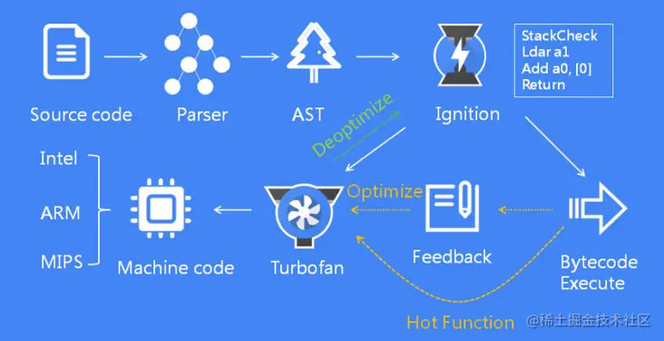
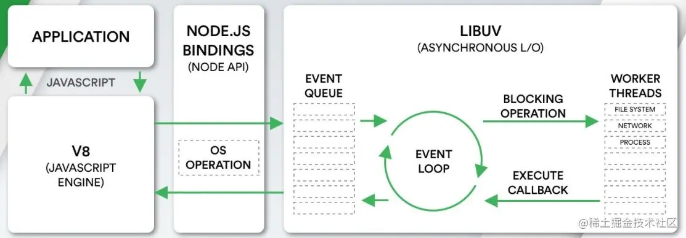

## AST 抽象语法树

抽象语法树 (Abstract Syntax Tree)，

用途：
- 编辑器的错误提示、代码格式化、代码高亮、代码自动补全；
- `elint`、`pretiier` 对代码错误或风格的检查；
- `webpack` 通过 `babel` 转译 `javascript` 语法；

js 执行的第一步是读取 js 文件中的字符流，然后通过词法分析生成 `token`，之后再通过语法分析( Parser )生成 AST，最后生成机器码执行。整个解析过程主要分为以下两个步骤：

- 分词：将整个代码字符串分割成最小语法单元数组
- 语法分析：在分词基础上建立分析语法单元之间的关系

- [AST explorer 在线生成词法 (✅ 推荐)](https://link.juejin.cn/?target=https%3A%2F%2Fastexplorer.net%2F "https://astexplorer.net/")
- [AST Parser produces syntax tree 词法scanner分析工具](https://link.juejin.cn/?target=https%3A%2F%2Fesprima.org%2Fdemo%2Fparse.html "https://esprima.org/demo/parse.html")

## V8 引擎
V8引擎是由 Google 开发的开源JavaScript 引擎，是 JavaScript **虚拟机**的一种

## Nodejs

## V8垃圾回收机制

[赠你 13 张图，助你 20 分钟打败了「V8 垃圾回收机制」！！！](https://security.feishu.cn/link/safety?target=http%3A%2F%2Fmp.weixin.qq.com%2Fs%3F__biz%3DMzg2NjY2NTcyNg%3D%3D%26mid%3D2247483683%26idx%3D1%26sn%3D973b0280aa9c6eb1678ea530ee4d2381%26chksm%3Dce4614b2f9319da402278b86e63f44e818e832ecbaafdada344ba979de3df4443a8ed53b0cb1%26scene%3D21%23wechat_redirect&scene=ccm&logParams=%7B%22location%22%3A%22ccm_drive%22%7D&lang=zh-CN)