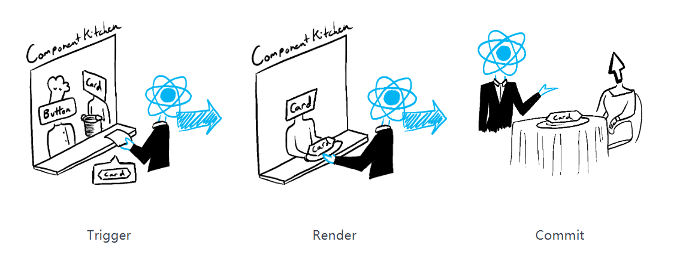

## React 渲染

更新流程：
- **trigger**：两种情况触发更新，==初次渲染、state改变==；标记需要更改的组件，解析JSX代码.
- **render**： ==计算渲染更改==, 生成新的 虚拟DOM，使用differ算法生成更新的DOM操作
- **commit**：把更改==提交到 DOM== 上， 生成真实DOM，然后交给浏览器渲染引擎



#### render

通过调用 `createRoot` 方法并传入目标 DOM 节点，然后用你的组件调用 `render` 函数完成的；这个过程是**递归**的。
- **初次渲染时,** React 会调用根组件，将VNode 转化为 `Fiber`树（构造新）
- **重渲染时,** React 会调用内部状态更新触发了渲染的函数组件。因为，`Fiber` 树已经存在于内存中了，所以 只需计算出 `Fiber` 树中的各个节点的差异
```js
const root = createRoot(document.getElementById('root'))
root.render(<Image />);
```


#### commit

根据 `render` 阶段的计算结果，执行更新操作，这个过程是**同步**执行的。
- **初次渲染**，React 会使用 `appendChild()` DOM API 将其创建的所有 DOM 节点放在屏幕上。
- **重渲染**，React 将应用最少的必要操作（在渲染时计算！），以使得 DOM 与最新的渲染输出相互匹配。

**React 仅在渲染之间存在差异时才会更改 DOM 节点。**

然后就会走 浏览器渲染 流程。[# 浏览器 之 渲染流程](https://heavenmei.github.io/post/browser-render)


### useEffect和useLayoutEffect触发时机


|      |  useEffect   |             useLayoutEffect              |
| ---- | :----------: | :--------------------------------------: |
| 触发时机 |  浏览器完成渲染之后   | 浏览器把内容真正渲染到界面之前<br/>等价于ComponentDidMount |
| 阻塞   | ❌（==异步执行==）  |           ✅（==同步执行==）会阻塞浏览器绘制            |
| 顺序   |      后       |                    先                     |
|      | 无法获取到最新dom元素 |                    可以                    |


## 虚拟 DOM

- 真实DOM：真实DOM 是浏览器中实际存在的文档对象模型，它由 HTML 元素组成，具有层次结构。操作真实DOM 需要直接访问浏览器 API，并且对真实DOM 进行操作会引起页面的重新渲染和重绘。
- 虚拟DOM：虚拟DOM 是一种用 **JavaScript 对象模拟真实DOM 的抽象**

#### 为什么要引入虚拟 DOM？

- 单页面应用中SPA，涉及大量 DOM 操作，引起多次计算，每次 DOM 操作都会重新构建渲染树、布局、渲染流程，造成巨大性能损耗

- DOM 元素很庞大，相较之下 JavaScript 对象处理起来更快、更简单。DOM 对象可以很容易用 Javascript 对象来表示。

- **状态树-->虚拟 DOM 树-->Diff 比较差异-->`ReactDOM.render()`-->DOM 树**

```js
<p id="text">hello<span class="textRed">world</span>
var element={
  tagName:'p',
  props:{
	  id:'text'
  },
  children:[
	  "hello",
	  {
		  tagName:'span',
		  props:{class:'textRed'},
		  childeren:["World"]
	  }
  ]
}
```

## Diff 算法

react之所以可以快速更新dom，在于react可以对比虚拟dom，找到差异后，只更新改变的部分。diff算法有很多，比如$DFS算法 O(n^3)  > cito.js  > kivi.jsO(n^2)$。通三个假设优化到$O(n)$。 [react diff 算法详解](https://blog.csdn.net/qdmoment/article/details/88798916)

2. 两个不同类型的元素会产生不同的树
3. 对于同一层级的一组子元素，他们可以通过唯一 ID 进行区分

#### tree diff
**同层比较，如果节点不存在直接删除创建**。这样只需要对 DOM 树进行一次遍历，就可以完成整个树的比较。复杂度变为$O(n)$。因此不建议进行 DOM 节点跨层级的操作


#### Component diff
同一类型的组件继续 tree diff 比较，不同类型的组件直接删除重建。


#### element diff
key 标识，判断是否是同一组件
- 插入：新的 component 类型不在老集合里
- 移动：在老集合有新 component 类型，且 element 是可更新的类型，可以复用以前的 DOM 节点。
- 删除：老 component 类型，在新集合里也有，但对应的 element 不同则不能直接复用和更新；或者老 component 不在新集合里的。

当没有 key 时 React 会逐个对节点进行更新，最后插入节点，效率低下。因此提出优化策略，添加唯一标识 key 进行区分，可以达到移动效果。

**Tips：不要使用 index 作为 key。和没有 key 一样的效果**

## Fiber 机制


**React15采用 Diff 算法**，对 virtural dom 的更新和渲染是同步的。如果组件层级比较深，相应的堆栈也会很深，==长时间占用浏览器主线程==，一些类似用户输入、鼠标滚动等操作得不到响应。

Fiber是**React16出来的新的调度算法**，用分片的方式，彻底解决主线程长时间占用问题的机制。就是把一个任务分成很多小片，当分配给这个小片的时间用尽的时候，就检查任务列表中有没有新的、优先级更高的任务，有就做这个新任务，没有就继续做原来的任务。这种方式被叫做**异步渲染(Async Rendering)**。

#### Fiber 树

每一个 Fiber 对于一个虚拟节点，在虚拟 DOM 树上构建了 Fiber 树，采用**链表**的机构存储。每个节点包括以下内容：

- stateNode：状态节点
- return：该节点的父级 Fiber 节点引用
- child：该节点的第一个子 Fiber 节点引用
- sibling：当前层级的下一个兄弟 Fiber 节点

#### 两个阶段

**Reconciliation** 阶段：找出要做的更新工作，就是一个计算阶段，计算结果可以被缓存，也就可以被打断；该阶段包含的生命周期函数有： `componentWillMount` `componentWillReceiveProps` `componentWillUpdate` `shouldComponentUpdate`该阶段任务随时可能被中断或重来，建议不要在这几个生命周期做副作用。（**异步**）

**Commmit** 阶段：需要提交所有更新并渲染，为了防止页面抖动，被设置为不能被打断。

PS：副作用：指函数除了返回一个值之外，造成的其他影响，如修改外部变量、抛出异常、I/O 操作等，这里的副作用指对 Fiber 节点进行插入、更新、删除。

####  Fiber 机制无法解决的问题

- 生命周期内大量的计算任务：由于 Reac Fiber 是以 Fiber 节点作为最小单元，无法在生命周期内对任务进行差分，这些计算任务在执行中途不能被中断
- 大量真实 DOM 操作：这部分任务在 Commit 阶段被同步执行，无法中断。过大的 DOM 操作压力只能由浏览器承担。

==总的来说，React Fiber 通过将任务切片，以及采用合适的任务调度机制，解决了高优先级任务被阻塞的问题，使应用展示更加流畅==。


### React 的任务调度机制

React 的任务调度系统主要负责 **协调组件的渲染和更新**，确保高优先级任务（如用户交互）能快速响应，低优先级任务（如数据预加载）不会阻塞主线程。其核心是 **并发模式（Concurrent Mode）** 和 **时间切片（Time Slicing）**。

#### 流程

1. **触发更新**
    - 用户交互（如点击）、数据变化、`setState` 等触发任务。

    - React 根据任务类型分配优先级（如 `onClick` 属于 `UserBlocking` 优先级）。

2. **任务调度**    
    - React 使用 **调度器（Scheduler）** 管理任务队列。

    - 高优先级任务插队，低优先级任务可能被中断或延迟。

3. **渲染阶段（Render Phase）**

    - **可中断**：React 构建虚拟 DOM（Fiber 树），可被高优先级任务打断。

    - **时间切片**：每 5ms 检查是否有更高优先级任务（默认时间片大小）。

4. **提交阶段（Commit Phase）**

    - **不可中断**：将最终变更同步到真实 DOM。
    - 执行副作用（如 `useEffect`）。


#### 优先级分类（React 18+）

React 内部定义了 5 种优先级（从高到低）：

1. **Immediate**（同步执行）：紧急任务，如 `input` 输入反馈。
2. **UserBlocking**（用户阻塞）：用户交互（如点击、拖拽）。
3. **Normal**（默认）：普通状态更新（如 setState）。
4. **Low**（低优先级）：延迟任务（如数据预加载）。        
5. **Idle**（空闲时执行）：最低优先级（如日志上报）。

## Redux

### Flux架构

核心思想：利用单项数据流和逻辑单向流来应对 MVC 架构中出现的状态混乱的问题

[阮一峰 Flux 教程](https://security.feishu.cn/link/safety?target=http%3A%2F%2Fwww.ruanyifeng.com%2Fblog%2F2016%2F01%2Fflux.html&scene=ccm&logParams=%7B%22location%22%3A%22ccm_drive%22%7D&lang=zh-CN)


流程：
1. View 发出用户的 Action（动作）即视图层发出的消息（比如mouseClick）
2. Dispatcher（派发器） 接收 Action，执行回调函数，要求 Store 进行相应的更新。
3. Store （数据层）用来存放应用的状态，一旦变动通知 View 更新
4. View 收到通知，更新页面


### Redux 介绍

三大特性：

- 单一数据源：全局变量 store
- state 只读：唯一改变 state 的方法就是触发 action，action 是一个用于描述已发生事件的普通对象。 
- 使用纯函数修改：一个函数只有依赖于它的参数，相同输入得到相同输出
 
 Redux 是一个单一的状态机，它==只关注state的变化==，至于视图层怎么变化，关键在于React-redux。
#### Action

**action 是 store 数据的唯一来源，本质上是 JS 的普通对象**。一般来说通过  `store.dispatch()`将 action 传到 store。我们约定，action 内必须使用一个字符串类型的  `type`  字段来表示将要执行的动作。

```js
function addTodo(text) {
  return {
    type: ADD_TODO,
    text,
  };
}
//Redux 中只需把 action 创建函数的结果传给 dispatch() 方法即可发起一次 dispatch 过程。
dispatch(addTodo(text));
//或者创建一个 被绑定的 action 创建函数 来自动 dispatch：
const boundAddTodo = (text) => dispatch(addTodo(text));
boundAddTodo(text);
```

#### Reducer

**Reducers**  指定了应用状态的变化如何响应aaction并发送到 store 的，==记住 actions 只是描述了有事情发生了这一事实，并没有描述应用如何更新 state==。

reducer 接收先前的 state 和 action，并返回新的 state

```js
function reducer(state = "SHOW_ALL", action) {
  switch (action.type) {
    case "SET_VISIBILITY_FILTER":
      return { ...state, age: state.age + 1 };
    default:
      return state;
  }
}
```

每个 reducer 只负责管理全局 state 中它负责的一部分。每个 reducer 的  `state`  参数都不同，分别对应它管理的那部分 state 数据。最后再由`combineReducers`合并

```js
const todoApp = combineReducers({
  reducer,
  todos,
});

export default todoApp;
```

#### Store

- `getState()`
- `dispatch(action)`
- `subscribe(listener)`:用于注册监听器，返回一个注销监听器的函数

```js
import { createStore } from "redux";
import todoApp from "./reducers";

let store = createStore(todoApp);
let store = createStore(todoApp, window.STATE_FROM_SERVER);
```

`createStore()` 的第二个参数是可选的, 用于设置 state 初始状态。这对开发同构应用时非常有用，服务器端 redux 应用的 state 结构可以与客户端保持一致, 那么客户端可以将从网络接收到的服务端 state 直接用于本地数据初始化。

#### Middleware

```js
//方法一
function logger(store) {
  // 这里的 next 必须指向前一个 middleware 返回的函数：
  let next = store.dispatch;

  return function dispatchAndLog(action) {
    console.log("dispatching", action);
    let result = next(action);
    console.log("next state", store.getState());
    return result;
  };
}

//方法二
function logger(store) {
  return function wrapDispatchToAddLogging(next) {
    return function dispatchAndLog(action) {
      console.log("dispatching", action);
      let result = next(action);
      console.log("next state", store.getState());
      return result;
    };
  };
}

//方法二——柯西里化
const logger = (store) => (next) => (action) => {
  console.log("dispatching", action);
  let result = next(action);
  console.log("next state", store.getState());
  return result;
};

//手写 合并
function applyMiddleware(store, middlewares) {
  middlewares = middlewares.slice();
  middlewares.reverse();

  let dispatch = store.dispatch;
  middlewares.forEach((middleware) => (dispatch = middleware(store)(dispatch)));

  return Object.assign({}, store, { dispatch });
}

// Redux 中的用法
//applyMiddleware与上述实现略有不同
import { createStore, combineReducers, applyMiddleware } from "redux";

let todoApp = combineReducers(reducers);
let store = createStore(
  todoApp,
  // applyMiddleware() 告诉 createStore() 如何处理中间件
  applyMiddleware(logger, crashReporter)
);
```

### React-redux

store 的三大功能：dispatch，subscribe，getState 都不需要手动来写了。react-redux 帮我们做了这些，同时它提供了两个好基友 Provider 和 connect。

**Redux 和 React 之间没有关系**。Redux 支持 React、Angular、Ember、jQuery 甚至纯 JavaScript。

```bash
npm install --save react-redux redux
# 调试器
npm install redux-devtools-extension
```

#### Provider
让所有容器组件都可以访问 store，而不必显示地传递它。只需要在渲染根组件时使用即可。

Provider的value一旦变化它内部的==所有==消费组件都会重新渲染，会产生性能问题。

```js
import React from "react";
import { render } from "react-dom";
import { Provider } from "react-redux";
import { createStore } from "redux";
import reducers from "./reducers";

let store = createStore(reducers);

render(
  <Provider store={store}>
    <App />
  </Provider>,
  document.getElementById("root")
);
```

#### connect
（高阶组件）==连接 React 组件和 Redux Store，当前组件可以通过 prop 获取应用中的 state 和 Action==。四个参数

- `mapStateToProps()`:指定如何把当前 Redux store state 映射到展示组件的 props 中
- `mapDispatchToProps()`：接收 dispatch()方法并返回期望注入到展示组件的 props 中的回调方法。


onnect模块就是一个高阶组件，主要作用是：

1. connect通过context获取Provider中的store，通过store.getState()获取state tree
2. connect模块返回函数wrapWithComponent
3. wrapWithConnect返回一个ReactComponent对象 Connect，Connect重新render外部传入的原组件WrappedComponent（UI组件），==并把connect中传入的mapStateToProps, mapDispatchToProps与组件上原有的props合并后==，通过属性的方式传给WrappedComponent。

  

```js
const getVisibleTodos = (todos, filter) => {
  switch (filter) {
    case "SHOW_COMPLETED":
      return todos.filter((t) => t.completed);
    case "SHOW_ACTIVE":
      return todos.filter((t) => !t.completed);
    case "SHOW_ALL":
    default:
      return todos;
  }
};

//state 是store的state
//返回一个新的对象，这个对象会作为props的一部分传入ui组件
const mapStateToProps = (state) => {
  return {
    todos: getVisibleTodos(state.todos, state.visibilityFilter),
  };
};
const mapDispatchToProps = (dispatch) => {
  return {
    onTodoClick: (id) => {
      dispatch(toggleTodo(id));
    },
  };
};

import { connect } from "react-redux";

const WrapChildClass = connect(mapStateToProps, mapDispatchToProps)(TodoList); //注入的组件

export default WrapChildClass;
```


### Zustand

> [Zustand](https://zustand.docs.pmnd.rs/getting-started/introduction) 是一个轻量级、简洁且强大的 React 状态管理库，与其他流行的状态管理库（如 Redux、MobX 等）相比，Zustand 的 API 更加简洁明了，学习成本较低，且无需引入繁琐的中间件和配置。
>
> 教程：[codthing.github.io/react/zusta…](https://link.juejin.cn/?target=https%3A%2F%2Fcodthing.github.io%2Freact%2Fzustand%2Fzustand-base%2F%23%25E4%25B8%2580%25E5%25AE%2589%25E8%25A3%2585 "https://codthing.github.io/react/zustand/zustand-base/#%E4%B8%80%E5%AE%89%E8%A3%85")


`src/store/useStore.ts`
```js
import { create } from "zustand";

type GlobalStore = {
  bears: number;

  increasePopulation: (payload: boolean) => void;
  removeAllBears: (payload: any) => void;
  updateBears: (payload: number) => void;
};

export const useStore = create<GlobalStore>((set) => ({
  bears: 0,
  increasePopulation: () => set((state) => ({ bears: state.bears + 1 })),
  removeAllBears: () => set({ bears: 0 }),
  updateBears: (newBears) => set({ bears: newBears }),
}));

```


`main.tsx`
```js
import { useStore } from "./store/useStore";

function App() {
  const bears = useStore((state) => state.bears);

  return (
    <>
      <h1>{bears} around here...</h1>
    </>
  );
}

```


#### Zustand 如何实现精准更新到订阅组件
```bash
store 更新 → 执行所有选择器 → 对比新旧选择结果 → 值变化则通知对应组件
            (state.count)    (oldCount vs newCount)
```

使用`useStore` 时Zustand 内部会：

1. **创建订阅**：组件首次渲染时，Zustand 会将该选择器函数注册到 store 的监听器列表中

2. **状态对比**：每次 store 更新时，Zustand 会：

    - 用选择器函数从新状态中提取值（如 `newValue = selector(newState)`）

    - 用相同的选择器从旧状态中提取值（如 `oldValue = selector(oldState)`）

    - **严格相等比较`===`** 这两个值
3. **决定更新**：只有当 `newValue !== oldValue` 时，才会触发组件重新渲染


#### 与Redux区别
Zustand 的优势在于：
-  **无依赖注入**：不需要 `Provider` 包裹，store 是**单例全局可访问**
- **更细粒度**：每个 `useStore` 调用独立订阅，不像 Redux 的 `connect` 会订阅整个 state
- **零样板代码**：不需要定义 action types/reducers


### 总结

#### 总体流程
- 首先调用`store.dispatch(action)`，同时用`getState`获取当前的状态树 state 并注册`subscribe(listener)`监听 state 变化
- 再调用`combineReducers`并将获取的 state 和 action 传入。combineReducers 会将传入的 state 和 action 传给所有 reducer，并根据 action 的 type 返回新的 state，触发 state 树的更新，我们调用 subscribe 监听到 state 发生变化后用 getState 获取新的 state 数据。

> 只使用 Redux 流程：component --> dispatch(action) --> reducer --> subscribe --> getState --> component

#### react-redux 流程
- Provider 组件接受 redux 的 store 作为 props，然后通过 context 往下传。
- connect 函数收到 Provider 传出的 store，然后接受三个参数 mapStateToProps，mapDispatchToProps 和组件，并将 state 和 actionCreator 以 props 传入组件，这时组件就可以调用 actionCreator 函数来触发 reducer 函数返回新的 state，connect 监听到 state 变化调用 setState 更新组件并将新的 state 传入组件。

> react-redux 流程：component --> actionCreator(data) --> reducer --> component


## React 合成事件

React 的 **合成事件（SyntheticEvent）** 是对浏览器原生事件的跨浏览器封装，提供了一致的事件接口，解决了浏览器兼容性问题。

|          | React 合成事件              | 原生 DOM 事件                    |
| -------- | ----------------------- | ---------------------------- |
| **事件绑定** | `onClick={handleClick}` | `element.addEventListener()` |
| **事件对象** | `SyntheticEvent`（跨浏览器）  | 原生 `Event`（浏览器差异）            |
| **事件委托** | 默认委托到 `root`            | 可手动委托                        |
| **阻止冒泡** | `e.stopPropagation()`   | `e.stopPropagation()`        |
| **阻止默认** | `e.preventDefault()`    | `e.preventDefault()`         |
| **事件池**  | 事件对象会被复用                | 无复用机制                        |


## React 17 /18 /19


## Reference

[React渲染（Render）全过程解析](https://juejin.cn/post/7259253595141095479)


