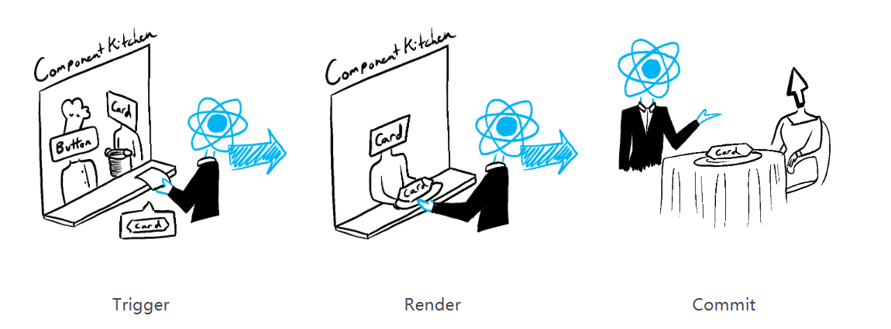
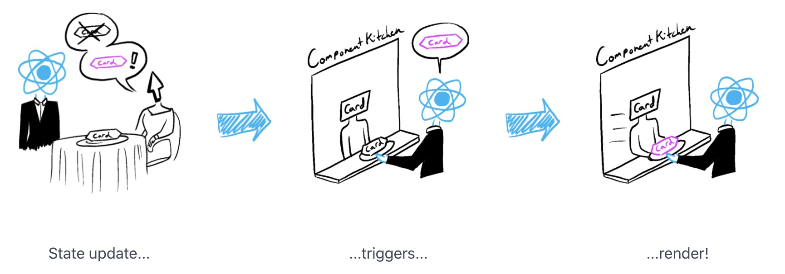
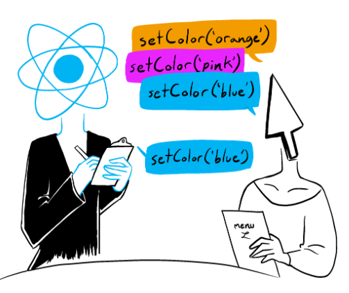
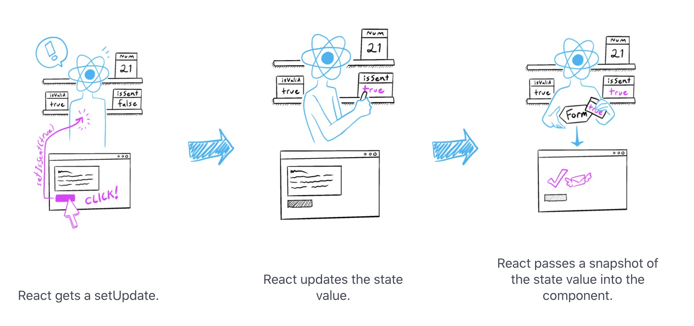
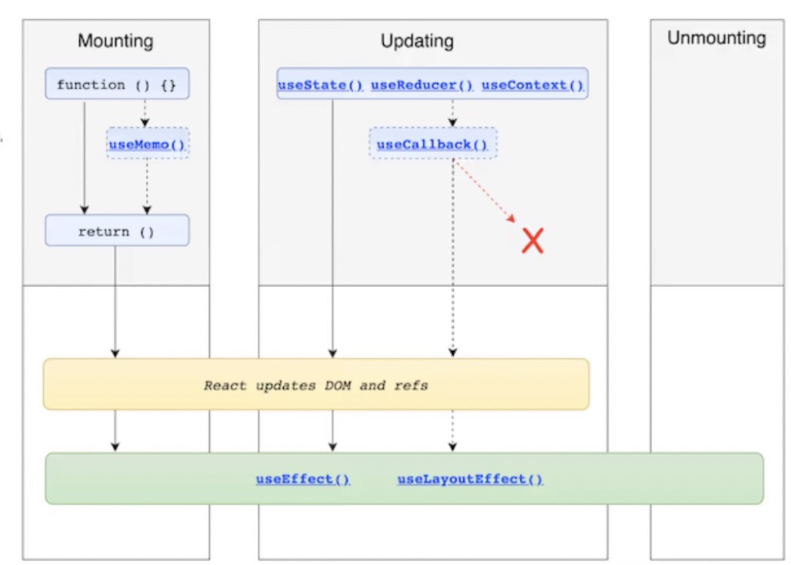
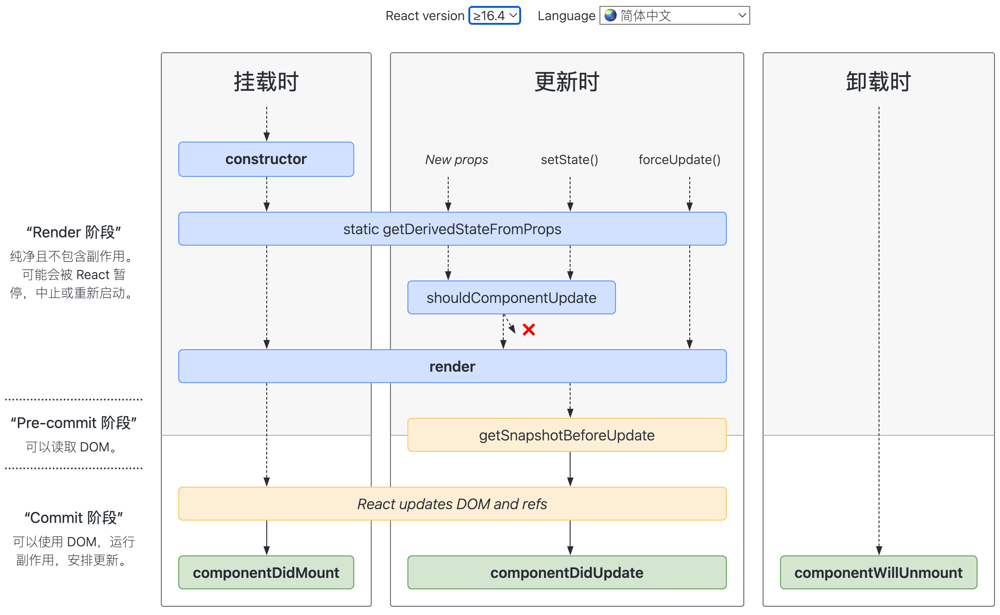

> [中文文档](https://security.feishu.cn/link/safety?target=https%3A%2F%2Freactjs.bootcss.com%2F%3Fspm%3Da2cl9.codeup_devops2020_goldlog_projectFiles.0.0.7cc140efSfVrlB&scene=ccm&logParams=%7B%22location%22%3A%22ccm_drive%22%7D&lang=zh-CN)
>
> [官方文档](https://security.feishu.cn/link/safety?target=https%3A%2F%2Fzh-hans.reactjs.org%2F&scene=ccm&logParams=%7B%22location%22%3A%22ccm_drive%22%7D&lang=zh-CN)

**安装**

```bash
npm install -g create-react-app
create-react-app 项目名称
```

## JSX

类 XML 语法：唯一特殊的是可以用大括号来加入 JavaScript 表达式。遇到 HTML 标签（以 < 开头），就用 HTML 规则解析；遇到代码块（以 `{` 开头），就用 JavaScript 规则解析。

- 两种元素：DOM 元素（小写字母开头）＆ React 组件（大写字母开头）

- 返回单个标签，标签必须闭合

- **驼峰命名**，`className`代替 css 中的 class，通过`对象`包裹为标签传递内联样式

- js 表达式用一对大括号`{ }`  包起来。

- 在 { } 中不能使用语句（if 语句、for 语句等等）, 但可以使用求值表达式与函数表达式

**事件绑定**

1. JSX 事件用驼峰命名，而 HTML 是小写命名
2. JSX 事件绑定传递一个回调函数，而 HTML 是传递一个字符串
3. JSX 不能通过 return/false 阻止默认事件，需要显示调用`preventDefault()`/`stopProgation()`

**条件渲染**

使用 || ，&&，if…else，switch 等条件判断返回 jsx，返回 null，undefined 时不渲染

**列表渲染**

map、filter 遍历数组，将数组的每一项变成一个 JSX 元素。 key 帮助 React 识别哪些元素改变了，比如被添加或删除。因你应当给数组中的每一个元素赋予一个唯一的标识。

## 组件

3 种定义方式

####  Function Component
一个 React 组件就是一个函数。无状态组件，通过hooks实现。 **目的是解决 React 的状态共享以及组件生命周期管理混乱的问题**

  ```jsx
  function Article(){
      return({
          <div></div>
      })
  }
  ```


#### Class
ES6 class:面向对象风格

  ```jsx
  class Article extends React.Component {
    constructor(props) {
      super(props);
    }
    render() {
      return <div></div>;
    }
  }
  ```

### Class 和 Function 组件区别

  1. 语法差异：constuctor，render 函数，bind 等等…
  2. hooks 的方法在 Class 组件中均有另一套对应的实现
  3. ==function 组件每次渲染都会有独立 props/state ,而 class 组件通过 this 捕获最新的 props/state==
  4. class 创建组件，函数成员不会自动绑定 this，需要手动绑定
  


#### 高阶组件（HOC）

 **React 中用于复用组件逻辑的高级技术**，本质是一个 **函数**，接收一个组件作为参数，并返回一个 **增强后的新组件**。
- **输入**：一个组件（如 `WrappedComponent`）。
- **输出**：一个新的增强组件（如 `EnhancedComponent`）。
- **作用**：在不修改原组件代码的情况下，扩展其功能（如添加 props、状态、生命周期等）


```jsx
const Container = (WrappedComponent) =>{
    class extends React.Component{
        render(){
            let newProps = {status:'ok'}
            return <WrappedComponent {...this.props} {...newProps} />
        }    
	}
}
```

**常见的HOC**：
- Redux 的 `connect`
- React Router 的 `withRouter`


**高阶函数**：接受值或返回值是函数的函数

```js
const add = (x) => (y) => x + y;
add(1)(2);

//Babel 转换后
var add = function add(x) {
  return function (y) {
    return x + y;
  };
};
```
## State

state 是组件内部的状态，React 把组件看成是一个状态机（State Machines）。

- **不要直接修改 state**。直接修改 state 可以给组件的 state 重新赋值，但无法触发组件的 re-render。
- state 的更新可能是**异步**的。
- 调用 setState，React 会把提供的对象合并到当前的 State 中（**浅拷贝**）

### 渲染和提交

React 主要分两个阶段执行工作：当触发更新的时候，React 先进行 **render** 阶段再进行 commit **阶段**。在不同的阶段会触发不同的 hooks（Function 组件），或者调用不同的生命周期函数（Class 组件）





**React 在一个渲染的事件处理程序中保持 state 固定（快照）**。状态变量的值在渲染中永远不会改变，即使它的事件处理程序的代码是**异步**的。可以理解成 Trigger 阶段确定了订单，就不会变更。

```jsx
const [number, setNumber] = useState(0);


//期望 +3 其实只+1
const handelClick = ()=>{
	//number是0,下一次渲染时更改number为1
	setNumber(number + 1);
	setNumber(number + 1);
	setNumber(number + 1);
}

const handelClick = ()=>{
	setNumber(number + 1);
	setTimeout(() => {
	  alert(number);//0
	}, 3000);
}


<button onClick={handelClick}>{number}</button>
```

**系列状态更新排队执行（异步）**。setState 实际上就是点单状态（连续点单）。React 会等到事件处理程序中的所有代码都运行后，才会 re-render 进入下一次渲染流程。下一步 Trigger 触发。


 **state 只在 re-render 后触发更新** 。 在 re-render 时先计算 state 的更新系列（Trigger），再渲染 DOM 节点（Render），最后呈现（Commit）



### 更新对象

State 保存的状态必须**只读**，配合 setState 改变，不能直接改变持有的对象

这里仿佛和 Vue2 里面响应式原理的缺陷差不多，==直接更改数组和对象是无法让数据变成响应式触发 re-render 的==。

 [Immer](https://security.feishu.cn/link/safety?target=https%3A%2F%2Freactjs.bootcss.com%2Flearn%2Fupdating-objects-in-state%23write-concise-update-logic-with-immer&scene=ccm&logParams=%7B%22location%22%3A%22ccm_drive%22%7D&lang=zh-CN)，它提供的`draft`是一种特殊类型的对象，称为 Proxy。和 Vue3 的响应式改进差不多。可以用来在 React 中避免嵌套太深导致的重复代码。

```jsx
const [person, setPerson] = useState({
  firstName: "Barbara",
  lastName: "Hepworth",
  email: "bhepworth@sculpture.com",
});
//不起作用
person.firstName = e.target.value;

//正确做法
setPerson({
  ...person, // Copy the old fields  浅拷贝
  firstName: e.target.value, // But override this one
});

//嵌套用法
setPerson({
  ...person,
  artwork: {
    ...person.artwork,
    image: e.target.value,
  },
});
```

### 更新数组

避免使用：`arr[0] = 'bird'`，`push()`and `pop()`。应该：将一个新数组传递给您的状态设置函数。

|      | 避免（改变数组）            | 喜欢（返回一个新数组）                                                                                                                                                                                                                               |
| ---- | --------------------------- | ---------------------------------------------------------------------------------------------------------------------------------------------------------------------------------------------------------------------------------------------------- |
| 添加 | `push`, `unshift`           | `concat`,`[...arr]`展开语法（[示例](https://security.feishu.cn/link/safety?target=https%3A%2F%2Freactjs.bootcss.com%2Flearn%2Fupdating-arrays-in-state%23adding-to-an-array&scene=ccm&logParams=%7B%22location%22%3A%22ccm_drive%22%7D&lang=zh-CN)） |
| 去除 | `pop`, `shift`, `splice`    | `filter`, `slice`([示例](https://security.feishu.cn/link/safety?target=https%3A%2F%2Freactjs.bootcss.com%2Flearn%2Fupdating-arrays-in-state%23removing-from-an-array&scene=ccm&logParams=%7B%22location%22%3A%22ccm_drive%22%7D&lang=zh-CN))         |
| 更换 | `splice`,`arr[i] = ...`赋值 | `map`（[示例](https://security.feishu.cn/link/safety?target=https%3A%2F%2Freactjs.bootcss.com%2Flearn%2Fupdating-arrays-in-state%23replacing-items-in-an-array&scene=ccm&logParams=%7B%22location%22%3A%22ccm_drive%22%7D&lang=zh-CN)）              |
| 排序 | `reverse`, `sort`           | 首先复制数组（[示例](https://security.feishu.cn/link/safety?target=https%3A%2F%2Freactjs.bootcss.com%2Flearn%2Fupdating-arrays-in-state%23making-other-changes-to-an-array&scene=ccm&logParams=%7B%22location%22%3A%22ccm_drive%22%7D&lang=zh-CN)）  |

```jsx
const [artists, setArtists] = useState([]);

setArtists([
  { id: nextId++, name: name },
  ...artists, // Put old items at the end
]);

setArtists(artists.filter((a) => a.id !== artist.id));
```


注意⚠️：即使复制一个数组，也不能直接改变其中(浅拷贝)，可以使用`map`没有突变的更新版本替换旧项目

```js
// ❌
const myNextList = [...myList];
const artwork = myNextList.find(a => a.id === artworkId);
artwork.seen = nextSeen; // Problem: mutates an existing item
setMyList(myNextList);

// ✅
setMyList(myList.map(artwork => {
  if (artwork.id === artworkId) {
    // Create a *new* object with changes
    return { ...artwork, seen: nextSeen };
  } else {
    // No changes
    return artwork;
  }
});
```

## Hook

React 16.8 的新增特性。Hooks 是一系列特殊的函数，可以让你“钩入” React 的特性，即在函数组件中也可以使用 state 及其他 React 特性，不必定义 Class 组件。例如 useState、useContext。

[React函数组件和类组件的差异](https://zhuanlan.zhihu.com/p/62767474)

#### Hook 统一认识

1. 每一次渲染都有它自己的 Props && state
2. 每一次渲染都有它自己的事件处理函数
3. 每一次渲染都有它自己的 Effects
4. 每一次渲染都由它自己的...所有
5. 同步，而非生命周期

#### Hook 规则

1. **只在最顶层和return 之前使用 Hook。不要在循环，条件或嵌套函数中调用 Hook**。 遵守这条规则，就能确保 hooks 在每一次渲染中都按照同样的顺序被调用，这让 React 能够在多次的 useState 和 useEffect 调用之间保持 hooks 状态的正确。
2. 只在 React 函数中调用 Hook。**不要在普通的 JavaScript 函数中调用 Hook** 你可以：
	-  ✅ 在 React 的函数组件中调用 Hook
	- ✅ 在自定义 Hook 中调用其他 Hook

### useReducer

减速器是处理状态的另一种方式（多useState）。将所有状态逻辑保存在一个易于访问的位置，移动到组件外部的单个函数中（store）。


**规定**
- 按照惯例，通常给 dispatch 一个 type 描述发生了什么的字符串，并在其他字段中传递任何附加信息。
- 约定在 reducer 中使用 switch 代替 if/else

**[useReducer+Context](https://security.feishu.cn/link/safety?target=https%3A%2F%2Freactjs.bootcss.com%2Flearn%2Fscaling-up-with-reducer-and-context&scene=ccm&logParams=%7B%22location%22%3A%22ccm_drive%22%7D&lang=zh-CN)**：实现深层传递，不局限于父子显示传递

```js
const initialState = { name: '张三', age: 20 };

function reducer(state, action) {
    switch(action.type) {
        case 'addAge':
            return { ...state, age: state.age + 1 };
        case ...
        default:
            return state;
    }
}

function App() {
    const [state, dispatch] = useReducer(reducer, initialState);
    // 惰性初始化
    // const [state, dispatch] = useReducer(reducer, initialState, (init) => init);
	function handleClick(taskId) {
		dispatch({ type: 'addAge' } );
	}
    return (
        <div>
            <p>{state.name}今年{state.age}</p>
            <button onClick={handleClick}>年龄加一</button>
        </div>
    );
}
```


### useEffect

用来进行副作用的处理，如获取服务端数据、原生事件绑定等。它跟 class 组件中的  `componentDidMount`、`componentDidUpdate`  和  `componentWillUnmount`  具有相同的用途，只不过被合并成了一个 API。

与  `componentDidMount`  或  `componentDidUpdate`  不同，使用  `useEffect`  调度的 effect 不会阻塞浏览器更新屏幕，这让你的应用看起来响应更快。大多数情况下，effect **不需要同步地执行**。

当你调用  `useEffect`  时，就是在==告诉 React 在完成对 DOM 的更改后运行你的“副作用”函数==。默认情况下，它在第一次渲染之后和每次更新之后都会执行.不用再去考虑“挂载”还是“更新”.


`return`清理副作用， React 会在组件卸载的时候执行清除操作。

```js
useEffect(() => {
  ChatAPI.subscribeToFriendStatus(props.friend.id, handleStatusChange);
  return () => {
    ChatAPI.unsubscribeFromFriendStatus(props.friend.id, handleStatusChange);
  };
});
```

利用第二个参数添加依赖，当依赖变化的时候 useEffect 入参函数才会执行，

```js
useEffect(() => {
  document.title = `You clicked ${count} times`;
}, [count]); // 仅在 count 更改时更新
```


#### ❌错误使用--async

每个async函数都会默认返回一个隐式的promise。但是，useEffect不应该返回任何内容。

```js
 useEffect(async () => {
     const result = await axios(
         'http://localhost/api/v1/search?query=redux',
     );
     setData(result.data);
 }, []);
```

控制台会报Warning

> Warning: useEffect function must return a cleanup function or nothing. Promises and useEffect(async () => …) are not supported, but you can call an async function inside an effect


✅正确使用

```js
useEffect(() => {
   const fetchData = async () => {
       const result = await axios(
           'http://localhost/api/v1/search?query=redux',
       );
       setData(result.data);
   };
   fetchData();
}, []);

```

### useRef

useRef **在组件的整个生命周期内，创建一个可变的、持久化的引用对象，这个对象的变更不会触发组件的重新渲染**，保存不用于渲染的值。你不会经常需要它们。

- useRef 的返回值可以被useEffect等依赖忽略掉，current上值的更改也不会通知组件render
- useRef 的值**存在于整个组件存在周期**
- useRef 的值存储于 ref.current 上

```js
// 存储常量
let ref = useRef(0);

function handleClick() {
	ref.current = ref.current + 1;
	alert("You clicked " + ref.current + " times!");
}

<button onClick={handleClick}>Click me! </button>;


// 引用元素
const domRef = useRef(null);
<div ref={domRef}></div>
```

#### refs 和 state 的区别

| redfs                         | state                            |
| ----------------------------- | -------------------------------- |
| 返回`{ current: initialValue }` | 返回[value, setValue]              |
| ==更改时不会触发重新渲染==。              | 更改时触发重新渲染。                       |
| 可变的—可在渲染过程之外修改 current        | “不可变”—您必须使用 setState 以排队重新渲染。    |
| 您不应该在渲染期间读取（或写入）current。      | 您可以随时读取状态。但是，每个渲染都有自己的状态快照，不会改变。 |
#### useRef 使用场景
`useRef` 的核心使用场景主要有四类：

1. **访问DOM元素**：这是最基础的用法，用于直接操作input、div等原生DOM节点，比如管理焦点、媒体控制或集成第三方库。
2. **存储可变值**：把它当作一个**不会触发重新渲染的‘实例变量’**，用来存储计时器ID、计数器或其他任何与UI无关的可变数据。
3. **保存上一次的状态**：利用其持久化特性，在`useEffect`中缓存上一次的props或state，用于实现比较逻辑。
4. **性能优化**：避免在每次渲染时重复创建昂贵的初始值。
#### forwardRef 转发 ref 到dom子组件

默认情况下 React 不允许组件访问其他组件的 DOM 节点，连自己的孩子都不行。用`forwardRef`让一个组件可以指定它把它的引用“转发”给它的一个孩子.

`useImperativeHandle` 暴露子组件方法

```js
import { forwardRef, useRef } from "react";

// 子组件
const MyInput = forwardRef((props, ref) => {
  const handleCancel = ()=>{}
  // 暴露子组件方法
  useImperativeHandle(ref, () => ({ handleCancel, }));

  return <input {...props} ref={ref} />;
});

// 父组件
export default function Form() {
  const inputRef = useRef(null);

  function handleClick() {
	// ref.current 将直接指向 DOM 元素实例。
    inputRef.current.handleCancel();
  }

  return (
    <>
      <MyInput ref={inputRef} />
      <button onClick={handleClick}>Focus the input</button>
    </>
  );
}
```


#### 手写 useRef

```js
function useRef(initialValue) {
  const [ref, unused] = useState({ current: initialValue });
  return ref;
}
```

### useCallback & useMemo &  react.memo
[memo、useMemo及useCallback解析](https://juejin.cn/post/6844904119358980110#heading-8)

- react.memo()是一个高阶组件，我们可以使用它来**包装不想重新渲染的组件**，==props没有变化，则不会重新渲染此组件==
- useMemo: 数据缓存，依赖变化时，工厂函数会重新执行
- useCallback:  函数缓存，依赖变化时，缓存的函数会更新

`useCallback(fn, deps)`  相当于  `useMemo(() => fn, deps)`。

```js
// 缓存数据
const memoizedValue = useMemo(() => computeExpensiveValue(a, b), [a, b]);

// 缓存函数
const memoizedCallback = useCallback(() => {
  doSomething(a, b);
}, [a, b]);
```


#### React.memo
`React.memo()` 可以支持指定一个`参数`，可以相当于 `shouldComponentUpdate` 的作用。**只有props变化才会触发组件更新**。
```js
function MyComponent(props) {
  /* render using props */
}
function areEqual(prevProps, nextProps) {
  /*
  return true if passing nextProps to render would return
  the same result as passing prevProps to render,
  otherwise return false
  */
}
export default React.memo(MyComponent, areEqual);
```


#### useCallback + memo = 最佳实践
`useCallback` 本身也有性能开销（内存和计算）。==只有当这个函数会被传递给子组件**并且**子组件使用了 `React.memo` 进行优化时，使用 `useCallback` 才有实际意义==。对于内部使用的函数或简单的回调，直接定义即可。


#### 为什么需要useCallback？
react中的性能优化。在hooks诞生之前，如果组件包含内部state，我们都是基于class的形式来创建组件。当时我们也知道，react中，性能的优化点在于：
- 调用`setState`，就会触发组件的重新渲染，无论前后的state是否不同
- ==父组件更新，子组件也会自动的更新==


基于上面的两点，我们通常的解决方案是：
- 使用`immutable`进行比较，在不相等的时候调用setState；
- 在`shouldComponentUpdate`中判断前后的props和state，如果没有变化，则返回false来阻止更新。

在hooks出来之后，我们能够使用function的形式来创建包含内部state的组件。但是，**使用function的形式，失去了上面的`shouldComponentUpdate`，我们无法通过判断前后状态来决定是否更新**。而且，在函数组件中，react不再区分mount和update两个状态，==这意味着函数组件的每一次调用都会执行其内部的所有逻辑，那么会带来较大的性能损耗==。因此useMemo 和useCallback就是解决性能问题的杀手锏。


### 自定义 Hooks

自定义 Hook 就是一个普通的 JavaScript 函数，内部可以调用 React 的内置 Hooks（如 `useState`、`useEffect` 等）。
-  **必须以 `use` 开头**（如 `useSomething`），这样 React 才能识别它是 Hook。
- **可以调用其他 Hooks**（如 `useState`、`useEffect`）。
- **不能在条件语句或循环中使用 Hooks**（必须顶层调用）。
- **可以返回任意值**（对象、数组、函数等）。


```js
import { useState } from 'react';

// 自定义 Hook：计数器
function useCounter(initialValue = 0, step = 1) {
  const [count, setCount] = useState(initialValue);

  const increment = () => setCount(count + step);
  const decrement = () => setCount(count - step);
  const reset = () => setCount(initialValue);

  return { count, increment, decrement, reset };
}

// 使用示例
function Counter() {
  const { count, increment, decrement, reset } = useCounter(0, 2);

  return (
    <div>
      <p>Count: {count}</p>
    </div>
  );
}
```

### flushSync 同步刷新

在 React 中，状态更新是异步的，导致一个问题，数据还未更新就继续执行。要解决这个问题，你可以强制 React 同步更新（“刷新”）DOM。

```js
import { flushSync } from "react-dom";

flushSync(() => {
  setTodos([...todos, newTodo]);
});
listRef.current.lastChild.scrollIntoView();
```

## 组件通信

### Props（父子）

父组件使用 props 向子组件传递，子组件到父组件利用回调函数 当内容嵌套在 JSX 标记中时，父组件将其名为`children`

父组件

```jsx
import React, { Component } from "react";
import Sub from "./SubComponent.js";
import "./App.css";

export default class App extends Component {
  callback(msg) {
    console.log(msg);
  }

  render() {
    return (
      <div>
        <Sub title="今年过节不收礼" callback={this.callback.bind(this)} />
      </div>
    );
  }
}
```

子组件

```jsx
import React from "react";
//可解构({title,callback})=>{}
const Sub = (props) => {
  const cb = (msg) => {
    return () => {
      props.callback(msg);
    };
  };
  return (
    <div>
      <h1>{props.title} </h1>
      <button onClick={cb("我们通信把")}>点击我</button>
    </div>
  );
};

export default Sub;
```

#### 为什么要用 bind()?

如果传递一个函数名给一个变量，之后通过函数名()的方式进行调用，在方法内部如果使用this 则 this 的指向会丢失。

如果使用 node 环境执行 js 文件则输出 node 相关信息，如嵌入到 html 中则 this
指向 window 对象

```js
const test = {
  name: "jack",
  getJack: function () {
    console.log(this.name);
  },
};
const func = test.getJack;
func();
//undefined
```

React 中的 bind 同上方原理一致,在 JSX 中传递的事件不是一个字符串，而是一个函数（如:onClick={this.handleClick}），此时 onClick 即是中间变量，所以处理函数中的 this 指向会丢失。

#### react 组件内点击事件的 this 的 3 种指向方法

5. 调用函数时**bind**(this)，，this 指向当前实例化对象。 `onClick={this.handleClick1.bind( this )}`
6. 声明函数时使用**箭头函数**，并在调用时直接使用 this.变量名即可。 `handleClick3 =()=>{console.log( this )}`
7. 通过在构造函数**constructor**内使用 bind 对函数内的 this 重定向  `this.handleClick2 = this.handleClick2.bind(this)`  不建议在 render()中 bind，因为它会在每次 render()方法执行时绑定类方法，肯定对于性能有影响。而直接在 constructor 中 bind, 则 bind 只会在组件实例化初时运行一次。

### useContext（祖先后代）

context 是组件树上某棵子树的全局变量。一颗树上的所有组件可以获取同样的状态。

- 当子组件获取上下文时，从自身最近的 Provider 中读取，没有则读取默认值
- Provider 接收一个 value 属性，并将该属性传递给自己的 Comsumer 组件
- 多个 Provider 可以嵌套使用，内层 value 覆盖外层

```jsx
import {useState, useContext, createContext} from 'react';
//1、创建并导出它
const  ThemeContext = createContext('');

function Child(props){
    //2、子组件声明使用
    const theme = useContext(ThemeContext);
    return (
        <span>{theme}</span>
    )
}

function ThemeShow(props){
    const { theme } = props;
    return (
        <div>
            theme is: <Child theme ={theme}/>
        </div>
    )}export defalut function App(){    const [theme,setTheme] = useState('blue');    return(        <div>
            <button onClick={()=> setTheme('red')}> changeTheme</button>
            //3、父组件包裹提供            <ThemeContext.Provider value={theme}>
                <ThemeShow />
            </ThemeContext.Provider>
        </div>

    )}
```

#### Class 形式

父组件 App.js

```jsx
import React, { Component } from "react";
import PropTypes from "prop-types";
import Sub from "./Sub";
import "./App.css";

export default class App extends Component {
  // 父组件声明自己支持 context
  static childContextTypes = {
    color: PropTypes.string, //数据类型
    callback: PropTypes.func,
  };

  // 父组件提供一个函数，用来返回相应的 context 对象
  getChildContext() {
    return {
      color: "red",
      callback: this.callback.bind(this),
    };
  }

  callback(msg) {
    console.log(msg);
  }

  render() {
    return (
      <div>
        <Sub></Sub>
      </div>
    );
  }
}
```

子组件 Sub.js

```jsx
import React from "react";
import SubSub from "./SubSub";

const Sub = (props) => {
  return (
    <div>
      <SubSub />
    </div>
  );
};

export default Sub;
```

子组件的子组件 SubSub.js

```jsx
import React, { Component } from "react";
import PropTypes from "prop-types";

export default class SubSub extends Component {
  // 子组件声明自己需要使用 context
  static contextTypes = {
    color: PropTypes.string,
    callback: PropTypes.func,
  };
  render() {
    const style = { color: this.context.color };
    const cb = (msg) => {
      return () => {
        this.context.callback(msg);
      };
    };
    return (
      <div style={style}>
        SUBSUB <button onClick={cb("我胡汉三又回来了！")}>点击我</button>
      </div>
    );
  }
}
```

### 事件总线 Bus（兄弟）

需要使用一个 events 包： `npm install events --save`  在 src 下新建一个 utils 文件夹，新增文件 events.js: 向外提供一个事件对象：

```js
import { EventEmitter } from "events";
export default new EventEmitter();
```

App.js：

```js
import React, { Component } from "react";

import Foo from "./Foo";
import Boo from "./Boo";

import "./App.css";

export default class App extends Component {
  render() {
    return (
      <div>
        <Foo />
        <Boo />
      </div>
    );
  }
}
```

Foo.js:

```js
import React, { Component } from "react";
import emitter from "./ev";

export default class Foo extends Component {
  constructor(props) {
    super(props);
    this.state = {
      msg: null,
    };
  }
  componentDidMount() {
    // 声明一个自定义事件
    // 在组件装载完成以后
    this.eventEmitter = emitter.addListener("callMe", (msg) => {
      this.setState({
        msg,
      });
    });
  }
  // 组件销毁前移除事件监听
  componentWillUnmount() {
    emitter.removeListener(this.eventEmitter);
  }
  render() {
    return <div>{this.state.msg} 我是非嵌套 1 号 </div>;
  }
}
```

Boo.js:

```js
import React, { Component } from "react";
import emitter from "./ev";

export default class Boo extends Component {
  render() {
    const cb = (msg) => {
      return () => {
        // 触发自定义事件
        emitter.emit("callMe", "Hello");
      };
    };
    return (
      <div>
        我是非嵌套 2 号 <button onClick={cb("blue")}>点击我</button>
      </div>
    );
  }
}
```

### Redux（全局）


## 生命周期

你可以使用此[生命周期图谱](https://projects.wojtekmaj.pl/react-lifecycle-methods-diagram/)作为速查表

**Function 组件**



**Class 组件**




