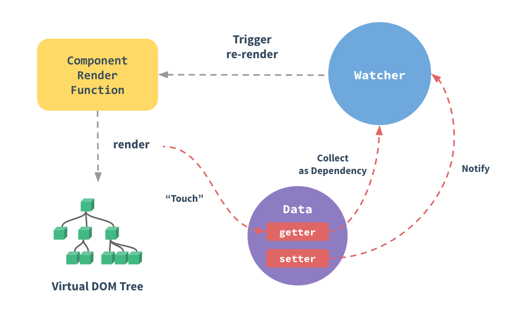

## Vue 简介
Vue是一套用于构建用户界面的**渐进式框架**， 发布于 2014 年 2 月。Vue.js 就是 MVVM 中的 View Model 层的实现者，他的核心就是实现了 DOM 监听与数据绑定。

在 MVVM 架构中， 是不允许数据和视图直接通信的， 只能通过 ViewModel 来通信， 而 View Model 就是定义了一个 Observer 观察者

- ViewModel 能够观察到数据的变化， 并对视图对应的内容进行更新
- ViewModel 能够监听到视图的变化， 并能够通知数据发生改变

#### MVVM

MVVM（**Model-View-ViewModel**）是一种软件设计模式，MVVM 的核心是`ViewModel`层，<u>负责转换 Model 中的数据对象来让数据变得更容易管理和使用</u>。
- **View**：视图层， 也就是用户界面。
- **Model**：指数据模型， 泛指后端进行的各种业务逻辑处理和数据操控， 主要围绕数据库系统展开。这里的难点主要在于需要和前端约定统一的接口规则
- **ViewModel**：是由前端开发人员组织生成和维护的视图数据层。在这一层， 前端开发者对从后端获取的 Model 数据进行转换处理， <u>做二次封装</u>， 以生成符合 View 层使用预期的视图数据模型。

#### Vue 生命周期


#### vue2和vue3的区别


## 响应式原理




## computed 计算属性

它就是一个能够将计算结果缓存起来的属性(将行为转化成了静态的属性)，仅此而已；可以想象为**缓存**

```vue
<div id="app">
  <p>currentTime1:{{currentTime1()}}</p>
  <p>currentTime2:{{currentTime2}}</p>
</div>
<script type="text/javascript">
  var vm = new Vue({
	el: "#app",
	data: {
	  message: "pan",
	},
	methods: {
	  //监听事件
	  currentTime1: function () {
		return Date.now();
	  },
	},
	computed: {
	//计算属性：methods，computed方法名不能重名，methods 优先级跟高
	  currentTime2: function () {
		this.message;
		return Date.now();
	  },
	},
  });
</script>
```

**说明：**

- methods：定义方法， 调用方法使用 currentTime1()， 需要带括号
- computed：定义计算属性， 调用属性使用 currentTime2， 不需要带括号：this.message 是为了能够让 currentTime2 观察到数据变化而变化
- 如何在方法中的值发生了变化，则缓存就会刷新!可以在控制台使用 vm.message=”qin jiang"， 测试。
- ==计算属性是基于它的依赖缓存的一个计算属性所以来的数据发生变化时，它才会重新取值，如果不改变计算属性也就不更新==。当遍历大数组和做大量计算时，应当使用计算属性。

每个计算属性都包含一个`getter`和`setter`，默认调用.

```vue
<div id="app">
    姓名：{{ fullName }}
</div>

<script>
var app = new Vue({
  el: "#app",
  data: {
    firstName: "Jack",
    lastName: "Green",
  },
  computed: {
    fullName: {
      //getter 读取
      get: function () {
        return this.firstName + " " + this.lastName;
      },
      //setter 写入时触发
      set: function (newValue) {
        var names = newValue.split(" ");
        this.firstName = names[0];
        this.lastName = names[names.length - 1];
      },
    },
  },
});
</script>
```

## 语法指令

### v-bind：

除了文本插值`{{}}`，我们还可以像这样来绑定元素 attribute：

```html
<div id="app-2">
  <span v-bind:title="message">
    鼠标悬停几秒钟查看此处动态绑定的提示信息！
  </span>
</div>
<script>
  var app2 = new Vue({
    el: "#app-2",
    data: {
      message: "页面加载于 " + new Date().toLocaleString(),
    },
  });
</script>
```

<u>动态更新 HTML 元素上的属性</u>——将这个元素节点的 title 属性和 Vue 实例的 message 值保持一致
如果你再次打开浏览器的 JavaScript 控制台，输入 `app2.message = '新消息'`，就会再一次看到这个绑定了 title 属性的 HTML 已经进行了更新。

### v-on @

<u>绑定监听事件监听器</u>
表达式可以是一个方法名，方法写在`methods`属性内且是函数形式

```html
<div id="app-6">
  <button v-on:click="sayHi">点我</button>
  <p>{{ message }}</p>
  <button v-on:click="reverseMessage">反转消息</button>
</div>
<script>
  var app6 = new Vue({
    el: "#app-6",
    data: {
      message: "Hello World",
    },
    methods: {
      sayHi: function () {
        //'this'在方法里面指向当前Vue实例
        alert(this.message);
      },
      reverseMessage: function () {
        this.message = this.message.split("").reverse().join("");
      },
    },
  });
</script>
```

- @click 调用方法名后可以不加`()`，若有参则默认传入原生事件对象 event
- Vue 提供了一个特殊变量`$event`，用于访问原生 DOM 事件

**修饰符**

在@绑定的事件后+`.`+一个后缀来使用修饰符，Vue 支持一下修饰符：

- `.stop` `.prevent` `.capture` `.self` `.once`

```html
<!--阻止单击事件冒泡-->
<a @click.stop="handle"></a>
<!--提交事件不再重载页面-->
<form @submit.prevent="handle"></form>
<!--修饰符可以串联-->
<a @click.stop.prevent="handel"></a>
<!--只有修饰符-->
<form @submit.prevent></form>
<!--添加事件侦听器时使用事件捕获模式-->
<div @click.capture="handle"></div>
<!--只有事件在该元素本身（而不是子元素）触发时触发回调-->
<div @click.self="handle"></div>
<!--只触发一次，组件同样适用-->
<div @click.once="handle"></div>
```

在表单元素上监听键盘事件，使用按键修饰符，以下是快捷键名称：

- `.enter` `.tab` `.delete` `.esc` `.space` `.up` `.down` `.left` `.right`

```js
//只有在keyCode为13时调用 vm.submit()
<input @keyup.13="submit">

//也可以自己配置具体按键,全局定义后，就可以使用 @keyup.f1
Vue.config.keycodes.f1 = 112
```

- `.ctrl` `.alt` `shift` `meta`(Mac 是 Commend 键，Window 是窗口键)【这些可以组合使用也可以和鼠标配合使用】

```html
<!-- Shift + S -->
<input @keyup.shift.83="handle" />
<!-- Ctrl + Click -->
<div @click.ctrl="doSomething">...</div>
```

### v-if， v-else，v-else-if

```html
<div id="app-4">
  <h1 v-if="type==='A'">A</h1>
  <h1 v-else-if="type==='B'">B</h1>
  <h1 v-else-if="type==='D'">D</h1>
  <h1 v-else>C</h1>
  <!-- ===三个等号在JS中表示绝对等于(就是数据与类型都要相等)-->
</div>
<script type="text/javascript">
  var app4 = new Vue({
    el: "#app-4",
    data: {
      type: "A",
    },
  });
</script>
```

出于效率考虑，Vue 会尽可能地**复用**已有的元素而非重新渲染。如果不希望这样，Vue.js 提供`key` 属性，它可以让你自己觉得是否复用元素，key 的值必须唯一，添加不同 key 值便不会复用。

### v-for

```html
<div id="app">
  <!--遍历数组：一个可选参数：索引-->
  <li v-for="(item,index) in items">{{item.message}}----{{index}}</li>
  <!--遍历对象: 两个可选参数（键名和索引）-->
  <li v-for="(value,key,index) in user">{{index}} - {{key}} ： {{value}}</li>
  <!--迭代整数-->
  <span v-for="n in 10">{{n}}</span>
</div>
<script>
  var app5 = new Vue({
    el: "#app",
    data: {
      items: [{ message: "huang" }, { message: "haiwen" }],
      user: {
        name: "Arson",
        sex: "man",
        age: 26,
      },
    },
  });
</script>
```

**数组更新**

`app.items.push({message:"wen"})`
改变原始数组的方法 push()、pop()、shift()、unshift()、splice()、sort()、reverse()

`app.items = app.items.filter(function (item){...}`
返回新数组的方法，需要替换原始数组 filter()、concat()、slice()

==注意==：以下变动 Vue 无法检测到，也不会触发视图更新：

- 通过索引直接设置项，`app.items[3]={...}`

- 修改数组长度，app.items.length=1

```js
//解决1a
Vue.set(app.items,3{
        message:'Huang'
        });
//如果是在webpack中使用组件化的方式，默认是没有导入Vue的，可以使用$set
this.$set(app.items,3{
        message:'Huang'
        });

//解决1b
app.items.splice(3,1,{
    message:'Huang'
})

//解决2
app.items.splice(1);
```

​

### v-model 双绑

它能轻松实现表单输入和应用状态之间的双向绑定.

注意：`v-model`会忽略所有表单元素的`value`、`checked`、`selected`特性的初始值而总是将`Vue`实例的数据作为数据来源。你应该通过`JavaScript`在组件的`data`选项中声明初始值!

```html
<div id="app-7">
  文本框：
  <input v-model="message" />
  <label>{{ message }}</label>
  <br />
  单复选框：
  <!--不需要v-model，v-bind绑定一个布尔值即可，为真时选中-->
  <input type="checkbox" id="checkbox" v-model="checked" />
  <label for="checkbox">{{checked}}</label>
  <br />
  单选框按钮
  <!--组合互斥用v-model配合value使用-->
  <input type="radio" id="one" value="One" v-model="picked" />
  <label for="one">One</label>
  <input type="radio" id="two" value="Two" v-model="picked" />
  <label for="two">Two</label>
  <span>选中的值：{{picked}}</span>
  <br />

  多复选框：
  <!--同上-->
  <input type="checkbox" id="jack" value="Jack" v-model="checkedNames" />
  <label for="jack">Jack</label>
  <input type="checkbox" id="join" value="Join" v-model="checkedNames" />
  <label for="join">Jack</label>
  <input type="checkbox" id="mike" value="Mike" v-model="checkedNames" />
  <label for="mike">Mike</label>
  <span>选中的值：{{checkedNames}}</span>
  <br />

  下拉框:
  <!--otion中有value则优先匹配，没有匹配text-->
  <!--select中 添加属性 multiple则多选，此时v-model绑定数组-->
  <select v-model="pan">
    <option value="" disabled>---请选择---</option>
    <option>A</option>
    <option>B</option>
    <option>C</option>
    <option>D</option>
  </select>
  <span>value:{{pan}}</span>
</div>
<script>
  var app7 = new Vue({
    el: "#app-7",
    data: {
      message: "Hello World",
      checked: false,
      checkedNames: [],
      picked: "",
      pan: "",
    },
  });
</script>
```

注意：`v-model`表达式的初始值未能匹配任何选项，元系将被渲染为“未选中”状态。 在 iOS 中， 这会使用户无法选择第一个选项，因为这样的情况下，iOS 不会触发`change`事件。因此，更推荐像上面这样提供一个值为空的禁用选项。

**绑定值**

上面 v-model 绑定的是静态字符串或布尔值，而业务中需要绑定动态数据，可用 v-bind 实现

```vue
<div id="app">
    单选按钮
    <input type="radio" v-model="picked" :value="value"/>
    <!--按下后app.picked === app.value = 123-->
    复选框
    <input type="checkbox" v-model="toggle" :true-value="value1" :false-value="value2"/>
    <!--勾选时，app.toggle === app.value1；未勾选时，app.toggle === app.value2 -->
    下拉框
    <select v-model="selected">
        <option :value="{number : 123}">123</option>
    </select>
    <!--选中时，app.selected.number=123-->
    
</div>
<script>
var app7 = new Vue({
  el: "#app-7",
  data: {
    picked: false,
    value: 123,
    toggle: false,
    value1: "a",
    value2: "b",
    selected: "",
  },
});
</script>
```

**修饰符**

与事件 v-onleisi ,v-model 也有修饰符，用于控制数据同步的时机。

- `.lazy`:v-model 默认是在 input 事件中同步输入框的数据，使用该修饰符会转变为在 change 事件中同步，不是实时改变，二十在失焦或按下回车时才更新。

- `.number`:将输入转换为 number 类型，否则虽然输入数字仍未 string

### 其他指令

| 指令    | 作用                                                                                                                                                                                         |
| ------- | -------------------------------------------------------------------------------------------------------------------------------------------------------------------------------------------- |
| v-html  | 输出 HTML 标签，而不是纯文本                                                                                                                                                                 |
| v-pre   | 跳过这个元素和子元素的编译过程                                                                                                                                                               |
| v-cloak | 它会在 Vue 实例结束编译时从绑定的 HTML 元素上移除，经常和 display:none 配合使用。<br />一般工程化项目不在需要。                                                                              |
| v-once  | 定义它的元素或组件只渲染一次，首次渲染后，不在随数据的变化重新渲染，将被视为静态内容。少用                                                                                                   |
| v-show  | 与 v-if 用法基本一致，但其时改变元素 CSS 属性 display。表达式为 false 等价于 display:none。<br /><u>区别</u>：v-show 无论真假均会被编译；v-if 为假时不会渲染只有当条件第一次变真时才开始编译 |

## 组件

### Vue.component()

注意：在实际开发中，我们并不会用以下方式开发组件，而是采用`vue-cli`创建，`vue`模板文件的方式开发，以下方法只是为了让大家理解什么是组件。

使用`Vue.component()`方法注册组件，格式如下：

```html
<div id="app">
  <pan></pan>
</div>
<script>
  //先注册组件
  Vue.component("pan", {
    template: "<li>Hello</li>",
    data: function () {
      return {
        message: "sd",
      };
    },
    //组件中的data必须时函数，然后将数据return出去
  });
  //再实例化Vue
  var vm = new Vue({
    el: "#app",
  });
</script>
```

**注意**：Vue 组件的模板在某些情况下会受到 HTML 的限制，例如`<table>`内规定只允许表格元素，所以使用组件会无效。因此需要用 is 属性挂在组件。

```vue
<div id="app">
    <table>
        <tbody is="pan"></tbody>
    </table>
</div>
<script>
//先注册组件
Vue.component("pan", {
  template: "<li>Hello</li>",
});
//再实例化Vue
var vm = new Vue({
  el: "#app",
});
</script>
```

### props 传递参数

父组件-> 子组件。注意：默认规则下 props 属性里的值**不能为大写**；

```html
<div id="app">
  <pan v-for="item in items" v-bind:panh="item"></pan>
</div>
<script>
  Vue.component("pan", {
    props: ["panh"],
    template: "<li>{{panh}}</li>",
  });
  var vm = new Vue({
    el: "#app",
    data: {
      items: ["java", "Linux", "前端"],
    },
  });
</script>
```

**数据验证**

```vue
<script>
Vue.component("pan", {
  props: {
    //必须是数字
    propA: Number,
    //必须是字符串或数组
    propB: [String, Number],
    //布尔值，默认true
    propC: {
      type: Boolean,
      default: true,
    },
    //数字，而且必传
    propD: {
      type: Number,
      required: true,
    },
    //如果是数组或对象，默认值必须是一个函数来返回
    propE: {
      type: Array,
      default: function () {
        return [];
      },
    },
    //自定义一个验证函数
    propF: {
      validator: function (value) {},
    },
  },
});
</script>
```

### 自定义事件

子组件->父组件。`this.$emit(‘自定义事件名’， 参数)`

说明：组件无法直接使用 vue 实例中的方法，只能调用自身的方法。

**使用 v-model**

组件$emit()的事件名是特殊的 input，没有使用@input=“handle”,而是直接用了 v-model 绑定了一个数据，这也是语法糖。
此外，v-model 还可以实现双向绑定。

### 插槽

使用`<slot>`元素作为承载分发内容的出口，可以应用在组合组件的场景中

```vue
<div id="vue">
  <todo>
        <todo-title slot="todo-title" :title="title"></todo-title>
        <!--v-bind:item 简写-->
        <todo-items slot="todo-items" v-for="item in todoItems" :item="item"></todo-items>
    </todo>
</div>
<script type="text/javascript">
Vue.component("todo", {
  template:
    '<div>\
                    <slot name="todo-title"></slot>\
                    <ul>\
                        <slot name="todo-items"></slot>\
                    </ul>\
                </div>',
});
Vue.component("todo-title", {
  props: ["title"],
  template: "<div>{{title}}</div>",
});
Vue.component("todo-items", {
  props: ["item"],
  template: "<li>{{item}}</li>",
});

var vm = new Vue({
  el: "#vue",
  data: {
    title: "秦老师系列课程",
    todoItems: ["狂神说Java", "test2", "test3"],
  },
});
</script>
```


## vue-cli

vue-cli 官方提供的一个**脚手架，用于快速生成一个 vue 的项目模板**；

项目的功能：统一的目录结构、本地调试、热部署、单元测试、集成打包上线

```bash
npm install -g vue-cli  # 2.X
npm install -g @vue/cli  # 3.X
```

## vue-router 路由


```bash
npm install vue-router --save-dev
```


路由模式有两种

- hash：路径带 # 符号，如 http://localhost/#/login
- history：路径不带 # 符号，如 http://localhost/login


```js
import Vue from "vue";
import Router from "vue-router";
//导入组件
import Content from "../components/Content";
import Main from "../components/Main";

//安装路由
Vue.use(Router);

//配置路由
export default new Router({
 mode: "history",
 routes: [
   {
	 //路由路径
	 path: "/content",
	 //路由名称
	 name: "content",
	 //跳转到组件
	 component: Content,
   },
   {
	 //路由路径
	 path: "/main",
	 //路由名称
	 name: "main",
	 //跳转到组件
	 component: Main,
   },
 ],
});
```

在`main.js`中配置路由

```js
import Vue from "vue";
import App from "./App";

//导入上面创建的路由配置目录
import router from "./router"; //自动扫描里面的路由配置

//来关闭生产模式下给出的提示
Vue.config.productionTip = false;

new Vue({
 el: "#app",
 //配置路由
 router,
 components: { App },
 template: "<App/>",
});
```

在`App.vue`中使用路由

```vue
<template>
 <div id="app">
   <!--
	 router-link：默认会被渲染成一个<a>标签，to属性为指定链接
	 router-view：用于渲染路由匹配到的组件
   -->
   <router-link to="/main">首页</router-link>
   <router-link to="/content">内容</router-link>
   <router-view></router-view>
 </div>
</template>

<script>
export default {
 name: "App",
};
</script>
<style></style>
```

### 参数传递

#### path/:id

1、 修改路由配置, 主要是 router 下的 index.js 中的 path 属性中增加了`:id`这样的占位符

```js
{
	path: '/user/profile/:id',
	name:'UserProfile',
	component: UserProfile
}
```

2、传递参数
  此时我们在 Main.vue 中的 route-link 位置处 <u>to 改为了 :to</u>，是为了将这一属性当成对象使用，注意 router-link 中的 name 属性名称 一定要和 路由中的 name 属性名称 匹配，因为这样 Vue 才能找到对应的路由路径；

```vue
<!--name是组件的名字 params是传的参数 如果要传参数的话就需要用v:bind:来绑定-->
<router-link
  :to="{ name: 'UserProfile', params: { id: 1 } }"
>个人信息</router-link>
```

3、在要展示的组件 Profile.vue 中接收参数 使用 `{{$route.params.id}}`来接收。Profile.vue 部分代码

```vue
<template>
  <!--  所有的元素必须在根节点下-->
  <div>
    <h1>个人信息</h1>
    {{ $route.params.id }}
  </div>
</template>
```


#### props
1、修改路由配置 , 主要在 router 下的 index.js 中的路由属性中增加了 props: true 属性

```js
{
	path: '/user/profile/:id',
	name:'UserProfile',
	component: UserProfile,
	props: true
}
```

2、传递参数和之前一样 在 Main.vue 中修改 route-link 地址

```vue
<!--name是组件的名字 params是传的参数 如果要传参数的话就需要用v:bind:来绑定-->
<router-link
  :to="{ name: 'UserProfile', params: { id: 1 } }"
>个人信息</router-link>
```

3、在 Profile.vue 接收参数为目标组件增加 props 属性。Profile.vue

```vue
<template>
  <div>
    个人信息
    {{ id }}
  </div>
</template>
<script>
export default {
  props: ["id"],
  name: "UserProfile",
};
</script>
<style scoped></style>
```


### 路由钩子与异步请求

beforeRouteEnter：在进入路由前执行
beforeRouteLeave：在离开路由前执行

在 Profile.vue 中写

```js
export default {
  name: "UserProfile",
  beforeRouteEnter: (to, from, next) => {
    console.log("准备进入个人信息页");
    next();
  },
  beforeRouteLeave: (to, from, next) => {
    console.log("准备离开个人信息页");
    next();
  },
};
```

参数说明：
- to：路由将要跳转的路径信息
- from：路径跳转前的路径信息
- next：路由的控制参数
- next() 跳入下一个页面
- next(’/path’) 改变路由的跳转方向，使其跳到另一个路由
- next(false) 返回原来的页面
- next((vm)=>{}) 仅在 beforeRouteEnter 中可用，vm 是组件实例