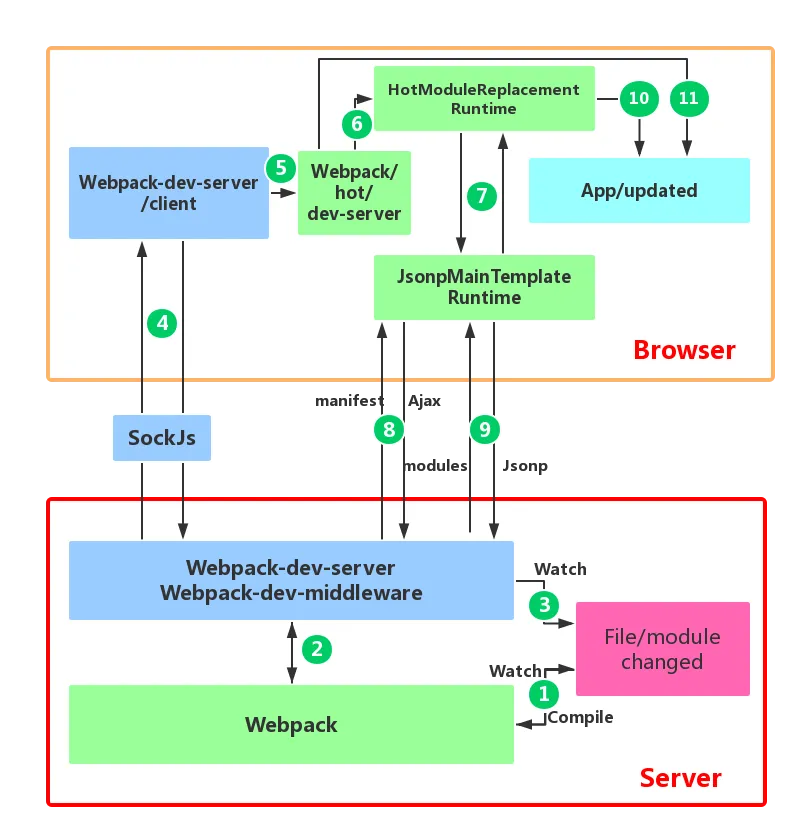

## HMR
`HMR`全称 `Hot Module Replacement`，可以理解为模块热替换，指在应用程序运行过程中，替换、添加、删除模块，而无需重新刷新整个应用


```js
const webpack = require('webpack')
module.exports = {
  // ...
  devServer: {
    // 开启 HMR 特性
    hot: true
    // hotOnly: true
  }
}
```

### 核心流程总结

- 通过`webpack-dev-server`（WDS）创建两个服务器：提供静态资源的服务（express）和Socket
	- express server 负责直接提供静态资源的服务（打包后的资源直接被浏览器请求和解析），同时以 Runtime 方式注入 HMR 客户端代码
	- socket server 是一个 websocket 的长连接，双方可以通信。浏览器加载页面后，与 WDS **建立 WebSocket 连接**
- 当 socket server 监听到对应的模块发生变化时，会生成两个文件`manifest.json`和`(update) chunk.js`，
- 通过长连接，socket server 会发送 hash 事件。
- 浏览器接收到 `hash` 事件后，请求 `manifest` 资源文件，浏览器拿到两个新的文件后，通过HMR runtime机制，加载这两个文件，并且针对修改的模块进行更新

### 详细流程

1. 监听文件变化，重新编译打包
2. WDM监控代码变化，并且告诉 webpack，将代码打包到内存中
3. `watchContentBase` 为 true 时，WDS 会监听配置文件夹中静态文件的变化，通知浏览器端进行 live reload。
4. 建立websorket长连接，将 webpack 编译打包的各个阶段的状态信息告知浏览器端，传递新模块的 hash
5. webpack/hot/dev-server 的根据WDS/client 传给它的信息和 dev-server 的配置决定是reload还是HMR
6. HotModuleReplacement.runtime 是客户端 HMR 的中枢，它接收新模块的 hash 值
7. JsonpMainTemplate.runtime
8. JsonpMainTemplate.runtime 向 server 端发送 Ajax 请求，服务端返回一个 json，该 json 包含了所有要更新的模块的 hash 值，
9. 再次通过 jsonp 请求，获取到最新的模块代码
10. HotModulePlugin 将会对新旧模块进行对比，决定是否更新模块，在决定更新模块后，检查模块之间的依赖关系，更新模块的同时更新模块间的依赖引用。
11. 当 HMR 失败后，回退到 live reload 操作，浏览器刷新
## Fast Refresh


## Reference

[Webpack 原理系列十：HMR 原理全解析](https://zhuanlan.zhihu.com/p/410510492)

[Webpack HMR 原理解析](https://zhuanlan.zhihu.com/p/30669007)
