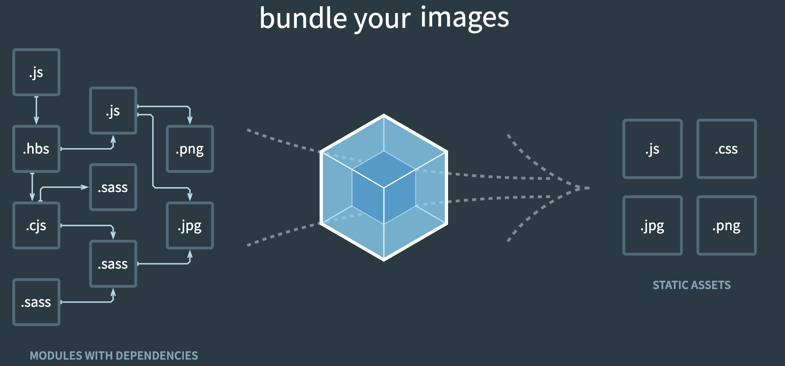

> [官方文档](https://security.feishu.cn/link/safety?target=https%3A%2F%2Fwebpack.docschina.org%2F&scene=ccm&logParams=%7B%22location%22%3A%22ccm_drive%22%7D&lang=zh-CN)
>
> [「吐血整理」再来一打 Webpack 面试题](https://security.feishu.cn/link/safety?target=https%3A%2F%2Fjuejin.cn%2Fpost%2F6844904094281236487%23heading-0&scene=ccm&logParams=%7B%22location%22%3A%22ccm_drive%22%7D&lang=zh-CN)

核心思想：“一切皆模块”。

webpack 是一个用于现代 JavaScript 应用程序的  **静态模块打包工具**。当 webpack 处理应用程序时，它会在内部从一个或多个入口点构建一个 依赖图(dependency graph)，然后将你项目中所需的每一个模块组合成一个或多个  `bundles`，它们均为静态资源，用于展示你的内容。


## 基础概念

### 入口（Entry）

`context`:Webpack 在查找相对路径的时候，会以 context 为根目录进行查找。**绝对路径**

`entry`：确定 webpack 从哪里开始打包。默认值是  `./src/index.js`。

```js
//Node的模块，用于操作文件路径
const path = require("path");

module.exports = {
  context: path.join(__dirname, "src"),
  entry: "./path/to/my/entry/file.js",
};
```

### 出口（output）

output ：指定 webpack 在哪里输出它所创建的  *bundle*。

- `filename`表示输出资源文件名默认值是  `./dist/main.js`；**使用模板字符串指定多个输出，避免缓存**
- `path`表示输出资源位置，值必须为绝对路径。
- `clean`:在每次构建前清理  `/dist`  文件夹

**webpack.config.js**

```js
const path = require("path");

module.exports = {
  output: {
    path: path.resolve(__dirname, "dist"),
    filename: "my-first-webpack.bundle.js",
    //filename: '[name].bundle.[chunkhash].js',
    clean: true, //在生成文件之前清空 output 目录
  },
};
```

你可能会很感兴趣，webpack 和 webpack 插件似乎“知道”应该生成哪些文件。答案是，webpack 通过  **manifest**，可以追踪所有模块到输出 bundle 之间的映射。

> Webpack 在构建过程中会生成一个内部数据结构，即 **manifest**。这个数据结构记录了构建时模块及其导出信息之间的映射关系。简单来说，它是一个“地图”，帮助 Webpack 知道每个模块最终被打包到了哪个 bundle 文件中。

### 预处理器（loader）

==webpack 只能理解 JavaScript 和 JSON 文件，loader 对其他类型的资源进行转义==，输出为 webpack 能够处理的形式。

**loader**  有两个属性：

1. `test` ：接收正则表达式，表示识别出哪些文件会被转换。
2. `use` ：接收一个数组，定义使用哪个 loader，按照数组从后往前的顺序匹配

**webpack.config.js**

```js
const path = require("path");

module.exports = {
  output: {
    filename: "my-first-webpack.bundle.js",
  },
  module: {
    rules: [{ test: /\.txt$/, use: "raw-loader" }],
  },
};
```

注意⚠️

- 在 webpack 配置中定义 rules 时，要定义在  `module.rules`  而不是  `rules`  中。
- 使用正则表达式匹配文件时，你不要为它添加引号。也就是说，`/\.txt$/`  与  `'/\.txt$/'`  或  `"/\.txt$/"`  不一样。

### 插件（plugins）

==loader 用于转换某些类型的模块，而 plugin 则可以用于执行范围更广的任务==。 包括：打包优化，资源管理，注入环境变量。

想要使用一个插件，你只需要  `require()`  它，然后把它添加到  `plugins`  数组中。多数插件可以通过选项(option)自定义。你也可以在一个配置文件中因为不同目的而多次使用同一个插件，这时需要通过使用  `new`  操作符来创建一个插件实例。

```javascript
//为应用程序生成一个 HTML 文件，并自动将生成的所有 bundle 注入到此文件中。
const HtmlWebpackPlugin = require("html-webpack-plugin");
const webpack = require("webpack"); // 用于访问内置插件

module.exports = {
  module: {
    rules: [{ test: /\.txt$/, use: "raw-loader" }],
  },
  plugins: [new HtmlWebpackPlugin({ template: "./src/index.html" })],
};
```

### 模式（mode）

参数： `development（开发）`, `production（生产）` ， `none` 。会将 DefinePlugin 中  `process.env.NODE_ENV`  修改。默认值 production。

```javascript
module.exports = {
  mode: "production",
};
```

### 代码分片

常用的代码分离方法：

- **入口起点**：使用  `entry` 配置手动地分离代码。
- **防止重复**：使用  `Entry dependencies`  或者  `SplitChunksPlugin` 去重和分离 chunk。

#### SplitChunksPlugin

插件可以将公共的依赖模块提取到已有的入口 chunk 中，或者提取到一个新生成的 chunk。 具体配置详见[SplitChunksPlugin](https://security.feishu.cn/link/safety?target=https%3A%2F%2Fwebpack.docschina.org%2Fplugins%2Fsplit-chunks-plugin%2F&scene=ccm&logParams=%7B%22location%22%3A%22ccm_drive%22%7D&lang=zh-CN)

```js
const path = require("path");

module.exports = {
  mode: "development",
  entry: {
    index: "./src/index.js",
    another: "./src/another-module.js",
  },
  output: {
    filename: "[name].bundle.js",
    path: path.resolve(__dirname, "dist"),
  },
  //在优化里面配置
  optimization: {
    splitChunks: {
      chunks: "all", // 对所有 chunk 进行分割

    },
  },
};
//最后生成
//index.bundle.js
//another.bundle.js
//loash.js 公共的依赖模块
```

#### Chunk 和 Module 的关系

1. **Module（模块）**：
    - 模块是代码的基本单元，可以是一个 JavaScript 文件、CSS 文件或其他资源。
    - 模块通过 `import` 或 `require` 语法相互依赖。
2. **Chunk（块）**：
    - Chunk 是一个或多个模块的集合，最终被打包成一个或多个文件。
    - Webpack 会根据配置将模块分配到不同的 chunk 中，每个 chunk 生成一个或多个文件。

==Webpack 默认会将所有入口点（entry points）及其依赖的模块打包到一个单独的 chunk 中==。例如，如果你有多个入口点，每个入口点及其依赖的模块会被打包到一个单独的文件中。


## 环境配置

### 概念

开发环境：开发人员调试开发的一种环境: 方便调试，保持高效的开发 生产环境：发布上线的环境: 让程序在生产环境中正常有效的运行

**开发环境的需求：**

- live reloading 或模块热更新 （本地开启服务，实时更新）
- source-map (代码映射，方便打包调试)
- 接口代理　 (配置 proxyTable 解决开发环境中的跨域问题)
- 代码规范检查 (代码规范检查工具)

**生产环境的需求：**

- 提取公共代码
- 压缩 bundle、文件压缩/base64 编码(压缩代码，减少线上环境文件包的大小)
- 更轻量的 source map
- 资源优化

**开发环境和生产环境的共同需求：**

- 入口
- 代码处理(loader 处理)
- 解析配置

**如何区分**

在 node 中有一个对象**process**对象，它里面包括 env 和它的一些属性，NODE_ENV 是我们自己加上去的自定义属性，用来区分环境变量，也就是通过这个变量来进行区别是开发环境还是生产环境。`process.env.NODE_ENV`

```json
//--config是可以设置我们执行哪个webpack文件，默认是执行webpack.config.js,但是我们现在修改文件名了，所以我们要设置一下
"build": "cross-env NODE_ENV=production webpack --config webpack.config.prod.js", // 生产环境打包
"dev": "cross-env NODE_ENV=development webpack-dev-server --config webpack.config.dev.js" // 开发环境
```

### sourse-map

当 webpack 打包源代码时，可能会很难追踪到 error(错误) 和 warning(警告) 在源代码中的原始位置。例如，如果将三个源文件（`a.js`, `b.js`  和  `c.js`）打包到一个 bundle（`bundle.js`）中，而其中一个源文件包含一个错误，那么堆栈跟踪就会直接指向到  `bundle.js`。你可能需要准确地知道错误来自于哪个源文件，所以这种提示这通常不会提供太多帮助。

`devtool`：此选项控制是否生成，以及如何生成 source map。

- **生产环境**  中使用  `source-map`
- **开发环境**  中使用  `inline-source-map`

```js
devtool: 'inline-source-map',
```

更多[sourse-map 选项](https://security.feishu.cn/link/safety?target=https%3A%2F%2Fwebpack.docschina.org%2Fconfiguration%2Fdevtool%2F%23devtool&scene=ccm&logParams=%7B%22location%22%3A%22ccm_drive%22%7D&lang=zh-CN)

### webpack-dev-Server

针对**开发阶段**，webpack 提供了一个便捷的本地开发调试工具`webpack-dev-server`，提供了一个基本的 web server，并且具有 live reloading(实时重新加载) 功能

```javascript
const path = require("path");

module.exports = {
  //...
  devServer: {
    static: {
      directory: path.join(__dirname, "public"),
    },
    compress: true,
    port: 9000,
    proxy: {
      "/api": {
        target: "http://localhost:3000",
      },
    },
    hot: true,
  },
};
```

- `static.directory`：表示从哪个目录提供静态文件的选项（默认是 'public' 文件夹）。将其设置为  `false`  以禁用
- `compress`：表示服务是否启用 gzip 压缩
- `port`：指定监听请求的端口号
- `proxy`：代理，跨域设置
- `hot`:启用 webpack 的模块热替换 HMR


>[官方介绍HMR](https://webpack.docschina.org/concepts/hot-module-replacement/)


虽然 devServer 的自动刷新（live reloading）还不错，但当开发复杂大型项目时，这种方式仍然效率不高。webpack 还提供了更灵活的功能——`HMR`模块热替换(hot module replacement),用于在运行时只更新所需的部分模块，而不是刷新整个页面。当然 HMR 不适用于生产环境，仅用于开发环境。

从 webpack-dev-server v4 开始，HMR 是默认启用的。它会自动应用  `webpack.HotModuleReplacementPlugin`，这是启用 HMR 所必需的。因此当 hot 设置为 true，你不需要在你的 webpack.config.js 添加该插件。

模块热替换(hot module replacement)功能会在应用程序运行过程中，替换、添加或删除模块，而无需重新加载整个页面。主要是通过以下几种方式，来显著加快开发速度：

- 保留在完全重新加载页面期间丢失的应用程序状态。
- 只更新变更内容，以节省宝贵的开发时间。
- 在源代码中 CSS/JS 产生修改时，会立刻在浏览器中进行更新，这几乎相当于在浏览器 devtools 直接更改样式。

### webpack 配置文件

搭建好 Vue-cli 脚手架之后，build 文件夹会分别自动的生成 webpack.base.conf.js、webpack.dev.conf.js、webpack.prod.conf.js 三个 webpack 配置文件：

- `webpack.base.conf.js`：webpack 的开发环境和生产环境的共有配置(开发环境和生产环境都是需要执行的配置)
- `webpack.dev.conf.js`：webpack 的开发环境的特有配置(只在开发环境中执行，生产环境中不执行)
- `webpack.prod.conf.js`：webpack 的生产环境的特有配置(只在生产环境中执行，开发环境中不执行)


#### `webpack.base.conf.js` 公共环境

```js
const path = require("path");
//清除build/dist文件夹文件
const CleanWebpackPlugin = require("clean-webpack-plugin");
//生成创建Html入口文件
const HtmlWebpackPlugin = require("html-webpack-plugin");
//将css提取到单独的文件中
const MiniCssExtract = require("mini-css-extract-plugin");
//css压缩
const OptimizeCss = require("optimize-css-assets-webpack-plugin");
//压缩js文件
const UglifyJsPlugin = require("uglifyjs-webpack-plugin");
//引入webpack
const webpack = require("webpack");

module.exports = {
  //webpack 入口文件
  entry: "./src/index.js",
  //webpack 输出文件配置
  output: {
    //输出文件路径
    path: path.resolve(__dirname, "dist"),
    //输出文件名
    filename: "k-editor.[hash:8].js",
  },
  //配置插件
  plugins: [
    //使用插件清除dist文件夹中的文件
    new CleanWebpackPlugin({
      path: "./dist",
    }),
    //使用插件生成Html入口文件
    new HtmlWebpackPlugin({
      //模板文件路径
      template: "./src/index.html",
      //模板文件名
      filename: "index.html",
      minify: {
        removeAttributeQuotes: true, //删除双引号,
        collapseWhitespace: true, //压缩成一行，
      },
      hash: true,
    }),
    //提取css到style.css中
    new MiniCssExtract({
      filename: "style.css",
    }),
  ],
  resolve: {
    // modules: [path.resolve('node_modules')],//只在当前目录下查找
    alias: {
      //别名
      bootstrap: "bootstrap/dist/css/bootstrap.css",
    },
    // mainFields: ['style', 'main'],//优先寻找style，
    // mainFiles: [],//入口文件的名字,默认index.js
    // extensions: ['js', 'css', 'json', 'vue']//扩展名顺序
  },
  //loader加载器模块配置
  module: {
    rules: [
      {
        //正则表达式匹配.css为后缀的文件
        test: /\.css$/,
        //使用loader
        use: [
          MiniCssExtract.loader,
          "css-loader",
          {
            loader: "postcss-loader",
          },
        ],
        //正则表达式匹配.less为后缀的文件
        //使用lodaer来处理
      },
      {
        test: /\.less$/,
        use: [
          MiniCssExtract.loader,
          "css-loader",
          {
            loader: "postcss-loader",
          },
          "less-loader",
        ],
      },
      /* {                 test: /\.js$/,               //不包括node_modules                 exclude: /node_modules/,                 use: [{                     loader: "eslint-loader",                     options: {                         enforce: 'pre'    //强制更改顺序，pre 前  post 后                     }                 }],             },*/
      {
        test: /\.js$/, //普通的loader
        //不包括node_modules
        exclude: /node_modules/,
        use: [
          {
            loader: "babel-loader",
          },
        ],
      },
      {
        test: /\.html$/,
        use: ["html-withimg-loader"],
      },
      {
        test: /\.(gif|png|jpg)$/,
        use: [
          {
            loader: "url-loader",
            options: {
              //图片小于10kb就是图片地址，大于正常打包成base64格式编码
              limit: 10000,
              //输出路径
              outputPath: "img/",
            },
          },
        ],
      },
    ],
  },
};
```

#### `webpack.dev.conf.js` 开发环境

```js
//引入webpack-merge插件进行合并
const { merge } = require("webpack-merge");
//引入webpack.base.conf.js文件
const base = require("./webpack.base.conf");
//引入webpack
const webpack = require("webpack");
//进行合并，将webpack.base.conf.js中的配置合并到这
module.exports = merge(base, {
  //模块参数
  mode: "development",
  devServer: {
    contentBase: "./dist",
    //端口号
    port: "8383",
    inline: true,
    historyApiFallback: true, //在开发单页应用时非常有用，它依赖于HTML5 history API，如果设置为true，所有的跳转将指向index.html
    hot: true, //允许热加载
  },
  //启用source-map方便调试
  devtool: "source-map",
  plugins: [
    //定义全局变量
    new webpack.DefinePlugin({
      //这里必须要解析成字符串进行判断，不然将会被识别为一个变量
      DEV: JSON.stringify("dev"),
    }),
  ],
});
```

#### `webpack.prod.conf.js` 生成环境

```js
const { merge } = require("webpack-merge");
const base = require("./webpack.base");

const path = require("path");
const OptimizeCss = require("optimize-css-assets-webpack-plugin");
const UglifyJsPlugin = require("uglifyjs-webpack-plugin");
const webpack = require("webpack");

module.exports = merge(base, {
  mode: "production",
  optimization: {
    minimizer: [
      //压缩CSS代码
      new OptimizeCss(),
      //压缩js代码
      new UglifyJsPlugin({
        //启用文件缓存
        cache: true,
        //使用多线程并行运行提高构建速度
        parallel: true,
        //使用 SourceMaps 将错误信息的位置映射到模块
        sourceMap: true,
      }),
    ],
  },
  plugins: [
    //使用插件定义全局变量DEV
    new webpack.DefinePlugin({
      DEV: JSON.stringify("production"),
    }),
  ],
});
```

#### package.json 文件配置

```json
    "scripts": {
        "test": "npm  run test",
        "dev": "webpack serve --open --config webpack.dev.js",
        "build": "webpack --config webpack.prod.js"
      },
```
