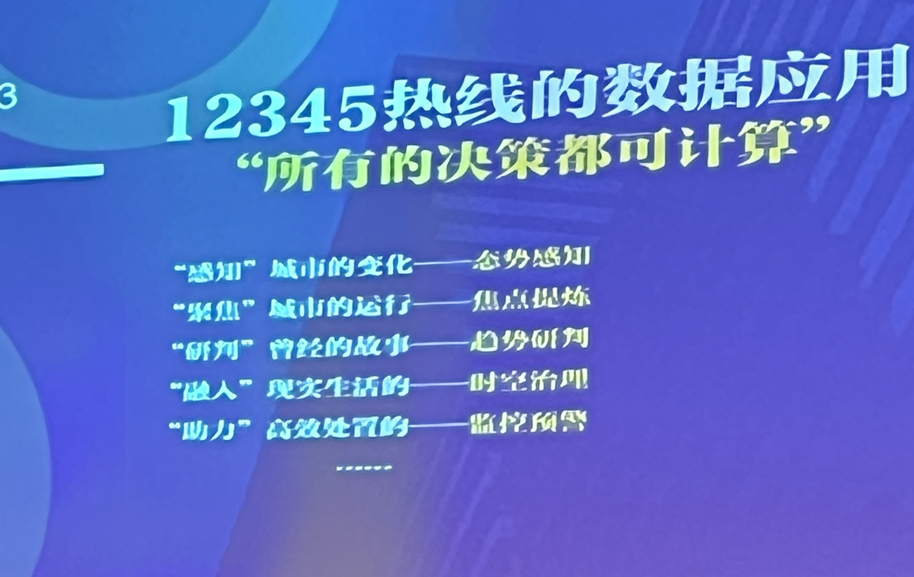
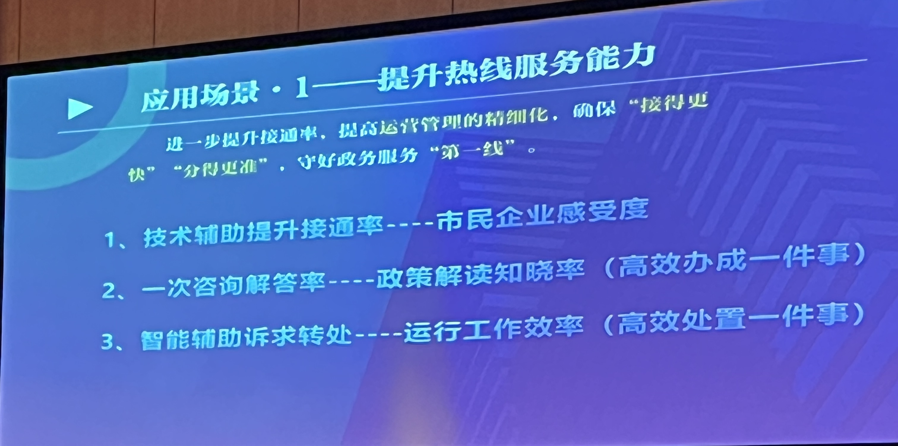
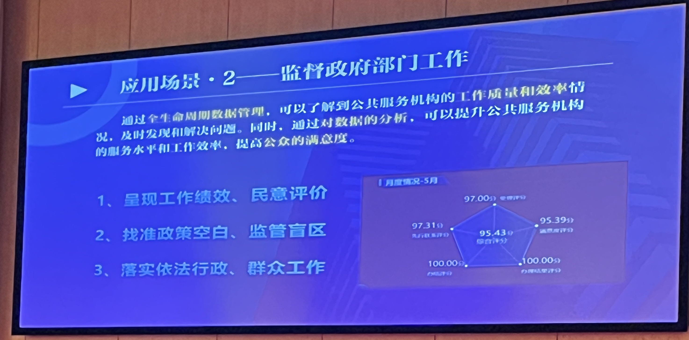
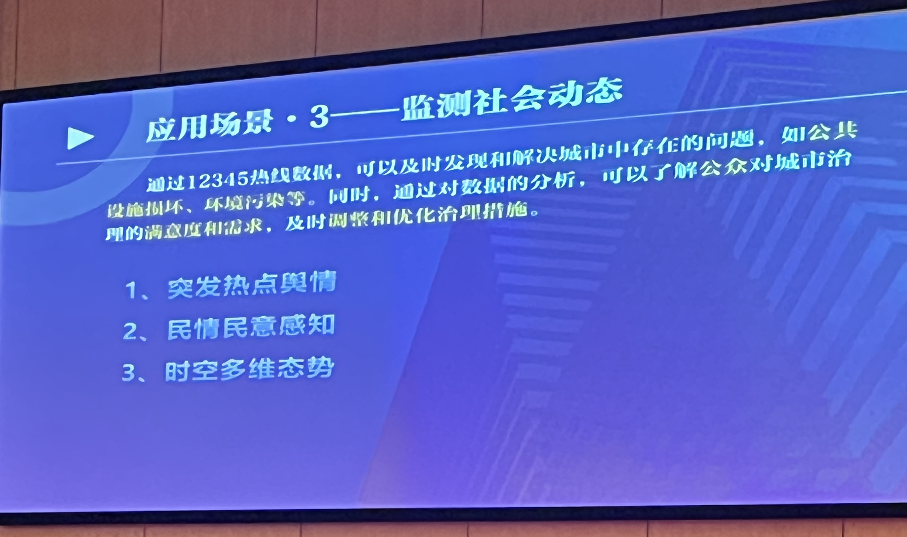

- [ ] 民情快报（合并多个投诉进行降噪，生成报告，转接给对应单位）
- [ ] 智能语音（方言困难，最大问题是表示方式不同，问题的表达方式归类）
- [ ] 智能视频（听障人士，老年人不识字看不懂，上海手语解读政策）
- [ ] 提前设定规则，分类进线问题，便于后续分析，对每个工单抓取关键字，打tag，业务分析明确后续工作内容
- [ ] 构建本地知识库的大模型
- [ ] 词云分析主流问题，舆情监测预警，分析市民需求转接相应服务
- [ ] 目标：未诉先办。预警研判处置，幸福感满意度衡量标准

场景一：提升热线服务能力

场景二：监督政府部门工作

场景三：监测社会动态
积水与气象局数据报告一致，雨污水理由，规律性变化，与往年一致

场景四：优化资源配置