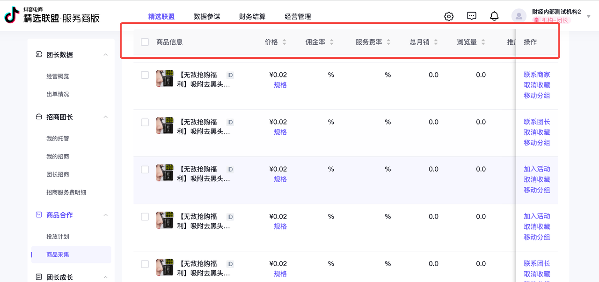
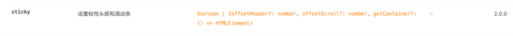
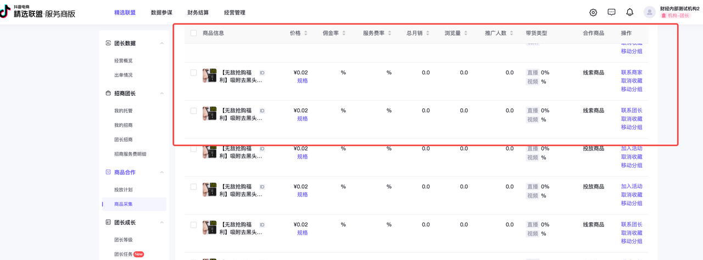
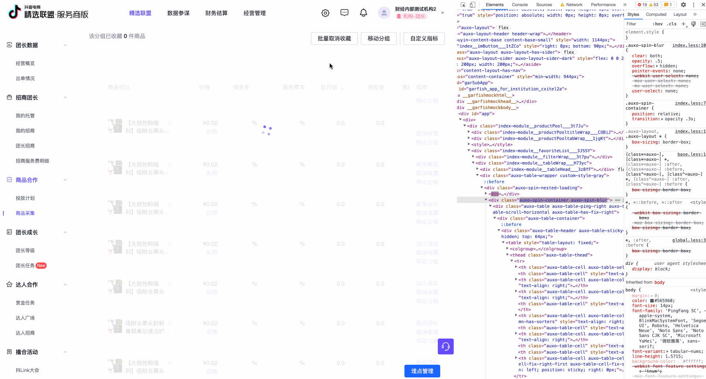

## 需求及问题

需求：表头吸顶，且保持表格固定列滚动

  

### 【问题1】sticky吸顶不生效

**解决1**由于祖先元素中有overflow：auto/hidden等设置导致无法吸顶，删除祖先元素的overflow或设为visible。

### 【问题2】吸顶生效后，滚动固定列失效

当去掉overflow后吸顶可生效，但固定列失效。表格无法滚动。

**解决2**由于overflow：visible导致容器内容平铺，因此需要给大容器设置一个width。由于内部元素设置了min-width，同时由于overflow：visible，因此可以达到效果。

  

## 探究原理
### sticky定位机制

一般来说，由于 position: sticky 的作用，随着页面的滚动，sticky 会吸附到页面顶部的固定位置。但是在某种情况下，它失效了。我反复调试，发现当 sticky 元素（祖先）容器使用了 overflow: hidden/auto 时，sticky 就失效了。它在容器滚动时不再吸附到容器顶部显示，而是像作为 normal flow 的内容一样随着滚动条的滚动而消失……

查阅了资料，在现行标准 CSS 定位标准 [CSS Positioned Layout Module Level 3,W3C Working Draft, 16 December 2021](https://www.w3.org/TR/css-position-3/#sticky-position) 中有如下解释：

> **sticky**
> 
> Identical to [relative](https://www.w3.org/TR/css-position-3/#valdef-position-relative), except that its offsets are automatically adjusted in reference to the nearest ancestor [scroll container’s](https://www.w3.org/TR/css-overflow-3/#scroll-container) [scrollport](https://www.w3.org/TR/css-overflow-3/#scrollport) (as modified by the [inset properties](https://www.w3.org/TR/css-position-3/#inset-properties)) in whichever axes the inset properties are not both [auto](https://www.w3.org/TR/css-position-3/#valdef-top-auto), to try to keep the box in view within its [containing block](https://www.w3.org/TR/css-display-3/#containing-block) as the user scrolls. This [positioning scheme](https://www.w3.org/TR/css-position-3/#positioning-scheme) is called **sticky positioning**.
> 
> 与relative相同，除了它的偏移量会根据最近的祖先滚动容器的滚动端口（由inset 属性修改）在任何轴上自动调整inset 属性不是都是auto，以尝试将框保持在其包含的视图中用户滚动时阻塞。这种定位方案称为**粘性定位**。

它明确了 sticky 元素，**类似相对定位relative**，会相对它最近的 **scrolling container** 去做定位。而且**任何轴**上的inset属性（即top、bottom、right、left等属性）不能是auto，（这也就是之前曾尝试过overflow-x：auto，overflow-y：visible也无法解决问题2的原因）

### sticky元素始终在父元素中

sticky元素虽然以 scrolling container 进行定位，但是其滚动边界不超过父元素，即当父元素滚动出可视区时sticky也会随之滚动消失。

使用Tips

1. 注意sticky元素的祖先元素中overflow属性，是否产生 scrolling container。
2. 注意sticky元素父元素大小是否足以使其显示。
3. ### overflow产生scroll Container

那么为何说overflow：hidden的时候就不行了呢？考虑它涉及滚动行为，且问题的出现和 overflow 相关，所以应当去查阅 Overflow Module 标准，现行标准是 [CSS Overflow Module Level 3, W3C Working Draft, 23 December 2021](https://link.zhihu.com/?target=https%3A//www.w3.org/TR/css-overflow-3/)。

根据标准的规定，overflow: hidden 的元素不会出现滚动条，不会响应用户的滚动操作，但是它会被程序滚动，它也会创建 scroll container ！同样的scroll和auto也是一个 scroll container，而visible和clip不是。

可以看到一个有趣的现象，当点击table排序时会触发spin添加新的class，而该class中带有overflow：hidden，因此我们原先的sticky会根据新的scroll container进行定位，从而出现了偏移。
 

  

  

拓展阅读：[Sticky Positioning 粘性定位完全解读](https://bytedance.feishu.cn/docx/doxcnAzDVfjP9ovSolaNQ27r6if)