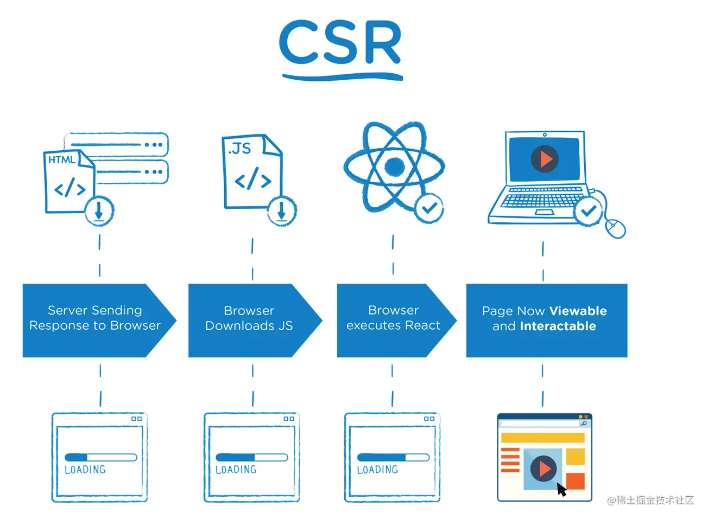
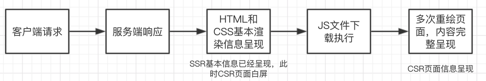
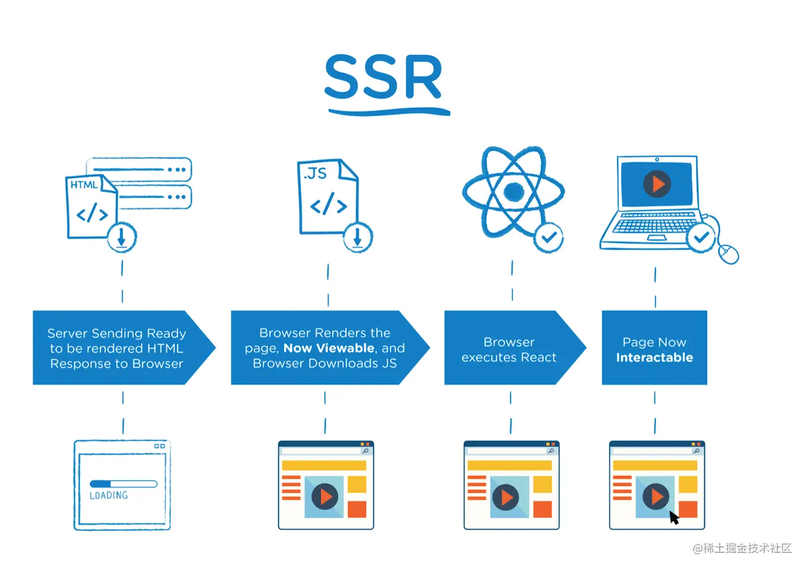
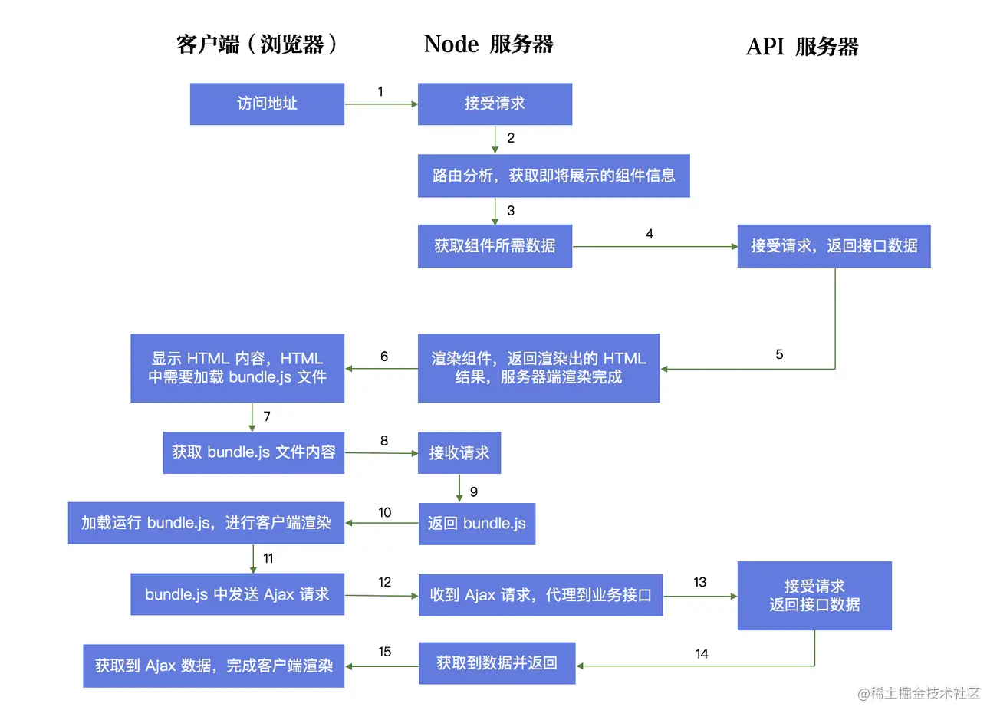
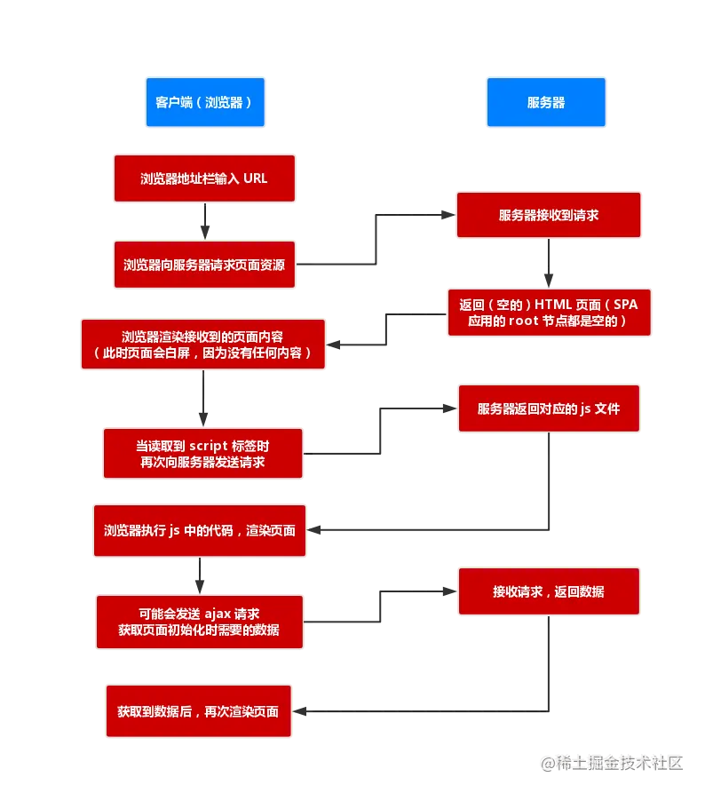

## SSR是什么？

  

**CSR**：Client-Side Render 客户端渲染

- 页面初始加载的 HTML 页面中无网页展示内容，需要加载执行JavaScript 文件中的 React 代码，通过 JavaScript 渲染生成页面，同时，JavaScript 代码会完成页面交互事件的绑定，详细流程可参考下图
    
- 流程：用户请求--->服务器返回一个Dummy页面--->Dummy页面引导浏览器取回Js--->浏览器执行Js --->页面渲染(内容可见)
    
 
    

  

**SSR**：Server-Side Render 服务端渲染

- 服务端渲染的模式下，当用户第一次请求页面时，由服务器把需要的组件或页面渲染成 HTML 字符串，然后把它返回给客户端。客户端拿到手的，是可以直接渲染然后呈现给用户的 HTML 内容，客户端只负责解析 HTML ，不需要为了生成 DOM 内容自己再去跑一遍 JS 代码。使用服务端渲染的网站，可以说是“所见即所得”，页面上呈现的内容，在 html 源文件里也能找到。
    
- 流程：用户请求--->服务器返回一个渲染后的页面(内容可见)--->加载JS--->执行Js对页面进行Hydrate（作用是加载并执行 JS 文件内容，并将事件回调绑定到真实的 DOM 上。）
    

    

  

## 为什么要用SSR？

**CSR缺点：**

- 对SEO非常不友好
    
      为了节约成本，爬虫通常不会跟踪执行页面中的 Javascript 脚本。导致CSR站点的信息无法被搜索引擎正常收录。
    
      爬虫可以直接抓取渲染之后的页面，CSR 首次返回的 HTML 文档中，是空节点（root），不包含内容，爬虫就无法分析你的网站有什么内容，所以就无法给你好的排名。而 SSR 返回渲染之后的 HTML 片段，内容完整，所以能更好地被爬虫分析与索引。
    
- 首屏响应速度差
    
    - 当打包输出的Bundle尺寸较大时，网络不佳的情况下，下载Js代码的时间会较长。下载Bundle的过程中，浏览器中无法不显示任何信息。
        
- 兼容性问题
    
    - 不是所有的浏览器都支持/完整的支持Javascript；部分浏览器会刻意的关闭Js。在这些情况下，CSR应用程序可能会完全失效。
        

  

**SSR优点：**

- 更快的内容到达时间 (time-to-content)，用户将会更快速地看到完整渲染的页面
    
- 更好的 SEO，搜索引擎爬虫抓取工具可以直接查看完全渲染的页面
    

**SSR缺点：**

- 对服务器性能消耗较高
    
- 项目复杂度变高，出问题需要在前端、node、后端三者之间找
    
- 需要考虑 SSR 机器的运维、申请、扩容，增加了运维成本（可以通过 Serverless 解决）
    

  

**SSR + SPA 体验升级**

第一次访问页面是服务端渲染，基于第一次访问后续的交互就是 `SPA` 的效果和体验，还不影响`SEO` 效果，这就有点完美了。

我们把页面的展示内容和交互写在一起，**让代码执行两次。在服务器端执行一次，用于实现服务器端渲染，在客户端再执行一次，用于接管页面交互。**

服务端只负责首次“渲染”（真正意义上，只有浏览器才能渲染页面，服务端其实是生成 HTML 内容），然后返回给客户端，客户端**接管**页面交互（事件绑定等逻辑），之后客户端路由切换时，直接通过 JS 代码来显示对应的内容，不再需要服务端渲染（只有页面刷新时会需要）

但是要实现两种技术的结合，同时可以最大限度的重用代码（同构），减少开发维护成本，那就需要采用 `react` 或者 `vue` 等前端框架相结合 `node (ssr)` 来实现。

  

  

## SSR原理

### SSR流程

整体来说 `react` 服务端渲染原理不复杂，其中最核心的内容就是同构。

1. Node服务器接收客户端请求，得到当前的`req url path`,然后在已有的路由表内查找到对应的组件，获取组件所需数据，
    
2. 然后基于 `react` 内置的服务端渲染api `renderToString() or renderToNodeStream()` 把组件渲染为 `html字符串`或者 `stream 流`,（至此SSR完成）
    
3. 在把最终的html进行输出前需要将数据注入到浏览器端(注水Hydrate)，server 输出(response)后浏览器端可以得到数据(脱水)，
    
4. 浏览器开始进行渲染和节点对比，然后执行组件的`componentDidMount` 完成组件内事件绑定和一些交互，浏览器重用了服务端输出的 `html 节点`，整个流程结束。
    

**对比CSR**

  

### 虚拟DOM

SSR 之所以能够实现，本质上是因为虚拟 DOM 的存在。

React 在做页面操作时，实际上不是直接操作 DOM，而是操作虚拟 DOM。这使得无法操作真实 DOM 的 node 服务器可以使用虚拟 DOM 转换成为字符串来完成对页面的构建。在 react 中，操作虚拟 DOM 转换成为字符串的方法是 [renderToString](https://reactjs.org/docs/react-dom-server.html#rendertostring) 。

- 在服务器，我可以操作 JavaScript 对象，判断环境是服务器环境，我们把虚拟 DOM 映射成字符串输出；
    
- 在客户端，我也可以操作 JavaScript 对象，判断环境是客户端环境，我就直接将虚拟 DOM 映射成真实 DOM，完成页面挂载
    

  

### 路由同构

> 一套代码既可以在服务端运行又可以在客户端运行，这就是同构应用。
> 
> 接下来的内容重点关注为什么需要同构，至于如何实现同构，后续再进行完善。。。

  

SSR 架构，我们需要让相同的 React 代码在客户端和服务器端各执行一次。React组件代码可以公用，但是router路由是不行的。这是由于在**服务器端需要通过请求路径**，找到路由组件，而在客户端需通过**浏览器中的网址（HashRouter、BrowserRouter）**，找到路由组件，是完全不同的两套机制，所以这部分代码是肯定无法公用。

  

  

### 数据同构

根据SSR的架构图可知，页面需要经过两次渲染，第一次渲染是服务端返回的 HTML 基本页面信息，第二次渲染则是客户端渲染。这两次渲染分别需要请求两次数据，我们需要保证，两次数据获取信息是相同的。

保证数据同构的方法非常的简单，就是在服务端请求数据并渲染页面以后，将数据以全局变量的形式写入页面。客户端直接获取页面数据，完成渲染。

  

  

## 适用场景

1、比如企业级网站，   主要功能是展示而没有复杂的交互，并且需要良好的SEO，则这时我们就需要使用服务器端渲染；

2、类似后台管理页面，   交互性比较强，不需要seo的考虑，那么就可以使用客户端渲染。

  

  

## Reference

[【长文慎入】一文吃透 React SSR 服务端渲染和同构原理](https://juejin.cn/post/6844903943902855176#heading-6)

[React 中同构（SSR）原理脉络梳理](https://juejin.cn/post/6844903694870265870#heading-1)

[SSR 基本原理与项目工程化](https://tech.bytedance.net/articles/11184#heading7)