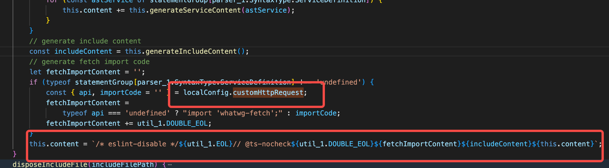

## Ferry是什么？

**一句话描述：****Ferry** **是一个致力于提高前后端协作开发效率的通信框架。**

从接口角度看，Ferry 是一个 HTTP 框架；

从开发角度看，Ferry 又是一个 RPC 框架。

Ferry 在服务 HTTP 接口的同时，提供超 RPC 的开发体验。

  


## 为什么需要Ferry？

由于，HTTP 与 RPC 开发隔离。

后端：

- 使用 RPC 框架，通过 IDL 的方式来描述和管理接口文档。
    
- IDL 能简洁清晰地描述接口
    
- 比较统一，基本成熟
    

前端：

- 没有接口描述文档 | wiki、docs | Yapi、Swagger
    
- key-value类型的数据格式表述能力单一，不适合描述接口
    
- 管理混乱，仍处于探索阶段
    

  

因此，Ferry 从 RPC 框架的开发模式入手，**把底层的 RPC 请求换成 HTTP 请求，从而打通 HTTP 和 RPC。**对后端的 IDL 进行扩展，使得 RPC 的 IDL 能用来描述 HTTP 接口

  

> RPC 请求和 HTTP 请求的区别是有没有对数据进行特殊的序列化/反序列化处理，可以参考另一篇文章： [RPC 的序列化了解一下](https://bytekm.bytedance.net/kmf/articleDetail/5376)


|  |  |
| ---- | ---- |


## Ferry能做什么？

包装RPC接口，利用IDL注释注解扩展HTTP所需信息，自动生成Client代码，发起HTTP请求。

同时帮你做了JS的数据类型检测+Mock（没用过，一般用Mock插件，所以这里不做深入了解）

其中，黑色为传统 RPC 的功能，红色为传统 RPC 不具备的功能，即超 RPC 的功能。


## So，Ferry是如何做的？

### Ferry IDL

Ferry IDL 提供了一种用 RPC IDL 来描述 HTTP 接口的方式。

> **Q1：扩展****RPC****的****IDL****，那还缺乏 HTTP 接口的哪些信息？**

A1：由于 RPC 框架一般使用 TCP 进行通信，HTTP 里面的东西基本都是缺乏的。为了方便理解，我们可以先聚焦于发送一个 HTTP 请求的必要信息，比如：URL 和 Method。

> **Q2：怎样在** **RPC** **的** **IDL** **里面优雅地加入 HTTP 接口的信息？**

A2：要保证扩展后的IDL不影响RPC 框架解析器的解析，只能通过注释或注解的形式。

1. 把 HTTP 信息写到注释里面
    
2. 把 HTTP 信息写到注解里面
    

一句话总结，就是继承并扩展IDL，补充原本RPC接口中HTTP请求需要的信息。

  

### Ferry Client

ferry-cli的功能是根据Ferry IDL文件生成client代码，模块结构如下图所示：

ferry-parser根据Ferry IDL文件生成AST，JS Generator、TS Generator和Mock Generator模块根据AST分别生成JS lib、TS lib和mock代码。


#### 前端RPC调用
    

ferry-cli生成的JS版和TS版lib代码封装了底层通信细节，开发者可以使用传统RPC接口的写法来调用lib里面的接口。

```JavaScript
const client = new UserServiceClient();
client.Store({ uid: '20190606', name: 'lance' })
.then((resp) => {});
```

#### 前端语法检测
    

JS 是一种弱类型语言，无法在编译或运行时检测数据类型的合法性。开发者给接口传入不符合预期的数据时，**JS 不会有任何提示，这显著地提高了发现和定位问题的成本**。

Ferry 可以自动对 JS 的接口数据类型进行合法性检测。

从理论上看，由于能从 Ferry IDL 文件获得数据的预期类型，因此可以对实际数据的类型进行合法性检测。但是，实现起来，并不是一件简单的事情。至少需要解决以下几个问题：

- 怎么处理 JS 中不存在的类型，比如“enum”和“struct”等
    
- 怎么处理类型嵌套引用的问题，比如“struct”引用“map”，“map”又引用“list”，“list”又引用“struct”。
    
- 生成代码的时候可以执行逻辑，生成的代码运行的时候又可以执行逻辑，怎样拆解逻辑可以使得生成的代码简洁高效。
    

下图展示了 Ferry 实现类型检测的主要逻辑：


对于上图的例子，整个调用链路为：

1. 接口调用时，调用“_checkStructType”检测传入数据“req”
    
2. “_checkStructType”调用“_checkStructOfStoreRequest”检测结构体“StoreRequest”
    
3. “_checkStructOfStoreRequest”分别调用“_checkStructType”、“_checkBaseType”和“_checkListType”检测各个字段
    
4. “_checkListType”调用“_checkBaseType”检测“list”的成员类型
    
5. “_checkStructType”调用“_checkStructOfUserProfile”检测结构体“UserProfile”
    

依次反复，直至结束。

#### 代码裁剪
    

Ferry 的客户端代码包含了类型检测和接口模拟的代码，这两部分代码是不应该带上线的。另外，一个 IDL 文件里面只有部分接口会被用到，其他不被使用的接口的代码也不应该带上线。Ferry 需要把这些代码裁剪掉。

Ferry 采用 **Webpack** **插件**来实现代码裁剪。

使用：webpack中配置

```JavaScript
module.exports = {
  module: {
    rules: [
      {
        test: /\.js$/,
        exclude: [/node_modules/],
        use: [
          // 注意，需要把这个 loader 放在最后面，使其可以最先执行
          {
            loader: '@byted-ferry/shake-loader',
            options: {
              targetDir: 'api-lib'
            }
          }
        ]
      }
    ],
  },
}
```

> 原理

目的虽然是代码裁剪，但实现的方法其实是代码转化。


利用 ts-loader 的“getCustomTransformers”配置项，在 TS 或 JS 代码被 ts-loader 处理前就进行转化。转化方法是用 TS 原生的 API 遍历 && 判断 && 更新 && 生成 AST 节点。

  

## 源码解读

### 前置知识AST

> [用JS解释JS！详解AST及其应用](https://mp.weixin.qq.com/s/SlXIjnwbHS_enHXlZAnMMw)

AST工作流程


  

### Ferry Client

> TS生成器和JS生成器同理，在此以JS为例

JS生成器：

1. 调用ferry parser生成AST，
    
2. 将AST里的类型映射到JS类型，根据不同类型生对应代码。整个生成的过程其实就是字符串拼接的过程，最后再写出文件。
    
3. 在拼接过程中，检测是否存在enum、struct等js不存在的类型，有则标记，并拼接类型检测函数的调用。
    
4. 同时在最后生成`_util.js`时，添加类型检测函数的定义
    


拼接js文件




根据标记，生成_util.js中的校验函数


生成效果


  

### 代码裁剪shake-loader

**babel包的用途：****https://babeljs.io/docs/en/babel-template**

1. 把源代码解析为AST（@babel-parser）
    
2. 对AST进行遍历（@babel-traverse）
    
3. AST转为code（@babel-generator）
    

主要裁剪函数：在遍历过程中查找是否调用了检测和mock函数，删除这部分代码。


  

## 总结

对于前端来说还是使用该框架就是从远程拉取thrift文件▶️自动编译生成接口调用代码（ferryclient）

省去了原本手动定义接口的步骤，并且用类RPC调用接口的方式发起请求。

流程梳理

1. 将thrift编译为AST（Ferry parser）
    
2. 交由JS Generator、TS Generator和Mock Generato等~~拼接字符串~~解析为相应接口和函数定义（Ferry Client）
    
3. 解析同时生成类型检测函数，并在~~拼接字符串~~解析时添加调用代码。
    
4. ~~mock功能暂未使用到，不做了解~~
    
5. 打包裁剪无用代码，在项目webpack中配置shake-loader插件，在打包时最先执行，利用babel包解析->遍历AST->删除mock及类型检测函数相关代码->生成代码。