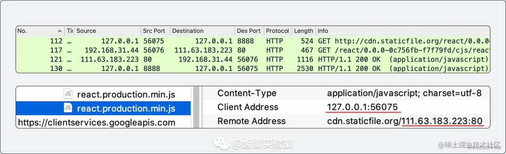

## 前情知识

#### **正向代理**

如果把局域网外的 Internet 想象成一个巨大的资源库，则局域网中的客户端要访 问 Internet，则需要通过代理服务器来访问，这种代理服务就称为正向代理。 简单一点：通过代理服务器来访问服务器的过程 就叫 正向代理。需要在客户端配置代理服务器进行指定网站访问

#### **反向代理**

其实客户端对代理是无感知的，因为客户端不需要任何配置就可以访问。 我们只需要将请求发送到反向代理服务器，由反向代理服务器去选择目标服务器获取数据后，在返回给客户端，此时反向代理服务器和目标服务器对外就是一个服务器，暴露的是代理服务器 地址，隐藏了真实服务器 IP 地址。

#### **负载均衡**

增加服务器的数量，然后将请求分发到各个服务器上，将原先请求集中到单个服务器上的 情况改为将请求分发到多个服务器上，将负载分发到不同的服务器，也就是我们所说的负载均衡。 客户端发送多个请求到服务器，服务器处理请求，有一些可能要与数据库进行交互，服 务器处理完毕后，再将结果返回给客户端。

#### 中间人攻击

中间人攻击（Man-in-the-middle attack，MITM）在密码学和计算机安全领域中是指攻击者与通讯的两端分别创建独立的联系，并交换其所收到的数据，使通讯的两端认为他们正在通过一个私密的连接与对方直接对话，但事实上整个会话都被攻击者完全控制。

简单来讲就是指攻击者在通讯两端之间接管流量，攻击者可以拦截通讯双方的通话并篡改内容。想要接管流量，就需要攻击者能将自己分别伪装成通讯两端，并且不被另一端识破，**DNS 欺骗与会话劫持等都是常见中间人攻击手段**。

  

  

## Charles

#### HTTP抓包原理

- 浏览器（Client）从端口号 56075 发起一个请求，请求发送到本地 Charles 监听的 8888 端口（MITM Server），这个连接直接在本机进行
- 收到浏览器的请求后，Charles 再从端口号 56076 （MITM Client）发起一个新的请求，因为这个网络包要入公网，所以从本机IP发送服务端IP
- 服务端返回一个 HTTP 响应到 Charles 的代理客户端 `本机IP:56076`
- Charles 内部做了一些处理（Capture & Analysis），然后把响应报文通过 8888 端口发送到 `127.0.0.1:56075`，到这里浏览器就收到了响应

#### HTTPS

[HTTPS 详解一：附带最精美详尽的 HTTPS 原理图](https://segmentfault.com/a/1190000021494676)

Https并非应用层的一种新协议，只是http通信接口部分用ssl/tls协议代替而已。通常http直接和tcp通信，当使用ssl时则演变成先和ssl通信，再由ssl和tcp通信。也就是 `HTTPS=HTTP+SSL`。

- **非对称加密**：使用两个密钥，一个是public key，一个是private key。通过一个特殊的数学算法，使得数据的加密和解密使用不同的密钥。
- **对称加密**：使用一个 密钥。这里是随机码KEY

1. 客户端发起 https 请求,连接到 server 的443接口
2. 采用 HTTPS 协议的服务器必须要有一套数字 CA (Certification Authority)证书，颁发证书的同时会产生一个私钥和公钥。**私钥由服务端自己保存，不可泄漏。公钥则是附带在证书的信息中，可以公开的。证书本身也附带一个证书电子签名，这个签名用来验证证书的完整性和真实性，可以防止证书被篡改**。
3. 服务端收到请求后把 `证书+公钥` 传给客户端
4. 客户端解析证书如果证书没有问题，客户端就会从服务器证书中取出服务器的公钥A。然后客户端还会生成一个随机码 KEY，并使用公钥A将其加密。
5. 客户端把加密后的随机码 KEY 发送给服务器，作为后面**对称加密**的密钥。

6. 服务器在收到随机码 KEY 之后会使用私钥B将其解密。经过以上这些步骤，客户端和服务器终于建立了安全连接，完美解决了对称加密的密钥泄露问题，接下来就可以用对称加密愉快地进行通信了。
7. 服务器使用密钥 (随机码 KEY)对数据进行对称加密并发送给客户端，客户端使用相同的密钥 (随机码 KEY)解密数据。

  

#### HTTPS抓包原理

- 客户端发起 SSL握手时,**中间人劫持用户请求并伪装成客户端发起 SSL 握手**.

- ==服务端发送公钥给中间人,中间人截获这个公钥保存起来,并把自己的公钥发送给客户端==.
- 客户端拿到替换后的公钥加密客户端的对称密钥发送请求给中间人, 中间人利用自己的私钥解出对称密钥,这时候**中间人已经拿到公钥和对称密钥,再用服务端发给中间人的公钥来加密对称密钥**,发送给服务器.
- 客户端和服务端所有的请求的数据都会**被中间人利用对称密钥解密**得到所有的信息.

所以要抓包 HTTPS, **前提是我们要安装并信任它的证书**.

  
  

## Eden Proxy

[Eden Proxy 原理剖析](https://bytedance.feishu.cn/wiki/wikcncZkURLnRSk9htQ5CrGOsZJ#MLsPDK)

[Eden Proxy 原理和架构——解析 HTTP 代理、TLS 和证书信任链 | ByteT 计划](https://tech.bytedance.net/articles/6851865198618214407#heading9)

### 是什么？

Eden Proxy 是 [Eden](https://eden.bytedance.net/index-cn) 的重要组成部分，它为本地模拟线上环境开发、调试、测试等提供了技术基础。Eden Proxy 通过 HTTP 代理的形式来完成请求和响应的转发、修改、拦截，从而达到请求转发到本地开发服务或者本地文件或者远程服务器的功能。

Eden Proxy 的基本原理就是在浏览器和服务器之间多了一层中间人（HTTP 代理），由中间人来传递两边的通信，在传递过程中可以根据需要对请求/响应进行修改。或者更简单一点来说，**Eden Proxy 进行了“中间人攻击”**

  

### HTTP代理

HTTP 代理是 Eden Proxy 的核心，HTTP 代理是位于客户端和服务器之间的一个实体，它对客户端充当了服务器，而对服务器充当了客户端。HTTP 代理分两种，第一种称为**普通代理**，第二种称为**隧道代理**。
#### 普通代理（正向代理）
    

浏览器向代理服务器发起请求（比如访问 `http://gpcp-boe.bytedance.net` ），代理服务器收到浏览器的**完整请求**之后，向真正的服务 xxx 发起请求，代理在获取到**完整响应**之后，再将响应返回给浏览器。

普通 HTTP 代理并不能代理 HTTPS 协议。（无私钥和证书）

#### 隧道代理
    

隧道代理会在实际客户端和实际服务端之间建立一个 TCP 隧道，代理会**盲转发**两边的通信内容，即客户端发送给服务端的数据，会通过这个代理建立的 TCP 隧道**直接到达**服务端，反之亦然。隧道代理不需要获取完整的请求/响应才能发送实际请求/响应，而是收到一点，发送一点，**不做解析、不做处理**。

正因为隧道代理的这种盲转发特性，隧道代理不仅可以用于 HTTP 代理，还可以用于 HTTPS 代理，实际上任何基于 TCP 的上层协议都可以使用隧道代理（比如 SMTP、POP3 等）。

  

总结：普通代理无法代理 HTTPS 协议，隧道代理虽然能代理 HTTPS 协议但是不能获取请求的明文，这样就无法修改代理的内容。

  

### HTTPS代理

因为 Eden Proxy 需要知道请求的明文，所以直接使用隧道代理并不适合，我们需要对隧道代理做一些改变，在客户端与代理建立隧道的 TCP 连接之后，将客户端的数据转发到一个本地的 HTTPS 服务器上，本地的 HTTPS 服务器负责与真实服务器进行通信。通过这种手段，客户端和代理之间建立的还是隧道连接（**只不过隧道的另一端不是真正的原始服务器，而是一个本地的 HTTPS 服务器**），双方通信的数据则经过了本地的 HTTPS 服务器，HTTPS 服务器就可以根据需要修改请求或者响应的内容了。

与Charles，进行HTTPS抓包类似，在客户端和本地HTTPS服务器通信时会产生连接不安全的问题，个问题的核心是本地 HTTPS 服务器无法生成由系统信任的 CA 签发的域名的证书。

这就是为什么在使用 Eden Proxy 之前会要求先装一个根证书。这个根证书就是用来给任意域名签发系统能信任的 TLS 证书的。有了根证书之后，客户端经过代理的 HTTPS 连接，实际上**是和一台本地 HTTPS 服务器建立了“安全”的 HTTPS 连接（自签名证书），而本地的 HTTPS 服务器则和原始服务器建立了真正安全的 HTTPS 连接（合法** **CA** **签发的证书）**。这时候代理就可以充当一个“安全”的中间人了，客户端将数据通过代理的 TCP 隧道连接交给本地的 HTTPS 服务器，本地 HTTPS 服务器再通过安全的 HTTPS 连接交给源服务器。

  

### Code Review

> 这也就解释了一直困扰小白的问题：为什么走boe、ppe环境，本地启动后，可以实现热更新？

通过配置Eden Proxy即可将其他域名代理到本地，以此可以实现本地代码开发，而一些api，通过设置流量头请求到boe、ppe的后端数据。

也可以打开`http://localhost:15323/`看看

  

  

### 多项目支持

在实际开发中，经常会遇到**多个项目同时开着**的情况，这时候如何支持几个项目的规则同时生效、如何平滑地管理项目添加或者退出时的规则变化就成了一个棘手的问题。

Eden Proxy 采用的是 **Master-Slave 形式**的架构：

- Master 是一个 Proxy Server，负责根据配置文件进行实际的代理工作，
    
- Slave 是一个 Proxy Service，负责与 Master 进行通信，告诉 Master 该读取哪个配置文件，并在 Master 未启动时启动一个 Master 进程。
    
- Master 和 Slave 运行在不同的进程中。Master 和 Slave 之间通过 WebSocket 进行通信，Master 和控制台也是通过 WebSocket 进行通信。
    

  

在 Eden Proxy 中，Master 负责几乎所有工作：

- 代理服务器的实现
    
- 系统代理的设置
    
- 控制台的 HTTP 服务
    
- 与控制台双向通信的 WebSocket 服务
    
- 在 Slave 发送添加/退出项目时更新规则
    

而 Slave 的工作就比较简单，只有两步：

- 尝试与 Master（如果已启动）通信，成功则将告知 Master 要添加的项目
    
- 如果失败，启动一个 Master，再回到第一步。在这一步中，由 Slave 启动的 Master 进程不是 Slave 进程的子进程，因此 Slave 退出时，Master 进程并不会退出，这是通过 Node.js `child_process` 的一个选项 `detached` 来实现的，代码可以看[这里](https://code.byted.org/ife/eden-set/blob/feature-1.17/packages/utils/eden-proxy-next/src/proxyServer/createProxyServer.ts#L27)。
    

  

  

  

## Bam Mock

[BAM Mock/增强开发工具 Chrome 插件使用说明](https://bytedance.feishu.cn/docs/doccnlKTL7PgMi6lHx1vQYXCwYn#kGZlqK)

Mock的优先级较高,Eden Proxy中不会捕获到。

