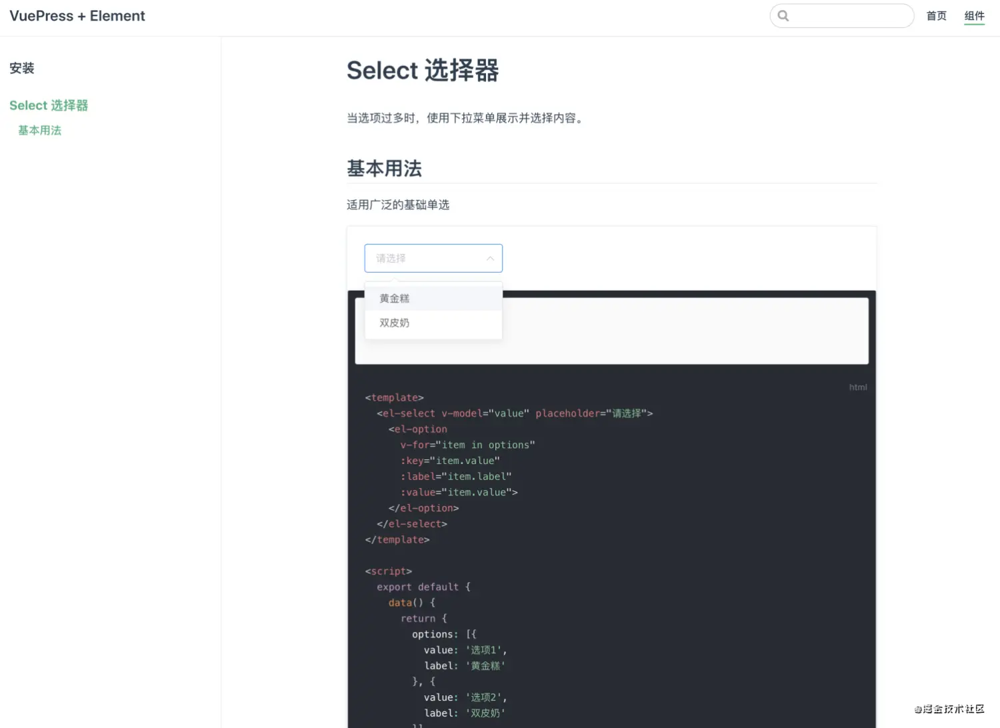

# 如何把写好的代码推送到 npm

> 首先要有一个 npm 账号 ，账号需要邮箱验证
>
> "build-bundle": "vue-cli-service build --target lib --name yzl-ui ./src/packages/index.js"
>
> 最后一项写本地入口文件

- npm run build-bundle
- npm login 登录
- npm publish 推送
- npm unpublish yzl-ui -force 强制删除一个包

```json
需要填写的信息依次是：
package name: 包的名称
version: 版本号
description: 包的描述
private: false, 写false说明包开业给人用
main:默认引入的是谁 一定要写
/*
	main属性主要使用在引用或者开发某个依赖包的时候需要此属性的支持，不然工程中无法用import导入依赖包；
不使用main属性的话我们可能需要这样写引用：require("some-module/dist/app.js")
	main如果写过main:'/dist/app.js'
	我们就可以直接require("some-module")
*/

entry point: 入口文件，默认是index.js
test command: 测试命令，可以不填直接回车
git repository: 提供git个人仓库，可以不填，直接回车
keywords： testplugin (项目的关键词，npm搜索关键词)
author: 作者名称
license: (ISC) 包遵循的开源协议，默认是ISC
```

# 如何写一个 vue ui 库（调试）

- 首先创建一个 vue3.0 项目 packages 专门放组件 index.js 是入口文件

`index.js`

```js
import yzl_Button from "./Button/index.vue";
// 按需引入
export const yzlButton = yzl_Button;
export default function (app) {
  // 全局引入
  return function install() {
    let allComponent = require.context(".", true, /\.vue/);
    allComponent.keys().forEach((item) => {
      // 注册全局组件
      app.component(
        allComponent(item).default.name,
        allComponent(item).default
      );
    });
  };
}
```

## 按钮 yzl-Button

> 思路：通过 props 传参改变添加控件类名 用 sass 的@each 循环添加样式 因为同一个控件会根据参数不同会有很多样式所以参数样式都是变量写好了

```vue
<template>
  <div class="yzl-box">
    <button ref="yzl_Button" class="yzl-Button" :class="props.type">
      <slot></slot>
    </button>
  </div>
</template>

<script>
import { toRefs, reactive, ref, onMounted } from "vue";
export default {
  name: "yzl-Button",
  props: {
    // 按钮类型
    type: {
      type: String,
      default: "primary",
      validator: (value) => {
        if (
          value &&
          !["primary", "success", "info", "warning", "danger"].includes(value)
        ) {
          throw new Error("类型错误");
        }
        return true;
      },
    },
    // 是否朴素
    plain: {
      type: Boolean,
      default: false,
    },
  },
  setup(props) {
    const state = reactive({});
    let yzl_Button = ref(null);
    onMounted(() => {
      // 朴素元素
      if (props.plain) {
        yzl_Button.value.classList.add(props.type + "plain");
      }
    });
    return {
      ...toRefs(state),
      props,
      yzl_Button,
    };
  },
};
</script>

<style lang="scss" scoped>
@import "./index.scss";
.yzl-box {
  .yzl-Button {
    width: 90px;
    height: 40px;
    border-radius: 5px;
    -webkit-outline: none;
    color: white;
  }

  @each $type,
    $color
      in (
        primary: $primaryBgColor,
        success: $successBgColor,
        info: $infoBgColor,
        warning: $warningBgColor,
        danger: $dangerBgColor
      )
  {
    .#{$type} {
      background-color: #{$color};
      border: none;
      outline: none;
    }
  }

  // 鼠标悬浮
  @each $type,
    $color
      in (
        primary: $primaryBgColor,
        success: $successBgColor,
        info: $infoBgColor,
        warning: $warningBgColor,
        danger: $dangerBgColor
      )
  {
    .#{$type}:hover {
      background-color: #{$color};
      opacity: 0.8;
      border: none;
      outline: none;
    }
  }

  // 朴素模式
  @each $type,
    $color
      in (
        primaryplain: $primarycPlainBgColor,
        successplain: $successcPlainBgColor,
        infoplain: $infocPlainBgColor,
        warningplain: $warningcPlainBgColor,
        dangerplain: $dangercPlainBgColor
      )
  {
    .#{$type} {
      background-color: #{$color};
      border: none;
      outline: none;
      color: #000;
    }
  }

  @each $type,
    $color
      in (
        primaryplain: $primaryBgColor,
        successplain: $successBgColor,
        infoplain: $infoBgColor,
        warningplain: $warningBgColor,
        dangerplain: $dangerBgColor
      )
  {
    .#{$type} {
      border: none;
      outline: none;
      color: #{$color};
      border: 1px solid #{$color};
    }
  }

  @each $type,
    $color
      in (
        primaryplain: $primaryBgColor,
        successplain: $successBgColor,
        infoplain: $infoBgColor,
        warningplain: $warningBgColor,
        dangerplain: $dangerBgColor
      )
  {
    .#{$type}:hover {
      border: none;
      outline: none;
      color: white;
      border: 1px solid #{$color};
      background-color: #{$color};
    }
  }
}
</style>
```

# 生成一个线上 UI 文档

- vue 使用 vuepress
- react 使用 Docusaurus

## vuepress2.0 使用方法

首先我们要知道 2.0 版本之前 vue 使用的是 vue2.0 版本 vuepress2.0 使用 vue3.0 版本 因为我们组件是基于 vue3.0 开发的 所以我们使用`vuepress2.0`

> https://www.jianshu.com/p/93c532cdf951 我是基于这篇博客学习 vuepress 2.0 之前的构建流程写的不错

### 安装

- **步骤 1**: 创建并进入一个新目录

  ```bash
  mkdir vuepress-starter
  cd vuepress-starter
  ```

- **步骤 2**: 初始化项目

  ```bash
  git init
  npm init
  ```

- **步骤 3**: 将 VuePress 安装为本地依赖

  ```bash
  npm install -D vuepress@next
  ```

- **步骤 4**: 在 `package.json` 中添加一些 scripts

  ```json
  {
    "scripts": {
      "docs:dev": "vuepress dev docs",
      "docs:build": "vuepress build docs"
    }
  }
  ```

- **步骤 6**: 创建你的第一篇文档

  ```bash
  mkdir docs
  echo '# Hello VuePress' > docs/README.md
  ```

- **步骤 7**: 在本地启动服务器来开发你的文档网站

  ```bash
  npm run docs:dev
  ```

  到这一步我们就可以启动项目

  `docs/README.md` 中写什么页面上就是什么了

### 创建首页

> 这里写你首屏要显示的东西

新建 `docs/README.md`

```bash
---
home: true
heroImage: https://artice-code-1258339218.cos.ap-beijing.myqcloud.com/vuepress/element-index.png
heroText: Element
features:
- title: 一致性 Consistency
  details: 与现实生活一致：与现实生活的流程、逻辑保持一致，遵循用户习惯的语言和概念
- title: 反馈 Feedback
  details: 通过界面样式和交互动效让用户可以清晰的感知自己的操作
- title: 效率 Efficiency
  details: 界面简单直白，让用户快速识别而非回忆，减少用户记忆负担。
footer: by饿了么
---

### 设计原则

<div style="display:flex;justify-content: space-between;padding-bottom:40px">
  <div style="display: flex;flex-direction: column;align-items: center;">
    
    <p style="margin:5px">一致性</p>
    <p style="margin:0px;font-size: 12px;color:#666">Consistency</p>
  </div>
  <div style="display: flex;flex-direction: column;align-items: center;">
    
    <p style="margin:5px">反馈</p>
    <p style="margin:0px;font-size: 12px;color:#666"> Feedback</p>
  </div>
  <div style="display: flex;flex-direction: column;align-items: center;">
    
    <p style="margin:5px">效率</p>
    <p style="margin:0px;font-size: 12px;color:#666">Efficiency</p>
  </div>
  <div style="display: flex;flex-direction: column;align-items: center;">
    
    <p style="margin:5px">可控</p>
    <p style="margin:0px;font-size: 12px;color:#666">Controllability</p>
  </div>
</div>
```

### 创建配置文件

新建 `docs/.vuepress/config.js` ，填入基本的配置信息。注意，这个文件是 VuePress 最核心的一个文件，有着丰富的配置项。

```javascript
module.exports = {
  title: "VuePress2.0 + yzl-ui",
  description: "VuePress搭建Element的组件库文档教程示例代码",
  base: "/",
  port: "8080",
  themeConfig: {},
  head: [],
  plugins: [],
  markdown: {},
};
```

### 新建组件页的`.md`文件

创建 `/docs/comps/README.md` , 填入内容。这里模仿的是 Element 官网的[安装页面](https://links.jianshu.com/go?to=https%3A%2F%2Felement.eleme.cn%2F%23%2Fzh-CN%2Fcomponent%2Finstallation%23an-zhuang)。

````markdown
# 安装

## npm 安装

推荐使用 npm 的方式安装，它能更好地和 webpack 打包工具配合使用。

npm i element-ui -S

## CDN

目前可以通过 unpkg.com/element-ui 获取到最新版本的资源，在页面上引入 js 和 css 文件即可开始使用。

```html
<!-- 引入样式 -->
<link
  rel="stylesheet"
  href="https://unpkg.com/element-ui/lib/theme-chalk/index.css"
/>
<!-- 引入组件库 -->
<script src="https://unpkg.com/element-ui/lib/index.js"></script>
```
````

创建 `/docs/comps/select.md`，填入内容。创建两个文件是方便我们之后设置文档侧边栏, 这里模仿的是 Element 官网的[选择器组件页面](https://links.jianshu.com/go?to=https%3A%2F%2Felement.eleme.cn%2F%23%2Fzh-CN%2Fcomponent%2Fselect)。

```markdown
# Select 选择器

当选项过多时，使用下拉菜单展示并选择内容。

## 基本用法

适用广泛的基础单选
```

### 配置顶部导航栏和侧边栏

```javascript
module.exports = {
  theme: "",
  title: "VuePress2.0 + yzl-ui",
  description: "VuePress搭建Element的组件库文档教程示例代码",
  base: "/",
  port: "8080",
  themeConfig: {
    navbar: [
      {
        text: "首页",
        link: "/",
      },
      {
        text: "组件",
        link: "/comps/",
      },
    ],
    sidebar: {
      // 配置侧边栏部分
      "/comps/": ["/comps/", "/comps/select.md"],
    },
  },
  head: [],
  plugins: [],
  markdown: {},
};
```

### 组件展示效果实现

可是到目前为止，我们还没有引入 Element 的组件部分，既然是一个组件库，我们自然希望实现像 Element 这样，上面有组件的展示，下面是示例的代码。这一部分我们就来看看如何实现这个效果吧


### 安装 Demo 插件

vuepress2.0 不让使用这个插件

这里我们会使用到一个 `vuepress-plugin-demo-container` 这个插件，使用以下命令安装

```bash
npm install vuepress-plugin-demo-container
```

然后在`/docs/.vuepress/config.js`文件中配置上该插件

```bash
module.exports = {
  // ...
  plugins: ['demo-container'], // 配置插件
  markdown: {}
}
```

### 自己写的组件存放位置

把之前写好的组件放到`\docs\.vuepress\packages`中


### 认识 clientAppEnhance.js

> 注意 ： vuepress2.0 之前`clientAppEnhance.js`叫做`enhanceApp.js`
>
> 参数也有所不同 如果你是 vue3.0 的 ui 组件你需要使用 app 注册全局组件 细节看官方文档

你有没有想过我们平时在项目里面使用 Element，需要在 `app.js` 中引入 Element，并调用 `Vue.use(Element)` 才能够在 Vue 中使用 Element 的组件，那么我们如果想在 VuePress 中使用 Element，我们需要去哪里编写这段代码呢？

此时我们需要认识一个新的文件`clientAppEnhance.js`，它算是 VuePress 中仅此于`config.js` 第二重要的文件了，当你想做一些 Vue 应用级别的配置时，就需要在这个文件里面配置。让我们在新建该文件吧：`/docs/.vuepress/clientAppEnhance.js`。

#### enhanceApp.js vue2.0 全局挂载

```bash
import ElementUI from 'element-ui';
import 'element-ui/lib/theme-chalk/index.css';

export default async ({
  Vue
}) => {
  if (typeof process === 'undefined') {
    Vue.use(ElementUI)
  }
}
```

#### clientAppEnhance.js vue3.0 全局挂载

```
import { defineClientAppEnhance } from '@vuepress/client'
import ElementPlus from 'element-plus';
import 'element-plus/lib/theme-chalk/index.css';
import yzlUI from './packages/index.js';

export default defineClientAppEnhance(({ app, router, siteData }) => {
  // app.use(yzlUI(app));
  app.use(yzlUI(app));
  app.use(ElementPlus);
})
```

### 引入组件

接下来我们在刚才创建的`/docs/comps/select.md`中使用 Element 试试看吧。使用下面的内容替换原有的内容吧。在/docs/comps/xxx.md 写全局组件即可渲染


# Select 选择器

当选项过多时，使用下拉菜单展示并选择内容。

## 基本用法

适用广泛的基础单选

::: demo 适用广泛的基础单选

```html
<script>
  export default {
    data() {
      return {
        options: [
          {
            value: "选项1",
            label: "黄金糕",
          },
          {
            value: "选项2",
            label: "双皮奶",
          },
        ],
        value: "",
      };
    },
  };
</script>
```


如果一切顺利的话，我相信你此时应该能够看到以下的效果了：



### 打包上线文档

`\docs\.vuepress\config.js`

```js
module.exports = {
  /*
		这个base很关键  比如你要部署的网站是http://47.98.51.8/yzl-ui/comps/button.html
		外文件夹是什么就取什么名字
		不这样会资源错误
	*/
  base: "/yzl-ui/",
};
```

- npm run docs:build 打包 在`docs/.vuepress`下会生成一个 dist 文件
