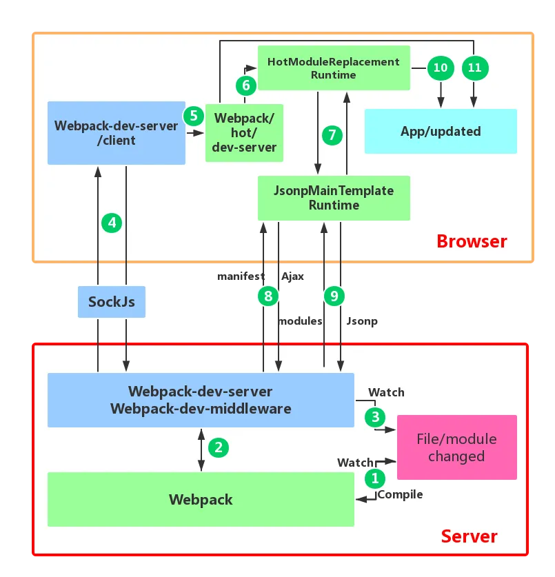

### HMR流程

1. 监听文件变化，重新编译打包
    
2. WDM监控代码变化，并且告诉 webpack，将代码打包到内存中
    
3. `watchContentBase` 为 true 时，WDS 会监听配置文件夹中静态文件的变化，通知浏览器端进行 live reload。
    
4. 建立websorket长连接，将 webpack 编译打包的各个阶段的状态信息告知浏览器端，传递新模块的 hash
    
5. webpack/hot/dev-server 的根据WDS/client 传给它的信息和 dev-server 的配置决定是reload还是HMR
    
6. HotModuleReplacement.runtime 是客户端 HMR 的中枢，它接收新模块的 hash 值
    
7. JsonpMainTemplate.runtime
    
8. JsonpMainTemplate.runtime 向 server 端发送 Ajax 请求，服务端返回一个 json，该 json 包含了所有要更新的模块的 hash 值，
    
9. 再次通过 jsonp 请求，获取到最新的模块代码
    
10. HotModulePlugin 将会对新旧模块进行对比，决定是否更新模块，在决定更新模块后，检查模块之间的依赖关系，更新模块的同时更新模块间的依赖引用。
    
11. 当 HMR 失败后，回退到 live reload 操作，浏览器刷新
    

### **核心流程总结：**

1. 使用 `webpack-dev-server` (后面简称 WDS)托管静态资源，同时以 Runtime 方式注入 HMR 客户端代码
    
2. 浏览器加载页面后，与 WDS 建立 WebSocket 连接
    
3. Webpack 监听到文件变化后，增量构建发生变更的模块，并通过 WebSocket 发送 `hash` 事件
    
4. 浏览器接收到 `hash` 事件后，请求 `manifest` 资源文件，确认增量变更范围
    
5. 浏览器加载发生变更的增量模块
    
6. Webpack 运行时触发变更模块的 `module.hot.accept` 回调，执行代码变更逻辑
    
7. done
    

### 参考资料

[Webpack 原理系列十：HMR 原理全解析](https://zhuanlan.zhihu.com/p/410510492)

[Webpack HMR 原理解析](https://zhuanlan.zhihu.com/p/30669007)

  

## Fast Refresh