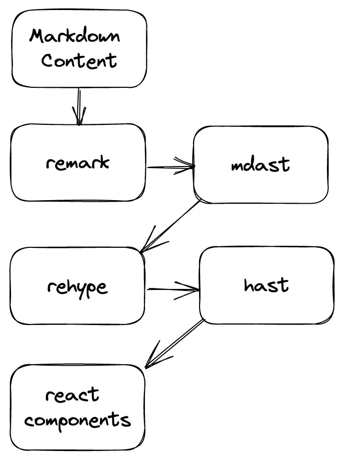

> [Contentlayer](https://www.contentlayer.dev/) 是一个功能强大的静态网站生成器，专为构建和管理静态页面、网站和博客而设计。它提供了一种简单而灵活的方式来创建和组织内容，可以将`Markdown`文件转换为静态`HTML`页面。


## 使用
基于Next，安装
```zsh
yarn add contentlayer next-contentlayer -S
```


创建 **contentlayer.config.ts**
```ts

```


## 原理

markdown 处理在[contentlayer](https://www.contentlayer.dev/)中是如何工作的。
[contentlayer](https://www.contentlayer.dev/)使用[remark](https://github.com/remarkjs/remark)将 markdown 解析为[mdast](https://github.com/syntax-tree/mdast)。我们现在可以使用`remark plugins`来修改`mdast`。然后`rehype`发挥作用并将 转换`mdast`为[hast](https://github.com/syntax-tree/hast)。 `rehype plugins`现在可以修改`hast`。最后`hast`将 转换为[react](https://reactjs.org/)组件。




## Markdown优化插件

- **`remark-gfm`**：用于扩展 **`remark`** 的功能，支持 GitHub Flavored Markdown (GFM) 的语法。它可以处理 GFM 的特殊语法，如任务列表、表格等。
- **`remark-math`**：用于在 Markdown 中支持数学公式的渲染。它可以解析 LaTeX 或 MathML 格式的数学公式，并将其转换为 HTML 或其他格式进行显示。
- **`remark-rehype`**：用于将 **`remark`** 的 AST 转换为 **`rehype`** 的 AST。它可以在 **`remark`** 和 **`rehype`** 之间进行转换，以便使用 **`rehype`** 的插件对 Markdown 进行进一步处理。


- **`rehype-pretty-code`**：用于美化代码块的样式和显示。它可以对代码进行语法高亮、添加行号等操作，以提升代码的可读性。
- **`rehype-raw`**：用于保留 HTML 标签的原始内容，而不进行任何转换。它可以用于处理包含自定义 HTML 标签或特殊需求的内容。
- **`rehype-stringify`**：用于将 **`rehype`** 的 AST（Abstract Syntax Tree）转换回 HTML 字符串。它可以将经过处理的 AST 转换为有效的 HTML 代码。
- [`rehype-slug`](https://link.juejin.cn/?target=https%3A%2F%2Fgithub.com%2Frehypejs%2Frehype-slug "https://github.com/rehypejs/rehype-slug"): h1-h6 标签添加 id，用于为标题生成唯一的 slug（URL-friendly string，常用于锚链接）。它可以将标题文本转换为小写、移除特殊字符等，以生成易于处理和识别的 slug。
- [`rehype-autolink-headings`](https://link.juejin.cn/?target=https%3A%2F%2Fgithub.com%2Frehypejs%2Frehype-autolink-headings "https://github.com/rehypejs/rehype-autolink-headings"): 添加锚点


## 自定义rehype 插件处理本地图片
> reference：[Contentlayer with next/image](https://sdorra.dev/posts/2022-12-11-contentlayer-next-image)

**思路**
1. 搜索 `hast` 树，对于每个带`img` 的元素，找到图片真实路径。
2. 利用`sharp`读取图像宽高，创建占位符。(若不使用next/Image可以略过)
3. 将图片复制到`public`文件夹，保持路径一致。
4. 更新`img`标签属性
5. 配置插件

**注意⚠️**
`Rehype` 插件不能是异步的，但图像处理是异步的。这就是为什么我们将 `processImage` 函数的每个结果的 `Promise` 存储在一个数组中，如果所有 `Promise` 都已解决并且工作已完成，则调用 `done` 函数


**Implementation**
编写文件`static-images.ts`

```js
import fs from "fs/promises";
import { Element, Root } from "hast";
import crypto from "node:crypto";
import path from "node:path";
import sharp from "sharp";
import { Plugin } from "unified";
import { visit } from "unist-util-visit";

type Options = {
  sourceRoot: string;
  publicDir: string;
  resourcePath: string;
};

const fileChecksum = async (file: string) => {
  try {
    return checksum(await fs.readFile(file));
  } catch (_) {
    return "";
  }
};

const checksum = (content: Buffer) => {
  return crypto.createHash("sha256").update(content).digest("hex");
};

const copy = async (source: string, sha256sum: string, target: string) => {
  if (sha256sum !== (await fileChecksum(target))) {
    const targetDir = path.dirname(target);

    await fs.mkdir(targetDir, { recursive: true });
    await fs.copyFile(source, target);
  }
};

const createPlaceholder = async (image: sharp.Sharp) => {
  const { width, height } = await image.metadata();
  if (!width || !height) {
    throw new Error("fetched image without width and height");
  }

  const imgAspectRatio = width / height;

  const placeholderImgWidth = 8;
  const placeholderImgHeight = Math.round(placeholderImgWidth / imgAspectRatio);

  return image
    .resize(placeholderImgWidth, placeholderImgHeight)
    .png({
      quality: 75,
    })
    .toBuffer()
    .then((buffer) => `data:image/png;base64,${buffer.toString("base64")}`);
};

const metadata = async (
  resourcePath: string,
  source: string,
  pathname: string
) => {
  const content = await fs.readFile(source);
  const image = await sharp(content);

  const { width, height } = await image.metadata();

  if (!width || !height) {
    return null;
  }

  const src = resourcePath + "/" + pathname;

  const sha256 = checksum(content);

  const blurDataURL = await createPlaceholder(image);
  return {
    sha256,
    props: {
      width,
      height,
      src,
      blurDataURL,
    },
  };
};

const processImage = async (
  options: Options,
  file: any,
  node: Element
): Promise<void> => {
  const root = options.sourceRoot;
  const pathname = path.join(
    file.data.rawDocumentData.sourceFileDir,
    (node.properties?.src as string) || ""
  );
  const source = path.join(root, pathname);

  const meta = await metadata(options.resourcePath, source, pathname);
  if (!meta) {
    return;
  }

  const target = path.join(options.publicDir, pathname);
  await copy(source, meta.sha256, target);

  if (!node.properties) {
    node.properties = {};
  }
  node.properties = {
    ...node.properties,
    ...meta.props,
  };
};

export const staticCoverImage = async (
  sourceRoot: string,
  targetRoot: string,
  resourcePath: string,
  directory: string,
  image: string
) => {
  if (image.includes("://")) {
    return image;
  }

  const source = path.join(sourceRoot, directory, image);
  const content = await fs.readFile(source);
  const sha256sum = checksum(content);
  const target = path.join(targetRoot, directory, image);

  await copy(source, sha256sum, target);

  return `${resourcePath}/${directory}/${image}`;
};

const staticImages: Plugin<[Options], Root> =
  // @ts-ignore
  (options) => (tree, file, done) => {
    const tasks: Promise<void>[] = [];

    visit(tree, "element", (node) => {
      if (node.tagName === "img" && !node.properties.src.includes("://")) {
        tasks.push(processImage(options, file, node));
      }
    });

    Promise.all(tasks).then(() => done());
  };

export default staticImages;

```


`contentlayer.config.js` 中引用该插件
```js
import mdxImages from "./lib/static-images";
...
export default makeSource({
  ...
  mdx: {
    remarkPlugins: [
     ...
    ],
    rehypePlugins: [
      [
        mdxImages,
        {
          publicDir: path.join(process.cwd(), "public"),
          sourceRoot: path.join(process.cwd(), "content"),
          resourcePath: "",
        },
      ],
      ...
    ],
  },
});

```


`Markdown.tsx` 在组件中使用并传递参数
```js
import { useMDXComponent } from "next-contentlayer/hooks";
import type { MDXComponents } from "mdx/types";

const components: MDXComponents = {
  ...
  img: ({ className, ...props }: any) =>
    props.width ? (
      //Image必须指定width/height,若没有该值则用img标签自适应image本身大小
      <Image className={cn("rounded-md border m-auto", className)} {...props} />
    ) : (
      
    ),
};

export function Mdx({ code }: { code: string }) {
  const Component = useMDXComponent(code);

  return (
    <div className="mdx">
      <Component components={components} />
    </div>
  );
}

```