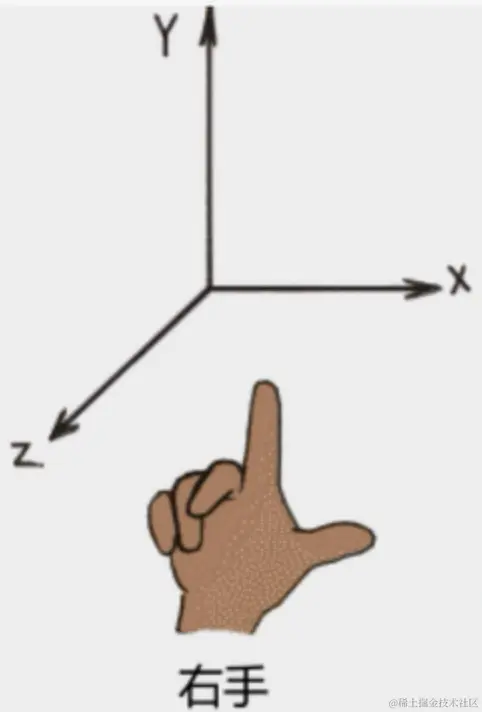
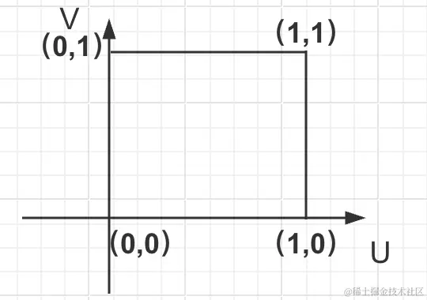

### What's WebGL

WebGL 实际上是**一种 2D API**，而非 3D API。WebGL 只关心 2 个方面。2D 中的**剪裁空间坐标（-1~1）和颜色**。
> 裁剪空间的`x`坐标范围是 -1 到 +1. 这就意味着0在中间并且正值在它右边。
> 
> 裁剪空间中 -1 是最底端 +1 是最顶端， 这也意味值0在中间，正值在上方

WebGL在电脑的GPU中运行。因此你需要使用能够在GPU上运行的代码。 这样的代码需要提供成对的方法。每对方法包含：
- 顶点着色器（`.vert` ）：计算顶点的位置 
- 片段着色器（ `.frag` ）：计算出当前绘制图元中每个像素的颜色值
并且使用一种和C或C++类似的强类型的语言 [GLSL](https://webglfundamentals.org/webgl/lessons/zh_cn/webgl-shaders-and-glsl.html)。 (GL着色语言)。 每一对组合起来称作一个 _program_（着色程序）。

> GLSL全称是 Graphics Library Shader Language （图形库着色器语言），是着色器使用的语言。 它有一些不同于JavaScript的特性，主要目的是为栅格化图形提供常用的计算功能。


对于想要绘制的每一个对象，都需要先设置一系列状态值，然后通过调用 `gl.drawArrays` 或 `gl.drawElements` 运行一个着色方法对，使得你的着色器对能够在GPU上运行。


##### 着色器(shader)获取数据方法
1. **Attributes 属性**  (从缓冲中获取的数据) 缓冲是发送到GPU的一些二进制数据序列，顶点着色器 每一次运行属性会从指定的缓冲中按照指定规则依次获取下一个值。
2.  **Uniforms 全局变量** (在一次绘制中对所有顶点保持一致值)
3. **Textures 纹理** (从像素或纹理元素中获取的数据，来自于图片的数据), 纹理是一个数据序列,*也可以随意存放除了颜色数据以外的其它数据*。
4. **Varyings 可变量**（一种顶点着色器给片断着色器传值的方式）

```js
gl_Position = vec4(x，y,z，w);
gl_FragColor = vec4(r,g,b,a);
```


### Pipeline

#### 1、着色器（shader）& 程序（Program）创建
```js
// 创建着色器对象
gl.createShader(type)
// 提供数据源 source: string
gl.shaderSource(shader, source);
// 编译 -> 生成着色器
gl.compileShader(shader);


// shader的Program程序创建
var program = gl.createProgram();
gl.attachShader(program, vertrexShader);
gl.attachShader(program, fragmentShader);
gl.linkProgram(program);// 连接program


// 使用program
gl.useProgram(program);
```


#### 2、缓存区创建与数据绑定
分类型讲各自的数据绑定的方法
##### 2.1 attribute绑定
在`shader`上声明好变量（ `.vert`文件中变量 `a_position`）
```js
attribute vec4 a_position;
void main() {
	gl_Position = a_position;
}
```

绑定程序并启用这个变量
```js
const positionAttributeLocation = gl.getAttribLocation(program, 'a_position');
// 启用变量
gl.enableVertexAttribArray(positionAttributeLocation);
```

绑定好了与着色器的通信管道，就可以传数据了，数据一般都是使用缓存区来保存
```js
// 创建缓存区
const positionBuffer = gl.createBuffer();


/** 
 * 首先绑定一个数据源到绑定点，然后可以引用绑定点指向该数据源
 * target - 指定绑定点，可以想象成一个WebGL内部的全局变量
 * buffer - 要绑定的缓存区
*/
gl.bindBuffer(gl.ARRAY_BUFFER, positionBuffer);


// 三个二维点坐标
var positions = [
	0, 0,
	0, 0.5,
	0.7, 0,
];
/** 
 * 创建并初始化了 Buffer 对象的数据存储区
 * target
 * size - 缓存区大小
 * srcData
 * usage - 缓存的usage类型
*/
gl.bufferData(gl.ARRAY_BUFFER, new Float32Array(positions), gl.STATIC_DRAW);

```

至此，shader与缓存区的数据+连接都搞定了，最后要打通program与缓存区之间的隔阂
```js
/**
 * 属性绑定到当前的ARRAY_BUFFER
 * size - 每次迭代运行提取size个单位数据
 * type - 每个单位的数据类型
 * normalized - 是否归一化
 * stride - 0 = 移动单位数量 * 每个单位占用内存（sizeof(type)）每次迭代运行运动多少内存到下一个数据开始点
 * offset - 从缓冲起始位置开始读取
*/
gl.vertexAttribPointer(positionAttributeLocation, size, type, normalize, stride, offset);

```
这样我们就把一个顶点的数组传给`program`的顶点着色器里去了

##### 2.2 uniform全局变量传递
在`shader`上声明好变量
```js
uniform vec2 u_resolution;
attribute vec2 a_position;

void main() {
  vec2 zeroToOne = a_position / u_resolution;
  vec2 zeroToTwo = zeroToOne * 2.0;
  vec2 clipSpace = zeroToTwo - 1.0;
  // gl_Position = vec4(a_position, 0, 1);
  gl_Position = vec4(clipSpace * vec2(1, -1), 0, 1);
}
```

绑定program与JS层，传递数据
```js
var resolutionUniformLocation = gl.getUniformLocation(program, 'u_resolution');


// 二维uniform2f，三维uniform3f，四维uniform4f
gl.uniform2f(resolutionUniformLocation, gl.canvas.width, gl.canvas.height)

```


##### 2.3 texture纹理

纹理可以将一个图片贴在我们画好的形状上。
渲染纹理时需要纹理坐标，而不是像素坐标。无论纹理是什么尺寸，纹理坐标范围始终是**0.0 到 1.0** 。
我们需要告诉WebGL矩形中每个顶点对应的纹理坐标。使用**varying**将纹理坐标从顶点着色器传到片段着色器。webgl只提供了绑定顶点着色器上attribute的方法

首先先读取图片
```js
var image = new Image();
  image.src = "./startNight.jpeg";
  image.onload = function () {
	// todo next
	render(image);
  };
```

创建纹理缓存
```js
  // 创建纹理
var texture = gl.createTexture();
gl.bindTexture(gl.TEXTURE_2D, texture);
// 设置参数，让我们可以绘制任何尺寸的图像
// webgl 1.0
gl.texParameteri(gl.TEXTURE_2D, gl.TEXTURE_WRAP_S, gl.CLAMP_TO_EDGE);
gl.texParameteri(gl.TEXTURE_2D, gl.TEXTURE_WRAP_T, gl.CLAMP_TO_EDGE);
// 纹理缩小过滤器
gl.texParameteri(gl.TEXTURE_2D, gl.TEXTURE_MIN_FILTER, gl.NEAREST);
gl.texParameteri(gl.TEXTURE_2D, gl.TEXTURE_MAG_FILTER, gl.NEAREST);

```

纹理数据-> program

```js

gl.texImage2D(gl.TEXTURE_2D, 0, gl.RGBA, gl.RGBA, gl.UNSIGNED_BYTE, image);// 加载的图片
```

纹理位置-> program
```js
const texCoordLocation = gl.getAttribLocation(program, 'a_texCoord');
 // 给矩形提供纹理坐标
var texCoordBuffer = gl.createBuffer();
gl.bindBuffer(gl.ARRAY_BUFFER, texCoordBuffer);
gl.bufferData(gl.ARRAY_BUFFER, new Float32Array([0, 0, 1, 0, 0, 1, 0, 1, 1, 0, 1, 1]), gl.STATIC_DRAW);
gl.enableVertexAttribArray(texCoordLocation);
gl.vertexAttribPointer(texCoordLocation, 2, gl.FLOAT, false, 0, 0);
```


#### 3、渲染
```js

/**
 * 清空画布 
 * clearColor: 指定清空canvas的颜色 
 * clear(mask): mask- 需要清除的缓冲区(颜色/深度/模板)
*/
gl.clearColor(0.0, 0.0, 0.0, 1.0); // 指定清空canvas的颜色 
gl.clear(gl.COLOR_BUFFER_BIT); // 清空canvas

/**
 * 画出形状 
 * mode: 图元类型
 * first: 指定从哪个点开始绘制
 * count: 绘制需要使用到多少个点
*/
gl.drawArrays(gl.TRIANGLES, 0, n);
```


### WebGL 重置画布尺寸
每个画布都有两个尺寸:
- **drawingbuffer** 的尺寸， 这个表示画布中有多少个像素。
- **画布显示** 的尺寸， CSS决定画布显示的尺寸。
```html
<!-- 画布的显示尺寸是 400x300，drawingbuffer 是 10x15 -->
<canvas id="c" width="10" height="15" style="width: 400px; height: 300px;"></canvas>
```


重置画布尺寸时除了需要重置canva的宽高，还需要调用`gl.viewport`设置视域
```js

function drawScene() {
	window.addEventListener("resize", onResize);
	onResize();
	
	gl.viewport(0, 0, gl.canvas.width, gl.canvas.height);
	...
}
onResize() {
	this.canvas.width = window.innerWidth;
	this.canvas.height = window.innerHeight;
}
```


### 坐标系的种类
在webgl中使用贴图前，需要了解的是坐标系的种类。
**canvas坐标系统（左）**：左上角为坐标原点，往右是X轴正方向，往下是Y轴正方向
**顶点坐标系统（中）**：右手坐标系，拇指X方向，食指Y方向，中指为Z方向。
**纹理坐标系统（右）**：纹理坐标为`UV`，`U`代表水平坐标，`V`代表垂直坐标。

|  |  |  |
| :----------------------------------------------------------: | :---------------------------------------------------------------: | ------------------------------------------------------------ |


### Summary
初始化阶段

- 创建所有着色器和程序并寻找参数位置 `gl.getUniformLocation`
- 创建缓冲并上传顶点数据
- 创建纹理并上传纹理数据

渲染阶段

- 清空并设置视图和其他全局状态（开启深度检测，剔除等等）
- 对于想要绘制的每个物体
    - 调用 `gl.useProgram` 使用需要的程序
    - 设置物体的属性变量
        - 为每个属性调用 `gl.bindBuffer`, `gl.vertexAttribPointer`, `gl.enableVertexAttribArray`
    - 设置物体的全局变量
        - 为每个全局变量调用 `gl.uniformXXX`
        - 调用 `gl.activeTexture` 和 `gl.bindTexture` 设置纹理到纹理单元
    - 调用 `gl.drawArrays` 或 `gl.drawElements`

编译着色器

>  [WebGL 码少趣多](https://webglfundamentals.org/webgl/lessons/zh_cn/webgl-less-code-more-fun.html)
>  
>  [典型的WebGL着色程序模板](https://webglfundamentals.org/webgl/lessons/zh_cn/webgl-boilerplate.html)，

###  Reference
[WebGL 基础知识](https://web.dev/articles/webgl-fundamentals?hl=zh-cn)

[MDN WebGL API](https://developer.mozilla.org/zh-CN/docs/Web/API/WebGL_API)

[WebGL 基础概念](https://webglfundamentals.org/webgl/lessons/zh_cn/webgl-fundamentals.html#toc)

[带你快速入门webgl与shader着色器渲染基础](https://blog.csdn.net/gdutRex/article/details/107658328)

[WebGL状态可视化](https://webglfundamentals.org/webgl/lessons/resources/webgl-state-diagram.html)

https://thebookofshaders.com/02/?lan=ch