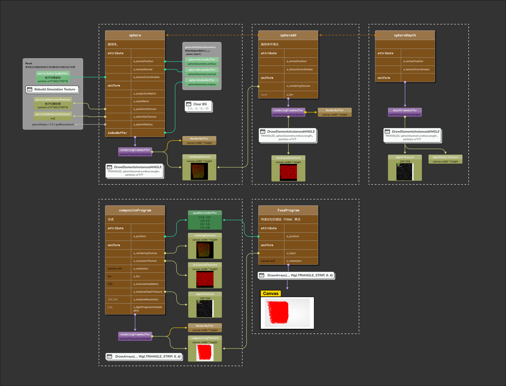
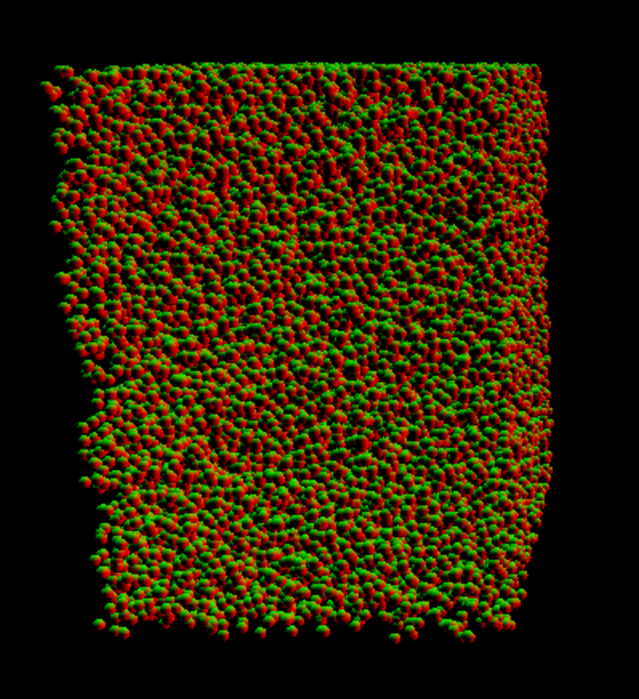
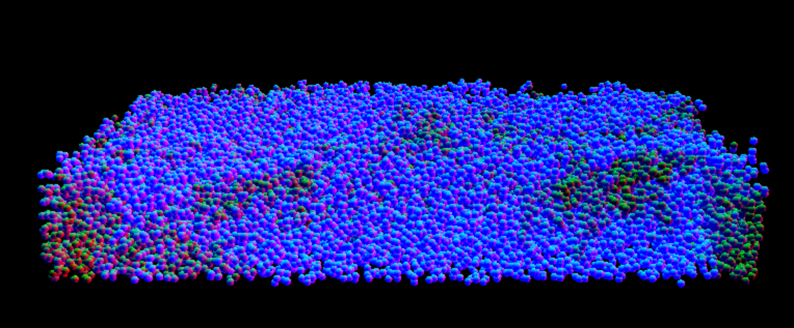
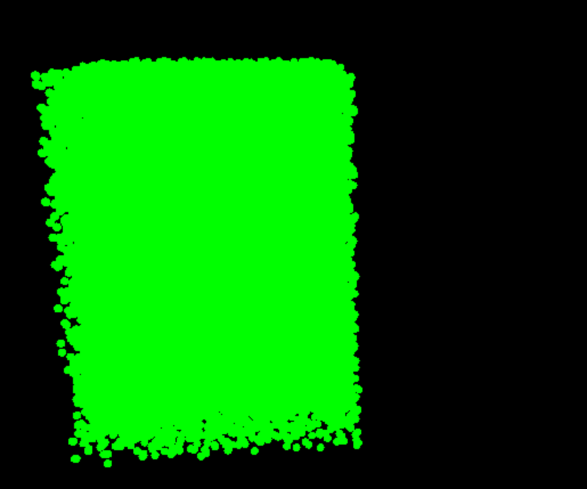
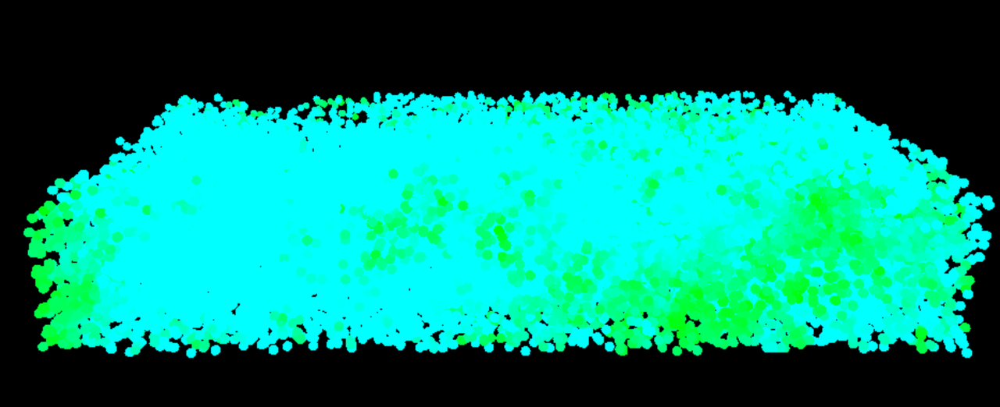

> 针对[https://github.com/dli/fluid](https://github.com/dli/fluid)该代码修改艺术粒子效果
> [http://david.li/fluid](http://david.li/fluid) ([video](http://www.youtube.com/watch?v=DhNt_A3k4B4))
> 粒子系统是模拟中的核心，采用了PIC/FLIP方法来模拟流体动力学。GPU并行处理能力的利用大大提升了模拟速度和渲染性能，而球形环境光遮挡体积技术+ PCF(Percentage Closer Filtering)则增强了3D模型的真实感。
> 


## pipeline梳理



### 球体渲染

#### 粒子颜色

以延迟的方式渲染到一个特殊的RGBA纹理格式: **(normal.x,normal.Y,speed,depth)**

法线被归一化（因此z可以用sqrt（1.0 - x * x - y * y）重建）,深度就是视图空间中的z

```js
// sphere.frag --特殊的RGBA纹理格式(x,y ,speed,depth)
gl_FragColor = vec4(v_viewSpaceNormal.x, v_viewSpaceNormal.y, v_speed, v_viewSpacePosition.z);
```

根据空间发现坐标调整red，green色值  

|  |  |
| :--: | :--: |
|  |  |


根据速度调整blue色值

|  |  |
| :----: | :----: |
|  |  |


### 球形绘制
#### ANGLE_instanced_arrays
WebGL中实例化渲染的扩展。实例化渲染允许您在单个绘制调用中多次使用相同的几何体，并对每个实例应用不同的属性（如颜色、位置、大小等）。
- `drawArraysInstancedANGLE(mode, first, count, primcount)` ： 类似`gl.drawArrays()`
- `vertexAttribDivisorANGLE(index, divisor)`：用于设置通用顶点属性的分频器（divisor）。分频器确定属性在多个实例之间的更新频率。
- `drawElementsInstancedANGLE(mode,count,type,offset,primcount)`：类似`gl.drawElements()
	- `mode`：图元类型
	- `count`：绘制索引数量
	- `type`：索引数组数据类型
	- `offset`：索引数组偏移量
	- `primcount`：绘制实例数量


```js
 wgl.drawElementsInstancedANGLE(
  sphereDrawState,
  wgl.TRIANGLES, //三角形
  this.sphereGeometry.indices.length, //索引数量
  wgl.UNSIGNED_SHORT,
  0,
  this.particlesWidth * this.particlesHeight // 512*60个实例
);

```


### 模拟粒子

传递粒子速度到网格，我们分两步向网格传递粒子速度：

1. 我们将weight * velocity累加到tempVelocityTexture中，然后将weight累加到weightTexture中
2. velocityTexture = tempVelocityTexture / weightttexture

我们累积到velocityWeightTexture，然后划分到velocityTexture


### 最终效果
根据输入图片初始化赋值粒子颜色，随位移变化不变


根据输入图片，赋值粒子颜色，保持图片不变


### Reference
[# fluid:流体颗粒-http - 实时3D流体模拟与WebGL渲染](https://blog.csdn.net/weixin_42594427/article/details/142328230)

[WebGL入门-WebGL常用API说明详解_webgl api-CSDN博客](https://blog.csdn.net/qw8704149/article/details/115152067)