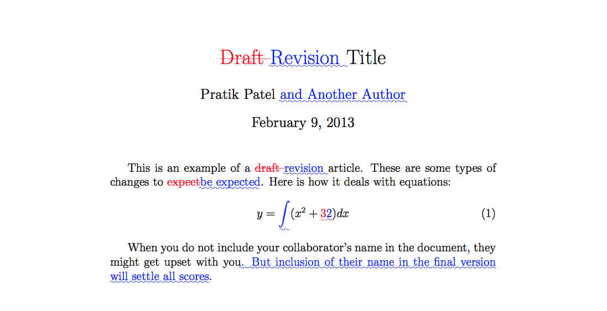

[latexdiff](https://github.com/ftilmann/latexdiff)是一个开源Perl脚本，用于比较两个latex文件并标记它们之间的显著差异。使用标准latex包(如color.sty)进行可视化标记，并可以使用各种选项。Perl脚本latexrevision提供了一个基本的修订工具，它接受或拒绝所有更改。手动编辑差异文件可用于覆盖此默认行为，并仅接受或拒绝所选更改。


## Usage
**安装**
```bash
brew install latexdiff

# M1
arch -arm64 brew install latexdiff

# 验证
latexdiff
```

**使用**
使用前需要先生成`.bbl`文件，我使用Texifier软件编译后可以直接去`.texpadtmp`文件中找到，移动到与tex文件同级即可

```bash
latexdiff [OPTIONS] old.tex new.tex > diff.tex

latexdiff --flatten old.tex new.tex > diff.tex

latexdiff old.tex new.tex --type=UNDERLINE > diff.tex


# 编译pdf
pdflatex -interaction=nonstopmode diff.tex
```

完整参数可以参考[官网文档](https://mirrors.concertpass.com/tex-archive/support/latexdiff/doc/latexdiff-man.pdf)

- `--flatten`：如果latext分别在两个文件夹下，内容中有的`\input`和`\include`命令。在共同文件夹下执行latexdiff，并使用该参数平铺。*无法flatten图片*
- `--type/-t`：此处的markupstyle叫做标注风格，默认值是UNDERLINE，意思是用蓝字加下划线标注添加，用红色加删除线标注删除。（可选值：CTRADITIONAL/TRADITIONAL/CFONT/BOLD）



## 插件
latexdiff这个工具自带了两个其他的工具，分别是latexrevise和latexdiff-vc，无需额外安装。
**latexrevise** 可以帮助我们将diff.tex中的标记全部删掉

|参数|描述|参数使用|
|---|---|---|
|SIMPLIFY|仅保留添加删除两类标注|-s 或–simlify|
|ACCEPT|仅保留添加标注内的内容|-a 或–accept|
|DECLINE|仅保留删除标注的内容|-d 或 --decline|
```bash
# 接受所有修改
latexrevise -a diff.tex > accept.tex
# 回滚所有修改，还原回未修改的版本
latexrevise -d diff.tex > decline.tex
```


## Reference
[How to use latexdiff to compare changes in .bib files?](https://tex.stackexchange.com/questions/625608/how-to-use-latexdiff-to-compare-changes-in-bib-files)
