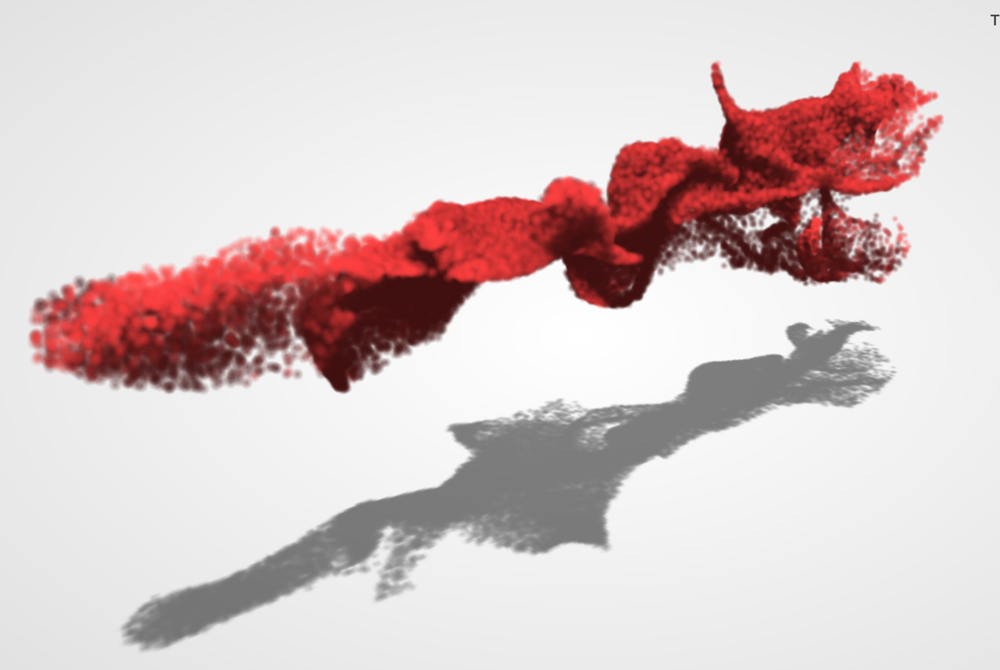
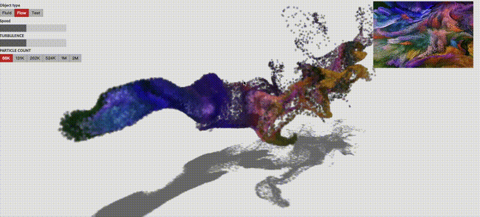

> 针对https://github.com/dli/flow该代码修改艺术粒子效果
> WebGL + curl noise + half-angle slice rendering + incremental odd-even merge sort
> WebGL +旋度噪声+半角切片渲染+增量奇偶合并排序

该方法没有实现粒子效果，绘制POINT，且没有用到实例渲染，性能估计会差一些
但是将粒子模拟放到GPU中，计算会快

## curl noise

> [GraphicsLab Project 之 Curl Noise - i_dovelemon - 博客园](https://www.cnblogs.com/idovelemon/p/12775127.html)

所谓 Curl Noise，即是对一个随机向量场，进行 Curl 操作之后得到的新场。因为满足散度为 0 的特性，所以这个场看上去就具有流体的视觉特性。如果用这个场作为速度去控制粒子，即可得到开头视频中流动的效果

## 最终效果

