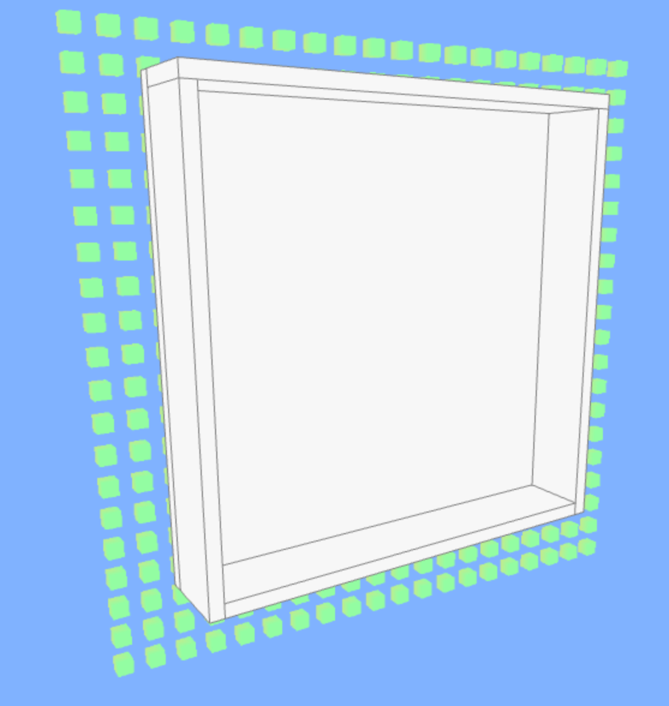
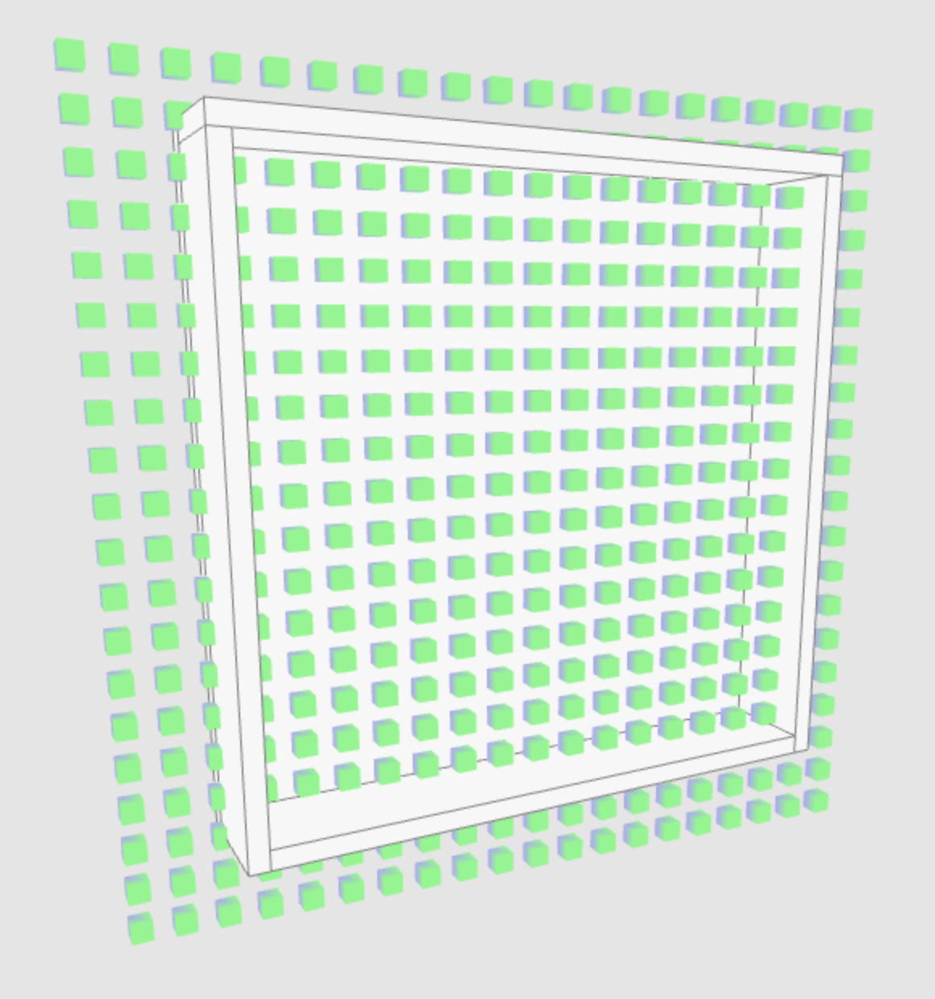

> 离屏渲染就是利用帧缓存渲染到纹理，但是再将texture渲染到canvas的和实时渲染到canvas的两个物体会失去深度叠加

|  |  |
| --------------------------------------------------- | --------------------------------------------------- |

方块是利用实例化渲染到纹理中，再将纹理映射到canvas。box是直接渲染到canvas。因此两种需要同时选择离屏或者实时渲染方式，不能混用。

### 与实时渲染的优缺点比较：
离屏渲染：
1.在变化的场景下，因为离屏渲染需要创建一个新的缓冲区，且需要多次切换上下文环境，所以代价很高；
2.在稳定的场景下，离屏渲染可以采用一张纹理进行渲染，所以性能较当前屏渲染有较大提升。
从上述对比可以看出，**在稳定场景下使用离屏渲染的优势较大**。

### 帧缓冲FBO

