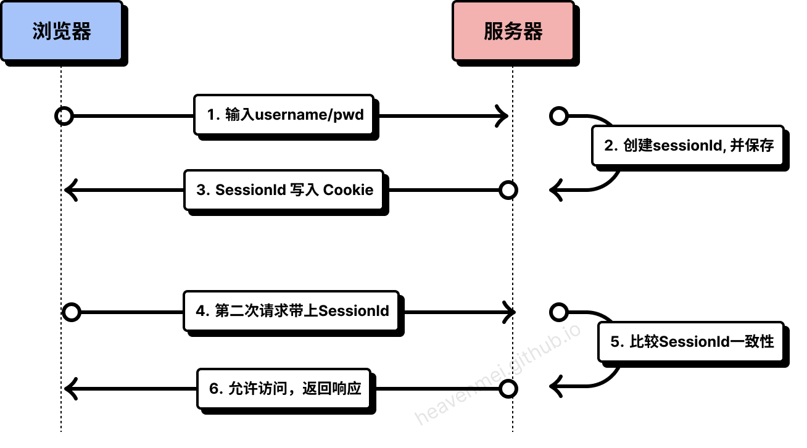
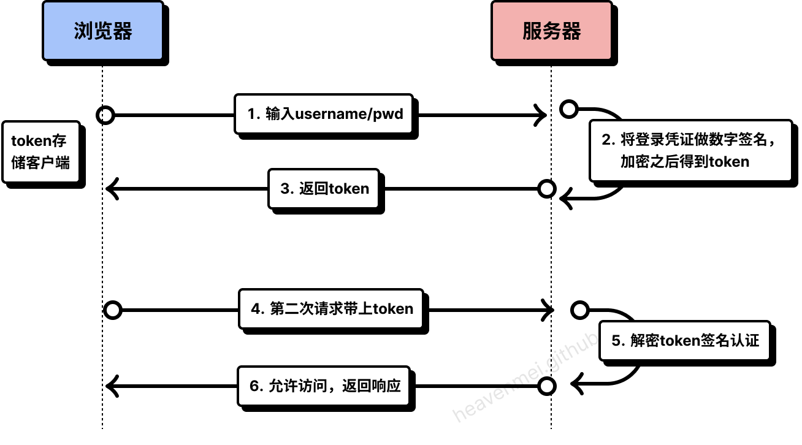
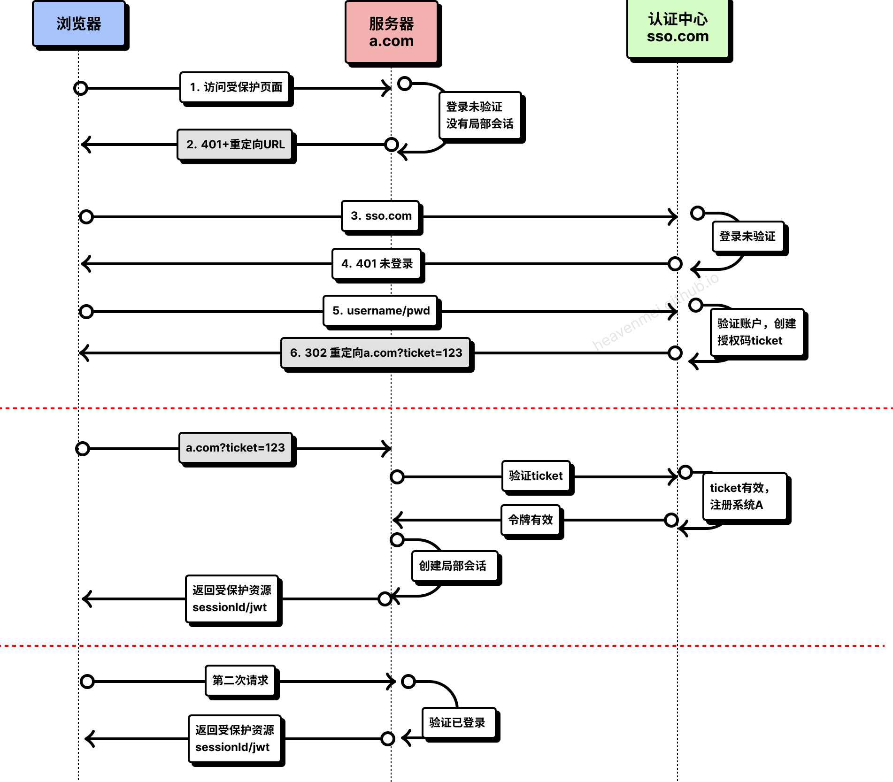
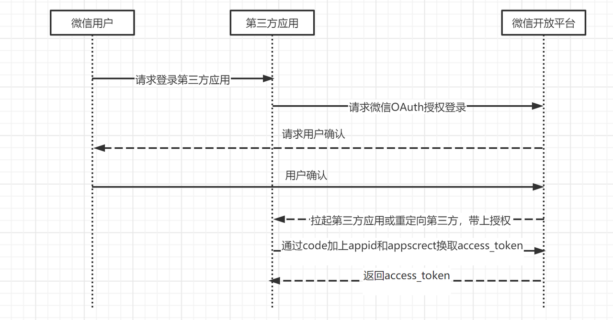
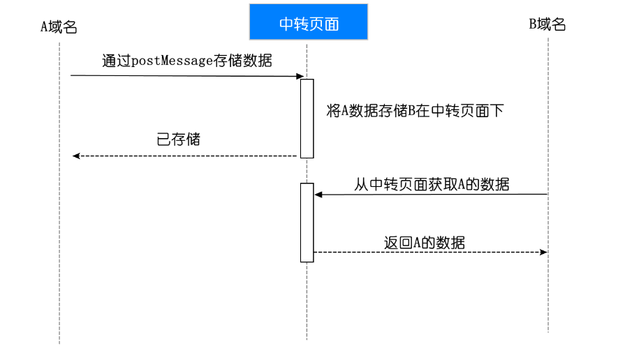

> 认证：Authentication，验证当前用户的身份
> 
> 授权：Authorization， 用户授予第三方应用访问该用户某些资源的权限
> 
> 凭证：Credentials，实现认证和授权的前提是需要一种证书来标记访问者的身份


**常见的前后端鉴权方式**
1. 基于Session-Cookie
2. 基于Token 验证（包括 JWT，SSO）
3. OAuth2.0（开放授权）

## Cookie + Session 登录
HTTP 是一种无状态的协议，客户端每次发送请求时，首先要和服务器端建立一个连接，在请求完成后又会断开这个连接。这种方式可以节省传输时占用的连接资源，但同时也存在一个问题：**每次请求都是独立的，服务器端无法判断本次请求和上一次请求是否来自同一个用户，进而也就无法判断用户的登录状态。**


Cookie 是服务器端发送给客户端的一段特殊信息，这些信息以文本的方式存放在客户端，客户端每次向服务器端发送请求时都会带上这些特殊信息。

有了 Cookie 之后，服务器端就能够获取到客户端传递过来的信息了，如果需要对信息进行验证，还需要通过 Session。

 客户端请求服务端，服务端会为这次请求开辟一块内存空间，这个便是 Session 对象。

有了 Cookie 和 Session 之后，我们就可以进行登录认证了

#### 流程




1. 用户访问页面，并输入密码登录。
2. 服务器验证密码无误后，会创建 SessionId，并将它保存起来。
3. 服务器端响应这个 HTTP 请求，并通过 Set-Cookie 头信息，**将 SessionId 写入 Cookie 中。** （服务器端的 SessionId 可能存放在很多地方，例如：内存、文件、数据库等。）
4. 在后续请求中，自动带上第一次登录时写入的 Cookie。
5. 服务器端比对 Cookie 中的 SessionId 和保存在服务器端的 SessionId 是否一致。
6. 一旦用户注销应用程序，会话将在客户端和服务器端都被销毁


#### Cookie + Session 存在的问题

虽然我们使用 Cookie + Session 的方式完成了登录验证，但仍然存在一些问题：

- 由于服务器端需要对接大量的客户端，也就需要==存放大量的 SessionId==，这样会导致服务器压力过大。
- 如果服务器端是一个集群，为了同步登录态，需要将 SessionId 同步到每一台机器上，无形中增加了服务器端维护成本。
- 由于 SessionId 存放在 Cookie 中，所以==无法避免 CSRF 攻击==。

## Token 登录
Token 是服务端生成的一串字符串，以作为客户端请求的一个令牌。当第一次登录后，服务器会生成一个 Token 并返回给客户端，客户端后续访问时，只需带上这个 Token 即可完成身份认证。

1. 用户输入其登录信息
2. 服务器验证信息是否正确，并返回已签名的token
3. **token储在客户端**，例如存在local storage或cookie中
4. 之后的HTTP每一次请求都需要携带 token，需要把 token 放到 HTTP 的 Header 里
5. 服务器解码JWT，并且如果令牌有效，则接受请求
6. 一旦用户注销，令牌将在客户端被销毁，不需要与服务器进行交互一个关键是，令牌是无状态的。后端服务器不需要保存令牌或当前session的记录。


#### Token 机制的特点

根据上面的案例，我们可以分析出 Token 的优缺点：

- 服务器端不需要存放 Token，所以不会对服务器端造成压力，即使是服务器集群，也不需要增加维护成本。
- Token 可以存放在前端任何地方，可以不用保存在 Cookie 中，提升了页面的安全性。
- Token 下发之后，只要在生效时间之内，就一直有效，如果服务器端想收回此 Token 的权限，并不容易。

#### Token 的生成方式

最常见的 Token 生成方式是使用 JWT（Json Web Token）。一个jwt实际上就是一个字符串，它由三部分组成，头部、载荷与签名，这三个部分都是json格式。

JWT 算法主要分为 3 个部分：header（头信息），playload（消息体），signature（签名）。

```js
header = '{"alg":"HS256","typ":"JWT"}'   
// `HS256` 表示使用了 HMAC-SHA256 来生成签名。
payload = '{"loggedInAs":"admin","iat":1422779638}'     
//iat 表示令牌生成的时间
```

- header 部分指定了该 JWT 使用的签名算法:
- playload 部分表明了 JWT 的意图：    
- signature 部分为 JWT 的签名，主要为了让 JWT 不能被随意篡改，签名的方法分为两个步骤： 
	- 输入base64url编码的 header 部分、base64url编码的 playload 部分，输出 unsignedToken。
	- 输入服务器端私钥、unsignedToken，输出 signature 签名。


#### 适合使用jwt的场景


- 有效期短
- 一次性特点

比如，用户注册后发一封邮件让其激活账户，通常邮件中需要有一个链接，这个链接需要具备以下的特性：能够标识用户，该链接具有时效性（通常只允许几小时之内激活），不能被篡改以激活其他可能的账户，一次性的。这种场景就适合使用jwt。


## SSO 单点登录

单点登录指的是在公司内部搭建一个**公共的认证中心**，公司下的所有产品的登录都可以在认证中心里完成，一个产品在认证中心登录后，再去访问另一个产品，可以不用再次登录，即可获取登录状态。



1. 用户访问网站a.com下的 pageA 页面。(==返回401+重定向url==，图中错了)
2. 由于没有登录，则会重定向到认证中心，并带上回调地址www.sso.com?return_uri=a.com/pageA，以便登录后直接进入对应页面
3. 用户在认证中心输入账号密码，提交登录。
4. 认证中心验证账号密码有效，然后**重定向a.com?ticket=123带上授权码 ticket，并将认证中心sso.com的登录态写入 Cookie**（==放在url中重定向，cookie有跨域问题==）。
5. 在a.com服务器中，拿着 ticket 向认证中心确认，授权码 ticket 真实有效。
6. 验证成功后，服务器将登录信息写入 Cookie（此时客户端有 2 个 Cookie 分别存有a.com和sso.com的登录态）。

认证中心登录完成之后，继续访问a.com下的其他页面。这个时候，由于a.com存在已登录的 Cookie 信息，所以服务器端直接认证成功。

如果认证中心登录完成之后，访问b.com下的页面。这个时候，由于认证中心存在之前登录过的 Cookie，所以也不用再次输入账号密码，直接返回第 4 步，下发 ticket 给b.com即可。


> SSO 单点登录退出

目前我们已经完成了单点登录，在同一套认证中心的管理下，多个产品可以共享登录态。现在我们需要考虑退出了，即：在一个产品中退出了登录，怎么让其他的产品也都退出登录？

原理其实不难，可以回过头来看第 5 步，每一个产品在向认证中心验证 ticket 时，其实可以顺带将自己的退出登录 api 发送到认证中心。

当某个产品c.com退出登录时：
1. 清空c.com中的登录态 Cookie。
2. 请求认证中心sso.com中的退出 api。
3. 认证中心遍历下发过 ticket 的所有产品，并调用对应的退出 api，完成退出。


## OAuth 第三方登录

在上文中，我们使用单点登录完成了多产品的登录态共享，但都是建立在一套统一的认证中心下，对于一些小型企业，未免太麻烦，有没有一种登录能够做到开箱即用？

这里以微信开放平台的接入流程为例



1. 首先，a.com的运营者需要在微信开放平台注册账号，并向微信申请使用微信登录功能。
2. 申请成功后，得到申请的 appid、appsecret。
3. 用户在a.com上选择使用微信登录。
4. 这时会跳转微信的 OAuth 授权登录，并带上a.com的回调地址。
5. 用户输入微信账号和密码，登录成功后，需要选择具体的授权范围，如：授权用户的头像、昵称等。
6. 授权之后，微信会根据拉起a.com?code=123，这时带上了一个临时票据 code。
7. 获取 code 之后，a.com会拿着 code 、appid、appsecret，向微信服务器申请 token，验证成功后，微信会下发一个 token。
8. 有了 token 之后，a.com就可以凭借 token 拿到对应的微信用户头像，用户昵称等信息了。
9. a.com提示用户登录成功，并将登录状态写入 Cooke，以作为后续访问的凭证。


## 总结
上文介绍了 4 种常见的登录方式，原理应该大家都清楚了，总结一下这 4 种方案的使用场景：
- Cookie + Session 历史悠久，适合于简单的后端架构，需开发人员自己处理好安全问题。
- Token 方案对后端压力小，适合大型分布式的后端架构，但已分发出去的 token ，如果想收回权限，就不是很方便了。
- SSO 单点登录，适用于中大型企业，想要统一内部所有产品的登录方式。
- OAuth 第三方登录，简单易用，对用户和开发者都友好，但第三方平台很多，需要选择合适自己的第三方登录平台。


## Cookie & Session & Token

### Cookie

> cookie 是什么？
- cookie 是存储于访问者计算机中的变量。每当一台计算机通过浏览器来访问某个页面时，那么就可以通过 JavaScript 来创建和读取 cookie。
- 实际上 cookie 是存于用户硬盘的一个文件，这个文件通常对应于一个域名，当浏览器再次访问这个域名时，便使这个cookie可用。因此，cookie可以跨越一个域名下的多个网页，但不能跨域。
- 不同浏览器对 cookie 的实现也不一样。即保存在一个浏览器中的 cookie 到另外一个浏览器是 不能获取的。
- **cookie 存储在客户端：** cookie 是服务器发送到用户浏览器并保存在本地的一小块数据，它会在浏览器下次向同一服务器再发起请求时被携带并发送到服务器上。
- **cookie 是不可跨域的：** 每个 cookie 都会绑定单一的域名，无法在别的域名下获取使用，**一级域名和二级域名之间是允许共享使用的**（**靠的是 domain）**。


> cookie 能做什么？

**HTTP 是无状态的协议（对于事务处理没有记忆能力，每次客户端和服务端会话完成时，服务端不会保存任何会话信息**）：每个请求都是完全独立的，服务端无法确认当前访问者的身份信息，无法分辨上一次的请求发送者和这一次的发送者是不是同一个人。所以服务器与浏览器为了进行会话跟踪（知道是谁在访问我），就必须主动的去维护一个状态，这个状态用于告知服务端前后两个请求是否来自同一浏览器。而这个状态需要通过 cookie 或者 session 去实现。


保存用户登录信息。

PS:虽然 浏览器将信息保存在 cookie 中是加密了，但是可能还是会造成不安全的信息泄露。

页面之间的传值。

在实际开发中，我们往往会通过一个页面跳转到另外一个页面。后端服务器我们可以通过数据库，session 等来传递页面所需要的值。但是在浏览器端，我们可以将数据保存在 cookie 中，然后在另外页面再去获取 cookie 中的数据。
 
PS：这里要注意 cookie 的时效性，不然会造成获取 cookie 中数据的混乱


> 怎么使用 cookie？

```js
document.cookie = "name=value;expires=evalue; path=pvalue; domain=dvalue; secure;”
```


> Tips


1. cookie可能被禁用。当用户非常注重个人隐私保护时，他很可能禁用浏览器的cookie功能；
2. cookie是与浏览器相关的。这意味着即使访问的是同一个页面，不同浏览器之间所保存的cookie也是不能互相访问的；
3. cookie可能被删除。因为每个cookie都是硬盘上的一个文件，因此很有可能被用户删除；
4. cookie安全性不够高。所有的cookie都是以纯文本的形式记录于文件中，因此如果要保存用户名密码等信息时，最好事先经过加密处理。
5. cookie 在保存时，只要后面保存的 name 相同，那么就会覆盖前面的 cookie，注意是完全覆盖，包括失效时间，pat

### Session
- session 是另一种记录服务器和客户端会话状态的机制
- **session 是基于 cookie 实现的，session 存储在服务器端**。SessionID 会被存储到客户端的cookie 中，SessionID 是连接 Cookie 和 Session 的一道桥梁，大部分系统也是根据此原理来验证用户登录状态。


### Token
- **访问资源接口（API）时所需要的资源凭证**, **服务端无状态化、可扩展性好**
- **简单 token 的组成：** uid(用户唯一的身份标识)、time(当前时间的时间戳)、sign（签名，token 的前几位以哈希算法压缩成的一定长度的十六进制字符串）
- 基于 token 的用户认证是一种**服务端无状态的认证方式**，服务端不用存放 token 数据。**用解析 token 的计算时间换取 session 的存储空间**，从而减轻服务器的压力，减少频繁的查询数据库
- token 完全由应用管理，所以它可以避开同源策略


### Cookie VS. Session

- 安全性： Session 比 Cookie 安全，Session 是存储在服务器端的，Cookie 是存储在客户端的。
- 存取值的类型不同：Cookie 只支持存字符串数据，想要设置其他类型的数据，需要将其转换成字符串，Session 可以存任意数据类型。
- 有效期不同： Cookie 可设置为长时间保持，比如我们经常使用的默认登录功能，Session 一般失效时间较短，客户端关闭（默认情况下）或者 Session 超时都会失效。
- 存储大小不同： 单个 Cookie 保存的数据不能超过 4K，Session 可存储数据远高于 Cookie，但是当访问量过多，会占用过多的服务器资源。


### Token VS.  Session  
- 安全性:  Session是保存在服务端的，而JWT是保存在客户端的。 Session 和 Token 并不矛盾，作为身份认证 Token 安全性比 Session 好，因为每一个请求都有签名还能防止监听以及重放攻击，而 Session 就必须依赖链路层来保障通讯安全了。*如果你需要实现有状态的会话，仍然可以增加 Session 来在服务器端保存一些状态。*
- Session 是一种记录服务器和客户端会话状态的机制，使服务端有状态化，可以记录会话信息。而 Token 是令牌，访问资源接口（API）时所需要的资源凭证。Token 使服务端无状态化，不会存储会话信息。

所谓 Session 认证只是简单的把 User 信息存储到 Session 里，因为 SessionID 的不可预测性，暂且认为是安全的。而 Token ，如果指的是 OAuth Token 或类似的机制的话，提供的是 认证 和 授权 ，认证是针对用户，授权是针对 App 。其目的是让某 App 有权利访问某用户的信息。这里的 Token 是唯一的。不可以转移到其它 App上，也不可以转到其它用户上。Session 只提供一种简单的认证，即只要有此 SessionID ，即认为有此 User 的全部权利。是需要严格保密的，这个数据应该只保存在站方，不应该共享给其它网站或者第三方 App。
 

所以简单来说：如果你的用户数据可能需要和第三方共享，或者允许第三方调用 API 接口，用 Token 。如果永远只是自己的网站，自己的 App，用什么就无所谓了。

  
## cookie VS. sessionStorage VS. localStorage
**共同点**：都是保存在浏览器端、且同源的

**区别：**
1. cookie数据始终在同源的http请求中携带（即使不需要），即cookie在浏览器和服务器间来回传递，而sessionStorage和localStorage不会自动把数据发送给服务器，仅在本地保存。cookie数据还有路径（path）的概念，可以限制cookie只属于某个路径下
2. 存储大小限制也不同，==cookie数据不能超过4K==，同时因为每次http请求都会携带cookie、所以cookie只适合保存很小的数据，如会话标识。sessionStorage和localStorage虽然也有存储大小的限制，但比cookie大得多，==可以达到5M或更大==
3. 数据有效期不同，sessionStorage：仅限==当前标签页==关闭之前有效；localStorage：始终有效，窗口或浏览器关闭也一直保存，因此用作持久数据；cookie：只在设置的cookie过期时间之前有效，即使窗口关闭或浏览器关闭
4. 作用域不同，sessionStorage不在不同的浏览器窗口中共享，即使是同一个页面；localstorage在所有==同源窗口==中都是共享的；cookie也是在所有同源窗口中都是共享的
5. web Storage支持事件通知机制，可以将数据更新的通知发送给监听者
6. web Storage的api接口使用更方便


| 存储方式               | 持久化到磁盘 | 重启后是否还在 | 容量限制（约）       | 主要特点           |
| ------------------ | ------ | ------- | ------------- | -------------- |
| **Cookie**         | ✅ 是    | ✅ 是     | 4 KB          | 每次请求都会自动携带到服务器 |
| **localStorage**   | ✅ 是    | ✅ 是     | 5 MB          | 永久保存，需手动清除     |
| **sessionStorage** | ❌ 否    | ❌ 否     | 5 MB          | 标签页关闭即失效，存在内存  |
| **IndexedDB**      | ✅ 是    | ✅ 是     | 无明确上限（通常数百MB） | 支持结构化数据、事务、索引  |


### 如何写一个会过期的localStorage

两种方案：惰性删除 和 定时删除

#### 惰性删除

惰性删除是指，某个键值过期后，该键值不会被马上删除，而是等到下次被使用的时候，才会被检查到过期，此时才能得到删除。我们先来简单实现一下：

```js
var lsc = (function (self) {
    var prefix = 'one_more_lsc_'
    /**
     * 增加一个键值对数据
     * @param key 键
     * @param val 值
     * @param expires 过期时间，单位为秒
     */
    self.set = function (key, val, expires) {
        key = prefix + key;
        val = JSON.stringify({'val': val, 'expires': new Date().getTime() + expires * 1000});
        localStorage.setItem(key, val);
    };
    /**
     * 读取对应键的值数据
     * @param key 键
     * @returns {null|*} 对应键的值
     */
    self.get = function (key) {
        key = prefix + key;
        var val = localStorage.getItem(key);
        if (!val) {
            return null;
        }
        val = JSON.parse(val);
        if (val.expires < new Date().getTime()) {
            localStorage.removeItem(key);
            return null;
        }
        return val.val;
    };
    return self;
}(lsc || {}));
```

#### 定时删除

定时删除是指，每隔一段时间执行一次删除操作，并通过限制删除操作执行的次数和频率，来减少删除操作对CPU的长期占用。另一方面定时删除也有效的减少了因惰性删除带来的对localStorage空间的浪费。

每隔一秒执行一次定时删除，操作如下：
1. 随机测试20个设置了过期时间的key。
2. 删除所有发现的已过期的key。
3. 若删除的key超过5个则重复步骤1，直至重复500次。

```js
var lsc = (function (self) {
    var prefix = 'one_more_lsc_'
    var list = [];
    //初始化list
    self.init = function () {
        var keys = Object.keys(localStorage);
        var reg = new RegExp('^' + prefix);
        var temp = [];
        //遍历所有localStorage中的所有key
        for (var i = 0; i < keys.length; i++) {
            //找出可过期缓存的key
            if (reg.test(keys[i])) {
                temp.push(keys[i]);
            }
        }
        list = temp;
    };
    self.init();
    self.check = function () {
        if (!list || list.length == 0) {
            return;
        }
        var checkCount = 0;
        while (checkCount < 500) {
            var expireCount = 0;
            //随机测试20个设置了过期时间的key
            for (var i = 0; i < 20; i++) {
                if (list.length == 0) {
                    break;
                }
                var index = Math.floor(Math.random() * list.length);
                var key = list[index];
                var val = localStorage.getItem(list[index]);
                //从list中删除被惰性删除的key
                if (!val) {
                    list.splice(index, 1);
                    expireCount++;
                    continue;
                }
                val = JSON.parse(val);
                //删除所有发现的已过期的key
                if (val.expires < new Date().getTime()) {
                    list.splice(index, 1);
                    localStorage.removeItem(key);
                    expireCount++;
                }
            }
            //若删除的key不超过5个则跳出循环
            if (expireCount <= 5 || list.length == 0) {
                break;
            }
            checkCount++;
        }
    }
    //每隔一秒执行一次定时删除
    window.setInterval(self.check, 1000);
    return self;
}(lsc || {}));
```

### localStorage 能跨域吗？

不能

解决方案：
- 通过postMessage来实现跨源通信
- 可以实现一个公共的iframe部署在某个域名中，作为共享域
- 将需要实现localStorage跨域通信的页面嵌入这个iframe
- 接入对应的SDK操作共享域，从而实现localStorage的跨域存储





### IndexedDB
**IndexedDB** 是一个运行在浏览器中的**非关系型（NoSQL）数据库**。它用于在客户端（用户的浏览器中）存储大量结构化数据。

数据不是以表格形式存储，而是以“对象存储”的形式。它更接近于 MongoDB 这类文档数据库，存储的是键值对（Key-Value）或完整的 JavaScript 对象。

| 特性       | **IndexedDB**             | **localStorage**               |
| -------- | ------------------------- | ------------------------------ |
| **存储容量** | **大** (通常 ≥ 50MB)         | **小** (通常 5MB)                 |
| **数据格式** | **结构化数据** (JS 对象、文件、Blob) | **字符串** (需手动 `JSON.stringify`) |
| **查询能力** | **强大** (支持索引、范围查询、游标)     | **弱** (只能按 key 取)              |
| **事务支持** | **有** (保证数据一致性)           | **无**                          |
| **操作方式** | **异步** (不阻塞 UI)           | **同步** (会阻塞 UI)                |
| **适用场景** | 大型应用、离线应用、缓存大量数据          | 存储少量简单配置、令牌                    |

**简单来说：如果你需要存储大量结构化数据并进行复杂查询，IndexedDB 是唯一的选择。如果只是存个 token 或用户设置，用 localStorage 更简单。**


## Reference
[用户认证：基于jwt和session的区别和优缺点](https://www.cnblogs.com/yuanrw/p/10089796.html "发布于 2018-12-09 00:56")

[傻傻分不清之 Cookie、Session、Token、JWT](https://juejin.cn/post/6844904034181070861#heading-25)

[理解OAuth 2.0](https://www.ruanyifeng.com/blog/2014/05/oauth_2_0.html)