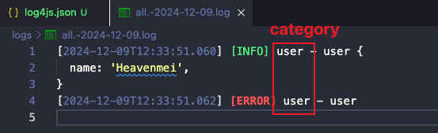

> 无论是在开发调试还是线上回溯，我们都会依赖日志 ​
> 而将日志以文件形式存储也是非常必要的，以防止服务崩掉时实时日志无法查看 ​

终端日志我们都是使用 `console.log` 直接打印到终端​
然鹅在 `Node` 端，`console.log` 都是儿戏​，只有终端能显示，一旦部署服务器很难查看。因此，使用[log4js](https://github.com/log4js-node/log4js-node)来管理。


## Implements
安装依赖
```bash
npm install log4js
```


日志等级，用于标记不同优先级，log4js 的日志分为九个等级，不同级别的日志在控制台中采用不同的颜色，比如 error 通常是红色的。各个级别的名字和权重如下：
```js
{
  ALL: new Level(Number.MIN_VALUE, "ALL"),
  TRACE: new Level(5000, "TRACE"),
  DEBUG: new Level(10000, "DEBUG"),
  INFO: new Level(20000, "INFO"),
  WARN: new Level(30000, "WARN"),
  ERROR: new Level(40000, "ERROR"),
  FATAL: new Level(50000, "FATAL"),
  MARK: new Level(9007199254740992, "MARK"), // 2^53
  OFF: new Level(Number.MAX_VALUE, "OFF")
}

```


日志分类，文件根据日志类型进行分类存储
```js
import log4js from "log4js";
// 实例化时，唯一可以传的一个参数category
const logger = log4js.getLogger("user");
logger.level = "all";

logger.trace('this is trace');
logger.debug('this is debug');
logger.info('this is info');
logger.warn('this is warn');
logger.error('this is error');
logger.fatal('this is fatal');
logger.mark('this is mark');

```


日志输出，log4js默认 `console.log` 直接打印到终端​，如果需要存储到文件中就需要用到`appenders`。
**Appenders** 将日志事件序列化为某种形式的输出。他们可以写入文件、发送电子邮件、通过网络发送数据。所有附加程序都有一个`type`来确定使用哪个附加程序。console和file都是一种appender，除此之外还有：
- DateFile：日志输出到文件，日志文件可以安特定的日期模式滚动，例如今天输出到 default-2021-04-20.log，明天输出到 default-2021-04-21.log；
- SMTP：输出日志到邮件；
- Mailgun：通过 Mailgun API 输出日志到 Mailgun；
- levelFilter 可以通过 level 过滤

创建`config/log4js.json`
```json
{
  "appenders": {
    "all": {
      "type": "dateFile",
      "filename": "./logs/all.log",
      "pattern": "-yyyy-MM-dd",
      "keepFileExt": true,
      "alwaysIncludePattern": true
    },
    "out": { "type": "stdout" },
    "errorFile": {
      "type": "file",
      "filename": "./logs/error.log"
    },
    "errors": {
      "type": "logLevelFilter",
      "level": "ERROR",
      "appender": "errorFile"
    }
  },
  "categories": {
    "default": { "appenders": ["all", "out", "errors"], "level": "ALL" }
  }
}
```


**params**
- type : 'dateFile' 首先指定 appenders 的类型为 dateFile
- filename : 用于指定日志落盘的文件地址 ( ps : “./logs/test.log” )
- pattern : 用于指定日志切分的时间间隔
	- '.yyyy-MM' 精确到月
	- '.yyyy-MM-dd' 精确到天
	- '.yyyy-MM-dd-hh' 精确到小时
- layout : 自定义日志输出的格式
- compress : compress 为 true，记录当天日志时，会对以往的老日志进行压缩操作，压缩文件后缀为 .gz (默认 : false)
- alwaysIncludePattern : 当为 true 时，log 文件名会包含之前设置的 pattern 信息 (默认为 false，但是强烈建议开启) 日志名例如 : test.log-2019-08-06
- daysToKeep : 指定日志保留的天数 ( 默认为 0，始终保留 )
- keepFileExt : 是否保持日志文件后缀名 ( 默认为 false，使用 pattern 的情况下，保持默认就好 )只有在 alwaysIncludePattern 为 false 时生效


在`index.js`中配置
```js
import log4js from "log4js";
import log4jsConfig from "./config/log4js.json";
log4js.configure(log4jsConfig);
```


执行上述代码后，log4js 会以天为分割，每天生成一个名字如 `all.-2024-12-09.log` 的日志文件。并筛选error级别存储进`error.log`。同时控制台也会打印。
