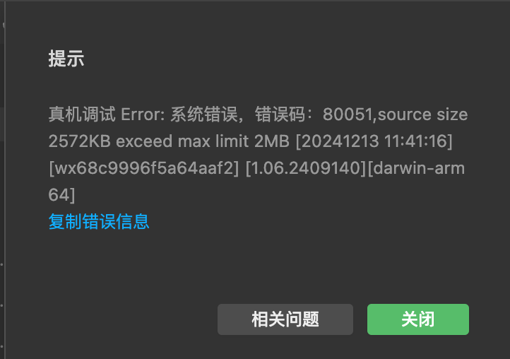
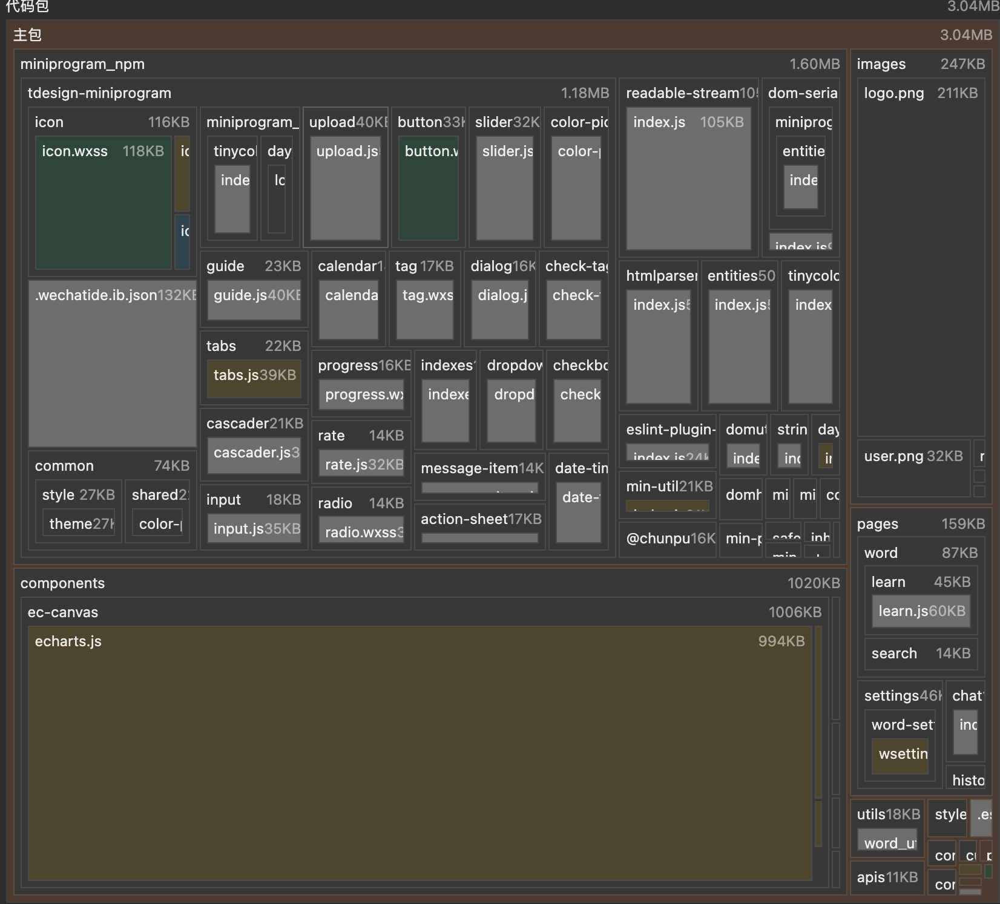
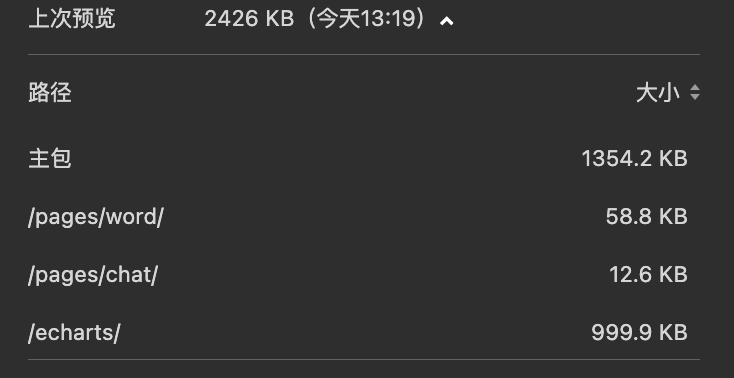

微信小程序真机调试会有包体积限制，单包不能超过2MB，查了一下依赖，大部分是npm构建的依赖。好在微信自己提供的分包的能力

|  |  |
|--|--|


## 分包
>  [官方教程](https://developers.weixin.qq.com/miniprogram/dev/framework/subpackages/basic.html)

我将其中一个功能模块word进行拆分，
```
├── app.js
├── app.json
├── app.wxss
├── pages
│   ├── index
|———└── pageA
│       └── index
|———└── word
│       ├── index
│       ├── learn
│             └── learn
│       ├── review
│             └── review
└── utils
```

 `app.json`， 注意⚠️：
 - `tabBar` 页面必须在主包内
 - `subPackages` 的根目录不能是另外一个 `subPackages` 内的子目录
 - **子包之间无法相互引用，但是可以引用主包文件**，反过来不行

```json
  "pages":[],//主包页面
  "subPackages": [
    {
      "name": "word",
      "root": "pages/word",
      "pages": [
        "index",
        "learn/learn",
        "review/review",
      ]
    },
  ],
```

至此，就完成了一个功能模块的拆分，但还主包体积还是很大，主要是UI库、Echart的体积太大，还需要继续拆分。UI库可以删去miniprogram_npm中不用的依赖，但是拆分起来太麻烦了。而且还要解决子包之间的相互引用问题

## 分包异步化组件


一个分包使用其他分包的自定义组件时，由于其他分包还未下载或注入，其他分包的组件处于不可用的状态。通过为其他分包的自定义组件设置 [占位组件](https://developers.weixin.qq.com/miniprogram/dev/framework/custom-component/placeholder.html)，我们可以先渲染占位组件作为替代，在分包下载完成后再进行替换。


先封装一个通用的echart组件
`baseChart.json`
```json
{
  "component": true,
  "usingComponents": {
    "ec-canvas": "../ec-canvas/ec-canvas"
  }
}
```


`baseChart.wxml`

```html
<view style="height: {{height}};width:100%">
  <ec-canvas
    id="{{chartId}}"
    canvas-id="{{canvasId}}"
    ec="{{ ec }}"
  ></ec-canvas>
</view>
```

`baseChart.js`
```js
import * as echarts from "../ec-canvas/echarts";

Component({
  properties: {
    height: {
      type: String,
    },
    option: {
      type: Object,
    },
  },
  observers: {
    option: function (val) {
      setTimeout(() => {
        this.initChart(val || {});
      }, 0);
    },
  },
  data: {
    chartId: "",
    canvasId: "",
    ec: {
      lazyload: true,
    },
  },
  lifetimes: {
    attached() {
      this.setData({
        chartId: `chart_${this.__wxExparserNodeId__}`,
        canvasId: `canvas_${this.__wxExparserNodeId__}`,
      });
      this.chartComp = this.selectComponent(`#${this.data.chartId}`);
    },
  },
  methods: {
    initChart(option) {
      this.chartComp &&
        this.chartComp.init((canvas, width, height, dpr) => {
          const chart = echarts.init(canvas, null, {
            width: width,
            height: height,
            devicePixelRatio: dpr,
          });
          if (option.tooltip) {
            Object.assign(option.tooltip, {
              confine: true,
              shadowBlur: 0,
              shadowColor: "#e7e8e8",
              shadowOffsetY: 0,
              shadowOffsetX: 0,
              borderColor: "#e7e8e8",
              padding: [
                5, // 上
                20, // 右
                5, // 下
                20, // 左
              ],
            });
          }

          chart.setOption(option);
          this.chart = chart;
          return chart;
        });
    },
  },
});

```


然后在主包页面`setting.json`中调用 
```json
{
  "usingComponents": {
    "t-chart": "/echarts/baseChart/baseChart"
  },
  // 占位组件
   "componentPlaceholder": {
    "t-chart": "view"
  }
}
```


```html
<t-chart option="{{option}}" height="300rpx"></t-chart>
```


`app.json`

利用分包预下载的能里，在使用异步组件的页面提前加载分包。
```json
"subPackages": [
    {
      "name": "echarts",
      "root": "echarts",
      "pages": [
        "ec-canvas/ec-canvas",
        "baseChart/baseChart",
      ]
    }
  ],
  "preloadRule": {
    "pages/settings/index": {
      "network": "all",
      "packages": ["echarts"]
    }
  },
```

成功后控制台会输出，若未成功可以重启下开发工具
```bash
preloadSubpackages: components
preloadSubpackages: success
```

