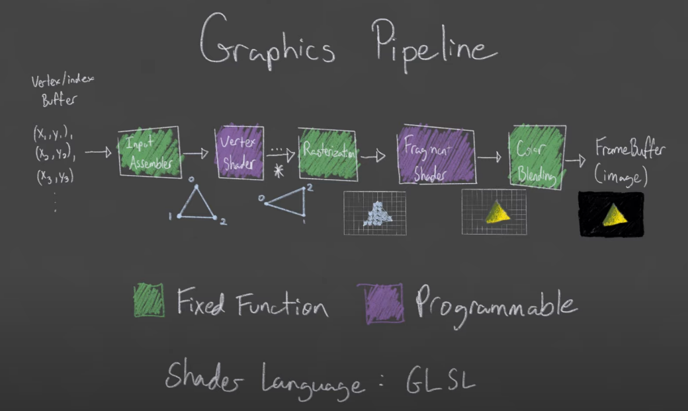
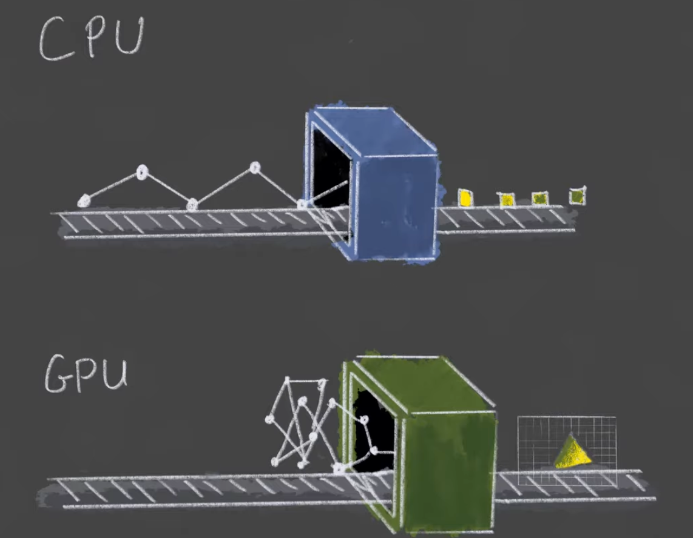

> 近期工作中在写AGP引擎，底层是用vulkan写的，所以来探索一下
> https://gitee.com/openharmony/graphic_graphic_3d


## 前期准备
本人是mac环境，
- Vulkan SDK： [https://vulkan.lunarg.com/sdk/home](https://vulkan.lunarg.com/sdk/home)
- GLM : [https://github.com/g-truc/glm/releases](https://github.com/g-truc/glm/releases) 最初用于创建OpenGL窗口和上下文的开源库，它提供了一套跨平台的API，能够方便地创建OpenGL窗口、处理输入事件、处理窗口事件等。
- GLFW: [https://www.glfw.org/download.html](https://www.glfw.org/download.html)GLM是一个用于数学计算的开源库，它提供了一组类和函数，用于实现矩阵变换、向量计算、投影等数学操作。
- cmake


安装好Vulkan SDK后可以跑一下Applications目录下的vkcube，如果成功运行说明你的电脑是支持Vulkan的
```bash
#通过homebrew进行glfw与glm
brew install glfw  
brew install glm

arch -arm64 brew install glm
arch -arm64 brew install glfw

arch -arm64 brew install cmake --cask

arch -arm64 brew install glslang
# 获取地址，cmake编译会用
where glslang

cmake -version
```


接下来在Clion中配置cmake引用程序，构建后运行，会弹出一个 *vulkan window* 的空的窗口就成功了。

`cmakelist.txt`
```cmake
cmake_minimum_required(VERSION 3.10)

PROJECT(HELLO)

set(CMAKE_CXX_STANDARD 11)

include_directories(/opt/homebrew/include ./include)
# glfw的库目录路径
link_directories(/opt/homebrew/Cellar/glfw/3.4/lib/)
# Vulkan的库目录
include_directories(/Users/heavenmei/VulkanSDK/1.3.290.0/macOS/include/)
link_directories(/Users/heavenmei/VulkanSDK/1.3.290.0/macOS/lib)

set(librariesList
        GLFW
        vulkan
)

add_executable(VulkanSample main.cpp)
target_link_libraries(VulkanSample ${librariesList})
```


`main.cpp`
```cpp
#define GLFW_INCLUDE_VULKAN
#include <GLFW/glfw3.h>

#define GLM_FORCE_RADIANS
#define GLM_FORCE_DEPTH_ZERO_TO_ONE
#include <glm/vec4.hpp>
#include <glm/mat4x4.hpp>

#include <iostream>

int main()
{
    glfwInit();
    
    glfwWindowHint(GLFW_CLIENT_API, GLFW_NO_API);
    GLFWwindow *window = glfwCreateWindow(1000, 600, "Vulkan window", nullptr, nullptr);
    
    uint32_t extensionCount = 0;
    vkEnumerateInstanceExtensionProperties(nullptr, &extensionCount, nullptr);
    
    std::cout << extensionCount << "extensions supported\n";
    
    glm::mat4 matrix;
    glm::vec4 vec;
    
    auto test = matrix*vec;
    test = test;
    
    while(!glfwWindowShouldClose(window))
    {
        glfwPollEvents();
    }
    
    glfwDestroyWindow(window);
    
    glfwTerminate();
    
    return 0;
}
```

## Open glfw window
我们需要先创建一个窗口，才能实时看到之后渲染出来的结果

`lve_window.cpp`
```cpp
#include "lve_window.h"

namespace lve {

    // 构造函数
    LveWindow::LveWindow(int w, int h, std::string name) : width{w}, height{h}, windowName{name} {
        initWindow();
    }

    // 析构函数
    LveWindow::~LveWindow() {
        glfwDestroyWindow(window);
        glfwTerminate();
    }

    // 初始化窗口
    void LveWindow::initWindow() {
        glfwInit();
        // 不是 OpenGL，不创建上下文！
        glfwWindowHint(GLFW_CLIENT_API, GLFW_NO_API);
        // 不允许调整窗体大小，因为调整大小涉及到整个流水线变动，这里先不考虑那么复杂的
        glfwWindowHint(GLFW_RESIZABLE, GLFW_FALSE);

        window = glfwCreateWindow(width, height, windowName.c_str(), nullptr, nullptr);
    }
}  // namespace lve
```

`main.cpp` 运行起来
```cpp

#include "lve_window.h"

int main()
{
    lve::LveWindow lveWindow{800, 600, "Hello Vulkan!"};
    while (!lveWindow.shouldClose())
    {
        // Window resize, mouse move event, etc.
        glfwPollEvents();
    }

    return EXIT_SUCCESS;
}
```


##  Graphics Pipeline
我们能够动态改变的是紫色部分，用GLSL语言编写Shader


由于GPU可以并行计算，计算效率会更高



首先创建shaders文件夹，编写glsl
```js
// simple_shader.vert
#version 450

vec2 positions[3] = vec2[](
  vec2(0.0, -0.5),
  vec2(0.5, 0.5),
  vec2(-0.5, 0.5)
);

void main() {
  gl_Position = vec4(positions[gl_VertexIndex], 0.0, 1.0);
}


// simple_shader.frag
#version 450

layout (location = 0) out vec4 outColor;

void main() {
    // r g b a
    outColor = vec4(1.0, 1.0, 0.0, 1.0);
}


```


编写`compile.sh` 编译vert-- spirv（spv）
```sh
# where glslang
/opt/homebrew/bin/glslang -V shaders/simple_shader.vert -o shaders/simple_shader.vert.spv  
/opt/homebrew/bin/glslang -V shaders/simple_shader.frag -o shaders/simple_shader.frag.spv
```


## Reference

https://easyvulkan.github.io/index.html

https://vulkan-tutorial.com/

https://github.com/blurrypiano/littleVulkanEngine