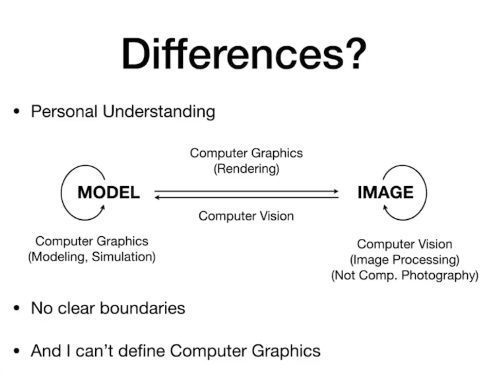
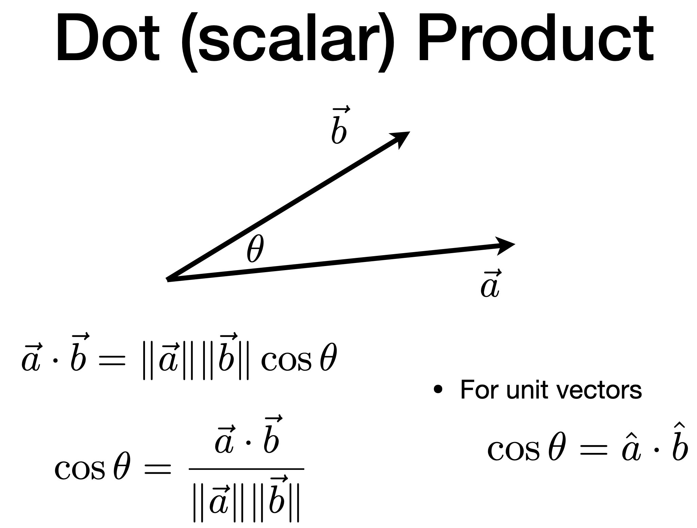
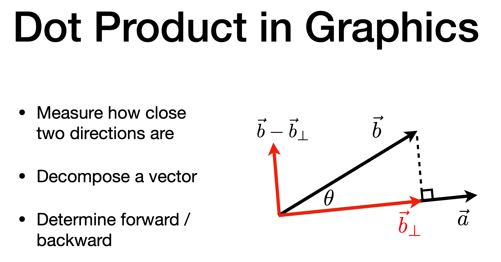
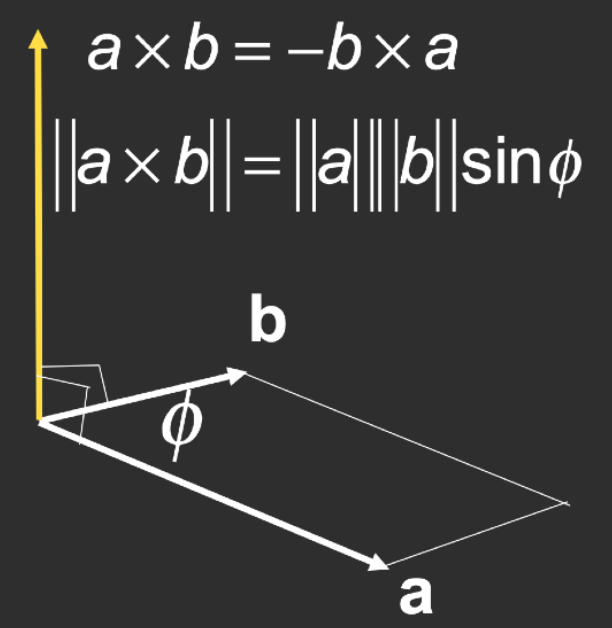
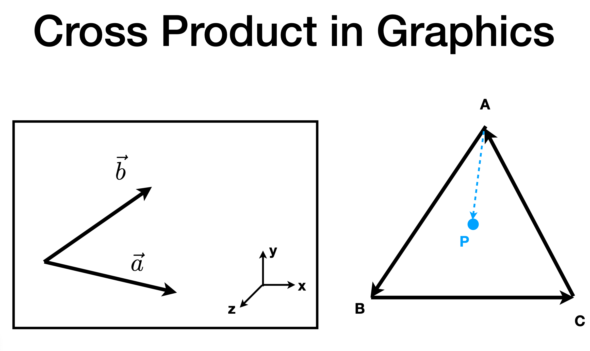

> 个人笔记，边看视频边记录。记录不全面，仅根据自身程度做一些必要的摘要

 课程主页： https://sites.cs.ucsb.edu/~lingqi/teaching/games101.html
 
 课程BBS： https://games-cn.org/forums/forum/graphics-intro/
 
 课程PPT和视频： https://games-cn.org/graphics-intro-ppt-video/ 

## Overview
**区别**：计算机视觉和图形学
计算机视觉：一切需要一定程度猜测的内容，需要识别哪些地方是人、哪些地方是路面等（本课程不会涉及）

## 线性代数基础
向量长度: $\| \vec{a} \|$

单位向量：$\hat{a}=\vec{a} / \| \vec{a} \|$

笛卡尔坐标系：$\| \mathrm{A} \|=\sqrt{x^{2}+y^{2}}$

## 向量点乘

作用：
1. 计算两个向量的夹角，光源与表面夹角的余弦值
2. 求一个向量在另一个向量上的投影
3. 判断两个向量的方向（dot product > or < 0）以及相对距离

|  |  |
| ---- | ---- |

属性：
$$
\vec{a} \cdot\vec{b}=\vec{b} \cdot\vec{a} 
$$
$$
\vec{a} \cdot( \vec{b}+\vec{c} )=\vec{a} \cdot\vec{b}+\vec{a} \cdot\vec{c} 
$$
$$
( k \vec{a} ) \cdot\vec{b}=\vec{a} \cdot( k \vec{b} )=k ( \vec{a} \cdot\vec{b} ) 
$$
$$
\vec{a} \cdot\vec{b}
=\left( \begin{matrix} {{{x_{a}}}} \\ {{{y_{a}}}} \\ {{{z_{a}}}} \\ \end{matrix} \right) \cdot\left( \begin{matrix} {{{x_{b}}}} \\ {{{y_{b}}}} \\ {{{z_{b}}}} \\ \end{matrix} \right) 
= \vec{a}^{T}\vec{b} 
= \left( \begin{matrix} {{x_{a}}} & {{y_{a}}} & {{z_{a}}} \\ \end{matrix} \right) \left( \begin{matrix} {{x_{b}}} \\ {{y_{b}}} \\ {{z_{b}}} \\ \end{matrix} \right)  
=x_{a} x_{b}+y_{a} y_{b}+z_{a} z_{b} 
$$

## 向量叉乘

右手定则 确定方向 （右手螺旋定则）

作用：
1. 判断左右
2. 判断内外 （**判断三角形覆盖了哪些像素**，就需要知道像素是不是在三角形内部，然后再进行着色）

属性：
$$
\vec{a} \times\vec{b}=A^{*} b=\left( \begin{matrix} {{0}} & {{-z_{a}}} & {{y_{a}}} \\ {{z_{a}}} & {{0}} & {{-x_{a}}} \\ {{-y_{a}}} & {{x_{a}}} & {{0}} \\ \end{matrix} \right) \left( \begin{matrix} {{x_{b}}} \\ {{y_{b}}} \\ {{z_{b}}} \\ \end{matrix} \right) =\left( \begin{matrix} {{{y_{a} z_{b}-y_{b} z_{a}}}} \\ {{{z_{a} x_{b}-x_{a} z_{b}}}} \\ {{{x_{a} y_{b}-y_{a} x_{b}}}} \\ \end{matrix} \right) 
$$

## 矩阵（Matrices）

**矩阵不满足交换律** (AB and BA are different in general)

**矩阵相乘**

$(M \times N) (N \times P) = (M \times P)$

$Element (i, j) = A [row_i] \cdot   B[column_j]$

**矩阵转置**

$( A B )^{T}=B^{T} A^{T}$

**矩阵的逆**

$A A^{-1}=A^{-1} A=I$
$( A B )^{-1}=B^{-1} A^{-1}$

**向量的点乘叉乘写成矩阵形式**

