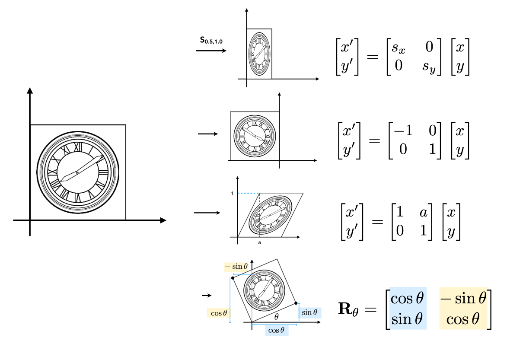
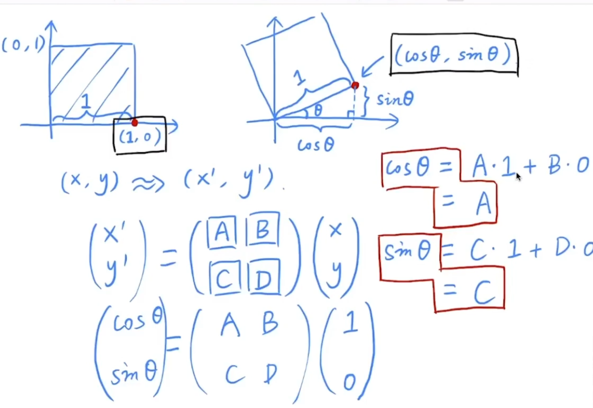
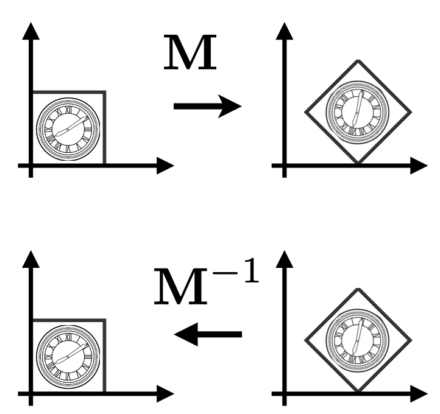
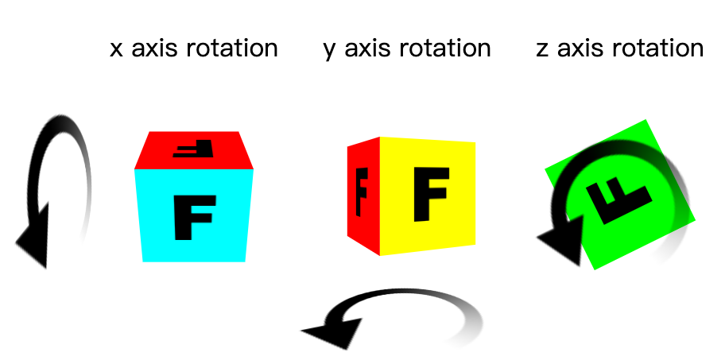
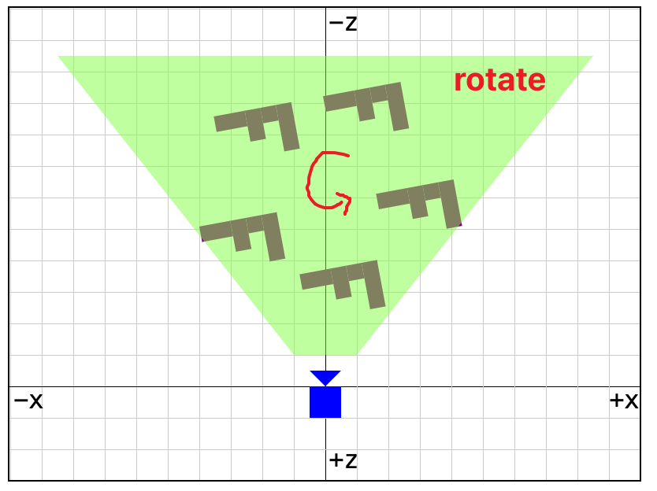

> 可以结合webGl参考：[WebGL 二维矩阵](https://webglfundamentals.org/webgl/lessons/zh_cn/webgl-2d-matrices.html)

## 线性变换

**通用形式**

$$
\left[ \begin{array} {c} {{{x^{\prime}}}} \\ {{{y^{\prime}}}} \\ \end{array} \right]=\left[ \begin{array} {c c} {{a}} & {{b}} \\ {{c}} & {{d}} \\ \end{array} \right] \left[ \begin{array} {c} {{x}} \\ {{y}} \\ \end{array} \right] 
== \left[ \begin{matrix} {{a \, x+b \, y}} \\ {{ c \, x+d \, y}} \\ \end{matrix} \right] 
$$
$$
\mathbf{x}^{\prime}=\mathbf{M} \mathbf{x} 
$$

**scale**
$$
\left[ \begin{matrix} {{x^{\prime}}} \\ {{y^{\prime}}} \\ \end{matrix} \right]
=\left[ \begin{matrix} {{s_x}} & {{0}} \\ {{0}} & {{s_y}} \\ \end{matrix} \right] \left[ \begin{matrix} {{x}} \\ {{y}} \\ \end{matrix} \right]  
= \left[ \begin{matrix} {{s_xx}} \\ {{s_yy}} \\ \end{matrix} \right] 
$$

镜像：相对于y轴做一个翻转
$$
\left[ \begin{matrix} {{x^{\prime}}} \\ {{y^{\prime}}} \\ \end{matrix} \right]
=\left[ \begin{matrix} {{-1}} & {{0}} \\ {{0}} & {{1}} \\ \end{matrix} \right] \left[ \begin{matrix} {{x}} \\ {{y}} \\ \end{matrix} \right]  
= \left[ \begin{matrix} {{-x}} \\ {{y}} \\ \end{matrix} \right] 
$$

**切片矩阵** （shear Matrix）
一条边水平方向移动，相当于所有点水平方向上的移动为a\*y
$$
\left[ \begin{matrix} {{x^{\prime}}} \\ {{y^{\prime}}} \\ \end{matrix} \right]
=\left[ \begin{matrix} {{1}} & {{a}} \\ {{0}} & {{1}} \\ \end{matrix} \right] \left[ \begin{matrix} {{x}} \\ {{y}} \\ \end{matrix} \right]  
= \left[ \begin{matrix} {{x + ay}} \\ {{y}} \\ \end{matrix} \right] 
$$

**旋转**
根据角度计算，下面是绕原点逆时针旋转实例，顺时针旋转可参考：[WebGL 二维旋转](https://webglfundamentals.org/webgl/lessons/zh_cn/webgl-2d-rotation.html)

$$
\left[ \begin{matrix} {{x^{\prime}}} \\ {{y^{\prime}}} \\ \end{matrix} \right]
=\left[ \begin{matrix} {{\operatorname{cos} \theta}} & {{-\operatorname{sin} \theta}} \\ {{\operatorname{sin} \theta}} & {{\operatorname{cos} \theta}} \\ \end{matrix} \right] \left[ \begin{matrix} {{x}} \\ {{y}} \\ \end{matrix} \right]  
= \left[ \begin{matrix} {{\operatorname{cos} \theta \, x - \operatorname{sin} \theta \, y}} \\ {{\operatorname{sin} \theta \, x + \operatorname{cos} \theta \, y}} \\ \end{matrix} \right] 
$$
选取两个点代入计算矩阵每列数值

## 齐次坐标
Homogeneous Coordinates

**平移**

$$
\left[ \begin{matrix} {{{x^{\prime}}}} \\ {{{y^{\prime}}}} \\ \end{matrix} \right]=\left[ \begin{matrix} {{a}} & {{b}} \\ {{c}} & {{d}} \\ \end{matrix} \right] \left[ \begin{matrix} {{x}} \\ {{y}} \\ \end{matrix} \right]+\left[ \begin{matrix} {{t_{x}}} \\ {{t_{y}}} \\ \end{matrix} \right] 
$$
因为平移不是线性变换，不能用线性变换的通用形式表示，因此引入齐次坐标，就可表示所有的变换。

How？给二维的向量和点增加一个维度，*因为向量具有平移不变性，所以是0*
2D point = (x, y, 1)T 
2D vector = (x, y, 0)T

$$
\left( \begin{matrix} {{{x^{\prime}}}} \\ {{{y^{\prime}}}} \\ {{{w^{\prime}}}} \\ \end{matrix} \right) 
= \left( \begin{matrix} {{{1}}} & {{{0}}} & {{{t_{x}}}} \\ {{{0}}} & {{{1}}} & {{{t_{y}}}} \\ {{{0}}} & {{{0}}} & {{{1}}} \\ \end{matrix} \right) \cdot\left( \begin{matrix} {{{x}}} \\ {{{y}}} \\ {{{1}}} \\ \end{matrix} \right) 

=\left( \begin{matrix} {{{x + t_x}}} \\ {{{y}+{t_{y}}}} \\ {{{1}}} \\ \end{matrix} \right) 
$$

**仿射变换（Affine）=线性变换+平移**

所有的仿射变换可以写成齐次坐标的形式（这样就用一个形式统一了所有的变换）

在表示二维情况下仿射变换的最后一行为（0,0,1），其他的像投影变换就不一定

Scale:
$$
\mathbf{S} ( s_{x}, s_{y} ) 
~=~ \left( \begin{matrix} {{s_{x}}} & {{0}} & {{0}} \\ {{0}} & {{s_{y}}} & {{0}} \\ {{0}} & {{0}} & {{1}} \\ \end{matrix} \right) 
$$

Rotation
$$
\mathbf{R} ( \alpha) 
~=~ \left( \begin{matrix} {{\operatorname{c o s} \alpha}} & {{-\operatorname{s i n} \alpha}} & {{0}} \\ {{\operatorname{s i n} \alpha}} & {{\operatorname{c o s} \alpha}} & {{0}} \\ {{0}} & {{0}} & {{1}} \\ \end{matrix} \right) 
$$

Translation
$$
\mathbf{T} ( t_{x}, t_{y} ) 
~=~ \left( \begin{matrix} {{1}} & {{0}} & {{t_{x}}} \\ {{0}} & {{1}} & {{t_{y}}} \\ {{0}} & {{0}} & {{1}} \\ \end{matrix} \right) 
$$

**逆变换**
乘以变换矩阵的逆矩阵

## Composite transform
有 n 种变换矩阵 ${A_n}$依次对 $\hat a$执行：$A_n A_{n−1} \dots A_1 \hat a$ (矩阵从右往左计算)

**矩阵变换不满足交换律，但可以任意结合**，因此注意顺序：先线性变换、再平移

## 3D Transforms

[WebGL 三维正射投影](https://webglfundamentals.org/webgl/lessons/zh_cn/webgl-3d-orthographic.html)

二维例子中的二维点 (x, y) 与 3x3 的矩阵相乘， 在三维中我们需要三维点 (x, y, z) 与 4x4 的矩阵相乘

**Scale:**
$$
\mathbf{S} ( s_{x}, s_{y}, s_{z} ) 
~=~ \left( \begin{matrix} 
{{s_{x}}} & {{0}} & {{0}} & {{0}} \\ 
{{0}} & {{s_{y}}} & {{0}} & {{0}} \\ 
{{0}} & {{0}} & {{s_z}} & {{0}} \\ 
{{0}} & {{0}} & {{0}} & {{1}} \\ 
\end{matrix} \right) 
$$

**Translation**
$$
\mathbf{T} ( t_{x}, t_{y} , t_{z}) 
~=~ \left( \begin{matrix} 
{{1}} & {{0}} & {{0}} & {{t_{x}}} \\ 
{{0}} & {{1}} & {{0}} & {{t_{y}}} \\ 
{{0}} & {{1}} & {{1}} & {{t_{z}}} \\ 
{{0}} & {{0}} & {{0}} & {{1}} \\ 
\end{matrix} \right) 
$$

二维中只需要一个是因为我们只需要绕 Z 轴旋转，现在在三维中还可以绕 X 轴和 Y 轴旋转

**x-Rotation**

$$
\mathbf{R}_x ( \alpha) 
~=~ \left( \begin{matrix} 
{{1}} & {{0}} & {{0}} & {{0}} \\ 
{{0}} & {{\operatorname{c o s} \alpha}} & {{-\operatorname{s i n} \alpha}} & {{0}} \\ 
{{0}} & {{\operatorname{s i n} \alpha}} & {{\operatorname{c o s} \alpha}} & {{0}} \\ 
{{0}} & {{0}} & {{0}} & {{1}} \\ 
\end{matrix} \right) 
\cdot \left( \begin{matrix} {{{x}}} \\ {{{y}}} \\ {{{z}}} \\ {{{1}}} \\ \end{matrix} \right) 

=  \left( \begin{matrix} {{{x}}} \\ 
{{{\operatorname{cos}\alpha \cdot y -\operatorname{sin}\alpha \cdot  z}}} \\ 
{{{\operatorname{sin}\alpha \cdot y + \operatorname{cos}\alpha \cdot z}}} \\ {{{1}}} \\ \end{matrix} \right) 

$$
**y-Rotation**
*绕y轴旋转，为什么sin 正负不太一样？*  
要通过轴的顺序判断，y 叉乘 z = x，x 叉乘 y = z，有一个**循环对称**的性质，z叉乘x才能得到y，而非x叉乘z，所以绕y轴有点不一样
$$
\mathbf{R}_y ( \alpha) 
~=~ \left( \begin{matrix} 
 {{\operatorname{cos} \alpha}} & {{0}} & {{\operatorname{s i n} \alpha}} & {{0}} \\ 
{{0}} & {{1}} & {{0}} & {{0}} \\ 
{{-\operatorname{s i n} \alpha}} &{{0}} &  {{\operatorname{c o s} \alpha}} & {{0}} \\ 
{{0}} & {{0}} & {{0}} & {{1}} \\ 
\end{matrix} \right) 
\cdot \left( \begin{matrix} {{{x}}} \\ {{{y}}} \\ {{{z}}} \\ {{{1}}} \\ \end{matrix} \right) 

=  \left( \begin{matrix} {{{\operatorname{cos}\alpha \cdot x + \operatorname{sin}\alpha \cdot z}}} \\ 
{{{y}}} \\ 
{{{- \operatorname{sin}\alpha \cdot x + \operatorname{cos}\alpha \cdot z }}} \\ {{{1}}} \\ \end{matrix} \right) 
$$

**z-Rotation**
$$
\mathbf{R}_z ( \alpha) 
~=~ \left( \begin{matrix} 
{{\operatorname{c o s} \alpha}} & {{-\operatorname{s i n} \alpha}} &{{0}} & {{0}} \\ 
{{\operatorname{s i n} \alpha}} & {{\operatorname{c o s} \alpha}} & {{0}} & {{0}} \\ 
{{0}} & {{0}} & {{1}} & {{0}} \\ 
{{0}} & {{0}} & {{0}} & {{1}} \\ 
\end{matrix} \right) 

\cdot \left( \begin{matrix} {{{x}}} \\ {{{y}}} \\ {{{z}}} \\ {{{1}}} \\ \end{matrix} \right) 

=  \left( \begin{matrix} {{{x}}} \\ 
{{{\operatorname{cos}\alpha \cdot x -\operatorname{sin}\alpha \cdot  y}}} \\ 
\operatorname{sin}\alpha \cdot x + \operatorname{cos}\alpha \cdot y\\
{{{z}}} \\ {{{1}}} \\ \end{matrix} \right) 
$$

## Viewing（观测）transformation

MVP变换：模型变换、视图变换（相机）、投影变换

### View / Camera Transformation
[WebGL 三维相机](https://webglfundamentals.org/webgl/lessons/zh_cn/webgl-3d-camera.html)

固定相机位置：（0，0，-z）位于原点往-z方向看

如果相机和物体同时移动，那照片会一样（保持静止）。因此通过将相机移动到原点， 物体移动到相机前来保持原始的**相对位置**。

高效的将物体移动到相机前是非常重要的。最简单的方式是使用一个**逆矩阵**，一旦有了**相机从原点移动旋转到目标位置的矩阵**后， 就可以计算出它的逆矩阵，利用这个逆矩阵可以不动相机，将物体从相反的方向移动到相机前。（*因为是正交矩阵，逆=转置，所以求转置即可*）

然后通过相机矩阵计算“视图矩阵”，视图矩阵是将所有物体以相反于相机的方向运动， 尽管相机还是在原点但是相对关系是期望的。

### Projection（投影）transformation

[WebGL 三维透视投影](https://webglfundamentals.org/webgl/lessons/zh_cn/webgl-3d-perspective.html)

**正交投影（Orthographic projection）**

之前所做的线性变换和平移都是正交投影

 **透视投影（Perspective projection）**
它的基础特性就是近大远小，离得越远显得越小。
 
透视投影进行归一化的思想：近平面不变，将远平面的大小挤压成和近平面一样大，后面的操作和正交投影一样