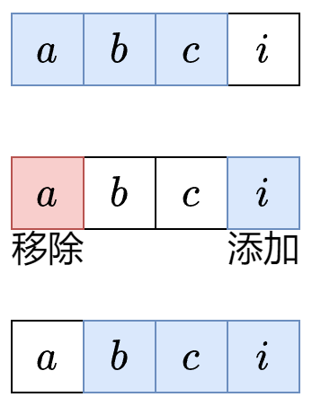

[【题单】滑动窗口与双指针（定长/不定长/单序列/双序列/三指针/分组循环）](https://leetcode.cn/discuss/post/3578981/ti-dan-hua-dong-chuang-kou-ding-chang-bu-rzz7/)


## 定长滑窗



总结成三步：入-更新-出
1. 入：下表为$i$的元素进入窗口，更新相关统计量。如果$i<k-1$ 则重复第一步
2. 更新： 更新答案。一般是更新最大值/最小值。
3. 出：下标为 $i−k+1$ 的元素离开窗口，更新相关统计量。


[1456. 定长子串中元音的最大数目](https://leetcode.cn/problems/maximum-number-of-vowels-in-a-substring-of-given-length/) 

```js
/**
 * @param {string} s
 * @param {number} k
 * @return {number}
 */
var maxVowels = function(s, k) {
    let res = 0,tmp = 0;
    for(let i = 0; i < s.length; i++){
        if (..) {
            tmp++;
        }

        if(i < k-1) {
            continue;
        };

        res = Math.max(res, tmp);        

        const out = i-k+1;
        if (..) {
            tmp--;
        }
    }
    return res;
};
```


## 不定长滑动窗口


不定长滑动窗口主要分为三类：求最长子数组，求最短子数组，以及求子数组个数。