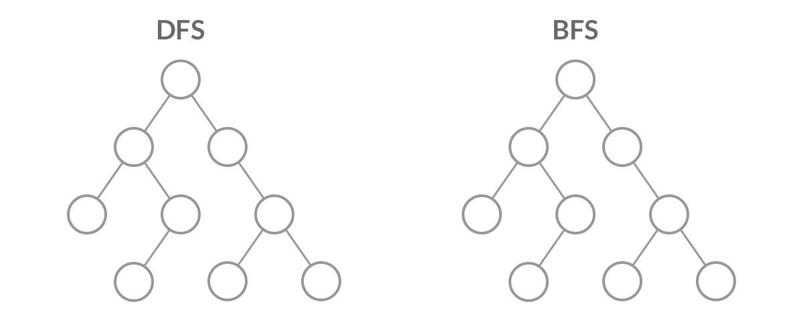

题单： [网格图（DFS/BFS/综合应用）](https://leetcode.cn/circle/discuss/YiXPXW/)



## DFS

二叉树中的DFS，二叉树的 DFS 有两个要素：「**访问相邻结点**」和「**判断 base case**」
```js
function dfs(root) {
    // 递归终止， base case， 叶子节点
    if (root == null) return;

    // 访问两个相邻结点：左子结点、右子结点
    dfs(root.left);
    dfs(root.right);
}
```

网格图中也类似，相邻节点为四周，终止条件是超出边界。注意考虑重复遍历问题，可能会导致死循环，因此需要标记已经遍历过的格子。以 [200. 岛屿数量](https://leetcode.cn/problems/number-of-islands/) 为例，直接标记 1/2


```js
function dfs(grid, r, c) {
    // 判断 base case
    if (!inArea(grid, r, c)) {
        return;
    }

	if (grid[r][c] !== '1') return;
	// 标记 已经遍历
	grid[r][c] = '2';
	
    // 访问上、下、左、右四个相邻结点
    dfs(grid, r - 1, c);
    dfs(grid, r + 1, c);
    dfs(grid, r, c - 1);
    dfs(grid, r, c + 1);
}

// 判断坐标 (r, c) 是否在网格中
function inArea(grid, r, c) {
    return 0 <= r && r < grid.length 
		&& 0 <= c && c < grid[0].length;
}
```


类似题：

[695. 岛屿的最大面积](https://leetcode.cn/problems/max-area-of-island/)

[面试题 16.19. 水域大小](https://leetcode.cn/problems/pond-sizes-lcci/)

 [463. 岛屿的周长](https://leetcode.cn/problems/island-perimeter/)


## BFS
DFS 遍历使用 **递归**， 而 BFS 遍历使用 **队列**

```js
let queue = [];
queue.push(root);

while (queue.length > 0) {
	let node = queue.shift();
	if (node.left) {
	  queue.push(node.left);
	}
	if (node.right) {
	  queue.push(node.right);
	}
}

```


基础：  [102. 二叉树的层序遍历](https://leetcode.cn/problems/binary-tree-level-order-traversal/)


网格图BFS 适用于需要计算最短距离（最短路）的题目。