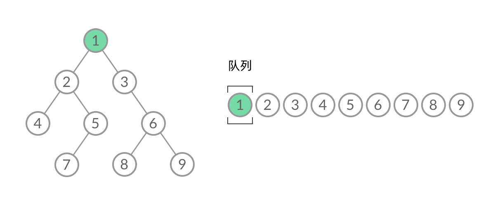

题单： [网格图（DFS/BFS/综合应用）](https://leetcode.cn/circle/discuss/YiXPXW/)


## DFS

二叉树中的DFS，二叉树的 DFS 有两个要素：「**访问相邻结点**」和「**判断 base case**」
```js
function dfs(root) {
    // 递归终止， base case， 叶子节点
    if (root == null) return;

    // 访问两个相邻结点：左子结点、右子结点
    dfs(root.left);
    dfs(root.right);
}
```

网格图中也类似，相邻节点为四周，终止条件是超出边界 （==先污染后治理==）。注意考虑重复遍历问题，可能会导致死循环，因此需要标记已经遍历过的格子。以 [200. 岛屿数量](https://leetcode.cn/problems/number-of-islands/) 为例，直接标记 1/2


```js
function dfs(grid, r, c) {
    // 判断 base case
    if (!inArea(grid, r, c)) {
        return;
    }

	if (grid[r][c] !== '1') return;
	// 标记 已经遍历 “”
	grid[r][c] = '2';
	
    // 访问上、下、左、右四个相邻结点
    dfs(grid, r - 1, c);
    dfs(grid, r + 1, c);
    dfs(grid, r, c - 1);
    dfs(grid, r, c + 1);
}

// 判断坐标 (r, c) 是否在网格中
function inArea(grid, r, c) {
    return 0 <= r && r < grid.length 
		&& 0 <= c && c < grid[0].length;
}
```


类似题：

[695. 岛屿的最大面积](https://leetcode.cn/problems/max-area-of-island/)

[面试题 16.19. 水域大小](https://leetcode.cn/problems/pond-sizes-lcci/)

 [463. 岛屿的周长](https://leetcode.cn/problems/island-perimeter/)

[827. 最大人工岛](https://leetcode-cn.com/problems/making-a-large-island/) （Hard）
## BFS
DFS 遍历使用 **递归**， 而 BFS 遍历使用 **队列**

二叉树中的BFS。[102. 二叉树的层序遍历](https://leetcode.cn/problems/binary-tree-level-order-traversal/)
```js
let queue = [];
queue.push(root);

while (queue.length > 0) {
  let len = queue.length;
  for (let i = 0; i < len; i++) {
    let node = queue.shift();
    if (node.left) queue.push(node.left);
    if (node.right) queue.push(node.right);
  }
}
```




网格图的层序遍历, 可以解决最短路径问题。==Dijkstra 算法解决的是带权最短路径问题，对于无权最短路径问题（边权为0/1）用 BFS 求解就行了==。 [1162. 地图分析](https://leetcode.cn/problems/as-far-from-land-as-possible/) 


```js
function bfs(grid, i, j) {
  let queue = [];
  queue.push([i, j]);

  while (queue.length > 0) {
    let len = queue.length;

    // 遍历单层所有节点
    for (let i = 0; i < len; i++) {
      let [r, c] = queue.shift();

      // 上下左右四个方向, 标记 已遍历
      if (inArea(grid, r - 1, c) && grid[r - 1][c] === 0) {
        grid[r - 1][c] = -1;
        queue.push([r - 1, c]);
      }
      if (inArea(grid, r + 1, c) && grid[r + 1][c] === 0) {
        grid[r + 1][c] = -1;
        queue.push([r + 1, c]);
      }
      if (inArea(grid, r, c - 1) && grid[r][c - 1] === 0) {
        grid[r][c - 1] = -1;
        queue.push([r, c - 1]);
      }
      if (inArea(grid, r, c + 1) && grid[r][c + 1] === 0) {
        grid[r][c + 1] = -1;
        queue.push([r, c + 1]);
      }
    }
  }
}

// 判断坐标 (r, c) 是否在网格中
function inArea(grid, r, c) {
	return 0 <= r && r < grid.length && 0 <= c && c < grid[0].length;
}
```


这是以`(i,j)`开始的单源BFS，**BFS 完全可以以多个格子同时作为起点（多源 BFS）**。我们可以把所有的陆地格子同时放入初始队列，然后开始层序遍历 。并对位移进行了一点优化。

```js
function bfs(grid) {
	let queue = [];
	// 将所有的源头加入队列
	for (let i = 0; i < grid.length; i++) {
	  for (let j = 0; j < grid[0].length; j++) {
		if (grid[i][j] === 1) {
		  queue.push([i, j]);
		}
	  }
	}
	
	const dx = [0, 0, 1, -1];
	const dy = [1, -1, 0, 0];
	
	while (queue.length > 0) {
	  let [r, c] = queue.shift();
	
	  // 上下左右四个方向, 标记 已遍历
	  for (let k = 0; k < 4; k++) {
		let x = r + dx[k];
		let y = c + dy[k];
		if (inArea(grid, x, y) && grid[x][y] == 0) {
		  grid[x][y] = -1;
		  queue.push([x, y]);
		}
	  }
	}
}

// 判断坐标 (r, c) 是否在网格中
function inArea(grid, r, c) {
	return 0 <= r && r < grid.length && 0 <= c && c < grid[0].length;
}

```