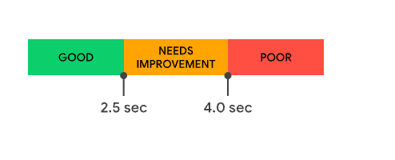

> 老生长谈的话题了
> 
> [前端性能优化](https://fe-perf.web.bytedance.net/#/network/index?varsion=1)([gitHub](https://code.byted.org/ife/performance-engineering))


## 浏览器请求加载


### 各字段含义

#### 初始化阶段

- navigationStart：用户完成卸载前一个文档的时间点

- redirectStart：页面重定向时的开始时间

- redirectEnd：页面重定向时的结束时间
    

#### 请求阶段

- fetchStart：浏览器发起资源请求时，如果有缓存，则返回读取缓存的开始时间

- domainLookupStart：查询DNS的开始时间。如果请求没有发起DNS请求，如keep-alive，缓存等，则返回fetchStart的时间点

- domainLookupEnd：查询DNS的结束时间。如果没有发起DNS请求，如keep-alive，缓存等，则返回fetchStart的时间点

- connectStart：当浏览器开始与服务器连接时的时间。如果没有建立连接，如请求是keep-alive、缓存等，那么它的值等同于domainLookupEnd

- secureConnectionStart：如果页面使用HTTPS，它的值是安全连接握手之前的时刻。如果该属性不可用，则返回undefined。如果该属性可用，但没有使用HTTPS，则返回0

- connectEnd：当浏览器端完成与服务器端建立连接的时刻。如果没有建立连接，如请求是keep-alive、缓存等，那么它的值等同于domainLookupEnd

- responseStart：指客户端收到从服务器端（或缓存、本地资源）响应回的第一个字节的数据的时刻

- responseEnd：指客户端收到从服务器端（或缓存、本地资源）响应回的最后一个字节的数据的时刻


#### 解析渲染阶段

- domLoading： 浏览器即将开始解析第一批收到的 HTML 文档字节，Document.readyState 变为loading， 相应的readystatechange事件触发。

- domInteractive: 当前网页DOM结构结束解析、开始加载内嵌资源的时间点。Document.readyState 变为interactive， 相应的readystatechange事件触发

- domContentLoadedEventStart: 当解析器发送DomContentLoaded事件，所有需要被执行的脚本已经被解析。

- domContentLoadedEventEnd: 所有需要立即执行的脚本已经被执行

- domContentLoaded: 文档被完全加载和解析完成之后，`DOMContentLoaded` 事件被触发，无需等待样式表、图像和子框架的完全加载。

- domComplete: 当前文档解析完成， Document.readyState 变为complete

- loadEventStart: 作为每个网页加载的最后一步，浏览器会触发 `load` 事件，以便触发额外的应用逻辑。如果这个事件还未被发送，它的值将会是0。

- loadEventEnd: `load` 事件 执行完成。如果这个事件还未被发送，或者尚未完成，它的值将会是0。


> 许多 JavaScript 框架都会等待`load`事件发生后，才开始执行它们自己的逻辑。因此，浏览器会捕获 `loadEventStart` 和 `loadEventEnd` 时间戳，让我们能够追踪执行所花费的时间


### 各指标汇总表


| 指标                                                 | 全称                                   | 解释                                                                                                             | 指标                                                                                                                | 备注                                               |
| -------------------------------------------------- | ------------------------------------ | -------------------------------------------------------------------------------------------------------------- | ----------------------------------------------------------------------------------------------------------------- | ------------------------------------------------ |
| **[TTFB](https://web.dev/ttfb/)**                  | Time To First Byte                   | 衡量资源请求与响应的第一个字节开始到达之间的时间的度量                                                                                    |                                                         |                                                  |
| **FP**                                             | First Paint<br/>首次渲染的时间点             | 在性能统计指标中，从用户开始访问 Web 页面的时间点到 FP 的时间点这段时间可以被视为 白屏时间                                                             |                                                                                                                   |                                                  |
| **[FCP](https://web.dev/fcp/)**                    | First Contentful Paint<br/>首次内容绘制    | 在性能统计指标中，从用户开始访问Web 页面的时间点到 FCP 的时间点这段时间可以被视为 无内容时间<br/>对于该指标，"内容"指的是文本、图像（包括背景图像）、`<svg>`元素或非白色的`<canvas>`元素。 | <br/>FCP控制在**1.8 秒**或以内。一个良好的测量阈值为页面加载的**第 75 个百分位数**   | 注意字体加载时间。<br/>需进行相应字体优化。                         |
| **[LCP](https://web.dev/lcp/)**                    | Largest Contentful Paint<br/>最大内容绘制  | <br/>                                                                                                          | <br/>LCP绘制控制在**2.5 秒**或以内。一个良好的测量阈值为页面加载的**第 75 个百分位数** |                                                  |
| **[FMP](https://web.dev/first-meaningful-paint/)** | First Meaningful Paint<br/>首次绘制有意义内容 | FMP 衡量了用户看到网页的主要内容的时间，是用户体验角度的一种重要的衡量指标。                                                                       |                                                                                                                   | 计算FMP性能消耗较大，且因为一些细小的变化导致数值巨大波动，<br/>该指标可以通过LCP代替 |
| **[TTI](https://web.dev/tti/)**                    | Time to Interactive<br/>可交互时间        | 从页面加载开始到页面处于完全可交互状态所花费的时间                                                                                      | TTI 控制在**5 秒**以内。                                                                                                 |                                                  |


#### 指标获取

PerformancePaintTiming 中包含当前 Web 页面的绘制性能打点信息，可通过 `performance.getEntriesByType('paint')` 方法获取， FP和 FCP 就在其中。


## 性能优化大纲


## 网络优化

### 开启HTTP2
    

优势

- 二进制传输协议
    
- 多路复用
    
    - HTTP1.0 采用tcp短连接，每次请求都要重新握手
        
    - HTTP1.1 采用tcp长连接，但存在队头阻塞问题，等待请求完成后才能去请求下一个资源
        
    - HTTP/2 **实现资源的并行请求，也就是不需要等待其他请求的完成**，然后服务器可以随时返回处理好的请求资源给浏览器。
        
- 服务端可主动推送消息
    
- 消息头压缩
    
    - 使用 『HPACK』算法来压缩消息头，同时在客户端和服务器两端建立“字典”，用索引号表示重复的字符串，类似的请求就不会再重复发送消息头。
        

  

兼容性问题

可以看到，主流浏览器基本都实现了 H2 的支持。

但是由于主流的浏览器 **Chrome、Firefox 等都公开宣布只在加密的场景下支持** **H2**，所以我们在开启 H2 的同时，需要同时开启 TSL(HTTPS)。

当宿主不支持 H2 协议时，服务端需要降级到 http 1.1 返回。


实践

可以打开浏览器调试控制台，查看网络面板中 Protocol 信息。


  
### 使用 CDN 部署静态资源

[浅探CDN原理](https://bytedance.feishu.cn/docx/doxcnUUlLWTwy5szI2EAd4BK6jD)

由于 CDN 节点缓存和客户端本地缓存的存在，CDN 适合部署一些更新频率不高、需要持久化存储的文件。

我们通常把**前端静态资源如** **JS****、****CSS** **等部署在** **CDN** **上**，这类文件在部署后通常不会再发生变化。

在一些特殊场景下，我们也可以把一些静态页面放在 CDN 上进行部署（如一些不需要持续迭代更新、流量较高的活动页面），我们把模板 HTML 和静态资源 JS、CSS 整体部署在 CDN 上，尽可能的利用 CDN 的动态加速，提高访问速度。


缓存

**客户端缓存：强缓存、协商缓存**

**CDN节点缓存**

类似客户端缓存，CDN 边缘节点机房本身也会保存有一份资源缓存，当用户发起 CDN 资源请求时，会首先访问距离用户最近的 CDN 边缘节点，若 CDN 节点上存在缓存，则直接返回用户，而不必每次都请求源站。

CDN 节点的缓存的存在，可以使资源请求更快的返回，有效提升性能，同时把负载压力由源站转移到了各个 CDN 节点上，减少业务方的维护成本。

- **a)** **CDN** **节点缓存时间**
    

CDN 节点缓存时间又称回源周期，支持配置。假设在 CDN 节点上生成了某源站资源的缓存后，该源站资源又产生了更新，被重新部署在原来的源站路径上。若此时 CDN 节点上该资源的缓存尚未过期，则不会重新请求源站刷新缓存，会导致用户请求拿到的资源依旧是更新前的版本，失去了动态化能力。

在前端领域，这种场景通常发生在文件路径不能使用文件指纹(contenthash)时，如直接部署页面入口 HTML 模板到 CDN 的场景。针对这种场景，我们需要合理配置 CDN 节点的资源缓存过期时间，既要尽可能保留页面的动态更新能力，又能享受到 CDN 的加速能力。

CDN 节点缓存时间通常需要客户端强缓存时间保持一致，若不一致，则代码真实生效时间以两者缓存更久者为准。

- **b)** **CDN** **节点缓存强制刷新**
    

假设我们没能及时配置 CDN 节点缓存时间，或配置的 CDN 节点缓存时间太久。在此情形下，若线上出现了 bug，我们想要对某资源的更新快速生效，及时止损，可以使用 CDN 节点刷新服务，触发该服务后，所有 CDN 节点缓存都会被抛弃，进行强制回源操作。

几乎所有 CDN 厂商都能提供 CDN 缓存刷新服务。

- **c)** **CDN** **节点** **缓存击穿**
    

CDN 通常会定义消息头 X-Cache 来标记本次请求是否成功命中 CDN 节点缓存。它有两个取值：

- X-Cache: HIT： 该次请求命中了 CDN 节点缓存，直接返回，跳过回源。
    
- X-Cache: MISS：该次请求没有命中 CDN 节点缓存，请求回源。
    

我们称 X-Cache: MISS 的场景，为**缓存击穿**。

我们可以主动配置不同的规则以确定击穿缓存的场景。可以按照 pathname 或 search 纬度来区分缓存，最大化的使用 CDN 加速能力。如下两个请求

[https://cdn.com/file.js?search=b](https://cdn.com/file.js?search=b)

[https://cdn.com/file.js?search=a](https://cdn.com/file.js?search=a)

配置缓存 key 至 URL 中的 pathname 部分时(即 /file.js 部分)，上面两个请求会命中同一个 CDN 节点缓存。

配置缓存 key 至 URL 中的 search 部分时(即 /file.js?search=xxx 部分)，上面两个请求会命中不同的 CDN 节点缓存。

- **d)** **CDN** **节点缓存预热**
    

前文提到，用户访问 CDN 节点时，如果对应 CDN 节点上不存在该资源缓存，则会请求源站获取该资源后返回给用户，同时生成节点缓存。

如上分析，CDN 节点在首次请求资源时会有一个『冷启』的回源过程，会花费更久的时间。我们可以通过 CDN 节点缓存预热的方法，在用户实际请求前主动触发各个 CDN 节点的回源动作，预先生成 CDN 节点缓存。

目前国内 CDN 厂商基本都支持 CDN 缓存预热操作，而海外 CDN 厂商对此支持并不理想。

  

### 使用 DNS 预解析
    

用户请求页面时，首先通过 DNS (Domain Name System) 把域名解析为具体的 IP 地址，然后向具体的 ip 发起实际页面请求。

DNS 解析本身的执行耗时我们难以掌控，但是对于前端开发者而言，存在一些事情是我们可以掌控的，比如用户访问页面时，我们可以让解析的时机提前，使页面更快的被加载。我们可以使用 dns-prefetch 的 link 标签来向浏览器声明在接下来的页面中即将用到某个域名下的资源，要求浏览器尽可能早的提前发起对该域名的 dns 解析操作。示例如下：

`<link rel="dns-prefetch" href="//cdn.example.com">`

  

### 提前建立网络连接
    

浏览器在建立网络连接时，要经过 DNS 解析、TCP 握手等过程，在 https 场景下还需要进行 TLS 加密信息验证。这些都是相当耗时的操作。


我们可以使用 preconnet 的 link 标签来提前触发上述操作，它会告诉浏览器，页面即将使用某域名下的资源，可以让浏览器提前建立网络连接，在页面真正发起资源请求时，会使用已经建立的网络连接，直接跳过这些耗时建连操作。代码如下：

`<link rel="preconnect" href="//example.com">`

如果需要发起跨域 CORS 请求，需要加入 `crossorigin` 声明配置如下

`<link rel="preconnect" href="//api.example.com" crossorigin>`

  

实践

Lighthouse 的 Opportunities 报告部分列出了所有未被用 `<link rel=preconnect>` 优先请求的关键请求：


使用Tips

虽然 `<link rel="preconnect">` 成本很低，但它仍然会占用宝贵的CPU时间，特别是在安全连接上。如果连接在 10 秒内没有被使用则会非常糟糕，因为浏览器会关掉连接，这样就浪费了所有的早期连接工作。

一般情况下，尝试使用 `<link rel="preload">`，因为它对于性能的调整更加全面，但对于边缘情况，请继续使用 `<link rel="preconnect">`:

- 知道资源在哪，但不知道具体要请求什么。
    
- 流媒体
    

`<link rel="dns-prefetch">` 是另一种与连接相关的`<link>`类型。这只处理 DNS 查找，但它有更广泛的浏览器支持，所以它可以作为一个很好的备选项。

  

### 域名收敛

- 域名发散：把页面资源部署在尽可能多的域名下
- 域名收敛：把页面资源部署在尽可能少的域名下

使用 『域名收敛』配合 H2，可以最大化的节省 DNS 解析、TCP 建连等网络成本，更好的发挥其多路复用的优势，大幅提升页面性能。

  

### 使用 brotli 压缩算法

相较于谷歌提出的gzip压缩算法更好。


### 优化HTTPS

- Session Resume： 服务端将一些昂贵的结果保存在session中复用

- OCSP Stapling：由服务端直接返回OCSP，不需要客户端额外查询。

    - OCSP 全称在线证书状态检查协议，用来向 CA 站点查询证书状态，比如是否撤销。通常情况下，浏览器使用 OCSP 协议发起查询请求，CA 返回证书状态内容，然后浏览器接受证书是否可信的状态。 这个过程非常消耗时间，因为 CA 站点有可能在国外，网络不稳定，RTT 也比较大。那有没有办法不直接向 CA 站点请求 OCSP 内容呢？OCSP Stapling 就能实现这个功能。
        
    - OSCP Stapling 工作原理简单来说就是浏览器发起 Client Hello 时会携带一个 certificate status request 的扩展，服务端看到这个扩展后将 OCSP 内容直接返回给浏览器，完成证书状态检查。由于浏览器不需要直接向 CA 站点查询证书状态，这个功能对访问速度的提升非常明显。
        
- 使用TLS 1.3：
    
    - 使用 TLS 1.3 协议只需要一次往返（ 1-RTT ）就可以完成握手，
        
    - 使用 TLS 1.2 需要两次往返（ 2-RTT ）才能完成握手
        
- TCP Fast Open： 一个RTT的时间内syn包发出的同时捎上应用层的数据
    
- HSTS： 强制客户点使用HTTPS与服务器创建连接


## 使用缓存加速


## 优化资源加载


### 资源预加载
Link preload 预加载当前页面资源

这些需要被提前加载的资源可以是一些关键字体、样式、脚本等资源，甚至可以是一个 XHR 请求。

```HTML
<link rel="preload" href="/assets/font.woff2" as="font" type="font/woff2">
<link rel="preload" href="/style/other.css" as="style">
<link rel="preload" href="//example.com/resource" as="fetch" crossorigin>
```

  

Link prefetch 预加载下级二跳页面的资源

这样当用户停留在当前页面时，浏览器会在合适的空闲时机提前加载跳转后所需的资源，提升用户后续浏览的体验。

```HTML
<link rel="prefetch" href="//example.com/next-page.html" as="document" crossorigin="use-credentials">
<link rel="prefetch" href="/library.js" as="script">
```

  

### HTML 加载优化
1. HTML 压缩( gzip / brotli )后的体积在 30 KB 之内
2. 减少 dom 节点数和属性
3. 不建议图片内联HTML中，经过 Gzip 或 Brotli 网络压缩后体积变化不大，推荐使用 preload、prefetch 等手段来优化图片的加载。
4. 骨架屏
        
    
      
    
### JS 加载优化
控制JS 的加载和执行时机
        
    

1. 优化文件体积
        
        1. 压缩： 使用Terser压缩代码，启用Brotli/Gzip网络压缩
            
        2. Code Splitting 按需加载
            
        3. 精准控制 Polyfill： 使用 browserslist 明确目标宿主环境
            
        4. 充分使用 tree shaking： 使⽤ ES Module 编写代码，合理声明副作⽤
            
        5. 谨慎引入三方库：合理选择渲染框架、引⼊标准⼯具库
            
    2. 优化网络请求
        
        1. 打包优化：动静分离 主次分割
            
        
        
        
        2. 充分使用缓存：文件指纹 缓存时长
            
        
            推荐使用文件指纹来生成文件名，进行版本控制。每次升级，都会生成一个与原来不一样的 JS 文件路径。
        
            在基于文件名的版本控制下，我们可以尽可能久的设置 JS 文件的客户端 http 缓存时间，可以配置为 1 年。
        
          
        
    

### 字体优化
    

控制字体加载时间

- 关键字体：指用户首屏核心区域用到的字体，对用户体验产生重大影响。
    
      这部分字体我们应该尽可能早的去加载。
    
    - 对体积较小的字体，我们可以随 CSS 直接内联(base64)到 HTML 中
        
    - 对体积较大的字体，我们可以使用预加载，让字体提前被请求
        
    
    ```Plaintext
    <link rel="preload" href="/assets/font.woff" as="font" type="font/woff2">
    ```
    
- 次要字体：对用户的首屏体验不会有特别严重的体验影响，被使用在一些非核心区域。
    
      对于这类字体，我们也可以做两种区分：
    
    - 首屏字体：随 CSS 进行常规加载
        
    - 非首屏字体：随 CSS 拆包进行异步加载
        
    
      
    

控制宿主加载策略

由于字体的下载需要一定的时间，大多数宿主浏览器都会针对字体做下载超时处理， 如果字体在一定时间内没有下载完成，那么浏览器会直接使用备用字体。

font-display 属性的诞生，支持自定义字体加载策略了，我们可以配置如下的选项：

- auto字体显示策略由用户代理定义。
    
- block为字体提供一个短暂的阻塞周期和无限的交换周期。
    
- swap为字体提供一个非常小的阻塞周期和无限的交换周期。
    
- fallback为字体提供一个非常小的阻塞周期和短暂的交换周期。
    
- optional为字体提供一个非常小的阻塞周期，并且没有交换周期。
    

上述选项中，对我们比较有用的值为 block 和 swap。

推荐把关键字体配置为 `font-display: block`、次要字体配置为 `font-display: swap`

  

减小字体体积

**选择合适的字体格式**

浏览器对各种格式的字体支持程度都不尽相同。


相同的字体，在不同的格式下的体积也不同：


综合考虑字体格式兼容性和体积的两大因素，取其最佳:

- PC 站点，选择使用 woff 格式字体
    
- 移动端站点，选择使用 ttf 格式字体
    

**字体压缩**

- 引入最小的字体集合，使用字体的子集而不是全集。
    
      通常我们只需要引入我们页面中需要使用的文字字体，而不必全量引入字符集。可以使用工具按照我们的需要去截取字体文件，保留我们需要的最小集合。如下推荐两个工具
    
    - [Fontmin](http://ecomfe.github.io/fontmin/#banner): 可以根据配置来按需提取字体文字，生成字体子集
        
    - [Subfont](https://github.com/Munter/subfont#readme)：可以分析我们的工程中真正使用到的字体文字，生成字体子集
        

**生成字体时，只引入我们需要的 font-weight。**

  打入冗余的 font-weight 只会造成字体文件的额外开销。

  

充分使用缓存

对于字体，推荐使用文件指纹来生成文件名，进行版本控制。每次升级，都会生成一个与原来不一样的 文件路径。

在基于文件名的版本控制下，我们可以尽可能久的设置字体文件的客户端 http 缓存时间，可以配置为 1 年。


## 总结

**加载优化**:减少HTTP请求、缓存资源、压缩代码、无阻塞、首屏加载、按需加载、预加载、压缩图像、减少Cookie、避免重定向、异步加载第三方资源

**执行优化**：CSS写在头部，JS写在尾部并异步、避免img、iframe等的src为空、尽量避免重置图像大小、图像尽量避免使用DataURL

**渲染优化**：设置viewport、减少DOM节点、优化动画、优化高频事件、GPU加速

**样式优化**：避免在HTML中书写style、避免CSS表达式、移除CSS空规则、正确使用display：display、不滥用float等

**脚本优化**：减少重绘和回流、缓存DOM选择与计算、缓存.length的值、尽量使用事件代理、尽量使用id选择器、touch事件优化