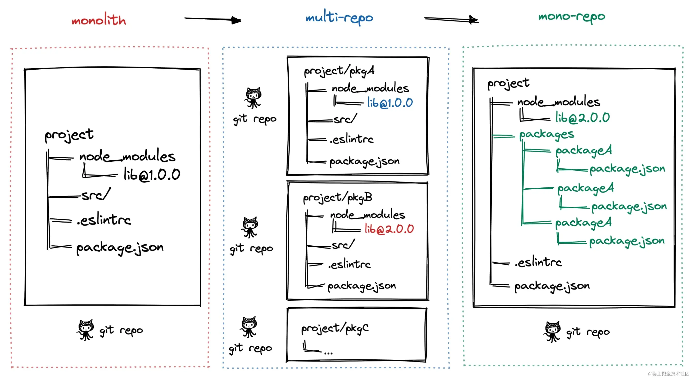

## Monorepo




|     | **MultiRepo**                                                                              | **MonoRepo**                                                                              |
| --- | ------------------------------------------------------------------------------------------ | ----------------------------------------------------------------------------------------- |
| 优点  | ✅ 代码隔离，研发者只需关注自己负责的仓库<br/>✅ 仓库体积小，模块划分清晰，可维护性强。                                            | ✅ 多项目代码都在一个仓库中，相同版本依赖提升到顶层只安装一次，节省磁盘内存<br/>✅ 代码复用高，方便进行代码重构。<br/>✅ 可以实现一次命令完成所有的部署。       |
| 缺点  | ❌ 多个仓库都有自己的 node_modules，存在依赖重复安装或冲突情况，占用磁盘内存大。<br/>❌ 各项目构建、打包、代码校验都各自维护，不一致时会导致代码差异或构建差异。 | ❌ 多个项目代码都在一个仓库中，没有项目粒度的权限管控，一个项目出问题，可能影响所有项目。<br/>❌ 多项目在一个仓库中，代码体积多大几个 G，`git clone`时间较长。 |

Monorepo 可以协助微前端项目，因为它可以提供一个集中式的代码库和版本控制系统，使得多个微前端应用可以共享代码和资源，并且可以更容易地进行协作和集成。通过 Monorepo，可以更容易地管理共享的组件、库和工具，以及更方便地进行测试、构建和部署。

#### monorepo的组织架构

在 monorepo 中，所有的包都放在 packages 目录下，每个包都有自己的 package.json 文件，而根目录的 package.json 用来管理整个项目的依赖。(用pnpm实现为佳)
```shell
├── packages
|   ├── pkg1
|   |   ├── package.json
|   ├── pkg2
|   |   ├── package.json
├── package.json
├── pnpm-workspace.yaml
```

## 微前端


> single-spa  https://zh-hans.single-spa.js.org/
> 
> garfish官方文档 移步👉🏻[https://garfish.fn.bytedance.net/guide/](https://garfish.fn.bytedance.net/guide/)
> 
> qiankun官方文档 移步👉🏻[https://qiankun.umijs.org/zh/guide/getting-started](https://qiankun.umijs.org/zh/guide/getting-started) 
> 
> qiankun 基于 single-spa
> 
> 为什么不是iframe？ 移步👉🏻 [Why Not Iframe](https://www.yuque.com/kuitos/gky7yw/gesexv) （简而言之，隔离性太强，共享能力弱）
> 
[微前端技术原理](https://juejin.cn/post/7099339595233361934)


微前端是指把前端服务拆分成很多个微服务，通俗来说，就是在一个`web`应用中可以独立的运行另一个`web`应用。

微前端的核心目标是==将巨石应用拆解成若干可以自治的松耦合微应用==。

而 qiankun 的诸多设计均是秉持这一原则，如 **HTML entry、沙箱、应用间通信**等。这样才能确保微应用真正具备 ==独立开发、独立运行== 的能力。


#### 核心思想

- **技术栈无关**：子应用可使用不同框架（React、Vue、Angular 等）。例如：主应用用 React，子应用 A 用 Vue，子应用 B 用 Angular。
- **独立开发与部署**：每个子应用有自己的代码库、构建流水线和部署流程。 修改子应用无需重新部署主应用。
- **运行时集成**：通过动态加载子应用的 JS/CSS 资源（如 `import()` 或 `<script>` 标签）。常见集成方式：**iframe**、**模块联邦（Module Federation）**、**自定义加载器**。
- **样式与状态隔离**：避免子应用间的 CSS 和 JS 全局污染（如 Shadow DOM、Scoped CSS）。


| **问题**    | **传统单体前端**     | **微前端解决方案**        |
| --------- | -------------- | ------------------ |
| **团队协作**  | 多团队修改同一代码库，易冲突 | 团队独立开发，技术栈解耦       |
| **技术栈升级** | 全应用强制升级，成本高    | 渐进式升级，新旧技术共存       |
| **部署效率**  | 全量部署，风险高       | 独立部署，按需更新          |
| **代码复用**  | 复用困难，易产生冗余     | 共享公共依赖（如UI库），模块化复用 |
| **维护成本**  | 代码臃肿，难以维护      | 功能隔离，责任清晰          |
  

### 核心原理

无论是`qiankun`还是`garfish`都需要子应用在入口js中提供生命周期钩子，以供主应用在合适的时机调用。
- `qiankun`需要子应用至少导出 `bootstrap`、`mount`、`unmount` 三个生命周期钩子；
- `garifsh`需要子应用导出`provider`生命周期钩子。


通常有两种`entry`: JS Entry 和 Html Entry。
#### JS Entry

在主应用的同一页面载入子应用，可以通过将**子应用的所有资源**（包括布局、功能逻辑与素材）打包进一个js文件里，并将这个文件作为资源的入口在主应用引入，参考 single-spa 的[这个实现](https://github.com/joeldenning/simple-single-spa-webpack-example/blob/master/src/root-application/root-application.js)。


**Js Entry 的缺点是：**
- 子应用更新打包后的 js **bundle 名称会变化**，主应用需要保证每次获取都是最新的 js bundle。
- 子应用**所有资源打包到一个文件中**，会失去 css 提取、静态资源并行加载、首屏加载(体积巨大)等优化。
- 需要在子应用打包过程中，修改相应的配置以补全子应用 js 资源的路径。

 这种方式增加了主子应用的耦合性，且加载子应用的过程中无法并行加载，存在单个资源过大的问题，较难提升整体的效率；但该方案对应用的部署流程较为便捷，且要求较低。


#### HTML Entry （推荐）

主应用在运行时通过提供单独打包好的子应用 URL 地址，==以 `fetch` 方式获取子应用的 HTML 文件==，使用正则表达式处理HTML字符串提取css、js文件，**在指定的容器中插入 HTML 内容**，这样的方式称为 HTML Entry。

相较于 JS Entry 方式，html Entry有着更低的耦合性和更大的灵活度，支持主应用在 fetch 后进行二次处理，通过 CSS 增加前缀、JS sandbox 等方式实现样式隔离和 JS 沙箱隔离，且能对静态资源采用并行加载，子应用的更新可以单独发布；

但这种方式必须需要子应用支持跨域。 qiankun 框架采用的就是 HTML Entry 的形式进行子应用的载入。


#### Example 流程
```js
import { registerMicroApps, start } from 'qiankun';

registerMicroApps([
  {
    name: 'react app', // app name registered
    entry: '//localhost:7100',
    container: '#yourContainer',
    activeRule: '/yourActiveRule',
  },
  {
    name: 'vue app',
    entry: { scripts: ['//localhost:7100/main.js'] },
    container: '#yourContainer2',
    activeRule: '/yourActiveRule2',
  },
]);

start();
```


1. 根据提供的**url作为入口文件加载资源**。通过fetch拿到资源内容。
	- 如果是html资源入口会进行标签的序列化和相关处理。
	- 如果是js文件则会直接实例化一个js资源类，目的是保存加载到资源的类型，大小，代码字符串等基本信息。并会尝试缓存加载的资源。

2. 拿到html文件后如何解析并处理html文件的呢？
	- 对加载的html资源进行**AST解析,结构化dom**，以便提取不同类型的标签内容。
	- 结构化后进行深度优先遍历把`link`，`style`，`script`标签提取出来。由于当前各个框架的实现基本都是有js生成dom并挂载到指定的元素上，因此这里只要把这三种加载资源的标签提取出来基本就完成了页面的加载。
	- 当然还需要配合微前端的加载方式改造下子系统入口，让挂载函数指向主应用提供的dom。至此我们完成了基本资源的提取。
3. html 被插入到指定的 container 中，同时依次调用微应用暴露出的生命周期钩子。


### 环境隔离--CSS

除了 single-spa 默认不提供样式隔离功能外，其余主流的微前端框架都实现了基于子应用作用域下的 CSS 样式隔离（原理类似 Vue 的 style scopted 实现方式）。

- 动态样式表

- 工程化手段

    - BEM

    - CSS Modules

    - CSS in JS

- Shadow Dom

- **CSS Module & CSS Namespace**

#### CSS Scope
一句话理解，就是给子应用的所有样式规则添加一个 scope（类似 Vue 中的 )。


1. 创建子应用容器节点后，通过 `document.querySelectorAll('style')` 找到所有 `style` 元素
2. 对于普通样式规则,通过 for 循环遍历 style.sheet.cssRules，转换 css 样式。

由于子应用有名称作为唯一标示，且挂载的容器在子应用切换时可以保证唯一性，可以通过统一加 `scope` 的形式处理所有的子应用样式。分为编译时和运行时两种处理方案：编译时提供 `webpack` 插件，对 `css` 编译时自动给子应用的样式添加 `scope`；运行时则是加载子应用时解析，由 `loader` 负责处理。

```JavaScript
// 假如子应用名字叫 child
// 转换前
.app-main {
    font-size: 14px;
}
// 转换后
div[data-qiankun="child"] .app-main {
    font-size: 14px;
}
```

#### Shadow DOM
给子应用容器节点挂载一个 shadow DOM，以实现父子应用、多个子应用之间的样式隔离。
```js
if (appElement.attachShadow) {

    shadow = appElement.attachShadow({ mode: 'open' });

} else {

    // createShadowRoot was proposed in initial spec, which has then been deprecated

    shadow = (appElement as any).createShadowRoot();

}

```


### 环境隔离--JS

[三种沙箱隔离方式](https://blog.csdn.net/qq_44746132/article/details/117385571?ops_request_misc=%257B%2522request%255Fid%2522%253A%2522166210607016782425122601%2522%252C%2522scm%2522%253A%252220140713.130102334.pc%255Fall.%2522%257D&request_id=166210607016782425122601&biz_id=0&utm_medium=distribute.pc_search_result.none-task-blog-2~all~first_rank_ecpm_v1~rank_v31_ecpm-6-117385571-null-null.142^v44^new_blog_pos_by_title&utm_term=%E5%BE%AE%E5%89%8D%E7%AB%AF%E6%B2%99%E7%AE%B1&spm=1018.2226.3001.4187)

Js 沙箱核心功能：为每一个子应用创建一个==专属的 “window 对象”== (不是真的 window 对象)。**劫持并代理window**，子应用对全局变量的读写操作都作用到这个 “window 对象”中，避免数据污染，沙箱内的数据不会暴露到全局。


#### snapshotSandbox - 快照沙箱

在某个阶段给当前的运行环境打一个快照，再在需要的时候把快照恢复，从而实现隔离。

- 在激活前的时候遍历 window 上的变量，存为 `snapshotOriginal`
- 在失活的时候再次遍历 window 上的变量，分别和 `snapshotOriginal` 对比，将不同的存到 `snapshotMutated` 里，将 window 恢复回到 `snapshotOriginal`
- 当应用再次切换的时候，就可以把 `snapshotMutated` 的变量恢复回 `window` 上，实现一次沙箱的切换。


#### proxySandbox - 代理沙箱

当有多个实例的时候，比如有`A`、`B`两个应用，`A` 应用就活在 `A` 应用的沙箱里面，`B` 应用就活在 `B` 应用的沙箱里面，`A` 和 `B` 无法互相干扰，这样的沙箱就是代理沙箱，这个沙箱的实现思路其实也是通过 `ES6` 的 [proxy](https://developer.mozilla.org/zh-cn/docs/web/javascript/reference/global_objects/proxy)，通过代理特性实现的。

```JavaScript
const varBox = {};
const fakeWindow = new Proxy(window, {
  get(target, key) {
    return varBox[key] || window[key];
  },
  set(target, key, value) {
    varBox[key] = value;
    return true;
  },
});
const fn = new Function('window', code);
fn(fakeWindow);
```


#### LegacySandbox（依赖 Proxy)：

缺点：虽然子应用之间的状态是隔离的，但是父子应用都会修改同一个 window 对象，互相污染。
  
#### 副作用隔离

除了 JS 沙箱，还需要劫持一些全局方法。

- 计时器：`setInterval`、`setTimeout`

- 全局事件监听：`addEventListener`    
- 全局存储：`localStorage`、`sessionStorage`


解决方法主要分为两类，能够通过劫持收集的：

- .如 `setInterval`、`setTimeout`、`addEventListener`，通过重写这些方法，在调用的时候记录起来，放进一个队列里，在沙箱销毁的时候统一进行清除。
- 持久化数据，无法通过劫持进行收集的，使用命名空间来区分 如 `localStorage`，`sessionStorage`，重写对象和方法


### 环境隔离--DOM

Garfish，首先依然是像构造沙箱window一样构造一份document的副本来作为沙箱内的document元素，保证document的set不会影响全局。这一部分实现就不在多说了。下一步就是代理这个副本document。代理的目标主要是两部分：
-  对于获取dom元素的方法让他的document对象指向子应用挂载的那个dom。
- 对于body和head这种顶级元素代理到子应用挂载dom下沙箱元素（在初始化子应用会在挂载dom下由garfish新建这些临时节点）。


### 路由托管 - Router

当浏览器的路径变化后，router 监听 `hashchange` 和 `popstate` 事件，在事件回调函数中，根据注册的子应用激活规则，卸载/激活子应用。

最先接收到这个变化的是基座的router，通过查询注册信息可以获取到转发到那个微应用，经过一些逻辑处理后，采用`修改hash`方法或者`pushState`方法来路由信息推送给微应用的路由，微应用可以是手动监听hashchange或者popstate事件接收，或者采用React-router，vue-router接管路由，后面的逻辑就由微应用自己控制。

最好的路由模式就是主应用、子应用都统一模式，可以减少不同模式之间的兼容工作

|   |   |   |   |   |
|---|---|---|---|---|
|主|子|推荐|接入影响|解决方案|
|hash|hash|✅|无||
|hash|history|不推荐|有|history.pushState|
|history|hash|一般|无||
|history|history|✅|无||

#### Garfish实现

Garfish 路由系统仅支持主应用的 `history` 路由模式，原因是 hash 路由无法作为子应用的基础路由

> 目前 `Garfish` 主要提供了以下三条策略

- 提供 `Router Map`，减少典型中台应用下的开发者理解成本
    
    - 通常可以将应用的结构分为两块，一块是菜单另一块则是内容区域，通过提供路由表来自动化完成子应用的调度，将公共部分作为拆离后的子应用渲染区域。
        
- 为不同子应用提供不同的 `basename` 用于隔离应用间的路由抢占问题
    
- 路由发生变化时能准确激活并触发应用视图更新


### 子应用通信

应用之间的通信能通过**发布订阅模**实现，本质原理都类似 [EventEmitter](https://link.juejin.cn/?target=https%3A%2F%2Fzhuanlan.zhihu.com%2Fp%2F77876876)。

`Garfish.channel` 为 Garfish 的实例属性，该属性是 [EventEmitter2](https://github.com/EventEmitter2/EventEmitter2) 的实例。


  

### 生命周期

`Garfish` 应用的生命周期可以归结为：加载、渲染、销毁 三个阶段

- 加载主要是通过 [Garfish.loadApp](https://www.garfishjs.org/api/loadApp)，通过 `loadApp` API 会自动创建应用的实例，

- 通过应用实例上的 `mount` 和 `show` 方法对应用进行渲染

- 通过 `unmount` 和 `hide` 方法对应用进行销毁
    

用户在实际使用的过程中通过 [Garfish.run](https://www.garfishjs.org/api/run)会发现当路由发生变化时符合加载条件的应用会自动加载渲染，实际上是 **`[Garfish Router Plugin](https://www.garfishjs.org/guide/router)`** **通过监听路由变化来触发** **`loadApp`** **和** **`mount`** **自动完成应用的加载、渲染、销毁。**

- `loadApp`：
    
    - beforeLoad()
        
    - 加载资源，html用fetch，js文件用script标签请求
        
    - New App()
        
    - Plugin & cache
        
    - afterLoad()
        
- `mount`
    
    - beforeMount 钩子
        
    - 将 app set 到 Garfish.activeApps 中
        
    - 创建 app container并添加到文档流上，编译子应用的代码 compileAndRenderContainer()
        
    - 拿到子应用的 provider,调用 provider.render
        
    - 将 app.display 和 app.mounted 设置为 true
        
    - afterMount 钩子
        
    - 如果渲染失败，app.mount 会返回 false，否则渲染成功会返回 true
        
- `show`
    
    - beforeMount 钩子
        
    - 将 app set 到 Garfish.activeApps 中
        
    - app container添加到文档流上
        
    - 调用 provider.render
        
    - 将 app.display 设置为 true
        
    - afterMount 钩子


  

### 部署

微前端应用的部署包括以下三部分：

- 主应用部署
    
- 服务发现的过程
    
- 需要承载子应用部署
    


#### 方案

微前端目前的落地方案可分为：自组织模式、基座模式、模块加载模式。

与基座模式相比，模块加载模式没有中心容器（去中心化模式），这就意味着任何一个微应用都可以当作模块入口，整个项目的微应用与微应用之间相互串联。具体的代表库就是 [qiankun](https://link.juejin.cn?target=https%3A%2F%2Fqiankun.umijs.org%2Fzh%2Fguide) vs [EMP](https://link.juejin.cn?target=https%3A%2F%2Fgithub.com%2FefoxTeam%2Femp)。

实现模块加载模式需要依赖于 webpack5 的 [Module Federation](https://link.juejin.cn?target=https%3A%2F%2Fwebpack.js.org%2Fconcepts%2Fmodule-federation%2F) 功能。


