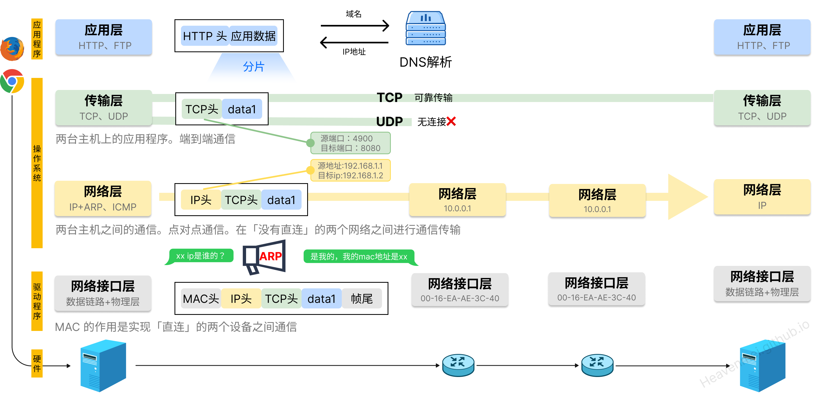
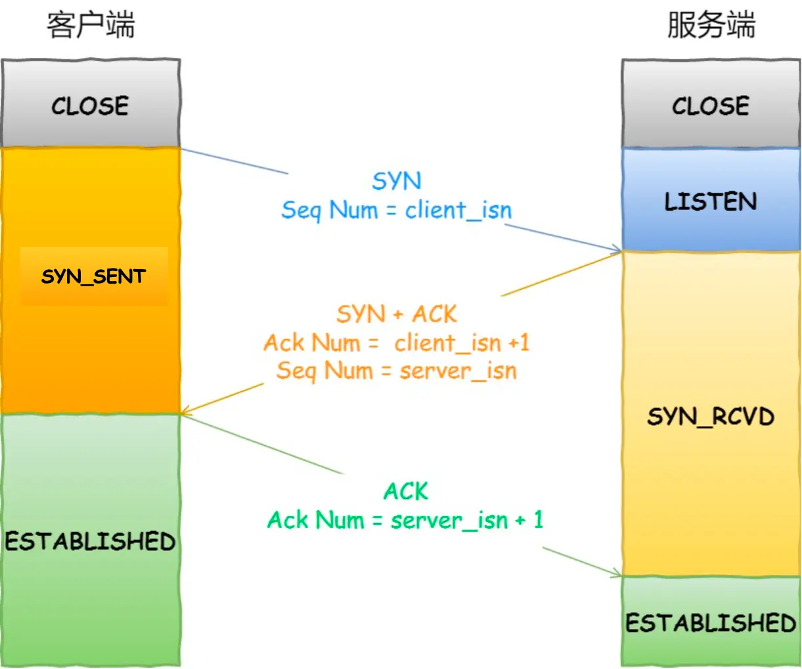
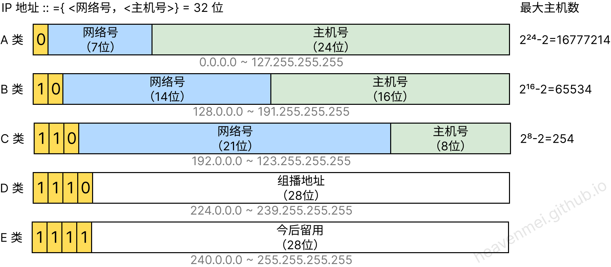
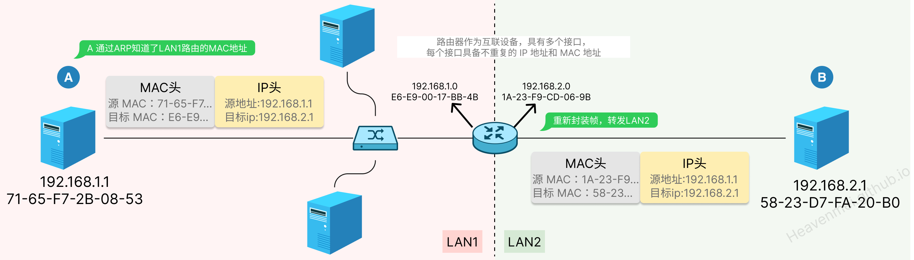
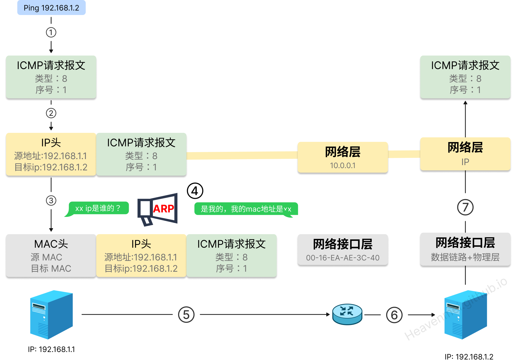

> 详细指南：[小林Coding 图解网络](https://xiaolincoding.com/network/)
## TCP/IP 网络模型有哪几层？

#### 应用层
应用层只需要专注于为用户提供应用功能，比如 HTTP、FTP、Telnet、DNS、SMTP等。

应用层是工作在**操作系统中的用户态，传输层及以下则工作在内核态**

#### 传输层
对接端口（端到端），**识别报文发送给那个应用（端口**），会对应用数据进行分块，
- TCP：可靠传数据，需要建立链接
- UDP：就是直接对接IP，无连接，

#### 网络层

每个服务器有个IP，负责**对接两个设备（点对点）**。

通过IP地址寻址，先匹配到相同的网络号（表示要找到同一个子网），才会去找对应的主机。

#### 网络接口层 = 数据链路层+物理层

在IP数据包上加MAC头打包成数据帧，MAC地址对应每一个网卡。

IP地址只告诉我们把包发到那个目标设备，但是在**以太网中，设备不是「直连」的，它是一种在「局域网」内，把附近的设备连接起来，** 使它们之间可以进行通讯的技术。因此，需要一段一段的通过`ARP协议（地址解析协议）`寻找下一个局域网的MAC地址。

> IP 地址属于逻辑地址，而 MAC 地址才是物理地址.
> 
>IP 是行程表，远程定位找到路由寻址，MAC是多车票

## TCP （传输层）

### TCP 和 UDP 的区别

|      | TCP                         | UDP                                                    |
| ---- | --------------------------- | ------------------------------------------------------ |
| 可靠性  | 高 _拥塞控制、流量控制、错误检测和修正_   | 低                                                      |
| 连接   | 面向连接                        | 无连接（直接和 IP 打交道）                                        |
| 速度   | 较低                          | 高                                                      |
| 传输方法 | TCP 是流式传输，没有边界，但保证顺序和可靠     | UDP 是一个包一个包的发送，是有边界的，但可能会丢包和乱序。                        |
| 服务对象 | 1 V 1                       | 1V 1 、 1 V n 、 n V n                                   |
| 场景   | FTP 文件传输； HTTP / HTTPS； | 包总量较少的通信，如 `DNS` 、`SNMP` 等； 视频、音频等多媒体通信； 广播通信； |
| 协议头  | 20+字节，包含序列号、标志位等等           | 8字节=64位， 源端口+目标端口+包长度+校验和                          |

#### TCP 标志符

- SYN（Synchronize）：包含随机序列号
- ACK（Acknowledgment）：序列号+1
- FIN（Finish）：包含随机序列号
- RST（Reset）
- PSH（Push）
### TCP三次握手

1. 第一次握手：客户端A将标志位SYN置为1,随机产生一个值为seq=J（J的取值范围为=1234567）的数据包到服务器，客户端A进入SYN_SENT状态，等待服务端B确认；
2. 第二次握手：服务端B收到数据包后由标志位SYN=1知道客户端A请求建立连接，服务端B将标志位SYN和ACK都置为1，ack=J+1，随机产生一个值seq=K，并将该数据包发送给客户端A以确认连接请求，服务端B进入SYN_RCVD状态。
3. 第三次握手：客户端A收到确认后，检查ack是否为J+1，ACK是否为1，如果正确则将标志位ACK置为1，**ack=K+1**，并将该数据包发送给服务端B，服务端B检查ack是否为K+1，ACK是否为1，如果正确则连接建立成功，客户端A和服务端B进入ESTABLISHED状态，完成三次握手，随后客户端A与服务端B之间可以开始传输数据了。

#### 为什需要三次握手？

==TCP 使用三次握手建立连接的最主要原因是防止「历史连接」初始化了连接。 即“为了防止已失效的连接请求报文段突然又传送到了服务端，因而产生错误”==

三次握手可以通过比较序列号是否+1判断是否建立链接，两次握手没有确认就建立连接，白白浪费资源

### TCP四次挥手

1. **第一次挥手**： Client发送一个FIN，用来关闭Client到Server的数据传送，Client进入FIN_WAIT_1状态。
2. **第二次挥手：** Server收到FIN后，发送一个ACK给Client，确认序号为收到序号+1（与- SYN相同，一个FIN占用一个序号），Server进入CLOSE_WAIT状态。
3. **第三次挥手：** Server发送一个FIN，用来关闭Server到Client的数据传送，Server进入LAST_ACK状态。
4. **第四次挥手：** Client收到FIN后，Client进入TIME_WAIT状态，接着发送一个ACK给Server，确认序号为收到序号+1，Server进入CLOSED状态，完成四次挥手。

#### 为什么建立连接是三次握手，而关闭连接却是四次挥手呢？

这是因为服务端在LISTEN状态下，收到建立连接请求的SYN报文后，把ACK和SYN放在一个报文里发送给客户端。（所以省了一次握手）

- 关闭连接时，客户端向服务端发送 FIN时，仅仅表示客户端**不再发送数据了但是还能接收数据**。
- 服务端收到客户端的 FIN 报文时，先回一个 ACK 应答报文，而**服务端可能还有数据需要处理和发送，等服务端不再发送数据时，才发送 FIN 报文**给客户端来表示同意现在关闭连接。

#### TCP 四次挥手，可以变成三次吗？

什么情况会出现三次挥手?

当服务端在 TCP 挥手过程中，==没有数据要发送== 并且==开启了 TCP 延迟确认机制==，那么第二和第三次挥手就会合并传输，这样就出现了三次挥手。 （ACK+FIN）

**TCP 延迟确认机制 （默认开启）**

当发送没有携带数据的 ACK，它的网络效率也是很低的，因为它也有 40 个字节的 IP 头 和 TCP 头，但却没有携带数据报文。为了解决 ACK 传输效率低问题，所以就衍生出了 TCP 延迟确认。TCP 延迟确认的策略:
- 当有响应数据要发送时，ACK会随着响应数据一起立刻发送给对方。
- 当没有响应数据要发送时，ACK将会延迟一段时间，以等待是否有响应数据可以一
- 发送如果在延迟等待发送 ACK 期间，对方的第二个数据报文又到达了，这时就会立刻发送 ACK

## IP 网络层

==实现主机与主机之间的通信，也叫点对点（end to end）通信==

IP协议目前有 IPv4（32位）和 IPv6 （128位）

### ARP
ARP: IP —> Mac,  RARP: MAC->IP

ARP 是借助 ARP 请求与 ARP 响应两种类型的包确定 MAC 地址的。只能解决同一个局域网的地址映射

ARP 协议是一个**广播问询，单播响应**协议。
- 同一局域网下，目标主机会响应。
- 不同局域网下，通过路由器转发。

路由器作为互联设备，具有多个接口，每个接口具备不重复的 IP 地址和 MAC 地址。因此，在讨论 ARP 表时，路由器的多个接口都各自维护一个 ARP 表，而非一个路由器只维护一个 ARP 表

### Ping 流程

ICMP 主要的功能包括：确认 IP 包是否成功送达⽬标地址、报告发送过程中 IP 包被废弃的原因和改善⽹络设置等。ICMP ⼤致可以分为两⼤类：
- ⼀类是⽤于诊断的查询消息，也就是「查询报⽂类型」（ping）
- 另⼀类是通知出错原因的错误消息，也就是「差错报⽂类型」

