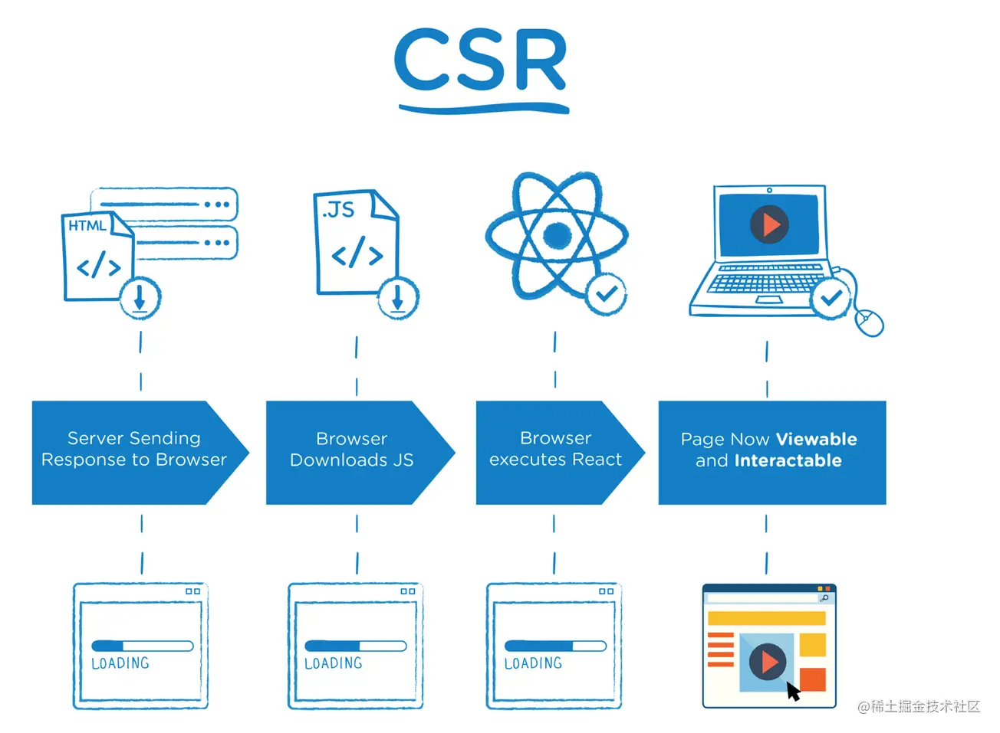

页面渲染过程：[浏览器 之 渲染流程](/post/browser-render)
## CSR，SSR，SSG

- CSR：Client Side Rendering ，客户端渲染。
- SSR：Server Side Rendering，服务端渲染。
- SSG：Static Site Generation ，静态站点生成。


| &emsp;&emsp;    | 特点                                                           | 优 点                     | 缺点                                 |
| --------------- | ------------------------------------------------------------ | ----------------------- | ---------------------------------- |
| CSR<br/>客户端渲染   | vue，react等框架 <br/>先下载html文档<br/>然后下载js来执行渲染出页面结果             | 1. 前后端分离。<br/>2. 服务器压力小 | 1. 不利于SEO<br/>2. 首屏渲染慢，做成SPA增量渲染   |
| SSR<br/>服务端渲染   | 传统SSR指JSP、PHP等<br/>现代SSR=SSR+CSR<br/>输出的是一个渲成的html           | 1. 利于SEO<br/>2. 利于首屏渲染  | 1. 占用服务器资源，在服务端渲染<br/>2. 不能只渲染可变区域 |
| SSG <br/>静态站点生成 | 在构建的时候直接把结果页面输出html到磁盘，<br/>每次访问直接把html返回给客户端，<br/>相当于一个静态资源 | 1. 利于SEO<br/>2. 服务器压力小  | 1. 只适用于静态数据<br/>2. 只渲染不能只渲染可变区域    |

**CSR**：用户请求-->服务器返回一个Dummy页面-->Dummy页面引导浏览器取回Js-->浏览器执行Js -->页面渲染(内容可见)


**SSR**：用户请求-->服务器返回一个渲染后的页面(内容可见)-->加载JS-->==执行Js对页面进行Hydrate==（作用是加载并执行 JS 文件内容，并将事件回调绑定到真实的 DOM 上。）


|  |  |
| ------------------------------------------------------- | ------------------------------------------------------- |
      


#### 现代SSR + SPA 体验升级

第一次访问页面是服务端渲染，基于第一次访问后续的交互就是 `SPA` 的效果和体验，还不影响`SEO` 效果，这就有点完美了。

我们把页面的展示内容和交互写在一起，**让代码执行两次。在服务器端执行一次，用于实现服务器端渲染，在客户端再执行一次，用于接管页面交互。**

服务端只负责首次“渲染”（真正意义上，只有浏览器才能渲染页面，服务端其实是生成 HTML 内容），然后返回给客户端，客户端**接管**页面交互（事件绑定等逻辑），之后客户端路由切换时，直接通过 JS 代码来显示对应的内容，不再需要服务端渲染（只有页面刷新时会需要）

但是要实现两种技术的结合，同时可以最大限度的重用代码（同构），减少开发维护成本，那就需要采用 `react` 或者 `vue` 等前端框架相结合 `node (ssr)` 来实现。

  
#### ISR：Incremental Site Rendering，
 
 增量式的网站渲染：
 - **关键性的页面**（如网站首页、热点数据等）预渲染为静态页面，缓存至 CDN，保证最佳的访问性能；

- **非关键性的页面**（如流量很少的老旧内容）先响应 fallback 内容，然后浏览器渲染（CSR）为实际数据；同时对页面进行异步预渲染，之后缓存至 CDN，提升后续用户访问的性能。


#### DPR：Distributed Persistent Rendering
 分布式的持续渲染：
 1. 去除了 fallback 行为，而是直接用 On-demand Builder（按需构建器）来响应未经过预渲染的页面，然后将结果缓存至 CDN；
 2. 数据页面过期时，不再响应过期的缓存页面，而是 CDN 回源到 Builder 上，渲染出最新的数据；
 3. 每次发布新版本时，自动清除 CDN 的缓存数据。
  

## SSR原理

### 同构 SSR 渲染
在服务端渲染中，有两种页面渲染的方式：

- 前端服务器通过请求后端服务器获取数据并组装HTML返回给浏览器，浏览器**直接解析HTML**后渲染页面
- 浏览器在交互过程中，**请求新的数据**并动态更新渲染页面

同构：一份代码，既可以客户端渲染，也可以服务端渲染。对于同构应用来说，我们必须实现客户端与服务端的路由、模型组件、数据模型的共享。


#### 组件同构
1. **构建服务端代码** `webpack.server.config.js`: 在服务端代码构建结束后，需要将构建结果运行在nodejs服务器上，但是，对于服务端代码的构建，有一下内容需要注意：
	- ==不需要编译CSS==，样式表只有在浏览器（客户端）运行时需要。
	- 构建的目标的运行环境是commonjs，nodejs的模块化模式为commonjs
	- ==不需要代码切割==，nodejs将所有代码一次性加载到内存中更有利于运行效率
2. **构建客户端代码** `webpack.client.config.js`: 在构建客户端代码时，使用的是客户端的执行入口文件，构建结束后，将构建结果在浏览器运行即可，但是在服务端渲染中，HTML是由服务端渲染的，也就是说，我们要加载哪些JS脚本，是服务端决定的，因为HTML中的script标签是由服务端拼接的，所以在客户端代码构建的时候，我们需要使用插件，==生成一个构建结果清单告诉服务端，当前页面需要加载哪些JS脚本和CSS样式表==。

#### 路由同构

SSR 架构，我们需要让相同的 React 代码在客户端和服务器端各执行一次。React组件代码可以公用，但是router路由是不行的。这是由于在**服务器端需要通过请求路径**，找到路由组件，而在客户端需通过**浏览器中的网址（HashRouter、BrowserRouter）**，找到路由组件，是完全不同的两套机制，所以这部分代码是肯定无法公用。


#### 数据同构

根据SSR的架构图可知，页面需要经过两次渲染，第一次渲染是服务端返回的 HTML 基本页面信息，第二次渲染则是客户端渲染。这两次渲染分别需要请求两次数据，我们需要保证，两次数据获取信息是相同的。

保证数据同构的方法非常的简单，就是在服务端请求数据并渲染页面以后，将数据以全局变量的形式写入页面。客户端直接获取页面数据，完成渲染。

  


### react服务端渲染
整体来说 `react` 服务端渲染原理不复杂，其中最核心的内容就是同构。

1. Node服务器接收客户端请求，得到当前的`req url path`,然后在已有的路由表内查找到对应的组件，获取组件所需数据，

2. 然后基于 `react` 内置的服务端渲染api `renderToString() or renderToNodeStream()` 把组件渲染为 `html字符串`或者 `stream 流`,（至此SSR完成）

3. 在把最终的html进行输出前需要将数据注入到浏览器端(注水Hydrate)，server 输出(response)后浏览器端可以得到数据(脱水)，

4. 浏览器开始进行渲染和节点对比，然后执行组件的`componentDidMount` 完成组件内事件绑定和一些交互，浏览器重用了服务端输出的 `html 节点`，整个流程结束。
    


**对比CSR**


### Hydration 水合/ 客户端激活
[SSR、Hydration 和 同构](https://juejin.cn/post/7400325741441204261)

水合反应（Hydration Reaction），也叫作水化，是一种化学反应，其中物质与水结合。

Web 开发中 又叫 客户端激活，Hydration 是指==客户端 js 通过绑定事件处理将静态的 HTML 转为动态网页的过程==。在 SSR 中，HTML 在服务端预渲染，在客户端绑定事件处理程序之前还不能交互。

#### Hydration 过程做了什么？

1. **绑定事件处理器**：使得服务器端渲染的 HTML 元素变得可交互。比如，按钮的点击事件、表单的提交事件等。
2. **重建应用状态**：恢复或初始化客户端的 JavaScript 应用状态，使得客户端代码和服务器端渲染的一致。
3. **同步 DOM**：确保在客户端的 React（或其他前端框架）的虚拟 DOM（Virtual DOM）与服务器端生成的实际 DOM 一致。

  


#### 水合失败
**水合失败的根本原因是：服务端渲染出的 HTML 树结构与客户端首次渲染出的 HTML 树结构不匹配。**

1. 组件渲染逻辑中使用了 `window`, `document`, `navigator` 等只在浏览器端存在的对象。
	- 将这类操作移到 `useEffect` 中，因为 `useEffect` 只会在客户端执行。
	- window/dom等声明为空
	```jsx
	 // 错误示例！
	function MyComponent() {
	  // 服务端没有 `window`，这里会是 undefined
	  const [width, setWidth] = useState(window.innerWidth);
	  // ...
	}
	```
2. 第三方库的兼容性问题，npm包不兼容ssr
	- 版本过滤掉，不加载这个包


  
  
### 虚拟DOM

SSR 之所以能够实现，本质上是因为虚拟 DOM 的存在。

React 在做页面操作时，实际上不是直接操作 DOM，而是操作虚拟 DOM。这使得无法操作真实 DOM 的 node 服务器可以使用虚拟 DOM 转换成为字符串来完成对页面的构建。在 react 中，操作虚拟 DOM 转换成为字符串的方法是 [renderToString](https://reactjs.org/docs/react-dom-server.html#rendertostring) 。

- 在服务器，我可以操作 JavaScript 对象，判断环境是服务器环境，我们把虚拟 DOM 映射成字符串输出；
    
- 在客户端，我也可以操作 JavaScript 对象，判断环境是客户端环境，我就直接将虚拟 DOM 映射成真实 DOM，完成页面挂载
    

## Reference

[【长文慎入】一文吃透 React SSR 服务端渲染和同构原理](https://juejin.cn/post/6844903943902855176#heading-6)

[React 中同构（SSR）原理脉络梳理](https://juejin.cn/post/6844903694870265870#heading-1)

[SSR 基本原理与项目工程化](https://tech.bytedance.net/articles/11184#heading7)

[CSR，SSR和SSG是什么，有什么优缺点？](https://juejin.cn/post/7039151040188383268)

[彻底理解服务端渲染 - SSR原理](https://github.com/yacan8/blog/issues/30)